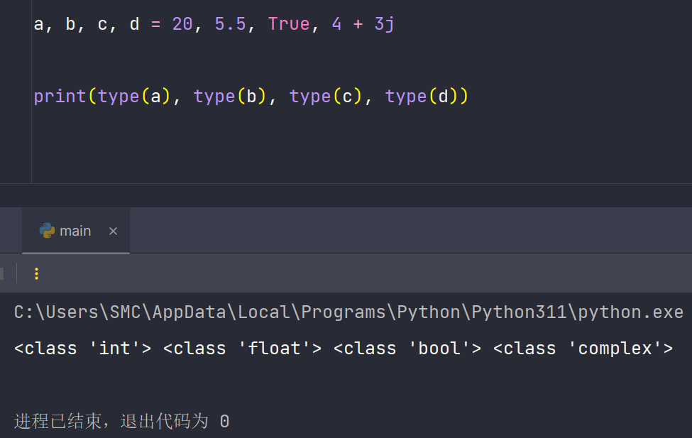

# Python 数据类型详解

## 数字类型

### 整数 (int)

在实际开发中，我会使用整数类型来表示没有小数部分的数值，例如计数、循环次数或索引。Python 3 中的整数大小仅受内存限制，所以我可以处理非常大的数值而无需担心溢出问题。

```python
count = 5
negativeCount = -3
zeroValue = 0
largeNumber = 9999999999999999
```

### 浮点数 (float)

当我需要表示有小数部分的数值时，我会使用浮点数，例如存储科学计算结果或商品价格。在内部，浮点数使用 64 位精度。我在计算货币金额时通常会考虑使用 `decimal` 模块来避免浮点精度误差。

```python
piValue = 3.14
temperature = -0.01
distance = 2.0
```

### 复数 (complex)

如果我需要处理数学、信号处理或工程领域的复杂计算，我会用复数类型。复数由实部和虚部组成。虚部以 j 或 J 结尾。

```python
complexNum = 3 + 4j
anotherComplex = 1 - 2j
complexFloat = -3.5 + 4.8j
```

### 布尔值 (bool)

布尔值表示真或假。我在条件判断、循环控制或函数返回状态时经常用到布尔值。在 Python 中，True 会被视为 1，False 被视为 0，因此可以在算术表达式中使用它们。

```python
isActive = True
isClosed = False
print(True + 4)    # 输出 5
print(False * 3)   # 输出 0
```

## 字符串类型

字符串用于存储文本数据。我会使用字符串来表示名称、说明信息或配置参数。字符串在 Python 中是不可变的，如果我想修改字符串内容，只能通过创建新字符串来实现。

### 定义字符串

我可以用单引号、双引号或三引号定义字符串。使用三引号可以轻松创建多行字符串。在实际开发中，我通常使用单引号或双引号处理短字符串，使用三引号维护多行注释或大段文本。

```python
greeting = 'Hello, World!'
language = "Python is great."
multiLineText = '''This is a
multi-line
string.'''
```

### 转义字符

通过反斜杠 \ 我可以在字符串中插入换行符、制表符等特殊字符。

```python
message = "Line one.\nLine two.\tTabbed"
```

### 字符串方法

我经常使用各种字符串方法来转换大小写、去除空格、替换子串和分割字符串。这些方法可以简化文本处理过程，提高代码的可读性和可维护性。

```python
print("hello".capitalize())    # Hello
print("HELLO".lower())         # hello
print("hello".upper())         # HELLO
print("hello world".title())   # Hello World
print("   hello   ".strip())   # hello
print("hello world".replace("world", "Python"))  # hello Python
print("hello world".find("world"))               # 6
print("hello hello hello".count("hello"))        # 3
print("hello".startswith("he"))                  # True
print("hello".endswith("lo"))                    # True
print("hello world".split())                     # ['hello', 'world']
print("-".join(["hello", "world"]))              # hello-world
print("hello".isalpha())                         # True
print("123".isdigit())                           # True
print("hello".center(10, "-"))                   # --hello---
```

对于数据清洗或文本分析，我会组合使用上述字符串方法快速处理大量文本数据，从而减少繁琐的手动处理过程。

### 字符串格式化

在实际项目中，我经常需要将变量值嵌入字符串。f-string 是我常用的格式化方式，它直观、易读，也能进行简单的表达式计算。

```python
name = "sumingcheng"
age = 30
formatted1 = f"My name is {name} and I am {age} years old."
print(formatted1)
```

## 布尔类型的实用场景

我会在条件判断、循环控制和函数返回状态中频繁使用布尔值。很多内置函数或容器在特定条件下会返回 False，例如空列表、0 或空字符串。当我需要判断数据有效性或检查输入参数时，我常用 bool() 来进行快速真值测试。

```python
print(bool(0))        # False
print(bool(1))        # True
print(bool(""))       # False
print(bool("hello"))  # True
```

## 使用 `type` 判断类型

我可以通过 `type()` 来查看变量的类型。在调试和检查数据结构时，这个函数十分有用。

```python
a = 20
b = 5.5
c = True
d = 4 + 3j
print(type(a), type(b), type(c), type(d))
```



在面向对象编程时，如果我需要判断对象类型和继承关系，我会使用 `isinstance()`，因为它能识别子类实例。

```python
class MyBaseList(list):
    pass

x = MyBaseList()
print(isinstance(x, MyBaseList)) # True
print(isinstance(x, list))       # True
```

## 多变量赋值与解构

Python 支持多变量赋值和解构，这为我在快速交换变量值、从函数返回多个值或处理元组、列表时带来巨大方便。

```python
x, y, z = 5, 10, 15
print(x, y, z)

values = (5, 10, 15)
a, b, c = values
print(a, b, c)

x, y = 5, 10
x, y = y, x
print(x, y)  # 10, 5
```

使用星号 `*` 可以收集多余的值，这在函数返回值为可变长度或数据处理场景中非常有用。

```python
x, *middleValues, z = 1, 2, 3, 4, 5
print(x, middleValues, z)  # 1 [2, 3, 4] 5
```
