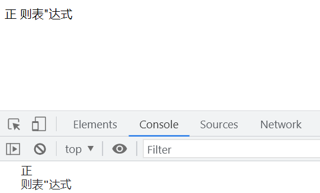
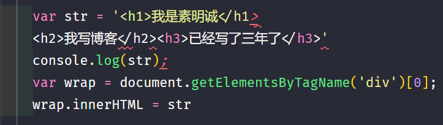

# 正则表达式基础

## 转义

### 转义符号

在 JavaScript 中,转义符号是反斜杠`\`。

### 转义字符

转义字符是由转义符号`\`和字符组成的,例如`\"`。

### 语法错误

如果在字符串中直接使用双引号,会导致语法错误:

```javascript
var str = "正"则表"达式";
```

会报错:`Uncaught SyntaxError: Unexpected identifier`

这是因为系统将`则表`判断成了变量。

如果改成这样:

```javascript
var str = '正' + 则表 + '达式';
```

会报错:`Uncaught ReferenceError: 则表 is not defined`

这是因为 JavaScript 先进行语法解释,再进行文本输出。系统认为`正`和`达式`两个地方是字符串,而`则表`是变量。

### 使用转义符号转义字符

使用`\"`可以将双引号转义,使其成为一个普通字符:

```javascript
var str = '正"则表"达式';
console.log(str); // 输出: 正"则表"达式

var str = '正\\则表\\达式';
console.log(str); // 输出: 正\则表\达式
```

`\"`在这里已经是一个转义字符。被转义的字符叫转义字符,如`\"`,而`\`叫转义符号。

## 常用转义字符

### \n（换行）、\r（回车）、\t（制表符）、\v（垂直制表符）、\f（换页符）

`\n`表示换行。注意控制台和 HTML 页面中的显示效果不同,因为控制台是一个编辑系统,而 HTML 页面是编译后的文档。

```javascript
var str = '正\n则表"达式';
console.log(str);
document.write(str);
```



### \r（回车）

不同的操作系统中,回车(Enter)的表示不同:

1. Windows: `\r\n`
2. Mac: `\r`
3. Linux: `\n`

### \t（制表符）

`\t`表示一个 Tab,通常等价于 4 个空格。

## 字符串多行的问题

JavaScript 不允许字符串多行书写,否则会报错:

`Uncaught SyntaxError: Invalid or unexpected token`



### 解决 HTML 模版换行的问题

可以使用字符串拼接的方式解决:

```javascript
var str = '<h1>我是素明诚</h1>' + '<h2>我写博客</h2>' + '<h3>已经写了三年了</h3>';
console.log(str);
var wrap = document.getElementsByTagName('div')[0];
wrap.innerHTML = str;
```

或者将回车和换行转义成空格:

```javascript
var str = '<h1>我是素明诚</h1>\
           <h2>我写博客</h2>\
           <h3>已经写了三年了</h3>';
console.log(str);
var wrap = document.getElementsByTagName('div')[0];
wrap.innerHTML = str;
```

### 写 HTML 模版的方法

可以使用`<script>`标签配合特定的`type`属性来书写 HTML 模板:

```html
<script type="text/html" id="tpl">
  <div><% %></div>
</script>
```

## RegExp 对象

`RegExp`是 Regular Expression(正则表达式)的缩写。正则表达式用于检查一个字符串是否包含某种子串、将匹配的子串替换或者从某个字符串中取出符合某个条件的子串等。

```javascript
// 实例化一个 RegExp 对象,接收两个参数:表达式和修饰符
var reg = new RegExp('test');
var str = 'This is a test';
// 检查 str 是否包含 test,如果包含则返回 true
console.log(reg.test(str)); // 输出: true
```

正则表达式默认是大小写敏感的,且要求匹配的子串必须是连续的。

### 忽略大小写

在实例化`RegExp`对象时,可以传入`i`修饰符表示 ignore case,即忽略大小写:

```javascript
var reg = new RegExp('Test', 'i');
var str = 'This is a test';
console.log(reg.test(str)); // 输出: true
```

### 匹配全局

使用`g`修饰符可以进行全局匹配:

```javascript
var reg = new RegExp('Test', 'gi'); // g 表示全局匹配,i 表示忽略大小写
var str = 'This is a test. Test is important.';
console.log(str.match(reg)); // 输出: ['test', 'Test']
```

### 多行匹配

使用`m`修饰符可以进行多行匹配:

```javascript
var reg = new RegExp('^Test', 'gim'); // m 表示多行匹配,^ 表示行的开头
var str = 'This is a test.\nTest is important.';
console.log(str.match(reg)); // 输出: ['Test']
```

### 字面量正则

除了使用`RegExp`构造函数创建正则对象,还可以使用字面量形式:

```javascript
var reg = /^test/gim;

var str = 'This is a test.\nTest is important.';
console.log(str.match(reg)); // 输出: ['Test']
```

### 正则是变量的情况

如果正则表达式中包含变量,则必须使用构造函数的形式:

```javascript
var v = 'Abc';
var reg = new RegExp(v, 'i');
var str = 'this is abc';
console.log(str.match(reg)); // 输出: ['abc', index: 8, input: 'this is abc', groups: undefined]
```

### 拷贝和引用地址

使用`new RegExp()`会创建一个新的`RegExp`实例,是原正则的一个拷贝:

```javascript
var reg = /test/;
var newReg = new RegExp(reg);
```

而直接将一个正则赋值给变量,则是引用了同一个地址:

```javascript
var reg = /test/;
var newReg = reg;
```

## 字符集合

### []

`[]`表示匹配其中的任意一个字符。

例如`[2s]`可以匹配`2`或`s`,`[sxwh]`可以匹配`s`、`x`、`w`、`h`中的任意一个,`[i22]`可以匹配`i`、`2`中的任意一个。

```javascript
var str = '2sihi';
var reg = /[2s][sxwh][i22]/g;
console.log(str.match(reg)); // 输出: ['2si']
```

`[]`中的字符会依次去匹配目标字符串,直到找到匹配的子串:

```javascript
var reg = /[wx][xy][a][ab]/g;
var str = 'afyaxzyzabcwxa1bxyabwxaawyaaxxaawxaaxyaaxyabxxabwxa';
console.log(str.match(reg));
// 输出: ['xyab', 'wxaa', 'wyaa', 'xxaa', 'wxaa', 'xyaa', 'xyab', 'xxab']
```

### 区间

在`[]`中可以使用`-`指定一个区间,例如:

```javascript
var str = 'asjdiaspo000Dz2123;111';
var reg = /[0-9][A-Z][a-z]/;

console.log(str.match(reg));
// 输出: ['0Dz', index: 11, input: 'asjdiaspo000Dz2123;111', groups: undefined]
```

`[0-9]`可以匹配任意数字,`[A-Z]`可以匹配任意大写字母,`[a-z]`可以匹配任意小写字母。

### 非

在`[]`中使用`^`表示"非",即不匹配`[]`中的字符。例如`[^0]`表示不匹配`0`:

```javascript
var str = 'asjdiaspo000Dz2123;Az11';
var reg = /[^0][A-Z][a-z]/;
console.log(str.match(reg)); // 输出: ['Dz', index: 12, input: 'asjdiaspo000Dz2123;Az11', groups: undefined]
```

### 或

使用`|`可以表示"或",即匹配其中之一即可:

```javascript
var str = 'asjdiaspo000Dz2123;Az11';
var reg = /123|11/g;
console.log(str.match(reg)); // 输出: ['123', '11']
```

### ()优先级

使用`()`可以提高优先级:

```javascript
var str = 'asjdiaspo000Dz2123;Az116**';
var reg = /(123|116)[^0]/g;
console.log(str.match(reg)); // 输出: ['123;', '116*']
```

`(123|116)`表示匹配`123`或`116`,`[^0]`表示匹配非`0`的字符。

## 元字符

元字符是正则表达式中具有特殊含义的字符。

| 元字符 |             等价             |
| :----: | :--------------------------: |
|   \w   |          [0-9A-z_]           |
|   \W   |            [^\w]             |
|   \d   |            [0-9]             |
|   \D   |            [^\d]             |
|   \s   |         [\r\n\t\v\f]         |
|   \S   |            [^\s]             |
|   \b   |           单词边界           |
|   \B   |          非单词边界          |
|   .    | 匹配除了回车和换行的所有字符 |

### \w

`\w`可以匹配数字、大小写字母和下划线,等价于`[0-9A-z_]`:

```javascript
var reg = /\wab/g;
var str = '234abc-%$#';
console.log(str.match(reg)); // 输出: ['4ab']
```

### \d

`\d`可以匹配任意数字,等价于`[0-9]`:

```javascript
var reg = /\dab/g;
var str = '234abc-%$#';
console.log(str.match(reg)); // 输出: ['4ab']
```

### \s

`\s`可以匹配空白字符,包括`\r`(回车)、`\n`(换行)、`\t`(制表)、`\v`(垂直制表)、`\f`(换页):

```javascript
var reg = /\sab/g;
var str = '23  ab-s$%';
console.log(str.match(reg)); // 输出: [' ab']
```

### \b

`\b`匹配单词边界:

```javascript
var reg = /hello\b/g;
var str = 'hello world';
console.log(str.match(reg)); // 输出: ['hello']
```

### .

`.`可以匹配除了回车(`\r`)和换行(`\n`)以外的任意字符:

```javascript
var reg = /./g;
var str = 'hello world\n\r\t';
console.log(str.match(reg)); // 输出: ['h', 'e', 'l', 'l', 'o', ' ', 'w', 'o', 'r', 'l', 'd', '\t']
```

需要注意,匹配过的字符不会再次被匹配:

```javascript
var reg = /[\w\W][\d\D][\s\S]/g;
var str = 'abcd';
console.log(str.match(reg)); // 输出: ['abc']
```

`[\w\W]`匹配了`a`,`[\d\D]`匹配了`b`,`[\s\S]`匹配了`c`,而`d`没有被匹配。
