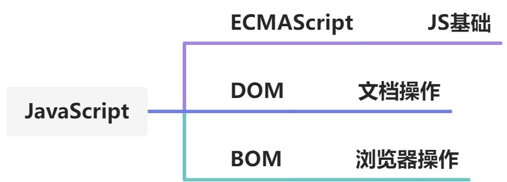
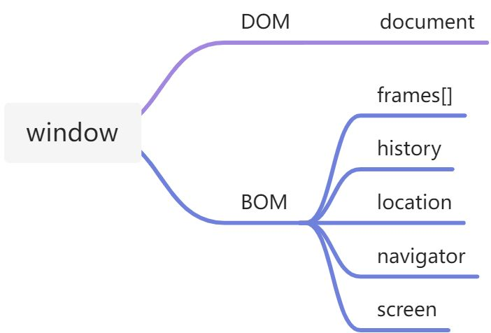

# 深入理解 BOM



## 什么是 BOM

`Browser Object Model`即浏览器对象模型，它是一组针对浏览器相关交互方法和接口的集合。通过`BOM`，`JavaScript`可以与浏览器进行对话，获取浏览器的各种信息并对其进行操作。

## BOM 要解决的问题

`BOM`主要处理浏览器窗口`window`和框架`frame`相关的内容，提供了一系列与浏览器交互的方法和接口，用于解决浏览器窗口的访问与操作问题。

## BOM 的核心对象 window

`window`对象是`BOM`的核心，它代表了浏览器窗口。在网页中定义的所有 JavaScript 全局对象、函数和变量，实际上都是`window`对象的属性和方法，包括`document`对象。

```javascript
window.username === username; // 在全局作用域定义的变量是window的属性
window.obj === obj; // 在全局作用域定义的对象也是window的属性
```

访问`document`对象时，可以省略`window`前缀:

```javascript
window.document.getElementById('div');
// 等同于
document.getElementById('div');
```

## BOM 的标准化问题

由于`BOM`缺乏规范，不同浏览器厂商对其功能的定义各不相同，导致了`BOM`的兼容性问题比较突出。在使用`BOM`时需要注意不同浏览器的差异。



## window 对象的组成

除了`window`对象本身的属性和方法外，还包括以下子对象:

1. `navigator` 浏览器的相关信息
2. `history` 当前窗口的历史记录
3. `location` 当前页面的 URL 信息，可用于页面重定向等
4. `screen` 用户屏幕的相关信息
5. `frames` 页面中所有框架的相关信息

## 多层嵌套 iframe 的访问

对于存在多层嵌套的`<iframe>`标签，子`<iframe>`可以访问其所有父级`<iframe>`的内容。这是因为子`<iframe>`的`window`对象的`parent`属性指向了父`<iframe>`的`window`对象，通过这种链式引用，子`<iframe>`可以逐级向上访问父`<iframe>`的`window`对象及其内容。
