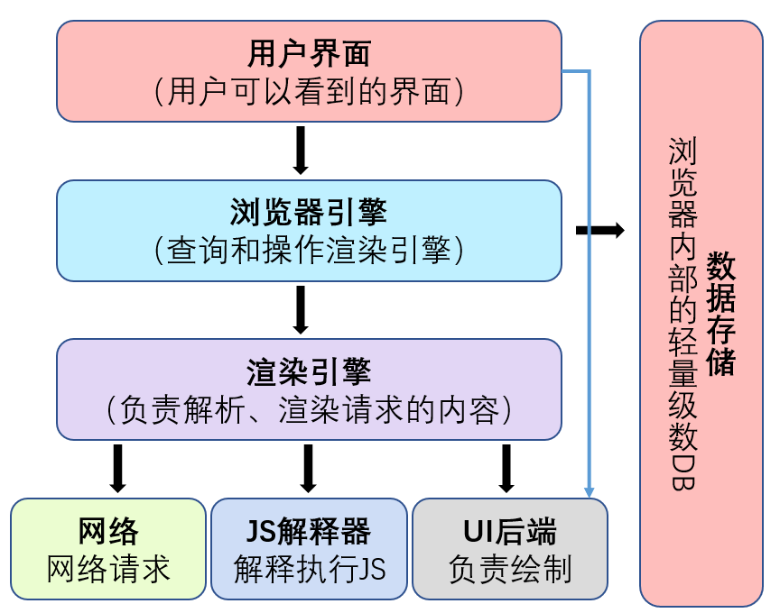
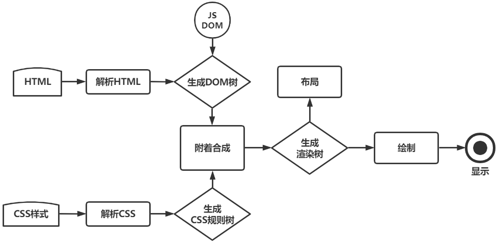
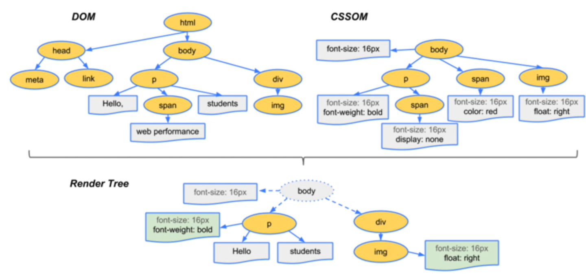

# 浏览器渲染引擎与渲染模式

浏览器是我们日常开发与使用网页的重要工具。作为一名前端开发者，深入理解浏览器的组成部分、页面渲染过程以及不同的渲染模式，有助于我们更好地优化页面性能，提升用户体验。本文将带你一探浏览器渲染引擎的奥秘，了解标准模式与怪异模式的区别。

## 浏览器的组成部分



现代浏览器通常由以下几个核心部分组成：

1. 用户界面（User Interface）：呈现给用户的浏览器外观和交互元素，如地址栏、前进/后退按钮等。

2. 浏览器引擎（Browser Engine）：在用户界面和渲染引擎之间传送指令，协调各个部分的工作。

3. 渲染引擎（Rendering Engine）：负责解析 HTML 和 CSS，并将解析后的内容显示在屏幕上。不同浏览器使用不同的渲染引擎，如 Gecko（Firefox）、Blink（Chrome）等。

4. 网络（Networking）：负责发起网络请求，如 HTTP 请求，获取网页内容。

5. JavaScript 解释器（JavaScript Interpreter）：解析和执行 JavaScript 代码，实现网页的动态交互效果。

6. 用户界面后端（UI Backend）：绘制基本的窗口小部件，如组合框、按钮等。

7. 数据存储（Data Persistence）：管理浏览器存储，如 Cookie、Local Storage 等。

## 页面渲染过程



浏览器渲染页面的过程可以简要概括为以下步骤：

1. 解析 HTML，生成 DOM 树。
2. 解析 CSS，生成 CSSOM 树。
3. 将 DOM 树和 CSSOM 树合并，生成渲染树（Render Tree）。
4. 根据渲染树进行布局（Layout），计算每个节点的位置和尺寸。
5. 将渲染树绘制（Paint）到屏幕上。

其中，渲染树是由可见的 DOM 节点和对应的 CSS 样式构成的树形结构，它决定了页面的最终呈现效果。



## 盒模型与渲染模式

在 Web 标准出现之前，不同浏览器对盒模型的解释存在差异，导致同一页面在不同浏览器下的渲染效果不一致。为了兼容旧版本浏览器，现代浏览器提供了不同的渲染模式。

### 标准盒模型与 IE 盒模型

标准盒模型（W3C 标准）：

- 元素的`width`和`height`属性只包括内容区域（content），不包括`padding`和`border`。

IE 盒模型（IE6 及以下版本）：

- 元素的`width`和`height`属性包括内容区域、`padding`和`border`。

### 标准模式与怪异模式

浏览器根据文档类型声明（DTD）来决定使用标准模式还是怪异模式进行渲染。

标准模式（Standards Mode）：

```html
<!DOCTYPE html>
<html>
  <body>
    <script>
      console.log(document.compatMode); // "CSS1Compat"
    </script>
  </body>
</html>
```

怪异模式（Quirks Mode）：

```html
<html>
  <body>
    <script>
      console.log(document.compatMode); // "BackCompat"
    </script>
  </body>
</html>
```

在怪异模式下，浏览器会模拟旧版本的行为，如使用 IE 盒模型、百分比高度被准确应用、内联元素可设置宽高等。为了避免兼容性问题，我们应该始终使用标准模式进行开发。

## 文档类型定义（DTD）

DTD（Document Type Definition）用于定义 XML 或 HTML 文档的结构和合法元素。常见的 HTML DTD 有以下三种：

1. 严格版本（Strict）：不包含展示性和弃用的元素，强调结构与表现的分离。
2. 过渡版本（Transitional）：包含展示性和弃用的元素，适用于从旧版本 HTML 过渡到新版本。
3. 框架版本（Frameset）：支持使用框架将页面分割成多个部分。

在现代 Web 开发中，我们通常使用 HTML5 的简化 DOCTYPE 声明`<!DOCTYPE html>`来触发标准模式。
