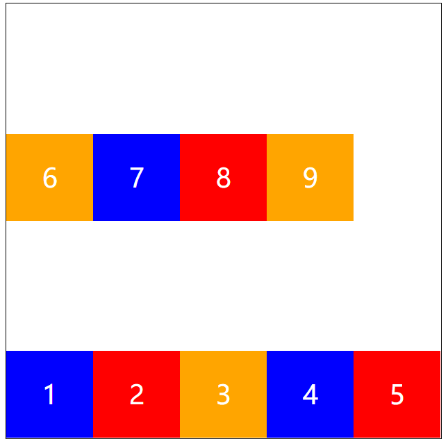

# 弹性盒模型

简称 flexbox，全称是 flexible box。出现这一布局方式是因为在实际开发中，我经常遇到元素在单一轴线上难以灵活对齐和分布的问题。使用 flex 布局可以让子元素在主轴上进行更合理的对齐与分布，从而更好地完成响应式布局。flex 布局的特性是单一维度的布局，这意味着一次只处理一个方向上的排列和对齐。


## 二维布局方式

在实际项目中，如果需要同时在两个方向上进行控制和布局，我更倾向使用 CSS Grid 布局。CSS Grid 是 CSS 提供的另一种强大的布局方案，可以在二维方向上灵活地控制元素的行列分布，从而实现更精细的响应式布局效果。

`CSS Grid layout` 网格布局。  
[更多信息可参考 MDN 上的 CSS Grid 文档](https://developer.mozilla.org/en-US/docs/Web/CSS/CSS_Grid_Layout)

## 设置 flex

在书写 CSS 时，为了兼容旧版浏览器，我会同时使用各前缀写法。

```css
div {
  display: flex;
  display: -webkit-box;
  display: -webkit-flex;
  display: -ms-flexbox;
}
```

## flex 的元素构成

flex 布局包含两个关键部分  
flex 父级容器是 flex container  
flex 子元素称为 flex item

## 实战示例

下面是一个基础的 HTML 代码示例，我通过设置父容器为 flex 布局，让子元素在主轴方向上灵活对齐与分布。

```html
<head>
  <meta charset="UTF-8" />
  <meta http-equiv="X-UA-Compatible" content="IE=edge" />
  <meta name="viewport" content="width=device-width, initial-scale=1.0" />
  <title>弹性盒子布局</title>
  <style>
    div.container {
      display: flex;
      display: -webkit-box;
      display: -webkit-flex;
      display: -ms-flexbox;
      width: 500px;
      height: 500px;
      border: 1px solid #000;
      flex-direction: row-reverse;
    }

    .item-left,
    .item-middle,
    .item-right {
      width: 100px;
      height: 100px;
      color: #fff;
      font-size: 30px;
      text-align: center;
      line-height: 100px;
    }

    .item-left {
      background-color: blue;
    }

    .red {
      background-color: red;
    }

    .orange {
      background-color: orange;
    }
  </style>
</head>

<body>
  <div class="container">
    <div class="item-left blue">1</div>
    <div class="item-middle red">2</div>
    <div class="item-right orange">3</div>
  </div>
</body>
```

在实际开发中我常使用这种方式调整元素在主轴方向上的排列顺序。例如当我需要让元素逆序排列，就可以使用 row-reverse 来实现。

# 父容器上的属性

下面是另一段 HTML 代码，用来展示父容器属性的应用。

## HTML 代码

```html
<!DOCTYPE html>
<html lang="en">
  <head>
    <meta charset="UTF-8" />
    <meta http-equiv="X-UA-Compatible" content="IE=edge" />
    <meta name="viewport" content="width=device-width, initial-scale=1.0" />
    <title>弹性盒子布局</title>
    <style>
      div.container {
        display: flex;
        display: -webkit-box;
        display: -webkit-flex;
        display: -ms-flexbox;
        width: 500px;
        height: 500px;
        border: 1px solid #000;
      }

      .item-left,
      .item-middle,
      .item-right {
        width: 100px;
        height: 100px;
        color: #fff;
        font-size: 30px;
        text-align: center;
        line-height: 100px;
      }

      .item-left {
        background-color: blue;
      }

      .red {
        background-color: red;
      }

      .orange {
        background-color: orange;
      }
    </style>
  </head>
  <body>
    <div class="container">
      <div class="item-left blue">1</div>
      <div class="item-middle red">2</div>
      <div class="item-right orange">3</div>
    </div>
  </body>
</html>
```

## 定义主轴方向

使用 flex-direction 可以定义主轴方向。  
默认是从左到右的行方向

```css
flex-direction: row;
```


如果需要逆向，可以用 row-reverse，让元素从右到左排列

```css
flex-direction: row-reverse;
```


在实际项目中，如在电商页面的商品列表中，如果我希望元素呈现出从右往左的布局，可以直接使用 row-reverse 让他们顺序倒转。

如果需要竖直方向的排列，可用 column

```css
flex-direction: column;
```


如需竖直方向翻转，可用 column-reverse

```css
flex-direction: column-reverse;
```


## 盒子超出后是否换行

默认不换行

```css
flex-wrap: nowrap;
```


有时在移动端界面，当元素数量过多，我会选择自动换行。这样在小屏幕下仍可保持清晰布局。

```css
flex-wrap: wrap;
```


还可颠倒折行

```css
flex-wrap: wrap-reverse;
```



## 主轴加折行简写

通过 flex-flow 可以同时定义主轴方向和换行方式

```css
flex-flow: row wrap;
```


在实际项目中我常使用 flex-flow 简写，保持代码简洁。

## 主轴上的对齐方式

justify-content 用于定义在主轴方向上如何对齐元素

默认沿着起点对齐

```css
justify-content: flex-start;
```

沿着终点对齐，元素集中在主轴的另一端

```css
justify-content: flex-end;
```


元素居中

```css
justify-content: center;
```


当我需要让导航栏的菜单项在中间显示时，就会使用 center 对齐。

两端对齐

```css
justify-content: space-between;
```


空隙平均分布

```css
justify-content: space-around;
```


## 垂直对齐

align-items 用于定义元素沿着交叉轴方向的对齐方式  
当需要在副轴上控制项目对齐，如让元素顶对齐

```css
align-items: flex-start;
```


底部对齐

```css
align-items: flex-end;
```


居中对齐

```css
align-items: center;
```


当我在制作留言板页面时，希望头像和文字在交叉轴上水平居中，就会使用 center 实现。

沿基准线对齐

```css
align-items: baseline;
```


填满高度

```css
align-items: stretch;
```


## 多轴对齐方式

align-content 用于在多轴情况下控制交叉轴的对齐方式。如果有多行元素，此属性可让行在交叉轴方向分布更加灵活。

顶部对齐

```css
align-content: flex-start;
```


底部对齐

```css
align-content: flex-end;
```


交叉轴两端对齐

```css
align-content: space-between;
```


交叉轴中间对齐

```css
align-content: center;
```


交叉轴间距相等

```css
align-content: space-around;
```


当元素数量动态变化时，使用 align-content 可以让多行布局在不同屏幕尺寸下有更好的视觉表现。

等分交叉轴并顶端对齐

```css
align-content: stretch;
```


## 移动端固定定位

在移动端开发中，我有时需要让底部菜单固定在屏幕底部。这可以通过 position 属性实现。

```html
<!DOCTYPE html>
<html lang="en">
  <head>
    <meta charset="UTF-8" />
    <meta http-equiv="X-UA-Compatible" content="IE=edge" />
    <meta name="viewport" content="width=device-width, initial-scale=1.0" />
    <title>固定定位示例</title>
    <style>
      .content {
        width: 100%;
        height: 1000px;
        background-color: black;
      }

      .fixed-menu {
        position: fixed;
        width: 100%;
        height: 100px;
        left: 0;
        bottom: 0;
        background-color: antiquewhite;
      }

      li {
        color: #fff;
        font-size: 16px;
        line-height: 30px;
      }
    </style>
  </head>
  <body>
    <div class="content"></div>
    <div class="fixed-menu">
      <h1>菜单栏</h1>
    </div>
  </body>
</html>
```
