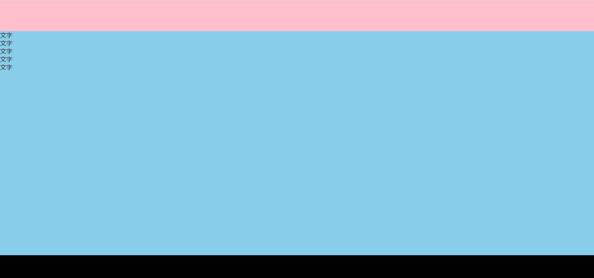

# 布局与内容自适应

## 布局实现思路

此处使用了 Flex 布局，将整体页面分为三个部分。顶部与底部区域高度固定，中间内容区通过 Flex 属性自动占据剩余空间。此方法无需手动为中间内容区设定固定高度，有助于在可变窗口大小中保持布局稳定。

此处在`<body>`中添加.container 作为整体布局容器。通过 flex-direction 设定为 column，让`<header>`与`<footer>`分别固定于顶部与底部。content 区使用 flex 属性为 1，使其在垂直方向上自动延展，避免内容溢出页面并需要额外滚动。需要隐藏滚动条时可通过 CSS 控制样式。

此布局在实际项目中应用广泛。例如后台管理系统的整体框架中，上方是固定工具栏，下方为固定版权信息，中间为可变内容区。无论内容区文字多少，都可以在窗口自动撑开，确保用户体验舒适。

## 代码示例

```html
<!DOCTYPE html>
<html lang="en">
  <head>
    <meta charset="UTF-8" />
    <meta http-equiv="X-UA-Compatible" content="IE=edge" />
    <meta name="viewport" content="width=device-width, initial-scale=1.0" />
    <title>Document</title>
    <style>
      * {
        margin: 0;
      }
      body::-webkit-scrollbar {
        display: none;
      }

      .layout-container {
        min-height: 100vh;
        display: flex;
        flex-direction: column;
      }

      .layout-container .header {
        height: 80px;
        background: pink;
      }

      .layout-container .content {
        background-color: skyblue;
        flex: 1;
      }

      .layout-container .footer {
        height: 60px;
        background-color: black;
      }
    </style>
  </head>

  <body>
    <div class="layout-container">
      <div class="header"></div>
      <div class="content">
        <p>文字</p>
        <p>文字</p>
        <p>文字</p>
        <p>文字</p>
        <p>文字</p>
      </div>
      <div class="footer"></div>
    </div>
  </body>
</html>
```


