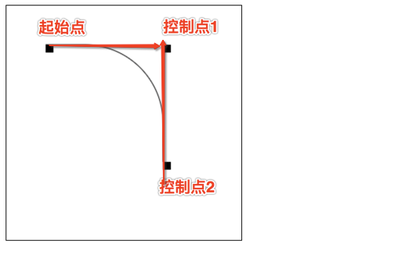
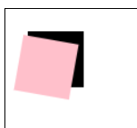
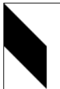

# 获取 2D 接口

获取 3D 接口为 WEBGL

```html
<body>
  <canvas id="canvas" width="300" height="200"></canvas>
  <script>
    var canvas = document.getElementById('canvas');
    var ctx = canvas.getContext('2d');
  </script>
</body>
```

## cancas 坐标


# 绘画图形

## 矩形

我在使用 2D 绘图接口时通常通过 fillRect 方法绘制基本矩形，然后再结合 clearRect 实现透明效果。下面是示例代码。

```javascript
ctx.fillStyle = 'orange';
ctx.fillRect(50, 50, 100, 100);
ctx.clearRect(75, 75, 50, 50);
```

## 画笔

使用 strokeRect 方法绘制矩形边框，这可以帮助我在实际开发中更直观地标识区域。

```javascript
ctx.strokeRect(50, 50, 100, 100);
```

## 绘制路径（直线）

我通常会先使用 beginPath 方法开始一条路径，然后通过 moveTo 和 lineTo 绘制直线段，最后使用 stroke 将路径描边显示出来。这种方式在实际开发中非常灵活，可以用来绘制任意形状的连接线条。

```javascript
ctx.beginPath();
ctx.strokeStyle = 'orange';
ctx.moveTo(50, 50);
ctx.lineTo(100, 100);
ctx.stroke();
```

## 三角形

我在绘制三角形时，先创建路径并使用 moveTo、lineTo 完成三个顶点的连接，再使用 closePath 闭合路径后描边。为了更好地控制线条样式，我会使用 lineWidth 属性调整线条粗细。

```javascript
ctx.beginPath();
ctx.strokeStyle = 'orange';
ctx.lineWidth = 5;
ctx.moveTo(50, 50);
ctx.lineTo(150, 50);
ctx.lineTo(100, 100);
ctx.closePath();
ctx.stroke();
```

## 圆

使用 arc 方法可以轻松绘制圆形或椭圆，这在绘制饼图或圆形按钮时十分方便。

```javascript
ctx.beginPath();
ctx.arc(70, 70, 50, 0, 2 * Math.PI, false);
ctx.stroke();
```

## arcTo

使用 arcTo 方法绘制圆角路径时，我会根据控制点和半径实现平滑的曲线连接。在绘制复杂路径时，这个方法对我来说非常实用。

```javascript
ctx.beginPath();
ctx.moveTo(50, 50);
// 参数1与参数2为控制点1坐标 参数3与参数4为控制点2坐标 最后一个参数为圆弧半径
ctx.arcTo(200, 50, 200, 200, 100);
ctx.lineTo(200, 200);
ctx.stroke();
```



## 二次贝塞尔曲线

我在需要实现较为平滑的弧线时会使用 quadraticCurveTo 来绘制二次贝塞尔曲线。通过控制点位置的调整，我可以轻松实现曲线平滑过渡。

```javascript
ctx.beginPath();
ctx.moveTo(10, 200);
var controlPointX1 = 40,
  controlPointY1 = 100;
var endX = 200,
  endY = 200;
ctx.quadraticCurveTo(controlPointX1, controlPointY1, endX, endY);
ctx.stroke();

ctx.beginPath();
ctx.rect(10, 200, 10, 10);
ctx.rect(controlPointX1, controlPointY1, 10, 10);
ctx.rect(endX, endY, 10, 10);
ctx.fill();
```


## 三次贝塞尔曲线

在需要更精确控制曲线路径时，我会使用 bezierCurveTo 绘制三次贝塞尔曲线。这可以通过两个控制点决定曲线的弧度与倾向，在复杂图像绘制中非常有用。

```javascript
ctx.beginPath();
ctx.moveTo(40, 200);
var cp1x = 20,
  cp1y = 100;
var cp2x = 100,
  cp2y = 120;
var endX2 = 200,
  endY2 = 200;
ctx.bezierCurveTo(cp1x, cp1y, cp2x, cp2y, endX2, endY2);
ctx.stroke();

ctx.beginPath();
ctx.rect(40, 200, 10, 10);
ctx.rect(cp1x, cp1y, 10, 10);
ctx.rect(cp2x, cp2y, 10, 10);
ctx.rect(endX2, endY2, 10, 10);
ctx.fill();
```


## 坐标轴变换

通过 translate 方法，我可以轻松改变绘图的起点坐标系位置，从而实现局部坐标变换，这在大型图形绘制或动画中非常实用。

```javascript
ctx.translate(50, 0);
ctx.fillRect(0, 0, 50, 50);
```

## 保存状态

使用 save 和 restore 方法可以让我在复杂的绘图中灵活切换不同状态。每次调用 save 都会将当前状态存储，然后通过 restore 恢复到上一次保存的状态。这对于多层级变换非常有帮助。

```javascript
ctx.save();
ctx.translate(50, 0);
ctx.fillRect(0, 0, 50, 50);
ctx.restore();
ctx.fillStyle = 'pink';
ctx.fillRect(0, 0, 30, 30);
```

## 缩放因子

使用 scale 方法可对后续绘制内容进行缩放。我经常在绘制图像或者文本时使用此方法来实现放大或缩小的效果。

```javascript
ctx.scale(2, 1);
ctx.fillRect(50, 0, 50, 50);
```

## 旋转

使用 rotate 方法可围绕原点旋转坐标系。我在绘制旋转元素或构建简单动画时非常依赖此方法。

```javascript
ctx.fillRect(20, 20, 50, 50);
ctx.rotate((Math.PI / 180) * 10);
ctx.fillStyle = 'pink';
ctx.fillRect(20, 20, 50, 50);
```



## 变换

transform 方法允许我直接对坐标系进行复杂变换，包括倾斜、缩放和旋转的综合效果。通过合理使用 transform 方法，我能够实现复杂场景中的自定义变换。

```javascript
ctx.transform(1, 1, 0, 1, 0, 0);
ctx.fillRect(0, 0, 50, 50);
```


