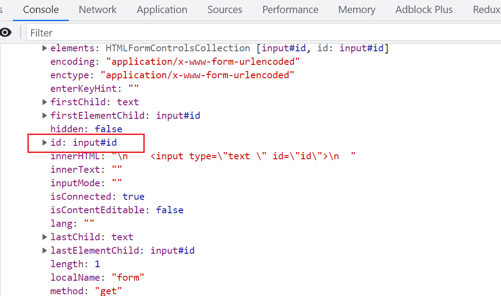
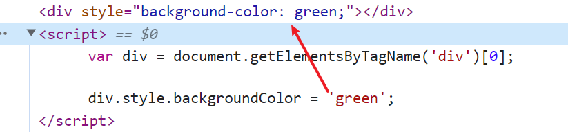
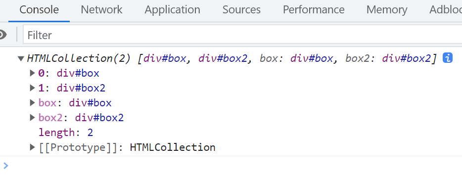

# ECMAScript 3 种对象

## 本地对象

我在实际使用中常常接触到本地对象，也称为原生对象，这些对象在执行环境中无需额外加载即可直接使用。它们包括 Object、Function、Array、String、Number、Boolean、Error、EvalError、SyntaxError、RangeError、ReferenceError、TypeError、URIError、Date、RegExp 等。在项目开发中，这些对象是最基础且非常重要的工具，我会利用它们来实现数据结构处理、字符串操作、错误处理以及正则匹配等多种功能。

## 内置对象

内置对象在 ECMAScript 标准中定义，它们是独立于宿主环境且在所有实现中都应该存在的对象。使用中我常利用 Math 来完成数学计算，使用 Global 对象来访问全局范围的相关属性和方法。另外，我还经常通过 isNaN、parseInt、Number、decodeURI、encodeURI、Infinity、NaN、undefined 这些内置成员来处理数据类型转换、检查是否为数字及基本数据解析。这些内置特性让我在代码中更加灵活地完成基础运算与数据判断。

## 宿主对象

宿主对象由运行 JS 的环境提供。以浏览器为例，window（BOM）和 document（DOM）等对象就是宿主对象。在实际项目中，由于不同浏览器环境对宿主对象的实现不尽相同，我在编写代码时会关注兼容性问题，选择通用的访问方式，并在必要时使用特性检测或 Polyfill 来确保代码在不同环境下都能正常运行。

# DOM

[文档对象模型 (DOM) - Web API 接口参考 | MDN](https://developer.mozilla.org/zh-CN/docs/Web/API/Document_Object_Model)

## XML

HTML 的诞生受到了 XML 的启发。XML 为 HTML 的结构化与可解析奠定了基础。浏览器能够直接解析符合标准的 HTML 文档，并将其转换为 DOM 树结构。在实际开发中，我通过对 DOM 树的操作来实现动态更新页面、修改节点属性、移除与增加节点等工作。

```xml
<person>
  <name>姓名</name>
  <sex>性别</sex>
  <age>18</age>
</person>
```

## id 向上传递

在 HTML 结构中，如果子元素的 id 与父元素的 id 相同，会出现 id 向上传递的问题，导致查询父级 id 时出现歧义。实际开发中我会确保 id 在文档中是唯一的，以便通过 document.getElementById 精准获取元素。

```html
<form id="myForm">
  <input type="text" id="id" />
</form>

<script type="text/javascript">
  var forms = document.getElementsByTagName('form');
  console.log(forms);
</script>
```



## 操作样式属性

在实际开发中，我需要动态控制页面元素的样式。修改 style 属性相当于修改行内样式，因为行内样式的优先级更高，可以保证在复杂的 CSS 层叠环境下精准控制元素样式。不过这种方式会与外部 CSS 产生冲突，不利于维护与扩展。实践中，为了更好地控制样式，我通常使用 className 配合 CSS 类规则，这样更利于样式统一管理。



## 选择一组 DOM

我通过 document.getElementsByTagName 或 document.getElementsByClassName 获取一组 DOM 节点，然后通过下标访问想要的元素。不过在现代开发中，我更常用 document.querySelector 和 document.querySelectorAll 来实现更灵活的元素选择。

```html
<div id="box"></div>
<div id="box2"></div>

<script type="text/javascript">
  var boxes = document.getElementsByTagName('div');
  console.log(boxes);
</script>
```



## 循环绑定事件

在大量元素绑定事件时，我会使用循环遍历元素节点，然后为每个元素添加事件处理函数。通过 this 关键字可以准确定位到当前点击的元素。实际中我还会使用事件委托，将事件绑定到父级元素，通过事件冒泡减少重复绑定，从而提高性能。

```html
<div>123</div>
<div>234</div>
<div>235</div>

<script type="text/javascript">
  var boxes = document.getElementsByTagName('div');
  for (var i = 0; i < boxes.length; i++) {
    boxes[i].onclick = function () {
      console.log(this.innerText);
    };
  }
</script>
```

# 幻灯片

## 循环绑定闭包

在循环中绑定事件常常会出现闭包问题。当我在 for 循环中创建函数时，内部函数会引用相同的变量环境，导致循环结束后输出结果与预期不一致。实践中我通常使用立即执行函数（IIFE）来保存循环变量的当前状态，从而确保每个函数调用时拿到正确的变量值。

```javascript
function test() {
  var arr = [];
  var i = 0;
  for (; i < 10; ) {
    arr[i] = function () {
      document.write(i + '');
    };
    i++;
  }
  return arr;
}
var myArr = test();
for (var j = 0; j < myArr.length; j++) {
  myArr[j]();
}
```

### 解决方法

使用立即执行函数将变量 j 保存在函数作用域中，从而避免闭包问题。

```javascript
function test() {
  var arr = [];
  for (var i = 0; i < 10; i++) {
    (function (j) {
      arr[j] = function () {
        document.write(j + '');
      };
    })(i);
  }
  return arr;
}
var myArr = test();
for (var j = 0; j < myArr.length; j++) {
  myArr[j]();
}
```

## 案例

下方示例是一个简单的图片幻灯片预览。我通过点击缩略图的方式切换主图片展示。通过合理使用 className 控制元素的显示与隐藏，将复杂的 DOM 结构及事件逻辑清晰地组织起来。在实战中，我也会借助 CSS 过渡动画和事件委托来进一步优化体验，并减少 DOM 操作带来的性能损耗。

```html
<!DOCTYPE html>
<html lang="en">
  <head>
    <meta charset="UTF-8" />
    <meta http-equiv="X-UA-Compatible" content="IE=edge" />
    <meta name="viewport" content="width=device-width, initial-scale=1.0" />
    <style>
      body {
        margin: 0;
      }
      ul {
        padding: 0;
        margin: 0;
        list-style: none;
      }
      a {
        text-decoration: none;
      }
      img {
        width: 100%;
        height: 100%;
      }
      .slider-wrap {
        width: 996px;
        height: 480px;
        margin: 50px auto;
        border: 1px solid #000;
        background-color: #000;
      }
      .sider {
        float: left;
        position: relative;
        width: 853px;
        height: 480px;
      }
      .sider .slider-item {
        display: none;
        position: absolute;
        top: 0;
        left: 0;
        height: 480px;
      }
      .sider .slider-item.active {
        display: block;
      }
      .thumbs {
        float: left;
        width: 142px;
        height: 480px;
      }
      .thumbs-itme {
        height: 80px;
        opacity: 0.5;
      }
      .thumbs .thumbs-itme.cur {
        opacity: 1;
      }
    </style>
  </head>
  <body>
    <div class="slider-wrap">
      <div class="sider">
        <ul class="slider-list">
          <li class="slider-item active">
            <a href="">
              
            </a>
          </li>
          <li class="slider-item">
            <a href="">
              
            </a>
          </li>
          <li class="slider-item">
            <a href="">
              
            </a>
          </li>
          <li class="slider-item">
            <a href="">
              
            </a>
          </li>
          <li class="slider-item">
            <a href="">
              
            </a>
          </li>
          <li class="slider-item">
            <a href="">
              
            </a>
          </li>
        </ul>
      </div>
      <div class="thumbs">
        <ul class="thumbs-list">
          <li class="thumbs-itme cur">
            <a href="javascript:;">
              
            </a>
          </li>
          <li class="thumbs-itme">
            <a href="javascript:;">
              
            </a>
          </li>
          <li class="thumbs-itme">
            <a href="javascript:;">
              
            </a>
          </li>
          <li class="thumbs-itme">
            <a href="javascript:;">
              
            </a>
          </li>
          <li class="thumbs-itme">
            <a href="javascript:;">
              
            </a>
          </li>
          <li class="thumbs-itme">
            <a href="javascript:;">
              
            </a>
          </li>
        </ul>
      </div>
    </div>
    <script type="text/javascript">
      var thumbsItem = document.getElementsByClassName('thumbs-itme');
      var sliderItem = document.getElementsByClassName('slider-item');
      for (var i = 0; i < thumbsItem.length; i++) {
        (function (j) {
          thumbsItem[i].onclick = function () {
            for (var k = 0; k < thumbsItem.length; k++) {
              thumbsItem[k].className = 'thumbs-itme';
              sliderItem[k].className = 'slider-item';
            }
            this.className += ' cur';
            sliderItem[j].className += ' active';
          };
        })(i);
      }
    </script>
  </body>
</html>
```

## 插件开发

为了更好地组织代码和实现复用性，我通常将功能封装成插件。在下面的示例中，我通过构造函数和原型方法将幻灯片逻辑打包成可复用的模块。这样在后续项目中，我只需要传入特定类名即可快速初始化并使用。实际开发中，我还会考虑将这些插件进行参数扩展和方法增强，以满足更多的场景需求。

```javascript
(function () {
  var Slider = function (opt) {
    this.sliderItem = document.getElementsByClassName(opt.sliderItem);
    this.thumbsItem = document.getElementsByClassName(opt.thumbsItem);
    this.bindClick();
  };

  Slider.prototype = {
    bindClick: function () {
      var slider = this.sliderItem;
      var thumbs = this.thumbsItem;

      for (var i = 0; i < thumbs.length; i++) {
        (function (j) {
          thumbs[j].onclick = function () {
            for (var k = 0; k < thumbs.length; k++) {
              thumbs[k].className = 'thumbs-itme';
              slider[k].className = 'slider-item';
            }
            this.className += ' cur';
            slider[j].className += ' active';
          };
        })(i);
      }
    },
  };

  window.Slider = Slider;
})();

var slider = new Slider({
  sliderItem: 'slider-item',
  thumbsItem: 'thumbs-itme',
});
```

[JavaScript-practise/DOM at main · sumingcheng/JavaScript-practise](https://github.com/sumingcheng/JavaScript-practise/tree/main/DOM)
