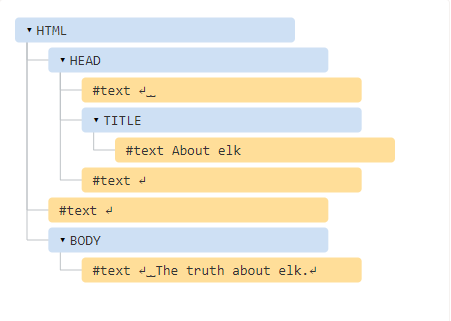
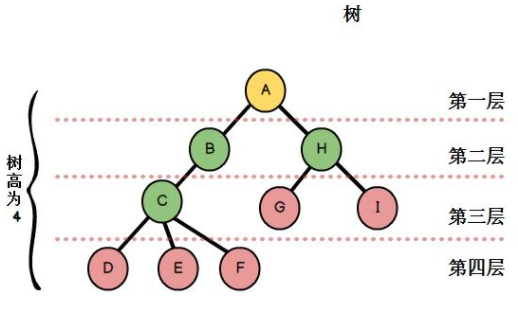
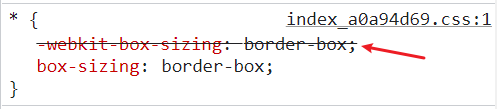

# domTree 解析

## domTree

```html
<html>
  <head>
    <title>About elk</title>
  </head>
  <body>
    The truth about elk.
  </body>
</html>
```



## 解析原则

**深度优先原则**：从左到右，从上到下，先走到最深的节点，然后再继续的走下一个节点。`DOM`树的解析过程是深度解析，不是广度解析。



# 加载

先解析后加载，如果是一个图片，图片的`url`是`baidu.img`，那么`img`的标签被解析了，但是图片还在加载。解析和加载是一个异步的过程。

# CssTree

`cssTree`：样式结构体

1. `CSS`树和`DOM`树也基本一致，也满足深度优先。
2. `CSS`树会忽略浏览器不能识别的样式。



# renderTree

`CSS`构建结束后，`domTree`和`cssTree`结合成`renderTree`渲染树。浏览器会根据`renderTree`去绘制页面。

1. 渲染树每个节点都有自己的样式。
2. 渲染树不包含隐藏节点，例如：`display：none`和`head、style、html、title`之类不需要的节点。
3. 渲染树包含`visibility：hidden`，只要是影响布局的都要在渲染树里。
4. 渲染树上的每一个节点都会被当做一个盒子`box`，具有内容填充、边距、位置、大小、其他样式。
5. `renderTree`构建完成后，浏览器会根据`renderTree`来绘制页面。

# 回流和重绘

当`JS`对页面的节点操作时，就会产生回流或者重绘，回流一定会触发重绘，而重绘不一定会回流。

1. 回流又叫重排`reflow`
2. 重绘又叫`repaint`

## 回流

1. 因为节点的尺寸、布局、显示，这些改变的时候，`renderTree`的一部分或者是全部需要重新构建。这种重新构建的现象叫做回流。
2. 一个页面至少有一次回流，页面加载的首次也算一次回流。

## 重绘

1. 除了回流以外的都会引起重绘。
2. 回流时，浏览器会重新构建受影响的部分`renderTree`。
3. 回流完成时，浏览器会根据新的`renderTree`重新绘制回流影响的部分或者是全部节点，重新绘制的过程重绘。

## 引起回流的因素

1. `DOM`节点的增删
2. `DOM`节点的位置变化，比如`margin`
3. 元素的尺寸、边距、填充、边框、宽高
4. `DOM`节点`display`属性的显示与否
5. 页面的渲染初始化
6. 浏览器窗口尺寸变化也会引起回流`resize`
7. 向浏览器请求某些样式信息，`offset`、`scroll`、`client`、`width`、`height`、`getComputedStyle`、`currentStyle`。
8. `DOM`操作是最消耗性能的，是因为`DOM`操作会产生回流。
9. 回流产生的性能代价远远大于重绘。
10. 尽量避免在页面最前面添加东西

```html
<div class="box">盒子</div>
<script>
  var oBoxStyle = document.getElementsByClassName('box')[0].style;

  // 回流+重绘
  oBoxStyle.width = '200px';
  // 回流+重绘
  oBoxStyle.height = '200px';
  // 回流+重绘
  oBoxStyle.margin = '20px';
  // 重绘
  oBoxStyle.backgroundColor = 'pink';
  // 回流+重绘
  oBoxStyle.border = '5px solid orange';
  // 重绘
  oBoxStyle.color = '#fff';
  // 回流+重绘
  oBoxStyle.fontSize = '25px';
</script>
```

在写代码的时候，有些可以写在一起的尽量写字一起，可以减少回流和重绘。

## 增加 DOM 节点

增加节点只引起一个回流和重绘，但是如果是在最前面增加的，整个 boy 都要重新回流和重绘，增加在最后面则不影响。

```javascript
var h1 = document.createElement('h1');
h1.innerHTML = '我是标题';
document.body.appendChild(h1);
```

# 浏览器队列策略

浏览器生成一个批处理的队列，将多次产生的回流或者重绘，把引起回流的操作进行批量的处理。处理的时机按照队列数量或者是时间进行处理。

## 请求某些样式信息

**请求某些样式信息的时候浏览器会清空队列里的操作。**

因为队列里的操作可能会影响到样式值的计算和操作。所以浏览器每次碰到要获取某些样式信息，浏览器就会清空队列。

# 减少回流的次数和影响的规模

## 多次回流和重绘

操作 DOM 过多

```html
<head>
  <meta charset="UTF-8" />
  <meta http-equiv="X-UA-Compatible" content="IE=edge" />
  <meta name="viewport" content="width=device-width, initial-scale=1.0" />
  <title>Document</title>
  <style>
    div {
      height: 100px;
      width: 100px;
      background-color: #000;
    }
  </style>
</head>

<body>
  <div>盒子</div>
  <script>
    var oDiv = document.getElementsByTagName('div')[0];
    oDiv.onmouseover = function () {
      this.style.width = '200px';
      this.style.height = '200px';
      this.style.backgroundColor = 'green';
      this.style.border = '5px solid orange';
    };
  </script>
</body>
```

## 一次回流和重绘

使用`CSS`类样式，减少`DOM`操作，只引起一次回流和重绘

```html
<head>
  <meta charset="UTF-8" />
  <meta http-equiv="X-UA-Compatible" content="IE=edge" />
  <meta name="viewport" content="width=device-width, initial-scale=1.0" />
  <title>Document</title>
  <style>
    div {
      height: 100px;
      width: 100px;
      background-color: #000;
    }

    div.active {
      width: 200px;
      height: 200px;
      background-color: green;
      border: 5px solid orange;
    }
  </style>
</head>

<body>
  <div>盒子</div>
  <script>
    var oDiv = document.getElementsByTagName('div')[0];

    oDiv.onmouseover = function () {
      this.className += 'active';
    };
  </script>
</body>
```

## 动态值处理

添加行内样式

```html
<head>
  <meta charset="UTF-8" />
  <meta http-equiv="X-UA-Compatible" content="IE=edge" />
  <meta name="viewport" content="width=device-width, initial-scale=1.0" />
  <title>Document</title>
  <style>
    div {
      height: 100px;
      width: 100px;
      background-color: #000;
    }
  </style>
</head>

<body>
  <div>盒子</div>
  <script>
    var oDiv = document.getElementsByTagName('div')[0],
      width = 200,
      height = 200,
      backgroundColor = 'green',
      border = '5px solid orange';

    oDiv.onmouseover = function () {
      this.style.cssText =
        '\
      width:' +
        width +
        'px;\
      height:' +
        height +
        'px;\
      background-color:' +
        backgroundColor +
        ';\
      border:' +
        border +
        ';\
      ';
    };
  </script>
</body>
```

## 文档碎片

集中所有的`DOM`操作，一起处理

```html
<head>
  <meta charset="UTF-8" />
  <meta http-equiv="X-UA-Compatible" content="IE=edge" />
  <meta name="viewport" content="width=device-width, initial-scale=1.0" />
  <title>Document</title>
  <style>
    .box {
      height: 100px;
      width: 100px;
      margin-bottom: 10px;
      background-color: #000;
    }
  </style>
</head>

<body>
  <script>
    // 不占用DOM树
    var oFragement = document.createDocumentFragment();
    for (var i = 0; i < 10; i++) {
      // 回流重绘十次
      var oDiv = document.createElement('div');
      oDiv.className = 'box';
      // 使用oFragement 接收节点为一个集合
      oFragement.appendChild(oDiv);
    }
    // 回流一次重绘一次
    document.body.appendChild(oFragement);
  </script>
</body>
```

## display：none

```html
<head>
  <meta charset="UTF-8" />
  <meta http-equiv="X-UA-Compatible" content="IE=edge" />
  <meta name="viewport" content="width=device-width, initial-scale=1.0" />
  <title>Document</title>
  <style>
    .box {
      height: 100px;
      width: 100px;
      margin-bottom: 10px;
      background-color: #000;
    }
  </style>
</head>

<body>
  <div class="box"></div>
  <script>
    var oBox = document.getElementsByClassName('box')[0],
      oBoxStyle = oBox.style;
    oBox.onmouseover = function () {
      // 先进行none设置，让他不加载进dom
      oBoxStyle.display = 'none';
      oBoxStyle.width = '200px';
      oBoxStyle.height = '200px';
      oBoxStyle.backgroundColor = 'green';
      oBoxStyle.border = '5px solid orange';
      // 再设置，一起加载进dom，中间的所有操作都不会引起回流和重绘。
      oBoxStyle.display = 'block';
    };
  </script>
</body>
```

## 缓存拿到的值

```javascript
// 缓存拿到的值，减少回流和重绘
var oleft = div.offsetLeft;
div.style.left = oleft + 10 + 'px';
```

## 动画元素绝对定位

动画的元素一定要绝对定位，去脱离文档普通流，所有的动画和重绘都不影响到父级。

## table 布局

`table`回流和重绘的代价相当大，`table`内部本身有很多自己的设置，对回流的影响相当的大。可以使用` dl``ul `代替。
