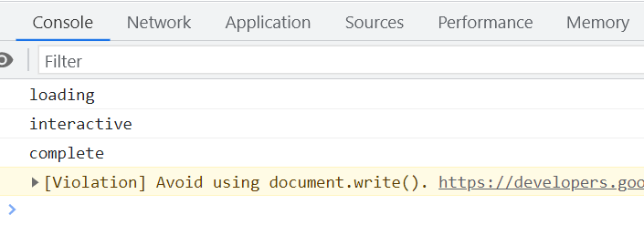
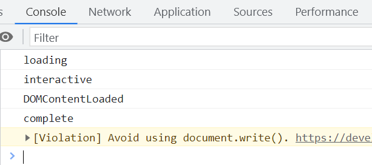

# 浏览器时间线 - 解析与渲染过程详解

本文将详细探讨浏览器从开始加载页面到完全渲染结束的整个过程,重点关注文档解析、DOM 构建、CSSOM 构建以及脚本执行等关键阶段。

## document.readyState 状态

`document.readyState`属性表示文档加载状态,共有三个可能的值:

### loading

表示文档正在加载中。在这个阶段:

1. `document`对象已创建,JS 开始起作用。DOM 的构建依赖于`document`对象。
2. 浏览器开始从第一行解析到最后一行,构建 DOM 树。
3. 如果遇到`link`或`style`标签:
   - 遇到`link`标签会开启新线程,异步加载外部 CSS 文件。
   - `style`标签则用于构建 CSSOM 树,CSSOM 树和 DOM 树是同时构建的。
4. 如果遇到不带`async`属性的`script`标签,则会阻塞文档解析,等待 JS 脚本加载并执行完成后才能继续解析文档。
5. 如果`script`标签设置了`async`属性,则会异步加载并执行 JS,不会阻塞文档解析。但此时不能使用`document.write`方法,若必须使用,可以将其写在`window.onload`事件处理函数中。
6. 解析到`img`标签时,会先解析这个节点。如果`src`属性不为空,则会创建新线程异步加载图片资源,不会阻塞文档解析。

### interactive

表示文档解析完成,但资源仍在加载。在这个阶段:

7. 整个 HTML 文档解析完毕。
8. 如果有设置`defer`属性的`script`标签,则开始按照在文档中出现的顺序依次执行这些脚本。
9. 触发`DOMContentLoaded`事件,标志着程序由同步脚本执行阶段过渡到事件驱动阶段。我们可以监听此事件,以了解文档解析完成的时间点。

### complete

表示页面所有内容都加载完毕。在这个阶段:

10. 所有异步加载的资源,如设置了`async`属性的脚本、图片等都已加载并执行完毕。
11. 触发`window`对象的`load`事件,标志着页面加载彻底完成。

## 监听 readyState 变化

我们可以通过`document.onreadystatechange`事件监听`readyState`的变化,一旦状态发生改变就会立即触发该事件。

```javascript
// 打印当前状态
console.log(document.readyState);

// 监听readyState变化
document.onreadystatechange = function () {
  console.log(document.readyState);
};
```

执行上述代码,控制台输出如下:



## DOMContentLoaded 事件

`DOMContentLoaded`事件在 DOM 树构建完成后立即触发,无需等待图片等资源加载。监听该事件的方式如下:

```javascript
document.addEventListener(
  'DOMContentLoaded',
  function () {
    console.log('DOM fully loaded and parsed');
  },
  false
);
```



## window.onload 事件

与`DOMContentLoaded`不同,`window.onload`事件会在页面所有资源都加载完毕后才触发。由于它触发时机较晚,因此不建议在实际开发中使用。

## 现代浏览器的优化

现代浏览器在解析和渲染方面做了很多优化:

1. 采用流式解析,边解析边构建 DOM 树和 CSSOM 树,尽早开始渲染。
2. 引入了`first paint`(首次渲染)的概念,尽快显示页面内容。

因此,我们应当避免将`script`标签放在 HTML 文档的开头,以免阻塞后续内容的解析。

## 兼容性处理

为了兼容旧版 IE 浏览器,可以封装一个`domReady`函数:

```javascript
function domReady(callback) {
  if (document.addEventListener) {
    document.addEventListener(
      'DOMContentLoaded',
      function () {
        document.removeEventListener('DOMContentLoaded', arguments.callee, false);
        callback();
      },
      false
    );
  } else if (document.attachEvent) {
    document.attachEvent('onreadystatechange', function () {
      if (document.readyState === 'complete') {
        document.detachEvent('onreadystatechange', arguments.callee);
        callback();
      }
    });
    if (document.documentElement.doScroll && window == window.top) {
      try {
        document.documentElement.doScroll('left');
      } catch (error) {
        return setTimeout(arguments.callee, 0);
      }
      callback();
    }
  }
}

// 使用示例
domReady(function () {
  // DOM加载完毕,执行某些操作
  console.log('DOM Ready!');
});
```

以上就是现代浏览器加载和渲染页面的完整时间线。作为开发者,我们应该根据实际情况,合理安排资源加载顺序,尽可能优化关键渲染路径,提升页面性能。同时,为了确保脚本执行不会阻塞页面解析,建议将脚本设置为异步加载或推迟到文档解析完成后执行。

## 事件传递机制

除了理解页面加载时间线,我们还需要了解浏览器事件传递的两种方式:事件冒泡和事件捕获。

事件传递定义了元素事件触发的顺序。例如,当点击一个嵌套在`<div>`中的`<p>`元素时,两个元素上绑定的 click 事件触发顺序取决于传递方式:

### 事件冒泡

事件从最内层元素开始触发,然后逐级向上传播到最外层。在上面的例子中,`<p>`上的 click 事件会先触发,之后再触发`<div>`上的 click 事件。

### 事件捕获

事件从最外层开始触发,然后逐级向内传播到最具体的元素。还是上面的例子,`<div>`上的 click 事件会先触发,之后再触发`<p>`上的 click 事件。

`addEventListener()`方法接受一个可选的`useCapture`参数来设置传递类型:

```javascript
element.addEventListener(event, function, useCapture);
```

`useCapture`默认为`false`,表示使用冒泡传递。当设置为`true`时,则使用捕获传递。例如:

```javascript
document.getElementById('myDiv').addEventListener('click', handleClick, true);
```

这样,名为`myDiv`的元素在捕获阶段就会触发`handleClick`函数。

理解事件传递机制有助于我们正确处理事件,避免可能出现的问题。在实际开发中,大部分情况下使用事件冒泡就足够了。只有在特定场景下,我们才需要使用事件捕获。
