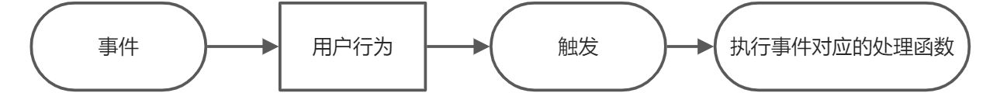

# 事件处理函数的绑定

事件不需要绑定。浏览器自带了许多事件，每个事件都可以绑定相应的处理器。



在这个过程中，我们需要将事件和处理函数进行绑定。也就是说，当事件被触发时，系统会执行绑定的函数。

# 事件处理函数

```javascript
document.addEventListener('click', function () {
  console.log('事件处理函数');
});
```

我在`document`对象上使用`addEventListener`方法绑定了一个`click`事件的监听器。当用户点击`document`时，系统会执行对应的事件处理函数，输出"事件处理函数"到控制台。

这个过程实现了事件与处理函数的绑定。

# 绑定事件处理函数

```javascript
const obj = {
  a: 1,
  b: 2,
};

function handleClick() {
  console.log(this);
}
// 使用 call 绑定时机不对，应该在事件触发时执行。
// document.addEventListener('click', handleClick.call(obj));
document.addEventListener('click', handleClick.bind(obj));
```

在上述代码中，我创建了一个对象`obj`，并定义了一个事件处理函数`handleClick`。使用`bind`方法将`handleClick`函数的`this`上下文绑定到`obj`对象，并将其作为`click`事件的处理器。这确保了当点击事件触发时，`handleClick`函数中的`this`指向`obj`，而不是默认的`document`对象。

需要注意的是，绑定事件处理函数时，我们应避免立即执行函数（如使用`call`），而应在事件触发时执行，因此使用`bind`方法更为合适。

# const 和 let

`const`用于声明不变的变量，通常用于声明对象。这符合编程的规范，确保变量不会被意外修改。

`let`用于声明可变的变量，允许变量随时修改，便于程序的扩展和灵活性。

从语法规则上看，`const`定义的是常量，而`let`定义的是变量。根据需求，你可以选择遵循规范使用`const`，或根据需要使用`let`以增强代码的可扩展性。

# Vue 中绑定事件处理函数

在 Vue 中，可以使用`v-on`指令来绑定事件处理函数。以下是不同的绑定方式：

```html
v-on:'eventType' v-on:click="handleClick" // 简写方式 @click="handleClick"
```

以上示例中，`v-on:click`和`@click`都是用于绑定`click`事件处理函数`handleClick`。简写方式`@click`更加简洁，常用于实际开发中。

## 绑定 JavaScript 表达式

```javascript
const App = {
  data() {
    return {
      count: 0,
      log: [],
    };
  },
  template: `
    <!-- 绑定JavaScript表达式 -->
    <!-- 强烈不推荐直接在模板中编写表达式，建议使用方法来处理逻辑 -->
    <div>
      <h1>{{ count }}</h1>
      <button @click="count += 1">增加</button>
      <button @click="count -= 1">减少</button>
    </div>
 `,
};

Vue.createApp(App).mount('#app');
```

在这个示例中，我在模板中直接使用 JavaScript 表达式来修改`count`的值。虽然这种方式简单，但不推荐，因为将逻辑直接写在模板中不利于代码的可维护性和扩展性。建议将逻辑封装在方法中，以便更好地管理和扩展。

## 绑定处理函数

```vue
const App = { data() { return { count: 0, log: [] }; }, template: `
<div>
      <h1>{{ count }}</h1>
      <button @click="increaseCount">增加</button>
      <button @click="decreaseCount">减少</button>
    </div>
`, methods: { increaseCount() { this.count += 1; this.addLog('增加', 1); console.log(this.log); }, decreaseCount() { this.count -= 1; this.addLog('减少', 1); }, addLog(action,
amount) { this.log.push({ action, amount, timestamp: new Date() }); } } } Vue.createApp(App).mount('#app');
```

在这个示例中，我通过方法`increaseCount`和`decreaseCount`来处理`click`事件。这种方式将逻辑封装在方法中，提高了代码的可读性和可维护性。同时，`addLog`方法用于记录每次操作的详细信息，包括动作类型、数量和时间戳。

## 内联绑定处理函数

```vue
const App = { data() { return { count: 0, log: [] }; }, template: `
<!-- 内联绑定处理函数 -->
<!-- 调用方法：这里不会立即执行methods中对应的方法，目的是传递参数 -->
<!-- $event是Vue封装的事件对象，变量名不可更改，是Vue中的特殊变量 -->
<div>
      <h1>{{ count }}</h1>
      <button @click="increaseCount(2, $event)">增加</button>
      <button @click="decreaseCount(1, $event)">减少</button>
    </div>
`, methods: { increaseCount(amount, event) { console.log(event); this.count += amount; this.addLog('增加', amount); console.log(this.log); }, decreaseCount(amount, event) {
console.log(event); this.count -= amount; this.addLog('减少', amount); console.log(this.log); }, addLog(action, amount) { this.log.push({ action, amount, timestamp: new Date() });
} } } Vue.createApp(App).mount('#app');
```

在这个示例中，我在`@click`事件中内联调用了方法`increaseCount`和`decreaseCount`，并传递了参数和事件对象`$event`。这种方式允许在事件处理函数中接收额外的参数，从而实现更灵活的逻辑处理。

需要注意的是，`$event`是 Vue 封装的事件对象，变量名不可更改，是 Vue 中的特殊变量，用于访问事件的详细信息。

## 绑定多个事件处理函数

```vue
const App = { data() { return { count: 0, log: [] }; }, template: `
<div>
      <h1>{{ count }}</h1>
      <button @click="handleIncrease(2)">增加</button>
      <button @click="handleDecrease(1)">减少</button>
    </div>
`, methods: { handleIncrease(amount) { this.count += amount; this.addLog('增加', amount); }, handleDecrease(amount) { this.count -= amount; this.addLog('减少', amount); },
addLog(action, amount) { this.log.push({ action, amount, timestamp: new Date() }); } } } Vue.createApp(App).mount('#app');
```

在这个示例中，我通过方法`handleIncrease`和`handleDecrease`分别处理增加和减少的逻辑，并调用`addLog`方法记录操作日志。这种方式避免了在模板中直接调用多个函数，提高了代码的清晰度和可维护性。

如果需要在一个事件中执行多个操作，可以在单一的方法中依次调用相关的函数，而不是在模板中使用逗号分隔。这有助于保持模板的简洁性，并集中管理逻辑。
