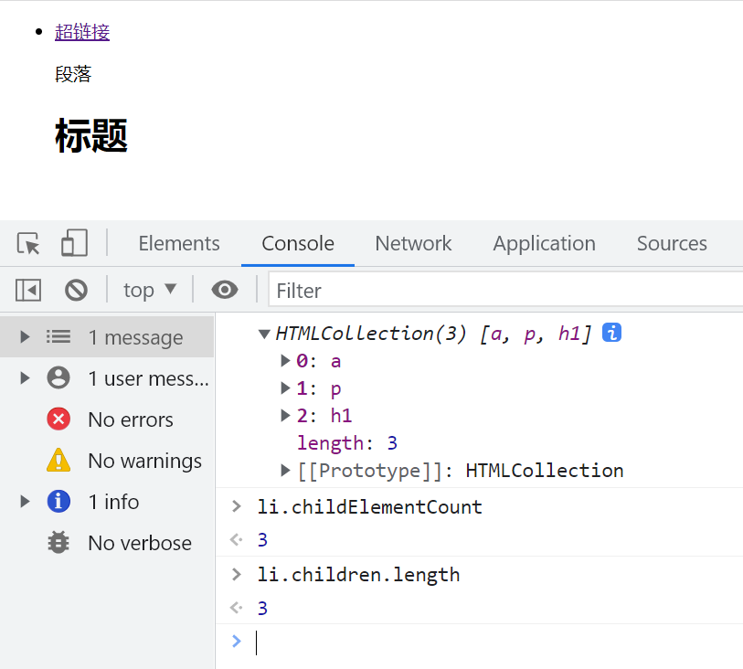

# document 对象与 DOM 操作

## 选项卡示例

下面是一个选项卡的 HTML 示例代码

```html
<!DOCTYPE html>
<html lang="en">
  <head>
    <meta charset="UTF-8" />
    <meta http-equiv="X-UA-Compatible" content="IE=edge" />
    <meta name="viewport" content="width=device-width, initial-scale=1.0" />
    <title>选项卡示例</title>
    <style>
      /* 省略了CSS代码 */
    </style>
  </head>
  <body>
    <div class="tab-wrap">
      <div class="tab clearfix">
        <div class="tab-item cur"><a href="javascript:;">选项卡1</a></div>
        <div class="tab-item"><a href="javascript:;">选项卡2</a></div>
        <div class="tab-item"><a href="javascript:;">选项卡3</a></div>
      </div>
      <div class="page">
        <div class="page-itme active">1</div>
        <div class="page-itme">2</div>
        <div class="page-itme">3</div>
      </div>
    </div>
    <script>
      var tabItem = document.getElementsByClassName('tab-item');
      var pageItem = document.getElementsByClassName('page-itme');

      for (var i = 0; i < tabItem.length; i++) {
        (function (j) {
          tabItem[j].onclick = function () {
            for (var k = 0; k < tabItem.length; k++) {
              tabItem[k].className = 'tab-item';
              pageItem[k].className = 'page-itme';
            }
            this.className = 'tab-item cur';
            pageItem[j].className = 'page-itme active';
          };
        })(i);
      }
    </script>
  </body>
</html>
```

这个示例实现了一个基本的选项卡功能，点击每个选项卡会切换对应的内容。其中使用了`document.getElementsByClassName`来获取选项卡和内容元素，通过修改`className`来切换选中状态和显示内容。

注意这里使用了闭包来解决循环中`i`的问题，确保点击事件里获取到正确的索引。

## 封装成 jQuery 插件

我们可以把上面的选项卡代码封装成一个 jQuery 插件，方便复用:

```javascript
(function ($) {
  var Tab = function (el, opt) {
    this.$el = $(el);
    this.opt = $.extend(
      {
        tabItem: 'tab-item',
        pageItem: 'page-itme',
        cur: 'cur',
        active: 'active',
      },
      opt
    );

    this.init();
  };

  Tab.prototype = {
    init: function () {
      var self = this;
      self.$tabItem = self.$el.find('.' + self.opt.tabItem);
      self.$pageItem = self.$el.find('.' + self.opt.pageItem);
      self.bindEvent();
    },

    bindEvent: function () {
      var self = this;
      self.$tabItem.on('click', function () {
        var $this = $(this);
        var index = $this.index();

        self.$tabItem.removeClass(self.opt.cur);
        $this.addClass(self.opt.cur);

        self.$pageItem.removeClass(self.opt.active);
        self.$pageItem.eq(index).addClass(self.opt.active);
      });
    },
  };

  $.fn.tab = function (opt) {
    return this.each(function () {
      new Tab(this, opt);
    });
  };
})(jQuery);
```

使用方式

```javascript
$('.tab-wrap').tab({
  tabItem: 'tab-item',
  pageItem: 'page-itme',
  cur: 'cur',
  active: 'active',
});
```

封装成插件后，代码结构更清晰，也更容易配置和使用。插件利用了 jQuery 的一些特性，比如`extend`合并参数、`find`查找元素、`index`获取索引、`eq`根据索引获取元素等。

## document 对象

在 JavaScript 中，`document`对象代表整个 HTML 文档，它是`window`对象的一个属性。我们可以通过`document`对象来访问和操作 HTML 文档中的元素。

`document`本质上是一个对象，它提供了很多属性和方法来与文档进行交互。下面介绍一些常用的`document`对象的方法。

## getElementById

`getElementById`用于根据 ID 属性获取元素，返回匹配到的第一个元素，如果没有匹配到则返回`null`。示例

```html
<div id="box"></div>
<script>
  var box = document.getElementById('box');
  console.log(box); // <div id="box"></div>
</script>
```

注意

- IE 8 及以下，ID 不区分大小写
- 只能选择一个元素，如果有多个重复的 ID，则返回第一个匹配的元素
- 性能最好，当知道元素 ID 时，应该优先使用该方法

## getElementsByClassName

`getElementsByClassName`根据类名获取元素，返回一个类数组对象，包含所有匹配到的元素。示例

```javascript
var boxes = document.getElementsByClassName('box');
console.log(boxes); // [<div class="box"></div>, <div class="box"></div>]
```

注意

- IE 8 及以下不支持
- 返回一个类数组对象，要使用下标访问其中的元素
- 性能仅次于`getElementById`

如果需要兼容 IE 8，可以使用`querySelector`或`querySelectorAll`代替:

```javascript
// 选择单个元素
var box = document.querySelector('.box');
// 选择多个元素
var boxes = document.querySelectorAll('.box');
```

## getElementsByTagName

`getElementsByTagName`根据标签名获取元素，返回一个类数组对象，包含所有匹配到的元素。示例

```javascript
var divs = document.getElementsByTagName('div');
console.log(divs); // [<div></div>, <div></div>]
```

注意

- 兼容性很好，IE 4 及以上都支持
- 返回一个类数组对象，要使用下标访问其中的元素
- 如果传入`*`，则会返回文档中所有元素

## querySelector 和 querySelectorAll

`querySelector`和`querySelectorAll`是 HTML5 新增的选择器 API，允许我们使用 CSS 选择器来查找元素。其中`querySelector`返回第一个匹配的元素，`querySelectorAll`返回所有匹配的元素。示例

```javascript
// 选择第一个div元素
var div = document.querySelector('div');

// 选择所有p元素
var ps = document.querySelectorAll('p');

// 选择所有拥有box类的div元素
var boxes = document.querySelectorAll('div.box');

// 选择id为main的元素
var main = document.querySelector('#main');
```

这两个方法非常强大，支持各种复杂的 CSS 选择器，但是注意以下几点:

- IE 7 及以下不支持
- 性能没有`getElement*`系列的方法好
- 返回的是静态 NodeList，底层实现与`getElement*`不同

关于静态 NodeList 与动态 NodeList 的区别:

```javascript
var divs = document.querySelectorAll('div');
console.log(divs.length); // 3
document.body.appendChild(document.createElement('div'));
console.log(divs.length); // 还是3，没有实时更新

var divs2 = document.getElementsByTagName('div');
console.log(divs2.length); // 4
document.body.appendChild(document.createElement('div'));
console.log(divs2.length); // 变成5，实时更新
```

所以在需要动态集合的场景下，更推荐使用`getElement*`系列的方法。


## 遍历节点树

在 HTML 文档中，每个元素、属性、文本都是一个节点，它们构成了一棵节点树。我们可以使用节点间的相对关系来遍历和操作节点树。

节点类型有以下几种:

1. 元素节点: 1
2. 属性节点: 2
3. 文本节点: 3
4. 注释节点: 8
5. document 节点: 9
6. DocumentFragment 节点: 11

下图展示了节点树的结构:


### parentNode

`parentNode`用于获取节点的父节点。示例

```html
<div>
  <p>hello</p>
</div>
<script>
  var p = document.querySelector('p');
  var parent = p.parentNode;
  console.log(parent); // <div>...</div>
</script>
```


### childNodes

`childNodes`用于获取节点的所有子节点，返回一个 NodeList。示例

```html
<ul>
  <li>
    <!-- 注释节点 -->
    <a href="">超链接</a>
    <p>段落</p>
    <h1>标题</h1>
  </li>
</ul>
<script>
  var li = document.querySelector('li');
  var children = li.childNodes;
  console.log(children);
</script>
```


可以看到，`childNodes`返回了`li`元素的所有子节点，包括元素节点、文本节点、注释节点等。

### firstChild 和 lastChild

`firstChild`返回节点的第一个子节点，`lastChild`返回最后一个子节点。示例

```javascript
var li = document.querySelector('li');
var first = li.firstChild;
var last = li.lastChild;
console.log(first); // #text
console.log(last); // #text
```


可以看到`firstChild`和`lastChild`都返回了文本节点，因为`li`的第一个和最后一个子节点都是换行产生的文本节点。

### previousSibling 和 nextSibling

`previousSibling`返回节点的前一个兄弟节点，`nextSibling`返回后一个兄弟节点。示例

```javascript
var p = document.querySelector('p');
var prev = p.previousSibling;
var next = p.nextSibling;
console.log(prev); // #text
console.log(next); // #text
```


`p`元素的前一个和后一个兄弟节点都是文本节点。

## 遍历元素节点树

如果我们只关心元素节点，不关心其他类型的节点，就需要使用专门的 API 来遍历元素节点树。

### parentElement

`parentElement`用于获取元素的父元素节点。示例

```javascript
var p = document.querySelector('p');
var parent = p.parentElement;
console.log(parent); // <div>...</div>
```


注意 IE 9 及以下不支持

### children

`children`用于获取元素的所有子元素节点。示例

```javascript
var ul = document.querySelector('ul');
var children = ul.children;
console.log(children); // [<li>...</li>]
```

注意 IE 7 及以下不支持

### childElementCount

`childElementCount`用于获取元素的子元素节点的数量。它等价于`children.length`。示例

```javascript
var ul = document.querySelector('ul');
var count = ul.childElementCount;
console.log(count); // 1
```



注意 IE 9 及以下不支持

### firstElementChild 和 lastElementChild

`firstElementChild`返回元素的第一个子元素节点，`lastElementChild`返回最后一个子元素节点。示例

```javascript
var ul = document.querySelector('ul');
var first = ul.firstElementChild;
var last = ul.lastElementChild;
console.log(first); // <li>...</li>
console.log(last); // <li>...</li>
```


注意 IE 9 及以下不支持

### previousElementSibling 和 nextElementSibling

`previousElementSibling`返回元素的前一个兄弟元素节点，`nextElementSibling`返回后一个兄弟元素节点。示例

```javascript
var p = document.querySelector('p');
var prev = p.previousElementSibling;
var next = p.nextElementSibling;
console.log(prev); // <a href="">超链接</a>
console.log(next); // <h1>标题</h1>
```


注意 IE 9 及以下不支持
