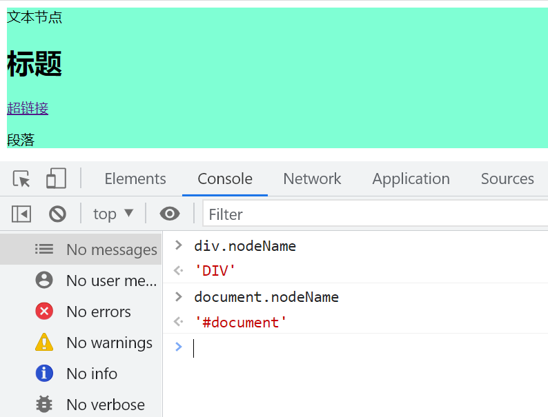
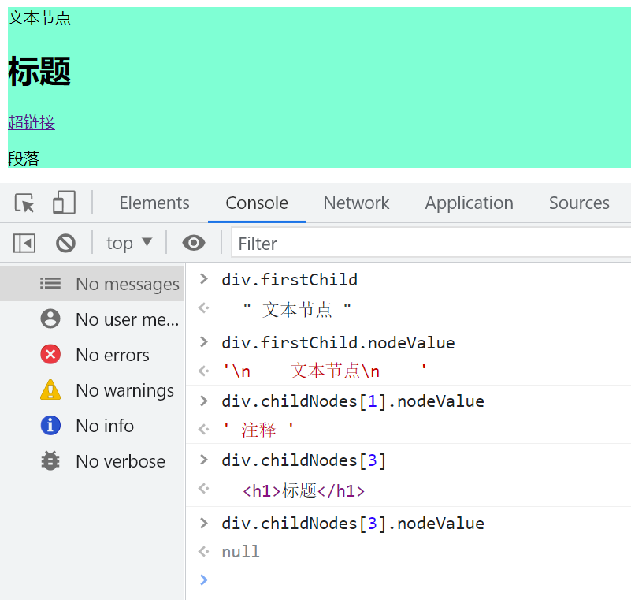
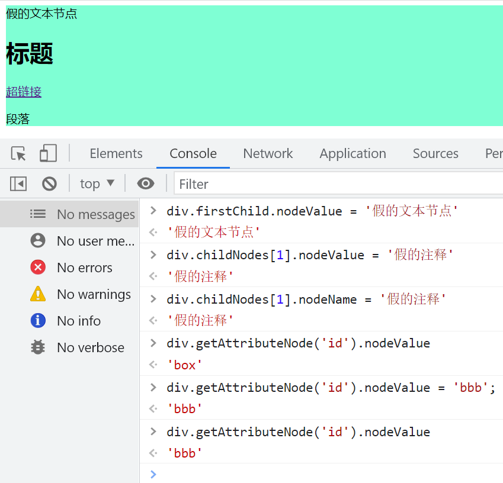
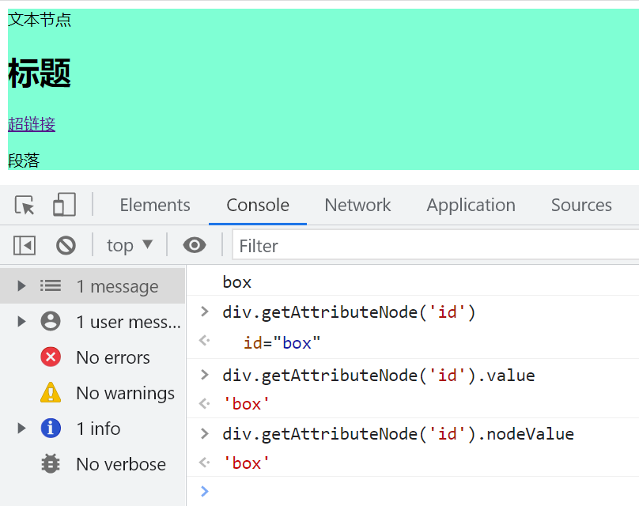
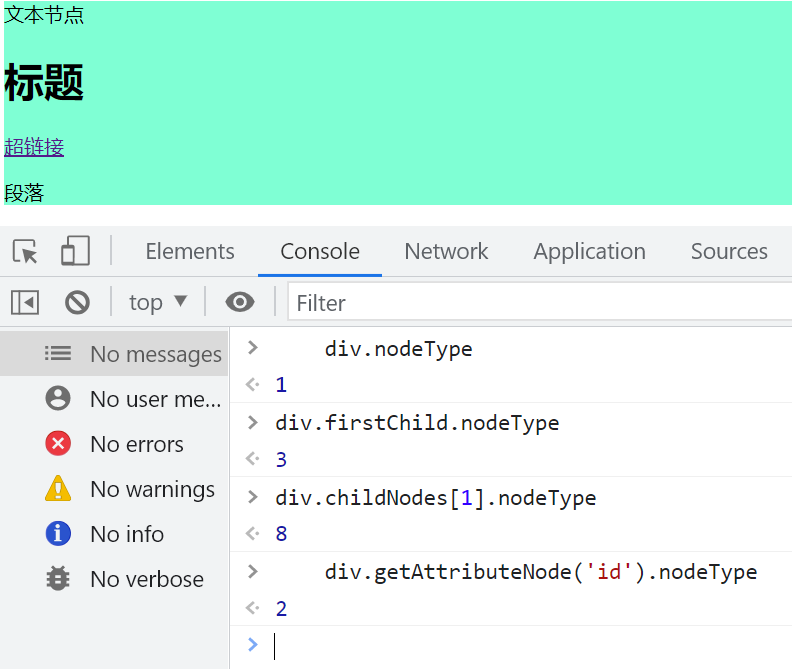
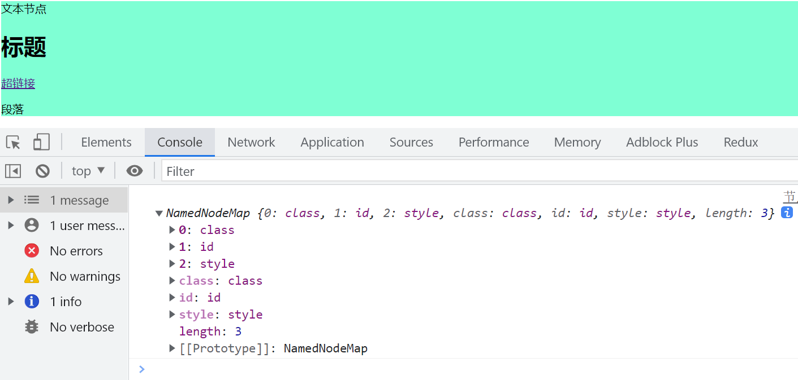
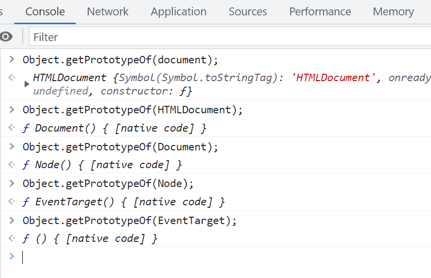
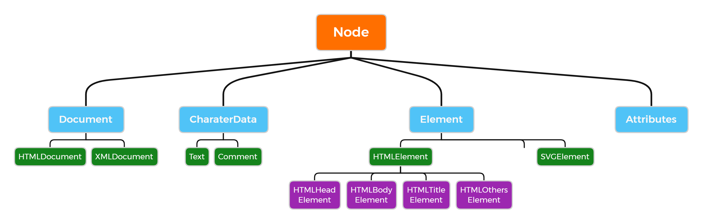

# DOM 节点属性与方法

## nodeName

每个节点都有名字，元素节点的 `nodeName` 默认是大写。元素的 `nodeName` 是只读属性。

```html
<body>
  <div class="box" id="box" style="background-color: aquamarine;">
    文本节点
    <!-- 注释 -->
    <h1>标题</h1>
    <a href="">超链接</a>
    <p>段落</p>
  </div>
  <script>
    var divElement = document.getElementsByTagName('div')[0];
    console.log(divElement.nodeName);
    console.log(document.nodeName);
  </script>
</body>
```



## 字符串转换大小写

```javascript
var str = 'Str';
console.log(str.toUpperCase()); // STR
console.log(str.toLowerCase()); // str
```

## nodeValue

除了元素节点，其他节点都可以获取 `nodeValue`。



### nodeValue 的可写性

文本节点、注释节点的 `nodeValue` 是可写的。



## getAttributeNode

通过属性名称获取属性节点。

```javascript
console.log(divElement.getAttributeNode('id').nodeValue); // box
```



## nodeType

`nodeType` 是只读属性，无法修改。不同类型的节点有不同的数值表示：

1. 元素节点 1
2. 属性节点 2
3. 文本节点 3
4. 注释节点 4
5. document 9
6. documentFragment 11



### 封装 childNodes

```javascript
// 传入父级 DOM 节点
function getElementChildren(parentNode) {
  var elements = [];
  var children = parentNode.childNodes;
  for (var i = 0; i < children.length; i++) {
    var child = children[i];
    if (child.nodeType === 1) {
      elements.push(child);
    }
  }
  return elements;
}

console.log(getElementChildren(divElement)); // [h1, a, p]
```

```javascript
function getElementChildren(parentNode) {
  var temp = {
    length: 0,
    push: Array.prototype.push,
    splice: Array.prototype.splice,
  };
  var childNodes = parentNode.childNodes;
  for (var i = 0; i < childNodes.length; i++) {
    var child = childNodes[i];
    if (child.nodeType === 1) {
      temp.push(child);
    }
  }
  return temp;
}

console.log(getElementChildren(divElement));
```

## attributes

访问节点的所有属性值。

```javascript
console.log(divElement.attributes);
```



### Element.getAttribute

获取指定的属性值。如果属性不存在，则返回 `null` 或 `""`。

```javascript
console.log(divElement.getAttribute('id'));
```

### Element.setAttribute

如果属性已存在，则更新其值；否则，添加一个新的属性。

## hasChildNodes

判断是否有子节点，只要是 DOM 节点即为真，返回布尔值。

```javascript
divElement.hasChildNodes();
```

## document 继承

1. `document` 是 `HTMLDocument` 的实例。
2. `HTMLDocument` 是 `Document` 的实例。
3. 我们常用的 `document` 上的许多方法都是从 `Document` 继承而来。

```javascript
var newDocument = new Document();
```



## DOM 结构树

1. `DOM` 可以操作 `XML` 和 `HTML` 元素，`Document` 可以构造出 `HTMLDocument` 和 `XMLDocument`。
2. `CharacterData` 是文本和注释的构造函数。
3. `Element` 是元素的构造函数。



### 判断标签类型

```javascript
var divElement = document.getElementsByTagName('div')[0];
console.log(Object.prototype.toString.call(divElement)); // [object HTMLDivElement]
```

## 深入 DOM 操作

### document 对象

```javascript
document.getElementById('exampleId');
document.getElementsByName('exampleName');
```

### Document 和 Element 上的方法

```javascript
var divElement = document.getElementsByTagName('div')[0];
// 获取 div 元素下第一个 p 标签
var paragraph = divElement.getElementsByTagName('p')[0];
console.log(paragraph);
// 通过类名选择
var paragraphsByClass = divElement.getElementsByClassName('exampleClass');
// 使用选择器
var firstParagraph = divElement.querySelector('p');
var allParagraphs = divElement.querySelectorAll('p');
```

### 选择所有元素

```javascript
var allElements = document.getElementsByTagName('*');
console.log(allElements);
```

### 获取 body 和 head

1. `document` 有 `body` 和 `head` 两个属性，可以直接获取，使用便捷。
2. 通过 `HTMLDocument`，无法通过原型直接访问 `body` 和 `head`。

```javascript
// 获取元素
var bodyElement = document.body;
var headElement = document.head;
// 获取文本
var documentTitle = document.title;
console.log(bodyElement);
console.log(headElement);
console.log(documentTitle);
```

### 获取 HTML 文档根元素

```javascript
var htmlElement = document.documentElement;
console.log(htmlElement);
```

## 案例

### 案例一

使用 `childNodes` 在原型上编程，遍历父元素，找到子元素节点。如果传入数字参数，则返回对应子元素；如果没有，则返回子元素集合，重点在于“元素”。

```javascript
Element.prototype.getChildElements = function (index) {
  var childElements = [];
  var children = this.childNodes;

  // 遍历所有子节点
  for (var i = 0; i < children.length; i++) {
    // 只收集元素节点
    if (children[i].nodeType === 1) {
      childElements.push(children[i]);
    }
  }

  // 如果传入了索引,返回对应位置的元素
  if (typeof index === 'number') {
    return childElements[index];
  }

  // 否则返回所有元素节点集合
  return childElements;
};

// 使用示例
var div = document.querySelector('div');

// 获取所有子元素节点
var allChildren = div.getChildElements();

// 获取第一个子元素节点
var firstChild = div.getChildElements(0);
```

### 案例二

在原型上编程，找出一个元素的第 N 层父级元素。

```javascript
Element.prototype.getNthParentElement = function (n) {
  // 参数校验
  if (typeof n !== 'number' || n < 1) {
    return null;
  }

  var currentElement = this;
  var count = 0;

  // 循环向上查找父元素
  while (currentElement && count < n) {
    currentElement = currentElement.parentElement;
    count++;
  }

  return currentElement;
};

// 使用示例
var p = document.querySelector('p');

// 获取第一层父元素
var parent1 = p.getNthParentElement(1);

// 获取第二层父元素
var parent2 = p.getNthParentElement(2);

// 获取第三层父元素
var parent3 = p.getNthParentElement(3);
```
