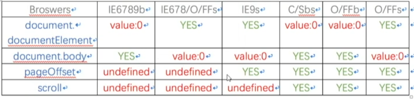
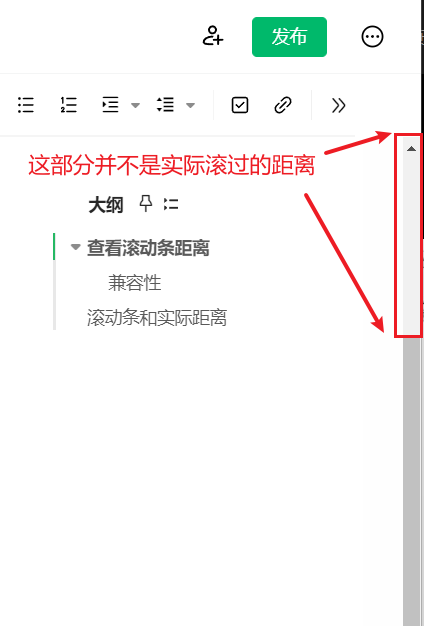

# 滚动条操作指南

## 查看滚动条距离

```javascript
// 查看滚动条距离
// 常规
window.pageXOffset;
window.pageYOffset;
// IE9及IE8以下
document.body.scrollLeft;
document.body.scrollTop;
document.documentElement.scrollLeft;
document.documentElement.scrollTop;
// 不常见
window.scrollY;
window.scrollX;
```

## 兼容性



# 滚动条和实际距离

滚动条滚过的距离代表的是一定的比例。



## 封装滚动条方法

```javascript
function getScrollOffset() {
  if (window.pageXOffset !== undefined) {
    return {
      left: window.pageXOffset,
      top: window.pageYOffset,
    };
  } else {
    return {
      left: document.body.scrollLeft + document.documentElement.scrollLeft,
      top: document.body.scrollTop + document.documentElement.scrollTop,
    };
  }
}
```

# 浏览器模式

浏览器本身支持向后兼容。

## 标准模式

`CSS1Compat`

```html
<!DOCTYPE html>
```

## 怪异模式

非`W3C`标准的`BackCompat`模式。

```javascript
// 查看兼容模式
document.compatMode;
```

# 获取浏览器可视区域

获取当前窗口的尺寸。

```javascript
// 常规的写法
window.innerHeight;
window.innerWidth;
// IE9/IE8以下 标准模式
document.documentElement.clientHeight;
document.documentElement.clientWidth;
// IE9/IE8以下 怪异模式
document.body.clientHeight;
document.body.clientWidth;
```

## 封装可视区域

```javascript
function getViewPortSize() {
  if (window.innerHeight !== undefined) {
    return {
      width: window.innerWidth,
      height: window.innerHeight,
    };
  } else {
    if (document.compatMode === 'BackCompat') {
      return {
        width: document.body.clientWidth,
        height: document.body.clientHeight,
      };
    } else {
      return {
        width: document.documentElement.clientWidth,
        height: document.documentElement.clientHeight,
      };
    }
  }
}
```

# 整个页面的高度

```javascript
// 整个html文档的宽度，不包含滚动条
document.body.scrollHeight;
document.body.scrollWidth;
// IE6/IE7/IE8
document.documentElement.scrollHeight;
document.documentElement.scrollWidth;
```

## 封装整个页面的尺寸

```javascript
function getScrollSize() {
  if (document.body.scrollHeight) {
    return {
      width: document.body.scrollWidth,
      height: document.body.scrollHeight,
    };
  } else {
    return {
      width: document.documentElement.scrollWidth,
      height: document.documentElement.scrollHeight,
    };
  }
}
```

# offsetTop 和 offsetLeft

只读属性，返回当前元素相对于`offsetParent`节点顶部边界的偏移像素值。

```html
<!DOCTYPE html>
<html lang="en">
  <head>
    <meta charset="UTF-8" />
    <meta http-equiv="X-UA-Compatible" content="IE=edge" />
    <meta name="viewport" content="width=device-width, initial-scale=1.0" />
    <style>
      * {
        margin: 0;
      }

      .parent {
        position: absolute;
        top: 100px;
        left: 100px;
        width: 300px;
        height: 300px;
        background-color: #999;
        overflow: hidden;
      }

      .child {
        position: absolute;
        top: 100px;
        left: 100px;
        width: 100px;
        height: 100px;
        background-color: green;
      }
    </style>
  </head>

  <body>
    <div class="parent">
      <div class="child"></div>
    </div>
    <script>
      const child = document.getElementsByClassName('child')[0];
      // offsetParent 如果父级没有定位，会继续向上查找父级。如果都没有，直接找到body
      console.log(child.offsetTop);
      console.log(child.offsetHeight);
    </script>
  </body>
</html>
```

## offsetParent

返回一个有定位的父级元素。

```javascript
console.log(child.offsetParent);
```

# 封装元素距离浏览器的距离

```html
<!DOCTYPE html>
<html lang="en">
  <head>
    <meta charset="UTF-8" />
    <meta http-equiv="X-UA-Compatible" content="IE=edge" />
    <meta name="viewport" content="width=device-width, initial-scale=1.0" />
    <style>
      * {
        margin: 0;
      }

      .grandpa {
        position: absolute;
        top: 100px;
        left: 100px;
        width: 360px;
        height: 360px;
        background-color: #ccc;
      }

      .parent {
        position: absolute;
        top: 30px;
        left: 30px;
        width: 300px;
        height: 300px;
        background-color: #999;
        overflow: hidden;
      }

      .child {
        position: absolute;
        top: 100px;
        left: 100px;
        width: 100px;
        height: 100px;
        background-color: green;
      }
    </style>
  </head>

  <body>
    <div class="grandpa">
      <div class="parent">
        <div class="child"></div>
      </div>
    </div>

    <script>
      const child = document.getElementsByClassName('child')[0];

      function getElementDocumentPosition(element) {
        let parent = element.offsetParent;
        let offsetLeft = element.offsetLeft;
        let offsetTop = element.offsetTop;

        while (parent) {
          offsetLeft += parent.offsetLeft;
          offsetTop += parent.offsetTop;
          parent = parent.offsetParent;
        }
        return {
          left: offsetLeft,
          top: offsetTop,
        };
      }

      console.log(getElementDocumentPosition(child));
    </script>
  </body>
</html>
```

# 操作滚动条

`scrollHeight` 等于 `innerHeight` 加上 `scrollTop`。
整个文档的高度等于当前可视区域加上已经滚过的距离。

```javascript
// 滚动到指定的X/Y轴距离，默认返回undefined
window.scroll(x, y);
window.scrollTo(x, y);
// 每次执行都会在当前基础上滚动指定的距离
window.scrollBy(x, y);
```

# 完整代码示例

以下是一个完整的示例，展示如何获取滚动条距离、浏览器可视区域以及操作滚动条。

```html
<!DOCTYPE html>
<html lang="en">
  <head>
    <meta charset="UTF-8" />
    <meta http-equiv="X-UA-Compatible" content="IE=edge" />
    <meta name="viewport" content="width=device-width, initial-scale=1.0" />
    <style>
      body {
        height: 2000px;
        padding: 20px;
      }
      .button {
        position: fixed;
        top: 20px;
        right: 20px;
      }
    </style>
    <title>滚动条操作示例</title>
  </head>

  <body>
    <button class="button" onclick="scrollToTop()">滚动到顶部</button>
    <button class="button" onclick="scrollToBottom()">滚动到底部</button>

    <script>
      function scrollToTop() {
        window.scrollTo({
          top: 0,
          behavior: 'smooth',
        });
      }

      function scrollToBottom() {
        window.scrollTo({
          top: document.body.scrollHeight,
          behavior: 'smooth',
        });
      }

      // 获取当前滚动位置
      console.log(getScrollOffset());

      // 获取可视区域尺寸
      console.log(getViewPortSize());

      // 获取整个页面尺寸
      console.log(getScrollSize());
    </script>
  </body>
</html>
```
