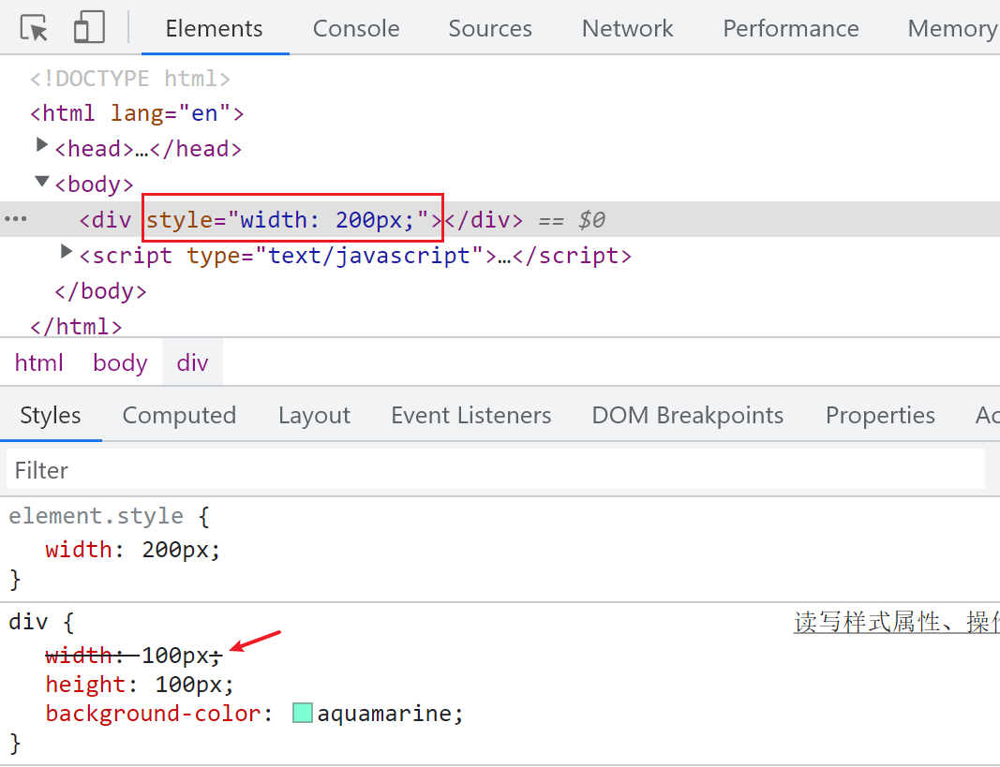

# DOM 操作 CSS 样式与伪元素

在前端开发中，我们经常需要通过 JavaScript 来操作 DOM 元素的样式。本文将介绍如何使用 DOM API 来读写元素的样式属性，以及如何操作伪元素和实现元素的简单运动效果。

## 规范的标签书写

在 HTML 文档中，我们应该规范地书写`<style>`和`<script>`标签，确保它们是完整的：

```html
<style type="text/css">
  /* CSS样式 */
</style>

<script type="text/javascript">
  // JavaScript代码
</script>
```

不规范的写法可能会导致样式或脚本无法正确应用。

## 通过 DOM 间接操作 CSS

我们可以通过 DOM API 来间接操作元素的 CSS 样式。例如，下面的代码通过设置元素的`style`属性来改变其宽度：

```html
<div></div>
<script type="text/javascript">
  var div = document.getElementsByTagName('div')[0];
  div.style.width = '200px';
</script>
```



需要注意的是，这种方式并没有直接修改 CSS 样式表，而是添加了优先级更高的内联样式。

## 设置样式的注意事项

通过`style`属性设置样式时，有以下几点需要注意：

1. `elem.style.xxx`既可读取也可设置样式值。
2. 样式属性名应按照小驼峰命名法进行书写，如`backgroundColor`。
3. 样式值必须是字符串形式，如`'200px'`。
4. 对于复合属性，建议拆解为多个单独的属性赋值，以提高效率。
5. 对于保留字，需要在前面加上`CSS`前缀，如`cssFloat`。

```javascript
var div = document.getElementsByTagName('div')[0];
div.style.width = '200px';
div.style.backgroundColor = 'orange';
div.style.cssFloat = 'left'; // 保留字
```

## 获取计算后的样式

我们可以使用`window.getComputedStyle()`方法来获取元素当前生效的所有样式，包括默认值。但需要注意，IE8 及以下版本不支持该方法。

```javascript
var div = document.getElementsByTagName('div')[0];
console.log(window.getComputedStyle(div, null));
```

对于 IE8 及以下版本，可以使用`elem.currentStyle`来获取样式：

```javascript
console.log(elem.currentStyle);
```

为了兼容不同浏览器，我们可以封装一个函数来获取元素的样式：

```javascript
function getStyles(elem, prop) {
  if (window.getComputedStyle) {
    if (prop) {
      return window.getComputedStyle(elem, null)[prop];
    } else {
      return window.getComputedStyle(elem, null);
    }
  } else {
    if (prop) {
      return elem.currentStyle[prop];
    } else {
      return elem.currentStyle;
    }
  }
}

console.log(getStyles(div, 'width'));
```

## 获取元素的宽高

除了 CSS 样式，我们还可以通过 DOM API 直接获取元素的宽高信息：

```javascript
console.log(div.offsetHeight);
console.log(div.offsetWidth);
```

这里获取的是元素的实际渲染宽高，而不是 CSS 样式中设置的值。

在进行元素运动相关的计算时，不建议使用`offsetWidth`和`offsetHeight`，因为它们会将`padding`也计算在内。建议使用封装的`getStyles()`函数来获取精确的宽高值：

```javascript
div.onclick = function () {
  var width = parseInt(getStyles(this, 'width'));
  this.style.width = width + 10 + 'px';
};
```

## 操作伪元素的样式

我们还可以通过`window.getComputedStyle()`方法来获取伪元素的样式：

```javascript
console.log(window.getComputedStyle(div, 'after').width);
```

但是，无法直接修改伪元素的样式。一种常见的做法是通过为元素添加类名，间接地改变伪元素的样式：

```html
<style type="text/css">
  .box::after {
    content: '';
    display: block;
    width: 50px;
    height: 50px;
    background-color: orange;
  }

  .box.active::after {
    background-color: black;
  }
</style>

<div class="box"></div>

<script type="text/javascript">
  var div = document.getElementsByTagName('div')[0];
  div.onclick = function () {
    this.className += ' active';
  };
</script>
```

## 通过类名操作样式的好处

在实际开发中，我推荐通过切换类名的方式来操作元素的样式，而不是直接修改`style`属性。这样做有以下好处：

1. 节省性能，避免频繁地重新计算和渲染样式。
2. 便于查看和修改，样式集中在 CSS 中管理，而不是分散在 JavaScript 代码中。

```html
<style type="text/css">
  .box {
    width: 100px;
    height: 100px;
    background-color: aquamarine;
  }

  .box.active {
    width: 200px;
    height: 200px;
    border: 1px #000 solid;
    background-color: burlywood;
    border-radius: 50%;
  }
</style>

<div class="box"></div>

<script type="text/javascript">
  var div = document.getElementsByTagName('div')[0];
  div.onclick = function () {
    this.className += ' active';
  };
</script>
```

## 实战案例：防抖菜单

下面是一个实际的应用案例，实现了一个具有防抖功能的菜单效果：

[https://github.com/sumingcheng/JavaScript-practise/blob/main/DOM/%E9%98%B2%E6%8A%96%E8%8F%9C%E5%8D%95.html](https://github.com/sumingcheng/JavaScript-practise/blob/main/DOM/%E9%98%B2%E6%8A%96%E8%8F%9C%E5%8D%95.html)
