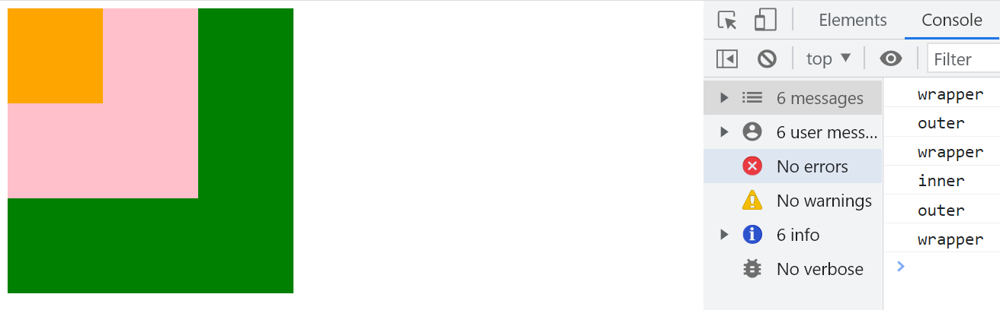
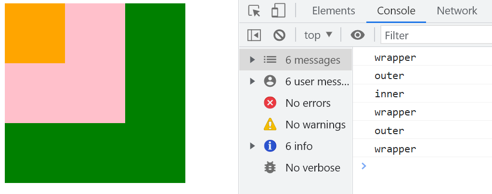
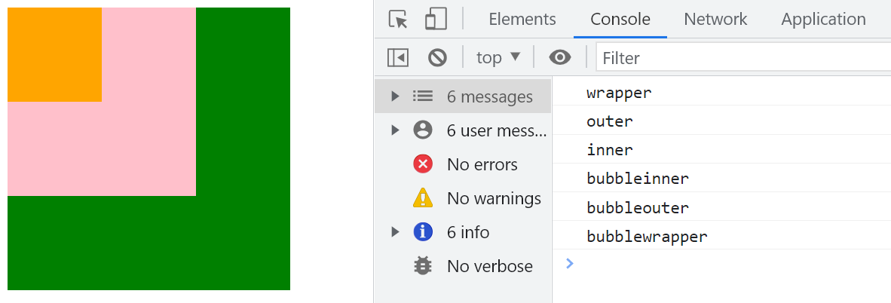

# 事件处理函数

## 事件

事件是元素固有的特性或功能，已经预先定义好。

## 绑定事件

绑定事件即关联事件处理函数，当事件触发时执行相应的函数。

## 事件句柄绑定

将事件绑定到事件源 `divElement` 上，`onclick` 是事件句柄，事件句柄绑定了事件处理函数。

```javascript
divElement.onclick = function () {
  this.style.backgroundColor = 'orange';
};
```

# 绑定事件处理函数

## 句柄绑定

同一元素只能赋值一次。多次赋值会覆盖前一次绑定的事件处理函数。

```javascript
// 句柄绑定
element.onclick = function () {};
// 第二次绑定会覆盖第一次
element.onclick = function () {};
```

## 行内事件绑定

不推荐使用行内事件绑定，最好将结构与逻辑分离。

```html
<div onclick="test()"></div>
<div onclick="console.log('1')"></div>
```

## 注册事件监听器

`addEventListener` 是 W3C 标准，IE9 以下不支持。它允许为同一元素绑定多个事件处理函数。

```javascript
// 第一个事件
divElement.addEventListener(
  'click',
  function () {
    console.log(1);
  },
  false
);
// 第二个事件
divElement.addEventListener(
  'click',
  function () {
    console.log(2);
  },
  false
);
```

### 绑定事件监听器

绑定外部函数时，如果使用相同的函数引用，仅会执行一次。

```javascript
// 两次绑定使用相同的引用，仅执行一次
divElement.addEventListener('click', handleClick, false);
divElement.addEventListener('click', handleClick, false);

function handleClick() {
  console.log(1);
}
```

## IE8 以下的事件绑定

在 IE8 及以下版本中，可以使用 `attachEvent` 绑定事件，但 `this` 指向 `window`。

```javascript
divElement.attachEvent('onclick', function () {
  // this 指向 window
  console.log(1);
});
```

## 批量绑定事件

为多个元素批量绑定事件，可以使用闭包或立即执行函数表达式 (IIFE) 来保持变量的正确引用。

```html
<!DOCTYPE html>
<html lang="en">
  <head>
    <meta charset="UTF-8" />
    <meta http-equiv="X-UA-Compatible" content="IE=edge" />
    <meta name="viewport" content="width=device-width, initial-scale=1.0" />
  </head>
  <body>
    <ul>
      <li>1</li>
      <li>2</li>
      <li>3</li>
      <li>4</li>
      <li>5</li>
    </ul>
    <script type="text/javascript">
      var listItems = document.getElementsByTagName('li'),
        len = listItems.length;

      for (var i = 0; i < len; i++) {
        (function (index) {
          var item = listItems[index];
          item.addEventListener(
            'click',
            function () {
              console.log(index);
            },
            false
          );
        })(i);
      }
    </script>
  </body>
</html>
```

## 不同运行环境中的 `this`

事件处理程序在不同运行环境下，`this` 指向不同。

```javascript
var button = document.getElementsByTagName('button')[0];

button.onclick = function () {
  console.log(this); // button 元素
};

button.addEventListener(
  'click',
  function () {
    console.log(this); // button 元素
  },
  false
);

button.attachEvent('onclick', function () {
  console.log(this); // window
});
```

# 封装事件处理

通过封装事件处理函数，可以兼容不同浏览器的事件绑定方式。

```javascript
function addEvent(element, type, handler) {
  if (element.addEventListener) {
    element.addEventListener(type, handler, false);
  } else if (element.attachEvent) {
    element.attachEvent('on' + type, function () {
      handler.call(element);
    });
  } else {
    element['on' + type] = handler;
  }
}

addEvent(button, 'click', function () {
  console.log(1);
});
```

# 移除绑定的事件

移除事件处理函数时，确保传入的函数引用相同。

```javascript
button.onclick = null;
button.onclick = false;

button.addEventListener('click', handleClick, false);
// 移除的函数引用必须相同
button.removeEventListener('click', handleClick, false);

button.detachEvent('onclick', handleClick);

// 函数内部移除事件处理，但在严格模式下不可使用
button.addEventListener(
  'click',
  function () {
    console.log(1);
    this.removeEventListener('click', arguments.callee, false);
  },
  false
);
```

# 内联元素无法嵌套

在 HTML 中，某些内联元素（如 `<a>` 标签）不应嵌套其他内联元素，以避免布局和功能问题。

```html
<!DOCTYPE html>
<html lang="en">
  <head>
    <meta charset="UTF-8" />
    <meta http-equiv="X-UA-Compatible" content="IE=edge" />
    <meta name="viewport" content="width=device-width, initial-scale=1.0" />
  </head>
  <style>
    a {
      display: block;
    }

    [href="http://www.baidu.com"]
    {
      width: 100px;
      height: 100px;
      background-color: green;
    }

    [href="http://www.taobao.com"]
    {
      width: 100px;
      height: 100px;
      background-color: orange;
    }
  </style>

  <body>
    <a href="http://www.baidu.com">
      百度
      <a href="http://www.taobao.com">淘宝</a>
    </a>
  </body>
</html>
```

# 事件冒泡

在嵌套的元素中，点击 `inner` 元素时，事件会首先触发 `inner`，然后逐级向上传递到父级元素。前提是事件类型相同。

```html
<!DOCTYPE html>
<html lang="en">
  <head>
    <meta charset="UTF-8" />
    <meta http-equiv="X-UA-Compatible" content="IE=edge" />
    <meta name="viewport" content="width=device-width, initial-scale=1.0" />
  </head>
  <style>
    .wrapper {
      width: 300px;
      height: 300px;
      background-color: green;
    }

    .outer {
      width: 200px;
      height: 200px;
      background-color: pink;
    }

    .inner {
      width: 100px;
      height: 100px;
      background-color: orange;
    }
  </style>

  <body>
    <div class="wrapper">
      <div class="outer">
        <div class="inner"></div>
      </div>
    </div>
    <script>
      var wrapper = document.getElementsByClassName('wrapper')[0],
        outer = wrapper.getElementsByClassName('outer')[0],
        inner = outer.getElementsByClassName('inner')[0];

      wrapper.addEventListener(
        'click',
        function () {
          console.log('wrapper');
        },
        false
      );

      outer.addEventListener(
        'click',
        function () {
          console.log('outer');
        },
        false
      );

      inner.addEventListener(
        'click',
        function () {
          console.log('inner');
        },
        false
      );
    </script>
  </body>
</html>
```



## 取消事件冒泡

使用 `e.stopPropagation()` 可以阻止事件冒泡，IE 中使用 `e.cancelBubble = true`。

```javascript
wrapper.addEventListener(
  'click',
  function () {
    console.log('bubbleWrapper');
  },
  false
);

outer.addEventListener(
  'click',
  function () {
    console.log('bubbleOuter');
  },
  false
);

inner.addEventListener(
  'click',
  function (e) {
    var event = e || window.event;
    // 阻止事件冒泡
    event.stopPropagation();
    // IE 下
    // event.cancelBubble = true;
    console.log('bubbleInner');
  },
  false
);
```

## 封装 `cancelBubble` 方法

为兼容不同浏览器，封装一个通用的 `cancelBubble` 方法。

```javascript
function cancelBubble(e) {
  var event = e || window.event;
  if (event.stopPropagation) {
    event.stopPropagation();
  } else {
    event.cancelBubble = true;
  }
}
```

# 事件捕获

在嵌套的元素中，点击 `inner` 元素时，事件会首先触发 `wrapper`，然后传递到 `outer` 和 `inner`。前提是事件类型相同。

```javascript
wrapper.addEventListener(
  'click',
  function () {
    console.log('wrapper');
  },
  true
);

outer.addEventListener(
  'click',
  function () {
    console.log('outer');
  },
  true
);

inner.addEventListener(
  'click',
  function () {
    console.log('inner');
  },
  true
);
```



## 捕获和冒泡同时存在

事件处理顺序为先捕获，后冒泡。事件源的执行顺序按照绑定的先后顺序。

```javascript
wrapper.addEventListener(
  'click',
  function () {
    console.log('bubbleWrapper');
  },
  false
);

outer.addEventListener(
  'click',
  function () {
    console.log('bubbleOuter');
  },
  false
);

inner.addEventListener(
  'click',
  function () {
    console.log('bubbleInner');
  },
  false
);

wrapper.addEventListener(
  'click',
  function () {
    console.log('wrapper');
  },
  true
);

outer.addEventListener(
  'click',
  function () {
    console.log('outer');
  },
  true
);

inner.addEventListener(
  'click',
  function () {
    console.log('inner');
  },
  true
);
```



## 不支持捕获的事件

以下事件不支持冒泡和捕获：

- `focus`
- `blur`
- `change`
- `submit`
- `reset`
- `select`

此外，IE 浏览器不支持事件捕获。

# 取消默认事件

仅在事件句柄绑定方式中使用，可以阻止右键菜单的出现等默认行为。

```javascript
document.oncontextmenu = function (e) {
  var event = e || window.event;
  // W3C 标准
  event.preventDefault();
  // IE9 以下
  event.returnValue = false;
  // 常用方式
  return false;
};
```

# 阻止 `<a>` 标签的默认行为

通过阻止 `<a>` 标签的默认行为，可以控制链接的跳转。

```html
<!-- 锚点 点击回到某个位置 -->
<a href="#"></a>
<!-- void(0) -> 返回0 -->
<a href="javascript:void(0);"></a>
<!-- 不刷新/不跳转 -->
<a href="javascript:;"></a>
<!-- 跳转 -->
<a href="http://www.baidu.com"></a>
```

```html
<a href="">跳转</a>
<script>
  var anchor = document.getElementsByTagName('a')[0];
  anchor.onclick = function (e) {
    e.preventDefault();
  };
</script>
```

# 点击图标查看详情

阻止 `inner` 元素的默认跳转事件，但不阻止外部元素的默认事件。这种场景在实际业务中很常见。

```html
<!DOCTYPE html>
<html lang="en">
  <head>
    <meta charset="UTF-8" />
    <meta http-equiv="X-UA-Compatible" content="IE=edge" />
    <meta name="viewport" content="width=device-width, initial-scale=1.0" />
  </head>
  <style>
    .link {
      display: block;
      width: 100px;
      height: 100px;
      background-color: orange;
    }
  </style>

  <body>
    <a href="http://www.baidu.com" class="link" target="_blank">
      <div class="inner">点击DIV</div>
    </a>
    <script>
      var inner = document.getElementsByClassName('inner')[0];
      inner.onclick = function (e) {
        var event = e || window.event;
        event.preventDefault();
        console.log('我点击了');
      };
    </script>
  </body>
</html>
```

# 阻止表单提交

取消页面跳转的提交现象，阻止默认行为后，可以进行异步提交。

```html
<!DOCTYPE html>
<html lang="en">
  <head>
    <meta charset="UTF-8" />
    <meta http-equiv="X-UA-Compatible" content="IE=edge" />
    <meta name="viewport" content="width=device-width, initial-scale=1.0" />
  </head>

  <body>
    <form action="">
      <input type="text" name="content" />
      <input type="submit" value="提交" id="submit" />
    </form>
    <script>
      var submitButton = document.getElementById('submit');
      submitButton.onclick = function (e) {
        var event = e || window.event;
        event.preventDefault();
        console.log('提交了');
      };
    </script>
  </body>
</html>
```

# 内联元素无法嵌套

在 HTML 中，某些内联元素（如 `<a>` 标签）不应嵌套其他内联元素，以避免布局和功能问题。

```html
<!DOCTYPE html>
<html lang="en">
  <head>
    <meta charset="UTF-8" />
    <meta http-equiv="X-UA-Compatible" content="IE=edge" />
    <meta name="viewport" content="width=device-width, initial-scale=1.0" />
  </head>
  <style>
    a {
      display: block;
    }

    [href="http://www.baidu.com"]
    {
      width: 100px;
      height: 100px;
      background-color: green;
    }

    [href="http://www.taobao.com"]
    {
      width: 100px;
      height: 100px;
      background-color: orange;
    }
  </style>

  <body>
    <a href="http://www.baidu.com">
      百度
      <a href="http://www.taobao.com">淘宝</a>
    </a>
  </body>
</html>
```

# 事件冒泡

在嵌套的元素中，点击 `inner` 元素时，事件会首先触发 `inner`，然后逐级向上传递到父级元素。前提是事件类型相同。

```html
<!DOCTYPE html>
<html lang="en">
  <head>
    <meta charset="UTF-8" />
    <meta http-equiv="X-UA-Compatible" content="IE=edge" />
    <meta name="viewport" content="width=device-width, initial-scale=1.0" />
  </head>
  <style>
    .wrapper {
      width: 300px;
      height: 300px;
      background-color: green;
    }

    .outer {
      width: 200px;
      height: 200px;
      background-color: pink;
    }

    .inner {
      width: 100px;
      height: 100px;
      background-color: orange;
    }
  </style>

  <body>
    <div class="wrapper">
      <div class="outer">
        <div class="inner"></div>
      </div>
    </div>
    <script>
      var wrapper = document.getElementsByClassName('wrapper')[0],
        outer = wrapper.getElementsByClassName('outer')[0],
        inner = outer.getElementsByClassName('inner')[0];

      wrapper.addEventListener(
        'click',
        function () {
          console.log('wrapper');
        },
        false
      );

      outer.addEventListener(
        'click',
        function () {
          console.log('outer');
        },
        false
      );

      inner.addEventListener(
        'click',
        function () {
          console.log('inner');
        },
        false
      );
    </script>
  </body>
</html>
```


## 取消事件冒泡

使用 `e.stopPropagation()` 可以阻止事件冒泡，IE 中使用 `e.cancelBubble = true`。

```javascript
wrapper.addEventListener(
  'click',
  function () {
    console.log('bubbleWrapper');
  },
  false
);

outer.addEventListener(
  'click',
  function () {
    console.log('bubbleOuter');
  },
  false
);

inner.addEventListener(
  'click',
  function (e) {
    var event = e || window.event;
    // 阻止事件冒泡
    event.stopPropagation();
    // IE 下
    // event.cancelBubble = true;
    console.log('bubbleInner');
  },
  false
);
```

## 封装 `cancelBubble` 方法

为兼容不同浏览器，封装一个通用的 `cancelBubble` 方法。

```javascript
function cancelBubble(e) {
  var event = e || window.event;
  if (event.stopPropagation) {
    event.stopPropagation();
  } else {
    event.cancelBubble = true;
  }
}
```

# 事件捕获

在嵌套的元素中，点击 `inner` 元素时，事件会首先触发 `wrapper`，然后传递到 `outer` 和 `inner`。前提是事件类型相同。

```javascript
wrapper.addEventListener(
  'click',
  function () {
    console.log('wrapper');
  },
  true
);

outer.addEventListener(
  'click',
  function () {
    console.log('outer');
  },
  true
);

inner.addEventListener(
  'click',
  function () {
    console.log('inner');
  },
  true
);
```


## 捕获和冒泡同时存在

事件处理顺序为先捕获，后冒泡。事件源的执行顺序按照绑定的先后顺序。

```javascript
wrapper.addEventListener(
  'click',
  function () {
    console.log('bubbleWrapper');
  },
  false
);

outer.addEventListener(
  'click',
  function () {
    console.log('bubbleOuter');
  },
  false
);

inner.addEventListener(
  'click',
  function () {
    console.log('bubbleInner');
  },
  false
);

wrapper.addEventListener(
  'click',
  function () {
    console.log('wrapper');
  },
  true
);

outer.addEventListener(
  'click',
  function () {
    console.log('outer');
  },
  true
);

inner.addEventListener(
  'click',
  function () {
    console.log('inner');
  },
  true
);
```


## 不支持捕获的事件

以下事件不支持冒泡和捕获：

- `focus`
- `blur`
- `change`
- `submit`
- `reset`
- `select`

此外，IE 浏览器不支持事件捕获。

# 取消默认事件

仅在事件句柄绑定方式中使用，可以阻止右键菜单的出现等默认行为。

```javascript
document.oncontextmenu = function (e) {
  var event = e || window.event;
  // W3C 标准
  event.preventDefault();
  // IE9 以下
  event.returnValue = false;
  // 常用方式
  return false;
};
```

# 阻止 `<a>` 标签的默认行为

通过阻止 `<a>` 标签的默认行为，可以控制链接的跳转。

```html
<!-- 锚点 点击回到某个位置 -->
<a href="#"></a>
<!-- void(0) -> 返回0 -->
<a href="javascript:void(0);"></a>
<!-- 不刷新/不跳转 -->
<a href="javascript:;"></a>
<!-- 跳转 -->
<a href="http://www.baidu.com"></a>
```

```html
<a href="">跳转</a>
<script>
  var anchor = document.getElementsByTagName('a')[0];
  anchor.onclick = function (e) {
    e.preventDefault();
  };
</script>
```

# 点击图标查看详情

阻止 `inner` 元素的默认跳转事件，但不阻止外部元素的默认事件。这种场景在实际业务中很常见。

```html
<!DOCTYPE html>
<html lang="en">
  <head>
    <meta charset="UTF-8" />
    <meta http-equiv="X-UA-Compatible" content="IE=edge" />
    <meta name="viewport" content="width=device-width, initial-scale=1.0" />
  </head>
  <style>
    .link {
      display: block;
      width: 100px;
      height: 100px;
      background-color: orange;
    }
  </style>

  <body>
    <a href="http://www.baidu.com" class="link" target="_blank">
      <div class="inner">点击DIV</div>
    </a>
    <script>
      var inner = document.getElementsByClassName('inner')[0];
      inner.onclick = function (e) {
        var event = e || window.event;
        event.preventDefault();
        console.log('我点击了');
      };
    </script>
  </body>
</html>
```

# 阻止表单提交

取消页面跳转的提交现象，阻止默认行为后，可以进行异步提交。

```html
<!DOCTYPE html>
<html lang="en">
  <head>
    <meta charset="UTF-8" />
    <meta http-equiv="X-UA-Compatible" content="IE=edge" />
    <meta name="viewport" content="width=device-width, initial-scale=1.0" />
  </head>

  <body>
    <form action="">
      <input type="text" name="content" />
      <input type="submit" value="提交" id="submit" />
    </form>
    <script>
      var submitButton = document.getElementById('submit');
      submitButton.onclick = function (e) {
        var event = e || window.event;
        event.preventDefault();
        console.log('提交了');
      };
    </script>
  </body>
</html>
```
