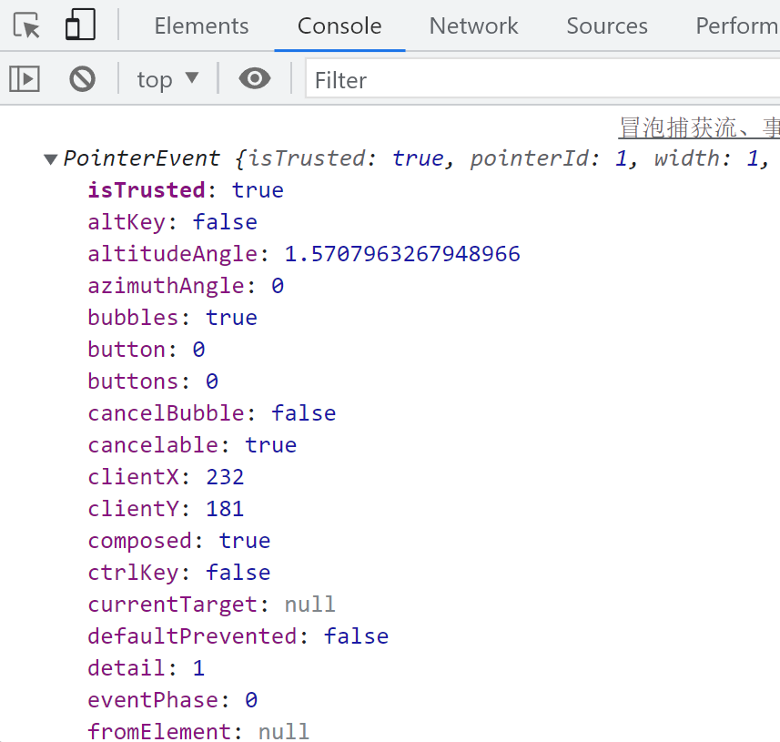
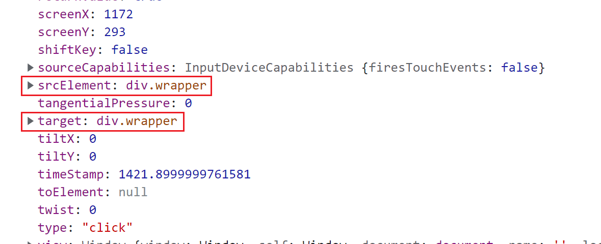

````markdown:docs/Frontend/DOM/70.冒泡捕获流-事件与事件源对象-事件委托.md
# DOM事件流与事件委托

## 事件流
事件流描述了页面接收事件的顺序。主要有两种事件流模型：
1. `IE`提出的事件冒泡流`Event Bubbling`
2. `Netscape`提出的事件捕获流`Event Capturing`

## 事件流阶段
DOM事件流分为三个阶段：
1. 事件捕获阶段：事件从文档的根节点流向目标节点，途中经过各个层次的DOM节点，在各节点上触发捕获事件。
2. 目标阶段：事件到达目标节点，触发目标节点的事件处理程序。如果一个节点绑定了多个事件处理程序，则按照它们定义的先后顺序依次执行。
3. 事件冒泡阶段：事件从目标节点流向文档的根节点，途中经过各个层次的DOM节点，在各节点上触发冒泡事件。

## DOM事件模型
1. `DOM0`级事件模型：通过`on`前缀的属性注册事件处理程序，如`onclick`、`onmouseover`等。
2. `DOM1`级事件模型：没有定义事件相关的内容。
3. `DOM2`级事件模型：定义了`addEventListener()`和`removeEventListener()`方法来添加和删除事件处理程序。这是W3C的标准规范。

## 事件对象
当事件被触发时，浏览器会创建一个事件对象，作为参数传递给事件处理程序，其中包含了与事件相关的详细信息。

```javascript
// 浏览器会把事件对象包装成形参传递过来
wrapper.onclick = function (e) {
  var e = e || window.event;
  console.log(e);
}
```



## 事件源对象
事件源对象指的是触发事件的DOM元素。不同浏览器对事件源对象的属性支持有所不同：
1. 火狐只支持`target`属性
2. `IE`只支持`srcElement`属性
3. 谷歌两个属性都支持



## 事件委托
事件委托是一种利用事件冒泡机制来简化事件处理的技术。它将事件处理程序注册到一个父级元素上，当子元素触发事件时，事件会冒泡到父级元素，从而被父级元素的事件处理程序捕获并处理。这样可以避免给每个子元素都注册事件处理程序，提高性能。

下面是一个事件委托的示例：

```html
<!DOCTYPE html>
<html lang="en">
<head>
  <meta charset="UTF-8">
  <meta http-equiv="X-UA-Compatible" content="IE=edge">
  <meta name="viewport" content="width=device-width, initial-scale=1.0">
</head>
<body>
  <button>增加li</button>
  <ul>
    <li>1</li>
    <li>2</li>
    <li>3</li>
    <li>4</li>
    <li>5</li>
    <li>6</li>
    <li>7</li>
    <li>8</li>
    <li>9</li>
    <li>10</li>
  </ul>
  <script>
    var list = document.getElementsByTagName('ul')[0],
      items = list.getElementsByTagName('li'),
      addBtn = document.getElementsByTagName('button')[0];

    list.onclick = function (e) {
      var e = e || window.event,
        target = e.target || e.srcElement;
      console.log(target.innerText);
    }

    addBtn.onclick = function () {
      var li = document.createElement('li');
      li.innerText = items.length + 1;
      list.appendChild(li);
    }
  </script>
</body>
</html>
```

在这个例子中，我们给`<ul>`元素注册了一个`onclick`事件处理程序。当用户点击列表项`<li>`时，点击事件会冒泡到`<ul>`元素上，被其事件处理程序捕获。通过`event.target`可以获取到实际被点击的`<li>`元素。这样无论列表项有多少个，都只需给`<ul>`注册一个事件处理程序即可。

### 获取元素列表的下标
有时我们需要获取被点击的列表项在列表中的下标位置，有两种常见的实现方式：

#### 方法1：循环比较
通过循环遍历列表，比较每一项与被点击元素是否相等，从而得到下标。

```javascript
list.onclick = function (e) {
  var e = e || window.event,
    target = e.target || e.srcElement;

  for (var i = 0; i < items.length; i++) {
    if (target === items[i]) {
      console.log(i);
      break;
    }
  }
}
```

#### 方法2：使用indexOf
将`NodeList`转换为数组，然后调用数组的`indexOf()`方法查找下标。

```javascript
list.onclick = function (e) {
  var e = e || window.event,
    target = e.target || e.srcElement;

  var index = Array.prototype.indexOf.call(items, target);
  console.log(index);
}
```

使用`indexOf()`的方式更加简洁，但是要注意`NodeList`并非真正的数组，需要通过`call()`来借用数组的方法。

````
