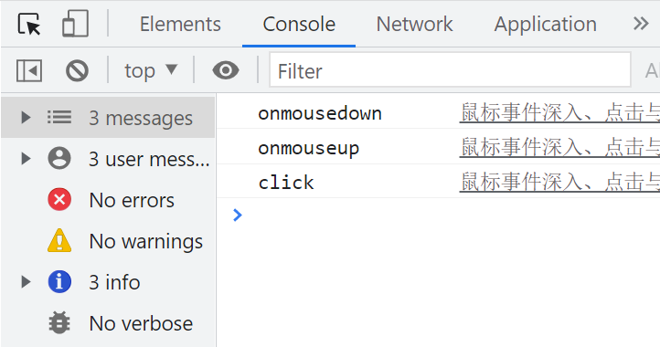

# 鼠标事件与元素拖拽

## 触发顺序

`onmousedown` 和 `onmouseup` 事件的组合会触发 `click` 事件。

```javascript
const button = document.getElementsByTagName('button')[0];

button.onclick = function () {
  console.log('click');
};

button.onmousedown = function () {
  console.log('onmousedown');
};

button.onmouseup = function () {
  console.log('onmouseup');
};
```



## 封装插件，实现元素拖拽

```javascript
const link = document.getElementsByTagName('a')[0];
link.dragNclick(function () {
  window.open('http://www.baidu.com');
});
```

```javascript
// 元素拖拽函数封装（无边界）
Element.prototype.dragNclick = function (onClick) {
  let startTime = 0;
  let endTime = 0;
  let initialPos = [];
  const element = this;

  element.addEventListener('mousedown', function (e) {
    startTime = new Date().getTime();
    initialPos = [parseInt(getStyles(element, 'left')), parseInt(getStyles(element, 'top'))];
    const offsetX = pagePos(e).X - parseInt(getStyles(element, 'left'));
    const offsetY = pagePos(e).Y - parseInt(getStyles(element, 'top'));

    function onMouseMove(eMove) {
      element.style.left = `${pagePos(eMove).X - offsetX}px`;
      element.style.top = `${pagePos(eMove).Y - offsetY}px`;
    }

    function onMouseUp(eUp) {
      endTime = new Date().getTime();
      if (endTime - startTime < 100) {
        element.style.left = `${initialPos[0]}px`;
        element.style.top = `${initialPos[1]}px`;
        onClick();
      }
      document.removeEventListener('mousemove', onMouseMove);
      document.removeEventListener('mouseup', onMouseUp);
    }

    document.addEventListener('mousemove', onMouseMove);
    document.addEventListener('mouseup', onMouseUp);
    e.stopPropagation();
    e.preventDefault();
  });
};
```

## 处理边界问题

```javascript
Element.prototype.dragNclick = function (onClick) {
  const element = this;
  let startTime = 0;
  let endTime = 0;
  let initialPos = [];
  const viewportWidth = getViewPortSize().width;
  const viewportHeight = getViewPortSize().height;
  const elementWidth = parseInt(getStyles(element, 'width'));
  const elementHeight = parseInt(getStyles(element, 'height'));

  element.addEventListener('mousedown', function (e) {
    startTime = new Date().getTime();
    initialPos = [parseInt(getStyles(element, 'left')), parseInt(getStyles(element, 'top'))];
    const offsetX = pagePos(e).X - parseInt(getStyles(element, 'left'));
    const offsetY = pagePos(e).Y - parseInt(getStyles(element, 'top'));

    function onMouseMove(eMove) {
      let newLeft = pagePos(eMove).X - offsetX;
      let newTop = pagePos(eMove).Y - offsetY;

      if (newLeft <= 0) {
        newLeft = 0;
      } else if (newLeft >= viewportWidth - elementWidth) {
        newLeft = viewportWidth - elementWidth - 1;
      }

      if (newTop <= 0) {
        newTop = 0;
      } else if (newTop >= viewportHeight - elementHeight) {
        newTop = viewportHeight - elementHeight - 1;
      }

      element.style.left = `${newLeft}px`;
      element.style.top = `${newTop}px`;
    }

    function onMouseUp(eUp) {
      endTime = new Date().getTime();
      if (endTime - startTime < 100) {
        element.style.left = `${initialPos[0]}px`;
        element.style.top = `${initialPos[1]}px`;
        onClick();
      }
      document.removeEventListener('mousemove', onMouseMove);
      document.removeEventListener('mouseup', onMouseUp);
    }

    document.addEventListener('mousemove', onMouseMove);
    document.addEventListener('mouseup', onMouseUp);
    e.stopPropagation();
    e.preventDefault();
  });
};
```

## 鼠标左中右

鼠标的三个按键分别对应 `0`、`1` 和 `2`。开发右键相关功能时，需确保浏览器版本在 `IE10` 以上。

```javascript
document.onmousedown = function (e) {
  console.log(e.button);
};
```

## 鼠标右键菜单

```javascript
document.addEventListener('contextmenu', function (e) {
  e.preventDefault();
  console.log('右键菜单被触发');
  // 在此处添加自定义右键菜单逻辑
});
```
