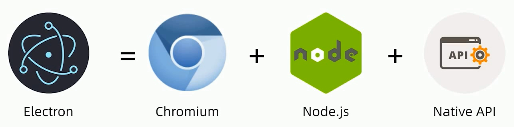
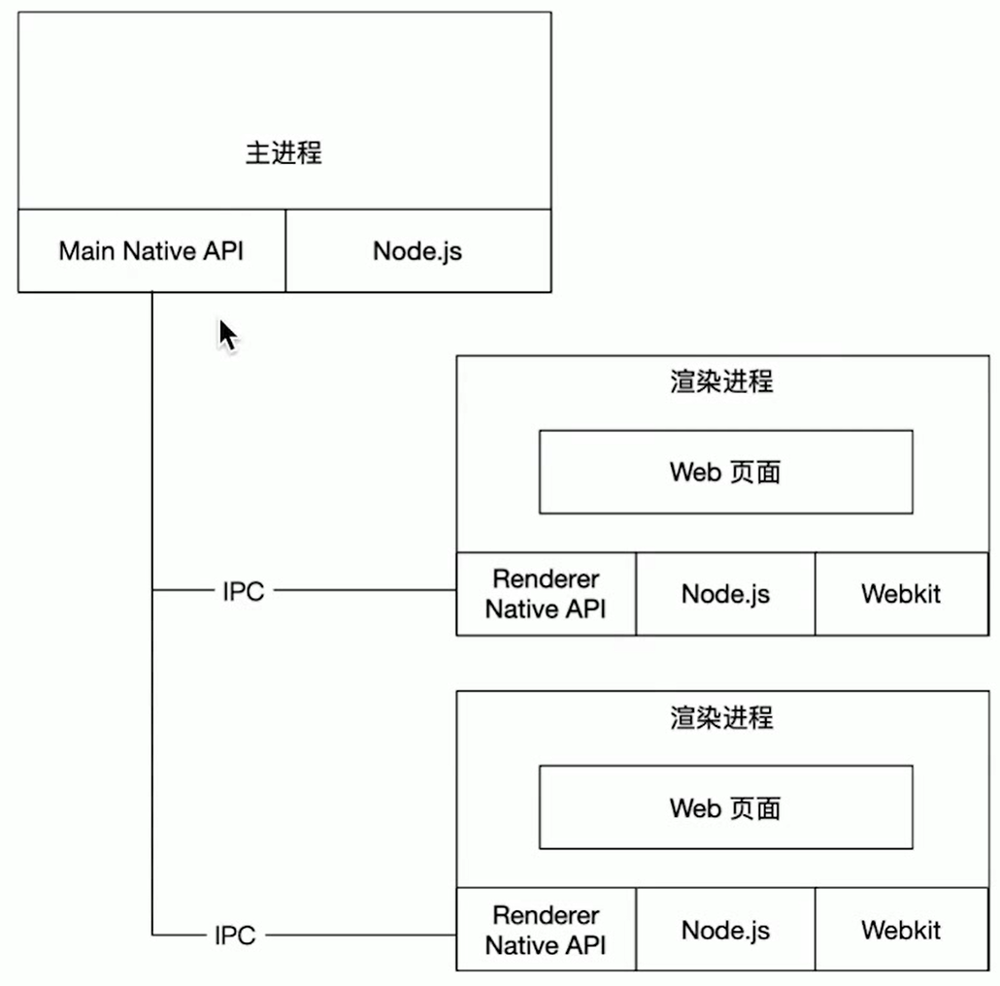
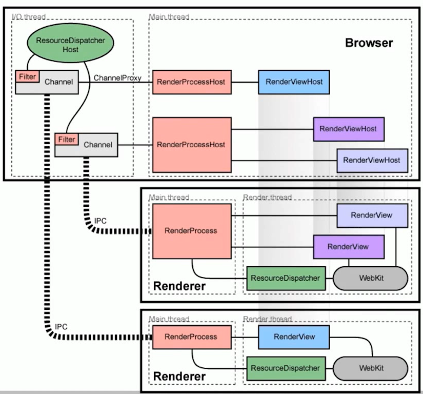
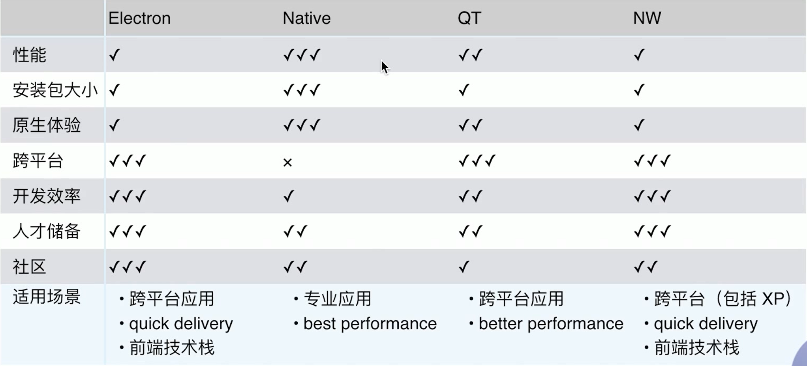

# Electron 初识与基础

Electron 是一个基于 web 技术构建跨平台桌面应用的框架,它具有以下特点

高效 通过 web 技术编写 UI,可以快速实现界面开发

能力 可以调用底层能力,实现更强大的功能

体验 支持跨平台,在不同操作系统上提供一致的用户体验

## Electron 架构

Electron 的架构主要包含三个部分

主进程(Main Process) 负责创建和管理应用窗口,以及与操作系统的交互

渲染进程(Renderer Process) 负责运行应用的前端页面,每个窗口都在单独的渲染进程中运行

原生 API(Native APIs) 提供了与操作系统底层交互的能力,如文件系统访问、网络通信等

渲染进程与主进程之间通过 IPC(进程间通信)实现消息传递和数据交换。多个窗口的渲染进程之间也可以通过 IPC 进行通信。

## Chromium 浏览器内核

Electron 内置了 Chromium 浏览器内核,为应用提供了强大的 web 渲染能力。Chromium 是谷歌开源的浏览器项目,它为 Electron 提供了以下支持

HTML/CSS/JavaScript 可以使用标准的 web 技术开发应用界面

DevTools 提供了开发者工具,方便调试和性能优化

多进程架构 每个页面运行在独立的渲染进程中,提高了稳定性和流畅度

安全沙箱 对页面中的不可信代码进行隔离,保障应用安全

## 跨平台桌面应用开发方案对比

目前流行的跨平台桌面应用开发方案有 Native、QT、Flutter、NW.js、Electron 等,它们各有优缺点

Native 使用平台原生技术如.Net/Objective-C/Java 等开发,优点是性能高、体验好、包体积小,缺点是门槛高、迭代慢,需要对不同平台分别开发和维护

QT 基于 C++开发,优点是跨平台、高性能、媲美原生体验,缺点是门槛较高,需要掌握 C++,迭代速度一般

Flutter 优点是跨端,支持移动、桌面、web 等,缺点是桌面端还在发展中,基建和生态还不够完善

NW.js 优点是跨平台、社区活跃、支持 XP 等老旧系统,缺点是包体积大、性能一般

Electron 优点是跨平台、社区活跃、案例众多,缺点是包体积大、性能一般

## 总结

如果项目对性能和体验要求不是极致,而是希望快速开发和迭代,降低跨平台开发成本,那么 Electron 是一个不错的选择。它允许开发者使用熟悉的 web 技术如 HTML/CSS/JavaScript 来构建功能丰富的桌面应用,同时支持 Windows、macOS、Linux 等主流操作系统。
