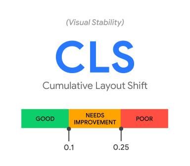

# 核心 Web 指标——衡量网站性能和用户体验的关键

作为一名 Web 开发者,我们都希望自己的网站能够为用户提供最佳的体验。但是,如何评估一个网站的性能和用户体验呢?这就需要用到 Web 指标。在众多的 Web 指标中,有一些被视为至关重要的,它们被称为"核心 Web 指标"。这些指标不仅适用于所有网页,而且每位网站所有者都应该重点关注并进行测量。因为它们能够直接反映用户的真实体验,并且在所有的 Google 工具中都有展示。

## 核心 Web 指标的三大要素

核心 Web 指标随时间的推移可能会发展和调整,但它们始终围绕以下三个关键方面来衡量用户体验:

加载性能:网站内容呈现给用户的速度有多快?

交互性:当用户与页面交互时,网站的响应速度如何?

视觉稳定性:页面的内容是否稳定,会不会出现突然的变化?

基于 2020 年的数据,以下是这三个方面的具体指标和推荐的阈值:

1. Largest Contentful Paint (LCP):该指标用于测量加载性能,特别是页面上最大的内容元素的渲染时间。为了提供优质的用户体验,我建议 LCP 应在页面首次开始加载后的 2.5 秒内完成。

2. First Input Delay (FID):该指标用于测量交互性,即用户首次尝试与页面交互到页面实际开始响应的时间。为了确保快速的响应,我推荐的 FID 时长应为 100 毫秒或更短。

3. Cumulative Layout Shift (CLS):这是一个关于视觉稳定性的指标。它衡量页面内容在加载过程中的位移量。为了避免给用户带来困扰,CLS 的建议值应保持在 0.1 或更低。

## 如何确保网站达到核心 Web 指标的标准

为了确保大部分用户都能获得良好的体验,上述每项指标的建议阈值应当以页面加载的第 75 个百分位数为基准。这意味着,我们不仅要关注网站的平均性能,还要确保绝大多数用户都能获得优质的体验。此外,这些标准同样适用于移动和桌面设备,因为无论在哪种设备上,用户都期待获得一致的高质量体验。

最后,请记住,如果一个页面在所有这三个指标上都达到了建议的第 75 个百分位数阈值,那么评估核心 Web 指标合规性的工具会认为这个页面已经通过了测试。

在建设和优化网站时,我们应始终将用户体验放在首位。核心 Web 指标为我们提供了一个实用的框架,帮助我们确保网站为每位访客提供了最佳的体验。让我们共同努力,打造出优秀的 Web 应用吧!

[Defining the Core Web Vitals metrics thresholds](https://web.dev/defining-core-web-vitals-thresholds/)
