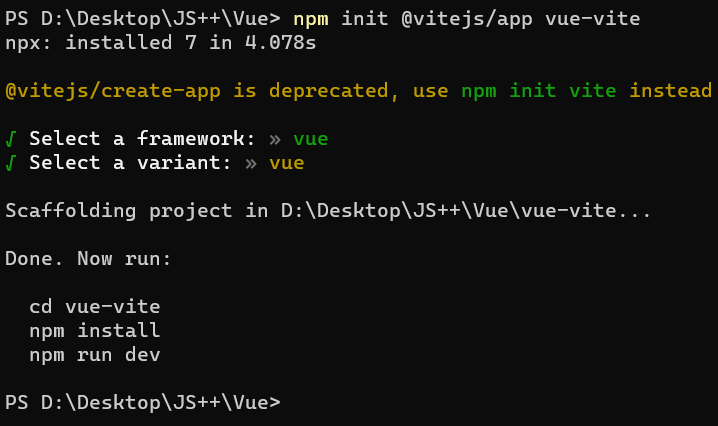

# 项目构建方式

在前端开发中，项目构建是一个非常重要的环节。合理的构建方式可以提高开发效率，优化项目性能。本文将介绍几种常见的项目构建方式，包括 Vite CDN 构建、Vite 终端构建以及使用 Vue CLI 脚手架创建项目。

## 使用 Vite CDN 构建项目

Vite 是一个基于浏览器原生 ES 模块导入的开发服务器，它的构建速度非常快。使用 Vite CDN 构建项目的步骤如下：

1. 初始化项目：`npm init -y`
2. 安装 Vite：`yarn add vite -D`
3. 修改 `package.json` 中的 `scripts`，将调试命令设置为 `"dev": "vite"`
4. 运行项目：`yarn dev` 或 `npm run dev`
5. Vite 默认启动端口为 `3000`，并支持热更新

使用 CDN 构建的项目，生成的文件会相对较小，尤其是在大型项目中优势更加明显。

### index.html

```html
<div id="app"></div>

<!-- Vue 3 -->
<script src="https://unpkg.com/vue@3.1.2/dist/vue.global.js"></script>

<!-- Vue 2 -->
<!-- <script src="https://unpkg.com/vue@2.6.14/dist/vue.global.js"></script> -->

<script type="module" src="./src/main.js"></script>
```

### main.js

```javascript
const { createApp, ref } = Vue;

const App = {
  template: `
    <div>
      <h1>{{text}}</h1>
      <button @click="change">Change</button>
    </div>
  `,
  setup() {
    const text = ref('hello Vue!!!');
    const change = () => {
      text.value = 'hello Vite';
    };
    return {
      text,
      change,
    };
  },
};

// Vue 3 写法
createApp(App).mount('#app');

// Vue 2 写法
// new Vue({
//   render: h => h(App)
// }).$mount('#app');
```

在 `main.js` 中，可以根据使用的 Vue 版本选择不同的写法。Vue 3 推荐使用 Composition API，而 Vue 2 使用 Options API。

## 使用 Vite 终端构建项目

除了使用 CDN，还可以通过终端命令来创建 Vite 项目：

1. 创建项目：`npm init @vitejs/app vue-vite`，其中 `vue-vite` 是项目名称



2. 创建后的项目没有 `node_modules`，需要进行依赖安装

## 使用 Vue CLI 脚手架创建项目

Vue CLI 是 Vue 官方提供的脚手架工具，可以快速搭建 Vue 项目。使用步骤如下：

1. 安装 Vue CLI：`npm install -g @vue/cli`
2. 创建项目：`vue create vue-project`，其中 `vue-project` 是项目名
3. 通过空格键进行安装项的选择

以上就是几种常见的 Vue 项目构建方式，可以根据实际需求选择合适的方式。在实战开发中，还需要注意以下几点：

- 选择合适的 Vue 版本，Vue 3 和 Vue 2 在语法和 API 上有一定区别
- 合理配置 Vite 或 Webpack 等构建工具，优化构建性能
- 遵循 Vue 的编码规范和最佳实践，编写可维护的代码
- 善用 Vue DevTools 等开发者工具，提高开发效率
