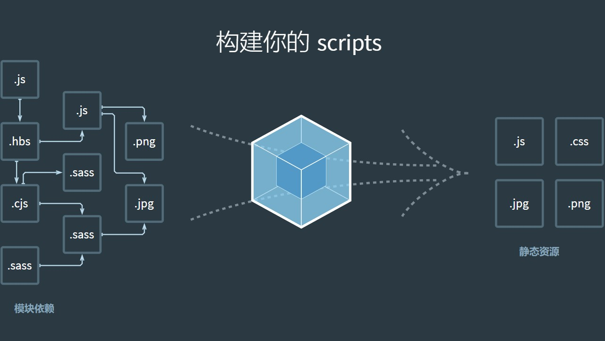
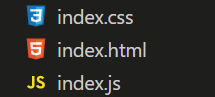
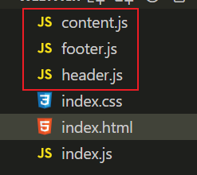

# Webpack 基础

## 以前的网页开发方式



在早期的网页开发中,我们通常会编写如下的 HTML、CSS 和 JavaScript 代码:

```html
<!DOCTYPE html>
<html lang="en">
  <head>
    <meta charset="UTF-8" />
    <meta http-equiv="X-UA-Compatible" content="IE=edge" />
    <meta name="viewport" content="width=device-width, initial-scale=1.0" />
    <title>Webpack</title>
    <link rel="stylesheet" href="./index.css" />
  </head>
  <body>
    <h1>这是一个网页</h1>
    <div id="app"></div>

    <script src="./index.js"></script>
  </body>
</html>
```

```css
body {
  background-color: antiquewhite;
}
```

```javascript
const app = document.getElementById('app');

const header = document.createElement('div');
header.innerText = 'header';
app.appendChild(header);

const content = document.createElement('div');
content.innerText = 'content';
app.appendChild(content);

const footer = document.createElement('div');
footer.innerText = 'footer';
app.appendChild(footer);
```

这种方式虽然简单直接,但是存在一些问题:

1. 所有的代码都写在一个 JS 文件中,不利于代码的维护和复用。
2. 没有使用模块化的开发方式,导致变量污染全局环境。

## 使用面向对象改造



为了解决上述问题,我尝试使用面向对象的思想对代码进行了改造:

```html
<!DOCTYPE html>
<html lang="en">
  <head>
    <meta charset="UTF-8" />
    <meta http-equiv="X-UA-Compatible" content="IE=edge" />
    <meta name="viewport" content="width=device-width, initial-scale=1.0" />
    <title>Webpack</title>
    <link rel="stylesheet" href="./index.css" />
  </head>
  <body>
    <h1>这是一个网页</h1>
    <div id="app"></div>
    <!-- 先引入各个模块 -->
    <script src="./header.js"></script>
    <script src="./content.js"></script>
    <script src="./footer.js"></script>
    <!-- 再实例化 -->
    <script src="./index.js"></script>
  </body>
</html>
```

```javascript
// index.js
new Header();
new Content();
new Footer();
```

```javascript
// content.js
function Content() {
  const app = document.getElementById('app');
  const content = document.createElement('div');
  content.innerText = 'content';
  app.appendChild(content);
}
```

```javascript
// footer.js
function Footer() {
  const app = document.getElementById('app');
  const footer = document.createElement('div');
  footer.innerText = 'footer';
  app.appendChild(footer);
}
```

```javascript
// header.js
function Header() {
  const app = document.getElementById('app');
  const header = document.createElement('div');
  header.innerText = 'header';
  app.appendChild(header);
}
```

这样改造后,代码结构清晰了很多,但仍然存在一些问题:

1. 需要加载多个 JS 文件,耗时更久,而且 index.js 中看不到其他模块的定义位置。
2. JS 文件的引用顺序如果不对,会导致错误更难以查找。

## 使用 Webpack 管理模块

为了彻底解决上述问题,我们可以使用 Webpack 来管理项目中的模块。使用 Webpack 之前,需要先安装它:

1. 确保电脑已安装 `npm`
2. 在项目目录下执行 `npm init -y` 初始化,生成 `package.json` 文件
3. 执行 `npm install webpack@4.41.2 webpack-cli@3.3.10 -D` 安装 webpack 4.41.2 版本

安装完成后,使用如下命令构建项目:

```bash
npx webpack index.js
```

Webpack 会分析 index.js 及其依赖,将它们打包成一个 dist/main.js 文件。

接下来修改代码,使用 ES Module 语法导入模块:

```javascript
// index.js
import Header from './header.js';
import Content from './content.js';
import Footer from './footer.js';

new Header();
new Content();
new Footer();
```

```html
<!DOCTYPE html>
<html lang="en">
  <head>
    <meta charset="UTF-8" />
    <meta http-equiv="X-UA-Compatible" content="IE=edge" />
    <meta name="viewport" content="width=device-width, initial-scale=1.0" />
    <title>Webpack</title>
    <link rel="stylesheet" href="./index.css" />
  </head>
  <body>
    <h1>这是一个网页</h1>
    <div id="app"></div>
    <!-- 只需引入 Webpack 打包后的文件 -->
    <script src="./dist/main.js"></script>
  </body>
</html>
```

```javascript
// content.js
function Content() {
  const app = document.getElementById('app');
  const content = document.createElement('div');
  content.innerText = 'content';
  app.appendChild(content);
}

export default Content;
```

header.js 和 footer.js 的改造与 content.js 类似,就不再赘述。

这样一来,无论项目中有多少个模块,我们只需要引入 Webpack 打包后的一个 JS 文件即可。Webpack 会帮助我们管理和打包这些模块,让我们可以专注于编写业务代码。
