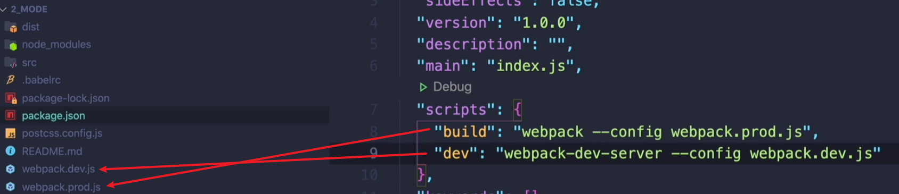
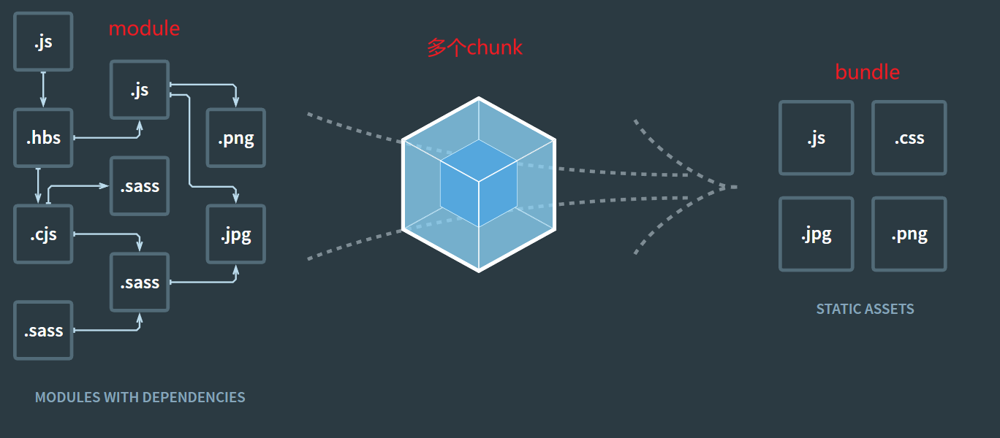

# Webpack 常用配置项

## HtmlWebpackPlugin

HtmlWebpackPlugin 可以简化 HTML 文件的创建。它会自动生成一个 HTML 文件,并将打包后的 JS 文件自动引入到这个 HTML 文件中。

使用方法如下

```javascript
const HtmlWebpackPlugin = require('html-webpack-plugin');

module.exports = {
  // ...
  plugins: [
    new HtmlWebpackPlugin({
      template: './src/index.html',
    }),
  ],
};
```

更多配置项可以参考官方文档:[HtmlWebpackPlugin | webpack 中文网](https://www.webpackjs.com/plugins/html-webpack-plugin/)

## sourceMap

sourceMap 可以建立源文件和打包文件之间的映射关系。当代码出错时,可以利用 sourceMap 快速定位到源文件中的错误位置,方便调试。

使用方法如下

```javascript
module.exports = {
  // ...
  devtool: 'source-map',
};
```

更多配置项可以参考官方文档:[source-map-loader | webpack](https://webpack.js.org/loaders/source-map-loader/#root)

## WebpackDevServer

WebpackDevServer 可以启动一个开发服务器,并提供一些实用的功能,比如自动编译、自动刷新浏览器、请求转发等。

使用方法如下

```javascript
module.exports = {
  // ...
  devServer: {
    contentBase: './dist',
    hot: true,
  },
};
```

更多配置项可以参考官方文档:[webpack-dev-server API | webpack](https://webpack.js.org/api/webpack-dev-server/#root)

## HMR 热更新

HMR(Hot Module Replacement)可以在不刷新浏览器的情况下,更新页面中的模块。这样可以保留应用的状态,提高开发效率。

使用方法如下

```javascript
const webpack = require('webpack');

module.exports = {
  // ...
  devServer: {
    hot: true,
  },
  plugins: [new webpack.HotModuleReplacementPlugin()],
};
```

在 JS 模块中,可以通过`module.hot.accept`来接受模块更新:

```javascript
if (module.hot) {
  module.hot.accept('./library.js', function () {
    // 更新逻辑
  });
}
```

更多使用方法可以参考官方文档:[Hot Module Replacement | webpack](https://webpack.js.org/guides/hot-module-replacement/#enabling-hmr)

## 使用 Babel 处理 ES6 代码

现代 JS 代码大多使用了 ES6+语法,而有些浏览器并不支持这些新语法。我们可以使用 Babel 将 ES6 代码转换为 ES5 代码。

如果是开发普通项目,可以使用`@babel/polyfill`来处理:

```javascript
module.exports = {
  // ...
  entry: ['@babel/polyfill', './app/js'],
};
```

如果是开发工具库,为了避免全局污染,可以使用`babel-plugin-transform-runtime`:

```javascript
{
  "plugins": [
    [
      "@babel/plugin-transform-runtime",
      {
        "corejs": 3
      }
    ]
  ]
}
```

更多使用方法可以参考:
[@babel/polyfill · Babel](https://babeljs.io/docs/en/babel-polyfill)
[babel-plugin-transform-runtime · Babel 中文文档 - 印记中文](https://babel.docschina.org/docs/en/6.26.3/babel-plugin-transform-runtime/)
[GitHub - zloirock/core-js: Standard Library](https://github.com/zloirock/core-js)

## Loader 的概念

Webpack 本身只能处理 JS 模块,如果要处理其他类型的文件,就需要使用对应的 loader。比如:

- 使用`css-loader`处理 CSS 文件
- 使用`file-loader`处理图片文件
- 使用`babel-loader`处理 ES6 代码

使用方法如下

```javascript
module.exports = {
  // ...
  module: {
    rules: [
      {
        test: /\.css$/,
        use: ['style-loader', 'css-loader'],
      },
    ],
  },
};
```

更多 loader 可以参考官方文档:[style-loader | webpack](https://webpack.js.org/loaders/style-loader/#root)

## 打包 React 代码

使用 Webpack 打包 React 代码,需要安装一些额外的依赖:

```bash
npm install --save-dev @babel/preset-react
```

然后在`.babelrc`中添加`@babel/preset-react`:

```json
{
  "presets": ["@babel/preset-react"]
}
```

更多使用方法可以参考:[@babel/preset-react · Babel 中文文档](https://babel.docschina.org/docs/en/babel-preset-react/)

## Tree Shaking

Tree Shaking 可以移除代码中未引用的部分,减小打包体积。Webpack 4 默认支持这个功能。

需要注意的是,Tree Shaking 依赖 ES Modules 的静态结构特性。CommonJS 是动态引入,无法分析依赖关系。

更多信息可以参考:[Tree shaking - 术语表 | MDN](https://developer.mozilla.org/zh-CN/docs/Glossary/Tree_shaking#:~:text=Tree%20shaking%20%E6%98%AF%E4%B8%80%E4%B8%AA%E9%80%9A%E5%B8%B8%E7%94%A8%E4%BA%8E%E6%8F%8F%E8%BF%B0%E7%A7%BB%E9%99%A4%20JavaScript%20%E4%B8%8A%E4%B8%8B%E6%96%87%E4%B8%AD%E7%9A%84%E6%9C%AA%E5%BC%95%E7%94%A8%E4%BB%A3%E7%A0%81%20%28dead-code%29%20%E8%A1%8C%E4%B8%BA%E7%9A%84%E6%9C%AF%E8%AF%AD%E3%80%82%20%E5%AE%83%E4%BE%9D%E8%B5%96%E4%BA%8E,ES2015%20%E4%B8%AD%E7%9A%84%20import%20%E5%92%8C%20export%20%E8%AF%AD%E5%8F%A5%EF%BC%8C%E7%94%A8%E6%9D%A5%E6%A3%80%E6%B5%8B%E4%BB%A3%E7%A0%81%E6%A8%A1%E5%9D%97%E6%98%AF%E5%90%A6%E8%A2%AB%E5%AF%BC%E5%87%BA%E3%80%81%E5%AF%BC%E5%85%A5%EF%BC%8C%E4%B8%94%E8%A2%AB%20JavaScript%20%E6%96%87%E4%BB%B6%E4%BD%BF%E7%94%A8%E3%80%82)

## 不同环境的配置

我们的项目通常需要在不同的环境下使用不同的配置,比如开发环境和生产环境。可以通过设置不同的配置文件来实现:

- `webpack.common.js` 存放公共配置
- `webpack.dev.js` 存放开发环境配置
- `webpack.prod.js` 存放生产环境配置

然后使用`webpack-merge`合并配置:

```javascript
const merge = require('webpack-merge');
const common = require('./webpack.common.js');

module.exports = merge(common, {
  mode: 'development',
  // ...
});
```



## JS 代码分割

随着项目越来越大,打包后的 JS 文件也会越来越大。我们可以使用代码分割将代码拆分为多个文件,按需加载。

Webpack 4 内置了`SplitChunksPlugin`来实现代码分割。它会自动提取公共模块,生成单独的 chunk。

使用方法如下

```javascript
module.exports = {
  // ...
  optimization: {
    splitChunks: {
      chunks: 'all',
    },
  },
};
```

更多配置项可以参考官方文档:[SplitChunksPlugin | webpack](https://webpack.js.org/plugins/split-chunks-plugin/#root)

## 懒加载

懒加载可以延迟加载不是立即需要的代码,加快页面初始加载速度。比如路由组件、图片等。

使用方法如下

```javascript
const Login = () => import('./login.js');

const routes = [
  {
    path: '/login',
    component: Login,
  },
];
```

当路由切换到`/login`时,才会加载`login.js`文件。

## module、chunk、bundle 的区别

这三个概念容易混淆,这里简单说明一下:

- module - 各个源码文件,比如 JS 模块、CSS 模块、图片等
- chunk - 代码分割后的产物,一个 chunk 由多个模块组成,用于代码的合并和分割
- bundle - 最终的输出文件,一个 bundle 对应一个 chunk,可以根据需要生成多个 bundle

它们的关系如下图:


## CSS 代码分割

CSS 代码也可以像 JS 代码一样实现分割,生成单独的文件。这可以使用`MiniCssExtractPlugin`实现:

```javascript
const MiniCssExtractPlugin = require('mini-css-extract-plugin');

module.exports = {
  // ...
  module: {
    rules: [
      {
        test: /\.css$/,
        use: [MiniCssExtractPlugin.loader, 'css-loader'],
      },
    ],
  },
  plugins: [
    new MiniCssExtractPlugin({
      filename: '[name].css',
    }),
  ],
};
```

这样 CSS 代码会生成单独的文件,而不是内嵌在 JS 中。

更多配置项可以参考官方文档:[MiniCssExtractPlugin | webpack](https://webpack.js.org/plugins/mini-css-extract-plugin/#root)

## 文件指纹

每次项目发布,我们常常会修改文件的内容。但是如果文件名不变,浏览器可能会使用缓存中的老文件,不能及时获取最新内容。

为了解决这个问题,我们可以给文件名加上 hash 值。当文件内容变化时,hash 值也会变化,从而请求新的文件。这个过程叫做"文件指纹"。

使用方法如下

```javascript
module.exports = {
  // ...
  output: {
    filename: '[name].[contenthash].js',
  },
};
```

这样生成的文件名类似`main.a2c0ab.js`,每次文件修改后,hash 值会变化,文件名也会变化。

更多信息可以参考官方文档:[Caching | webpack](https://webpack.js.org/guides/caching/#output-filenames)

## Shimming

有些第三方库(比如 jQuery)可能会引用一些全局依赖(比如`$`)。这些库一般要求使用者也提供这些全局变量。

Webpack 的`ProvidePlugin`可以自动加载这些模块,而不必到处`import`或`require`。

使用方法如下

```javascript
const webpack = require('webpack');

module.exports = {
  // ...
  plugins: [
    new webpack.ProvidePlugin({
      $: 'jquery',
      _: 'lodash',
    }),
  ],
};
```

这样在代码中就可以直接使用`$`和`_`变量,而不需要手动引入。

更多信息可以参考官方文档:[Shimming | webpack](https://webpack.js.org/guides/shimming/#root)

## Webpack 4/5 的区别

Webpack 5 相比 Webpack 4 有了很多改进,这里列举几点主要区别:

默认打包区别:

- Webpack 5 打包生产环境代码时,默认会压缩代码、开启 Tree Shaking 等优化
- Webpack 4 需要手动配置优化项

自带 Tree Shaking:

- Webpack 5 内置了更完善的 Tree Shaking 功能,代码优化更彻底
- Webpack 4 需要配合一些插件才能实现完整的 Tree Shaking

总的来说,Webpack 5 的默认配置更加优化,开箱即用,上手更加方便。

以上就是我对 Webpack 常用配置项的一些理解和总结。Webpack 功能十分强大,还有很多高级用法,需要在实践中不断积累和学习。希望这篇文章对你有所帮助。
