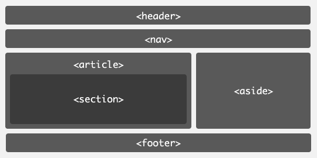

# HTML5 新增标签与属性



## 语义化标签

`article`标签用于包裹一块与自身相关的独立内容,比如一篇论坛帖子或博客文章。`article`内容通常可以独立分配和复用。

`section`标签用于表示某个单独功能的聚合,重点在于功能,比如一个小型地图区域。

## HTML5 文档声明

```html
<!DOCTYPE html>
```

## 属性默认值

```html
<!-- 属性为true -->
<input type="checkbox" checked />
<input type="checkbox" checked="true" />
<input type="checkbox" checked="checked" />

<!-- 属性为false -->
<input type="checkbox" checked="false" />
<input type="checkbox" />
```

## 新增属性

### contenteditable

`contenteditable`属性可以让元素内的文字变为可编辑状态。

```html
<p contenteditable="true">这是一段可编辑的文字</p>
```

### hidden

`hidden`属性可以隐藏元素,使其不在页面中显示。

```html
<p>这是一段重要内容</p>
<p hidden>这是一段次要内容,被隐藏了</p>
```

### data-\*

`data-*`可以让我们自定义属性。命名规则如下:

1. 名称不能包含分号和大写字母
2. 不能以`xml`开头

```html
<div data-id="test">自定义属性示例</div>

<script>
  let elem = document.getElementsByTagName('div')[0];
  let dataId = elem.getAttribute('data-id');
  console.log(dataId); // 输出 "test"
</script>
```

### draggable

`draggable`属性可以让元素变为可拖动。

```html
<div draggable="true" id="box"></div>

<script>
  let box = document.getElementById('box');

  // 开始拖动时触发
  box.ondragstart = function (event) {
    console.log('ondragstart', event);
  };

  // 拖动过程中持续触发
  box.ondrag = function (event) {
    console.log('ondrag', event);
  };

  // 拖动结束时触发
  box.ondragend = function (event) {
    console.log('ondragend', event);
  };
</script>
```

## 拖放 API 示例

下面是一个完整的拖放示例,实现了在不同区域之间拖动元素:

```html
<!DOCTYPE html>
<html lang="en">
  <head>
    <meta charset="UTF-8" />
    <title>拖放示例</title>
    <style>
      #box {
        width: 200px;
        height: 200px;
        background-color: orange;
      }

      .dragzone {
        width: 300px;
        height: 300px;
        background-color: pink;
        margin: 10px;
      }
    </style>
  </head>
  <body>
    <div class="dragzone">
      <div draggable="true" id="box"></div>
    </div>
    <div class="dragzone"></div>
    <div class="dragzone"></div>

    <script>
      let dragged;

      document.addEventListener('dragstart', function (event) {
        // 保存被拖动元素的引用
        dragged = event.target;
      });

      document.addEventListener('dragenter', function (event) {
        // 拖动进入目标区域时改变背景色
        if (event.target.className === 'dragzone') {
          event.target.style.backgroundColor = 'lightblue';
        }
      });

      document.addEventListener('dragleave', function (event) {
        // 拖动离开目标区域时恢复背景色
        if (event.target.className === 'dragzone') {
          event.target.style.backgroundColor = 'pink';
        }
      });

      document.addEventListener('dragover', function (event) {
        // 阻止默认行为,允许释放
        event.preventDefault();
      });

      document.addEventListener('drop', function (event) {
        event.preventDefault();
        if (event.target.className === 'dragzone') {
          // 恢复背景色
          event.target.style.backgroundColor = 'pink';
          // 将被拖元素移动到目标区域
          dragged.parentNode.removeChild(dragged);
          event.target.appendChild(dragged);
        }
      });
    </script>
  </body>
</html>
```

更多拖放 API 的信息可以参考 MDN 文档:
[DataTransfer - Web API 接口参考 | MDN](https://developer.mozilla.org/zh-CN/docs/Web/API/DataTransfer)
