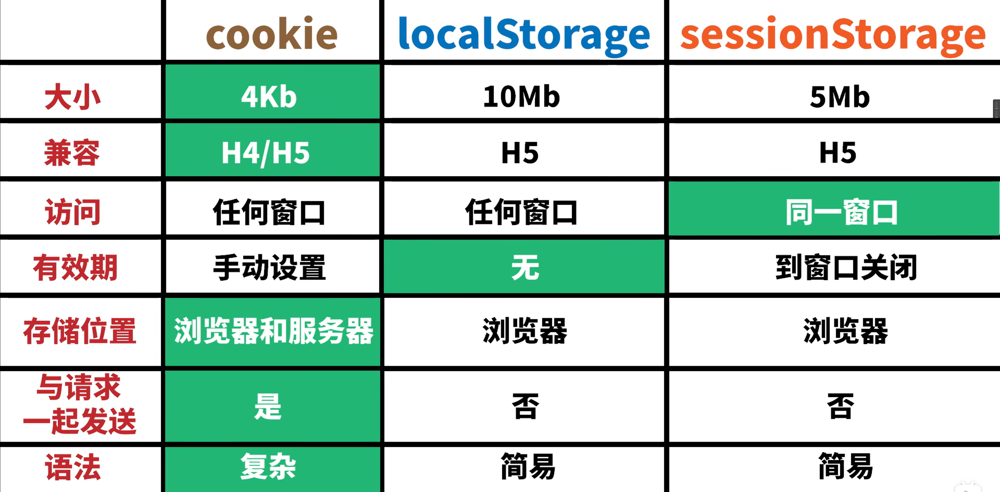

# 浏览器本地存储方式对比

在前端开发中,我们经常需要在浏览器端存储一些数据。常见的浏览器本地存储方式有三种:localStorage、sessionStorage 和 Cookies。下面我们来详细对比一下它们之间的区别。

## 存储位置和类型

这三种存储方式的数据都是存储在客户端浏览器中的。它们存储的数据类型都是字符串,如果存储的是对象,获取到的也是字符串类型,需要使用`JSON.parse()`方法转换为对象。

## 存储容量

localStorage 和 sessionStorage 的存储容量都是 5M,而 Cookies 的存储容量只有 4K。所以如果需要存储较大的数据,建议使用 localStorage 或 sessionStorage。

## 有效期

localStorage 是永久存储,除非手动清除,否则会一直保留。  
sessionStorage 只在当前会话有效,关闭页面或浏览器后会被清空。
Cookies 可以设置过期时间,在过期时间到达后会自动失效。

## 与服务器通信

localStorage 和 sessionStorage 都不会主动与服务器通信。而 Cookies 在每次 HTTP 请求时都会携带在请求头中发送给服务器。

## 页面共享

相同浏览器的不同页面(同域名同端口)可以共享 localStorage。  
父页面新打开的子页面会复制父页面的 sessionStorage(类似深拷贝),之后各自的 sessionStorage 变更不会相互影响。
同域名不同端口的页面可以共享 Cookies。

## 使用方式对比

|   操作    | localStorage/sessionStorage |                   Cookies                    |
| :-------: | :-------------------------: | :------------------------------------------: |
| 新增/修改 |    `setItem(key, value)`    |       `document.cookie = "key=value"`        |
|   读取    |       `getItem(key)`        |  `document.cookie` (返回所有 cookie 字符串)  |
|   删除    |      `removeItem(key)`      | `document.cookie = "key=; expires=过期时间"` |
|   清空    |          `clear()`          |                      无                      |



## 代码示例

### Cookies

```javascript
// 读取所有cookie
document.cookie;

// 新增cookie
document.cookie = 'name=zhangsan';

// 设置5000秒后过期
document.cookie = 'name=zhangsan; max-age=5000';

// 设置具体过期日期
var d = new Date();
d.setDate(d.getDate() + 10);
document.cookie = 'name=zhangsan; expires=' + d;

// 封装cookie的增删改查操作
var manageCookies = {
  set: function (key, value, expTime) {
    document.cookie = key + '=' + value + '; max-age=' + expTime;
    return this;
  },
  delete: function (key) {
    return this.set(key, '', -1); // 设置过期时间为负值即可删除
  },
  get: function (key, cb) {
    var cookies = document.cookie.split('; ');
    for (var i = 0; i < cookies.length; i++) {
      var kv = cookies[i].split('=');
      if (kv[0] === key) {
        cb(kv[1]);
        return this;
      }
    }
    cb(undefined);
    return this;
  },
};

manageCookies
  .set('name', 'lisi', 1000)
  .set('age', 20, 1000)
  .delete('name')
  .get('age', function (data) {
    console.log(data); // 20
  });
```

### localStorage

```javascript
// 存储数据
localStorage.setItem('name', 'zhangsan');

// 读取数据
var name = localStorage.getItem('name');

// 删除数据
localStorage.removeItem('name');

// 清空所有数据
localStorage.clear();
```

### sessionStorage

用法与 localStorage 完全一致,只是调用的是`sessionStorage`对象。

```javascript
// 存储
sessionStorage.setItem('name', 'lisi');

// 读取
var name = sessionStorage.getItem('name');
```

## 服务端如何跟踪用户

### HTTP 请求头 Referer

通过解析请求头中的 Referer 字段,可以获知用户的来源页面。

### IP 地址

通过用户的 IP 地址可以大致判断用户的地理位置。但 IP 地址可能是动态的,且可能存在代理服务器,定位并不十分准确。

### 用户主动登录

网站可以要求用户注册登录,然后将用户信息与其操作行为关联记录。这是最可靠的用户跟踪方式。

### URL 参数

可以在 URL 中附加一些参数来标识和跟踪用户,比如`uid=xxx`。这种方式简单但容易被篡改。

### Cookie

服务器可以在响应头中下发 Cookie,浏览器会存储并在后续请求中携带,服务器就可以识别用户。这是目前最常用的用户跟踪方式。

以上就是我对浏览器本地存储方式的详细对比和使用示例。在实际开发中,要根据具体需求选择合适的存储方式。localStorage 适合存储不太敏感且需要长期保存的数据,sessionStorage 适合存储会话级别的临时数据,Cookies 适合需要与服务器通信的场景。
