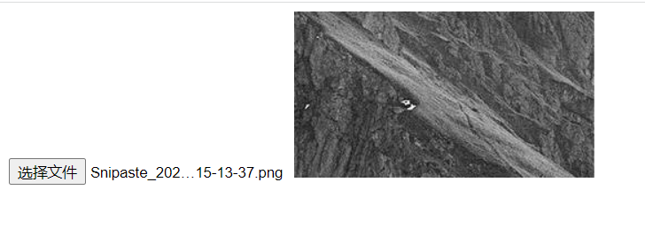

# 文件读取、分割与进度监控

在前端开发中,我们经常需要读取用户选择的文件,并对文件内容进行处理。本文将介绍如何使用 JavaScript 读取文件内容,分割文件,以及监控文件读取进度等进阶操作。

## 打开文件

要让用户选择文件,可以使用`<input>`标签,将`type`属性设置为`"file"`:

```html
<input type="file" id="fileInput" />
```

## 读取文件内容

### FileReader 对象

`FileReader`对象允许 Web 应用程序异步读取存储在用户计算机上的文件(或原始数据缓冲区)的内容,使用`File`或`Blob`对象指定要读取的文件或数据。

创建`FileReader`对象:

```javascript
const reader = new FileReader();
```

### 读取文本文件

可以使用`FileReader`的`readAsText`方法读取文本文件内容:

```javascript
<input type="file" id="fileInput" />

<script>
  const fileInput = document.getElementById('fileInput');

  fileInput.addEventListener('change', function(e) {
    const reader = new FileReader();

    reader.onload = function() {
      console.log(reader.result);
    }

    reader.readAsText(fileInput.files[0]);
  });
</script>
```

当用户选择文件后,会触发`change`事件。在事件处理函数中,创建`FileReader`对象,并监听`onload`事件。当文件读取完成后,可以通过`reader.result`获取文件内容。

### 读取图片文件

使用`readAsDataURL`方法可以读取图片文件,`result`属性将包含一个`data:URL`格式的字符串(base64 编码)以表示所读取图片的内容。

```javascript
const fileInput = document.getElementById('fileInput');

fileInput.addEventListener('change', function (e) {
  const reader = new FileReader();

  reader.onload = function () {
    const img = new Image();
    img.src = reader.result;
    img.width = 200;
    img.height = 200;
    document.body.appendChild(img);
  };

  reader.readAsDataURL(fileInput.files[0]);
});
```

读取完成后,创建一个``元素,将其`src`属性设置为`reader.result`,即可在页面上显示选择的图片。

#### 处理图片灰度化

利用`<canvas>`可以对读取的图片进行像素级处理,实现灰度化效果:

```javascript
<input type="file" id="fileInput" />

<script>
  const fileInput = document.getElementById('fileInput');

  fileInput.addEventListener('change', function(e) {
    const reader = new FileReader();

    reader.onload = function() {
      const img = new Image();

      img.onload = function() {
        const canvas = document.createElement('canvas');
        const ctx = canvas.getContext('2d');

        ctx.drawImage(img, 0, 0);

        const imgData = ctx.getImageData(0, 0, canvas.width, canvas.height);
        const data = imgData.data;

        for (let i = 0; i < data.length; i += 4) {
          const avg = (data[i] + data[i + 1] + data[i + 2]) / 3;
          data[i] = avg;
          data[i + 1] = avg;
          data[i + 2] = avg;
        }

        ctx.putImageData(imgData, 0, 0);
        document.body.appendChild(canvas);
      }

      img.src = reader.result;
    }

    reader.readAsDataURL(fileInput.files[0]);
  });
</script>
```

首先将图片绘制到`<canvas>`上,然后通过`getImageData`获取像素数据。遍历每个像素的 RGB 值,将它们的平均值赋给 RGB,即可得到灰度图像。最后使用`putImageData`将处理后的像素数据绘制回`<canvas>`。



## 文件分割

有时我们需要分割大文件,逐段读取其内容。可以使用`File`对象的`slice`方法来实现:

```html
<input type="file" id="files" />
<span class="readBytesButtons">
  读取的字节：
  <button data-startbyte="0" data-endbyte="4">1-5</button>
  <button data-startbyte="5" data-endbyte="14">6-15</button>
  <button data-startbyte="6" data-endbyte="7">7-8</button>
  <button>整个文件</button>
</span>
<div id="byteRange"></div>
<div id="byteContent"></div>

<script>
  const readBytesButtons = document.querySelector('.readBytesButtons');
  const inputFiles = document.getElementById('files');

  function readBlob(startByte, endByte) {
    const files = inputFiles.files;
    if (!files.length) {
      alert('请选择一个文件');
      return;
    }

    const file = files[0];
    const start = parseInt(startByte) || 0;
    const stop = parseInt(endByte) || file.size - 1;

    const reader = new FileReader();

    reader.onloadend = function (e) {
      if (e.target.readyState === FileReader.DONE) {
        const content = e.target.result;

        document.getElementById('byteRange').textContent = `读取的字节：${start + 1} - ${stop + 1} of ${file.size} bytes`;
        document.getElementById('byteContent').textContent = content;
      }
    };

    const blob = file.slice(start, stop + 1);
    reader.readAsBinaryString(blob);
  }

  readBytesButtons.addEventListener('click', function (e) {
    if (e.target.tagName === 'BUTTON') {
      const startByte = e.target.dataset.startbyte;
      const endByte = e.target.dataset.endbyte;
      readBlob(startByte, endByte);
    }
  });
</script>
```

通过为按钮添加`data-startbyte`和`data-endbyte`属性,指定要读取的字节范围。当点击按钮时,获取这些属性值,并调用`readBlob`函数。

在`readBlob`函数中,使用`file.slice(start, stop + 1)`获取指定字节范围的`Blob`对象,然后使用`FileReader`读取该`Blob`的内容。

## 监控读取进度

在读取大文件时,我们可能需要实时显示读取进度。`FileReader`提供了`onprogress`事件,可以用来监控读取进度:

```html
<input type="file" id="files" />
<button onclick="abortRead()">终止读取</button>
<div id="progressBar">
  <div class="percent">0%</div>
</div>

<script>
  let reader;

  const fileInput = document.getElementById('files');
  const progressBar = document.getElementById('progressBar');
  const percent = progressBar.querySelector('.percent');

  fileInput.addEventListener('change', handleFileSelect);

  function handleFileSelect(e) {
    reader = new FileReader();

    reader.onprogress = updateProgress;
    reader.onload = function (e) {
      percent.style.width = '100%';
      percent.textContent = '100%';
    };
    reader.onerror = handleError;

    reader.readAsDataURL(e.target.files[0]);
  }

  function updateProgress(e) {
    if (e.lengthComputable) {
      const percentLoaded = Math.round((e.loaded / e.total) * 100);
      percent.style.width = percentLoaded + '%';
      percent.textContent = percentLoaded + '%';
    }
  }

  function abortRead() {
    reader.abort();
    console.log('读取已取消');
  }

  function handleError(e) {
    switch (e.target.error.code) {
      case e.target.error.NOT_FOUND_ERR:
        console.log('文件未找到');
        break;
      case e.target.error.NOT_READABLE_ERR:
        console.log('文件不可读');
        break;
      case e.target.error.ABORT_ERR:
        console.log('读取已取消');
        break;
      default:
        console.log('读取文件时发生错误');
    }
  }
</script>
```

在`handleFileSelect`函数中,监听`FileReader`的`onprogress`事件。每当读取进度发生变化时,就会触发该事件,我们可以在`updateProgress`函数中更新进度条的宽度和百分比文本。

此外,还可以监听`onload`事件,在文件读取完成后将进度设置为 100%。以及监听`onerror`事件,处理可能发生的错误。

通过`reader.abort()`方法,可以手动终止文件读取操作。
