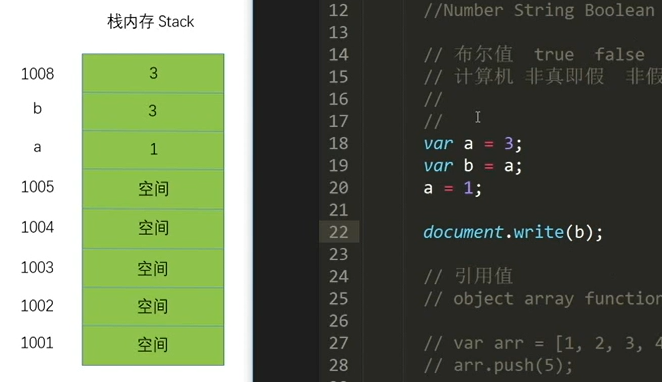
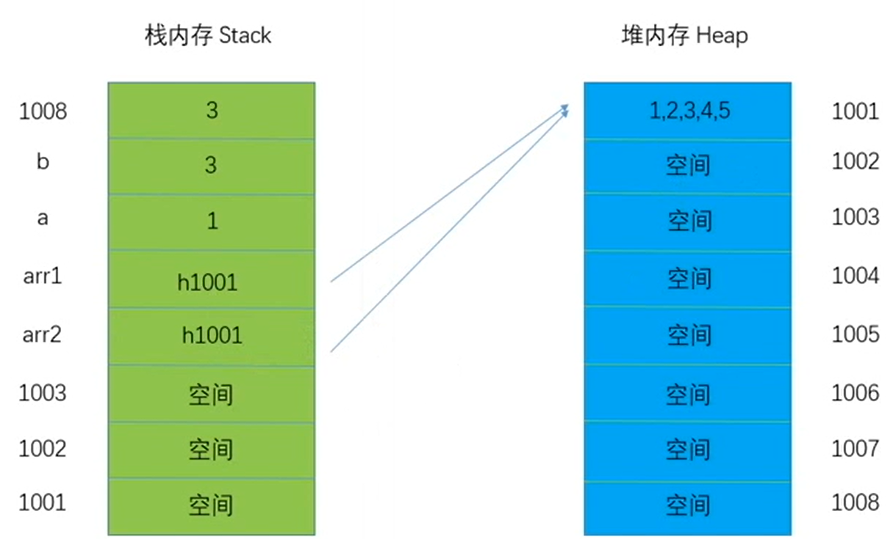
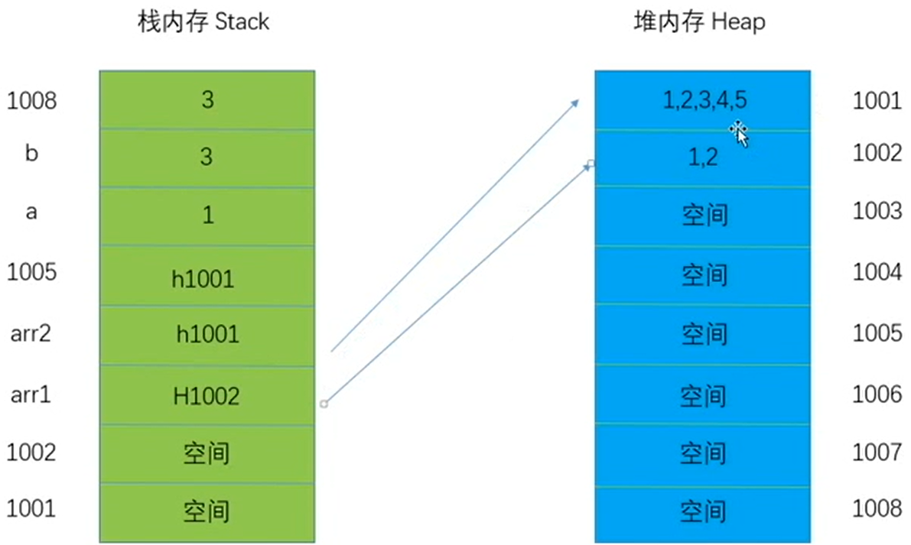

# 回顾历史

## 五大主流浏览器

|       **浏览器**       |                    **内核**                     |
| :--------------------: | :---------------------------------------------: |
|   Internet Explorer    |                     Trident                     |
|         Chrome         |                  Webkit Blink                   |
|         Safari         |                     Webkit                      |
|        Firefox         |                      Gecko                      |
|         Opera          | 最早是 Presto、后来是 Webkit、现在是 Blink 内核 |
| 360 浏览器、猎豹浏览器 |                IE+Chrome 双内核                 |
| 搜狗、遨游、QQ 浏览器  |     Trident（兼容模式）+Webkit（高速模式）      |

苹果自带浏览器是`Safari`，带你去旅行。`Windows`自带浏览器是`Explorer`，带你去探索。谷歌自带浏览器叫`Chrome`，化学元素铬，寓意多彩稳定。

## 浏览器的历史、JS 诞生的过程

**1990 年**，蒂姆·伯纳斯-李开发了一款真正意义上的浏览器`World Wide Web`，并将其移植到`C`语言上，改名为`libwww`或`Nexus`，主要用于浏览他人编写的网站。

**1993 年**，美国伊利诺伊大学`NCSA`的核心成员马克·安德森开发了`Mosaic`浏览器，这款浏览器的亮点是能够显示图片，是真正意义上的图形化浏览器。

**1994 年**，马克·安德森和吉姆·克拉克在硅图`SGI`公司成立了`Mosaic Communications Corporation`。由于`Mosaic`名称被伊利诺伊大学转让给`Spyglass`公司，马克·安德森将浏览器名称改为`Netscape Communications Corporation`。`Netscape Navigator`成为全球用户接受的浏览器，运营一直持续到 2003 年。

**1996 年**，微软收购了`Spyglass`，随后开发出了`Internet Explorer 1.0`。拥有自己的内核是非常困难且成本高昂的，微软选择购买别人的内核。微软发布了`IE 3`和`JScript`脚本语言，这种语言与现在的`JavaScript`功能相似，旨在实现网页的动态交互。

同年，网景公司的开发人员布兰登·艾奇基在`Netscape Navigator`的基础上开发出了`LiveScript`，即`JavaScript`的前身。然而，由于当时渲染和`JS`解析在同一个引擎中，性能低下且容易崩溃。

**1996 年**，`Java`开始获得知名度，网景公司与`Sun`公司商讨合作推广，`LiveScript`因此更名为`JavaScript`。

**2001 年**，`IE6 XP`发布，带来了`JS`引擎的诞生，内核分为`JS引擎`和`渲染引擎`，各个厂商开始重视浏览器渲染引擎的开发。

**2003 年**，`Mozilla`公司基于`Netscape Navigator`开源代码开发了`Firefox`，显示了开源对浏览器发展的重要影响。

**2008 年**，谷歌基于`Webkit Blink`开发了`V8`引擎，显著提升了`JavaScript`的执行性能，使得`Node.js`等独立于浏览器运行的应用成为可能，推动了渐进式`Web App`的发展。

**2009 年**，甲骨文收购了`Sun`公司，`JavaScript`的所有权归属甲骨文。

# ECMA

`European Computer Manufacturers Association`（欧洲计算机制造联合会）是一个评估、开发和认可电信及计算机标准的组织。

## ECMA-262

`ECMA-262`是一份标准，定义了`ECMAScript`。`ECMAScript`是脚本语言的规范，`ES5`和`ES6`等版本均基于此标准。

## 编程语言

计算机只能理解`0`和`1`，高级语言需要通过编译将源码转换为机器码。

### 编译型语言

编译型语言通过编译器将源码编译成可执行文件，适用于特定平台。编译后的程序执行速度较快，适合开发大型程序和复杂逻辑。然而，编译型语言的程序难以跨平台移植。

### 解释型语言

解释型语言通过解释器逐行解释执行源码，每次运行都需要重新解释。解释型语言无需针对不同系统平台进行移植，具有良好的跨平台特性，但执行速度较慢。`Python`是一门典型的解释型编程语言。

## 脚本语言

脚本语言通过脚本引擎进行解释执行，主要分为前端和后端两种。

前端脚本语言`JavaScript`运行在客户端，后端脚本语言`PHP`运行在服务器端。

# JavaScript

`JavaScript`具有单线程特性，同一时间只能执行一个任务。然而，`JS`引擎通过轮转时间片模拟多线程，使得能够同时处理多个程序。具体过程如下：

任务 1 和任务 2 被切分成多个任务片段，随机排列这些片段组成队列，然后按照队列顺序依次送入`JS`进程。`JS`线程逐一执行这些任务片段，从而实现并发执行的效果。

`ECMAScript`涵盖语法、变量、关键字、保留字、值、原始类型、引用类型运算、对象、继承和函数等内容。`DOM`（Document Object Model）由 W3C 制定，而`BOM`（Browser Object Model）则没有统一规范。

## 变量

变量是用于存储数据的容器，方便后续使用。

```javascript
// 变量声明
let variableA;
// 变量赋值
variableA = 3;
// 变量声明并赋值
let variableB = 3;
```

声明变量相当于拥有一个房子，赋值则是实际居住其中。

## 企业开发命名规范

变量命名需遵循以下规范：

- 不能以数字开头，可以用字母、下划线或`$`开头。
- 变量名中可以包含字母、数字、下划线和`$`。
- 不能使用关键字和保留字，如`if`。
- 命名应尽可能语义化和结构化。
- 企业中`JavaScript`调用通常采用`JHeader`、`jsHeader`、`J-header`等命名方式。
- 推荐使用小驼峰命名法，如`myEnglish`。

## 优先级

| 运算符                                                      | 描述                                       |
| ----------------------------------------------------------- | ------------------------------------------ |
| `()` `[]` `.`                                               | 分组、数组下标、成员访问                   |
| `new`（带参数列表）                                         | 创建新对象                                 |
| `++` `--` `!` `~` `+` `-` `typeof` `void` `delete`          | 一元运算符、类型检测、删除操作             |
| `**`                                                        | 指数运算                                   |
| `*` `/` `%`                                                 | 乘法、除法、取余                           |
| `+` `-`                                                     | 加法、减法、字符串连接                     |
| `<<` `>>` `>>>`                                             | 位移运算                                   |
| `<` `<=` `>` `>=` `instanceof` `in`                         | 比较运算、实例检查、属性检查               |
| `==` `!=` `===` `!==`                                       | 相等运算、严格相等、不等运算、严格不等运算 |
| `&`                                                         | 按位与                                     |
| `^`                                                         | 按位异或                                   |
| `                                                           | `                                          |
| `&&`                                                        | 逻辑与                                     |
| `                                                           |                                            |
| `?:`                                                        | 条件（三元）运算                           |
| `=` `+=` `-=` `*=` `/=` `%=` `<<=` `>>=` `>>>=` `&=` `^=` ` | =` `\*\*=`                                 |
| `,`                                                         | 逗号运算符                                 |

## 基本数据类型

`JavaScript`中有五种原始数据类型：`number`、`string`、`boolean`、`undefined`和`null`。`JavaScript`将整型和浮点型统一为数字类型，单引号和双引号内的内容均为字符串类型。`JavaScript`根据值推断数据类型，例如`123`为`number`，`"abc"`为`string`，因此常被称为**弱类型语言**。

动态语言属于脚本语言、解释型语言和弱类型语言。相对地，静态语言属于编译型语言和强类型语言。

非弱类型语言在编程时根据声明的数据类型来定义变量类型。

| undefined |            null            |
| :-------: | :------------------------: |
| 未被定义  | 空值，用于初始化组件或函数 |

## 引用值

`JavaScript`中的引用值包括`Object`、`Array`、`Function`、`Date`和`RegExp`等。

以`Array`为例：

```javascript
let numberArray = [1, 2, 3, 4];
numberArray.push(5);
document.write(numberArray);
```

### 栈空间（先进后出）



当重新给`variableA`赋值时，`variableA`会重新开辟一块空间存放新值，原始值保持不变，对应的名称恢复。

### 堆空间（存储引用类型的内容）

```javascript
let primaryArray = [1, 2, 3, 4];
let secondaryArray = primaryArray;
secondaryArray.push(5);
document.write(secondaryArray);
```

引用值的指针存在栈内存中。



当重新给`primaryArray`赋值时，



# 栈和指针


# 链接

请参考相关资料了解更多信息：[MDN Web 文档](https://developer.mozilla.org/zh-CN/docs/Web/JavaScript)

掌握前端历史和计算机的基础知识，是学好前端的先决条件，要尊重历史，常怀感恩之心，才能走得更远。
