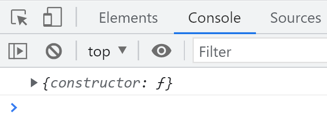
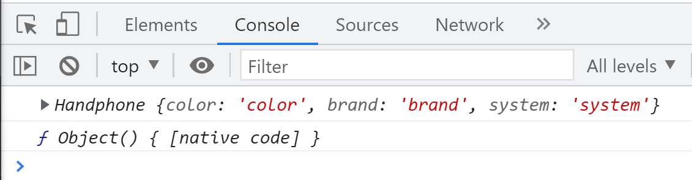
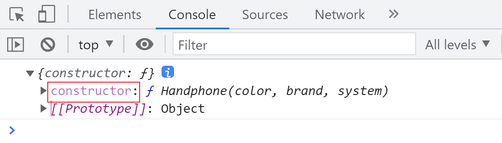
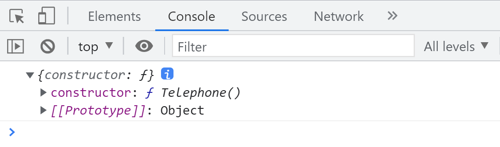
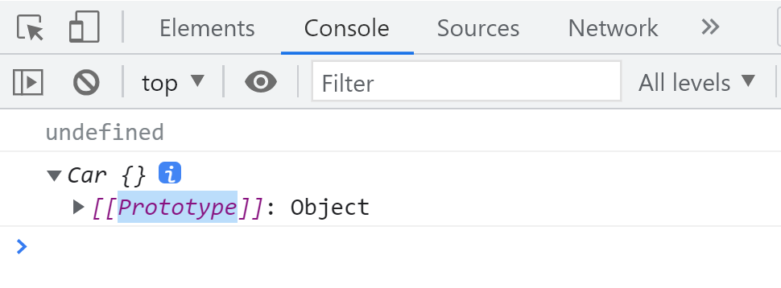

# 原型与作用域深入解析

## 原型

原型 `prototype` 是 `function` 对象的一个属性，同时 `prototype` 本身也是一个对象。

```javascript
function Handphone() {
  // prototype
}
console.log(Handphone.prototype);
```



`prototype` 定义了构造函数创建的每个对象的**公共祖先**。

以下示例中，`hp1.rom` 和 `hp2.ram` 都可以访问到原型上的属性。所有通过该构造函数创建的对象，都可以**继承**原型上的属性和方法。

```javascript
function Handphone(color, brand) {
  this.color = color;
  this.brand = brand;
  this.screen = '4:3';
  this.system = 'Android';
}
Handphone.prototype.rom = '64G';
Handphone.prototype.ram = '6G';

var hp1 = new Handphone('red', 'Xiaomi');
var hp2 = new Handphone('black', 'Huawei');

console.log(hp1.rom);
console.log(hp2.ram);
```

## 原型上的属性和对象上的属性

访问对象上的属性时，如果不存在，会继续查找原型上的属性。

```javascript
function Handphone(color, brand) {
  this.color = color;
  this.brand = brand;
  this.screen = '4:3';
  this.system = 'Android';
}
Handphone.prototype.rom = '64G';
Handphone.prototype.ram = '6G';
Handphone.prototype.screen = '16:9';

var hp1 = new Handphone('red', 'Xiaomi');
var hp2 = new Handphone('black', 'Huawei');

console.log(hp1.screen);
console.log(hp2.rom);
```

## 处理冗余和耦合

在上述示例中，每次 `new` 时，`Handphone` 函数内部都会重复赋值 `screen`、`ram` 和 `rom`，这导致代码冗余和耦合。

为减少冗余，可以将 `screen` 和 `system` 挂载到原型上。

需要传参的属性写在构造函数内部，固定不变的属性写在原型上，通过继承 `prototype` 来共享。

通常，JavaScript 中的方法挂载到原型上，因为方法不常变更。属性则需要根据需要在构造函数中传递。

```javascript
function Handphone(color, brand) {
  this.color = color;
  this.brand = brand;
}

Handphone.prototype.rom = '64G';
Handphone.prototype.ram = '6G';
Handphone.prototype.screen = '4:3';
Handphone.prototype.system = 'Android';

var hp1 = new Handphone('red', 'Xiaomi');
var hp2 = new Handphone('black', 'Huawei');

console.log(hp1.screen);
console.log(hp2.screen);
```

```javascript
function Handphone(color, brand) {
  this.color = color;
  this.brand = brand;
}

Handphone.prototype.rom = '64G';
Handphone.prototype.ram = '6G';
Handphone.prototype.screen = '4:3';
Handphone.prototype.system = 'Android';
Handphone.prototype.call = function () {
  console.log('I am calling someone');
};

var hp1 = new Handphone('red', 'Xiaomi');
var hp2 = new Handphone('black', 'Huawei');

hp1.call();
hp2.call();
```

## 开发时建议的写法

建议将原型定义为一个对象，以便更清晰地管理属性和方法。

```javascript
function Handphone(color, brand) {
  this.color = color;
  this.brand = brand;
}

Handphone.prototype = {
  rom: '64G',
  ram: '6G',
  screen: '4:3',
  system: 'Android',
  call: function () {
    console.log('I am calling someone');
  },
};

var hp1 = new Handphone('red', 'Xiaomi');
var hp2 = new Handphone('black', 'Huawei');

hp1.call();
hp2.call();
```

## 对原型的增删改

通过实例化的对象，无法直接对原型进行增删改。

```javascript
function Test() {}

Test.prototype.name = 'prototype';
var test = new Test();

console.log(Test.prototype);
test.num = 1;
delete test.name;
test.name = 'proto';
console.log(Test.prototype, test);
```

```javascript
function Handphone(color, brand, system) {
  this.color = color;
  this.brand = brand;
  this.system = system;
}

Handphone.prototype = {
  rom: '64G',
  ram: '6G',
  screen: '4:3',
  call: function () {
    console.log('I am calling someone');
  },
};

var hp1 = new Handphone('black', 'iPhone', 'iOS');
console.log(hp1);
console.log(hp1.constructor);
```



## Constructor

构造器 `constructor` 指向构造函数本身。也就是说，构造函数通过 `constructor` 创建对象。

```javascript
function Handphone(color, brand, system) {
  this.color = color;
  this.brand = brand;
  this.system = system;
}

var hp1 = new Handphone('black', 'iPhone', 'iOS');

console.log(Handphone.prototype);
```



修改指定的构造函数

```javascript
function Telephone() {}

function Handphone(color, brand, system) {
  this.color = color;
  this.brand = brand;
  this.system = system;
}

Handphone.prototype = {
  constructor: Telephone,
};

var hp1 = new Handphone('black', 'iPhone', 'iOS');

console.log(Handphone.prototype);
```



## Prototype

实例化后，每个对象都有一个原型 `Prototype`，它属于实例对象，而非构造函数本身。

```javascript
function Car() {}
Car.prototype.name = 'Benz';
var car = new Car();
console.log(car);
```



---

当 `this` 没有 `name` 属性时，会继续查找实例对象的原型 `__proto__`，如果原型中存在 `name`，则打印该值。

```javascript
function Car() {}
Car.prototype.name = 'Benz';
var car = new Car();
console.log(car.name);
```

## `__proto__` 可以被改动

`__proto__` 是每个实例对象的原型的引用容器，用于指向 `prototype`。虽然可以修改 `__proto__`，但不建议轻易改动。

```javascript
function Person() {}
Person.prototype.name = '张三';

var p1 = {
  name: '李四',
};

var person = new Person();

console.log(person.name);
person.__proto__ = p1;
console.log(person.name);
```

## 对属性的重写

在 JavaScript 中，建议使用单引号以避免与后端产生冲突，有时需要转义。

```javascript
function Car() {}
Car.prototype.name = 'Mazda';
var car = new Car();

Car.prototype.name = 'Benz';
console.log(car.name);
```

## 实例化前后

### 实例化后重写 `prototype`

```javascript
Car.prototype.name = 'Benz';

function Car() {}

var car = new Car();

Car.prototype = {
  name: 'Mazda',
};

console.log(car.name);
```

### 实例化前重写 `prototype`

```javascript
Car.prototype.name = 'Benz';

function Car() {}

Car.prototype = {
  name: 'Mazda',
};

var car = new Car();

console.log(car.name);
```

# Window 和 Return

`window.a` 相当于将 `a` 置于全局作用域。

```javascript
function abc() {
  window.a = 3;
}
abc();

console.log(a);
```

## window 和 return 都可以形成闭包

```javascript
// 使用 return
function test1() {
  var a = 1;

  function plus1() {
    a++;
    console.log(a);
  }
  return plus1;
}

var plus = test1();
plus();
plus();
plus();

// 使用 window
function test2() {
  var a = 1;

  function add() {
    a++;
    console.log(a);
  }
  window.add = add;
}
test2();

add();
add();
add();
```

## window 和 return 的区别

`window.变量` 将函数放到了全局作用域，而 `return 函数` 则将函数赋值给了一个变量，如果未被接收，函数会被自动回收。

```javascript
// 使用 return 的立即执行函数
var add = (function () {
  var a = 1;

  function add() {
    a++;
    console.log(a);
  }
  return add;
})();

add();
add();
add();

// 使用 window 的立即执行函数
(function () {
  var a = 1;

  function add() {
    a++;
    console.log(a);
  }
  window.add = add;
})();

add();
add();
add();
```

# JS 插件的写法

通过立即执行函数隔离作用域，防止变量污染。

```javascript
(function () {
  function Test() {}
  window.Test = Test;
})();

var test = new Test();
```

在前面添加引号是约定俗成，防止忘记添加 `;`，确保立即执行函数正常执行，并能快速识别立即执行函数。

```javascript
(function () {
  var Component = function () {};
})();
```

# 练习

> 构造函数接收数字类型的参数，完成数字相加和相乘的功能

```javascript
function Compute() {
  var result = 0;
  this.plus = function () {
    result = 0;
    result = loop(arguments, 'add', result);
  };
  this.times = function () {
    result = 1;
    result = loop(arguments, 'mul', result);
  };

  function loop(args, method, res) {
    for (var i = 0; i < args.length; i++) {
      var item = args[i];
      if (method === 'add') {
        res += item;
      } else if (method === 'mul') {
        res *= item;
      }
    }

    console.log(res);
    return res;
  }
}

var compute = new Compute();
compute.plus(1, 2, 3); // 输出 6
compute.times(1, 2, 4); // 输出 8
```

#
