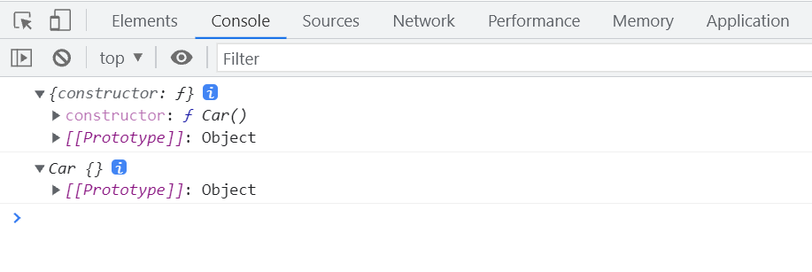
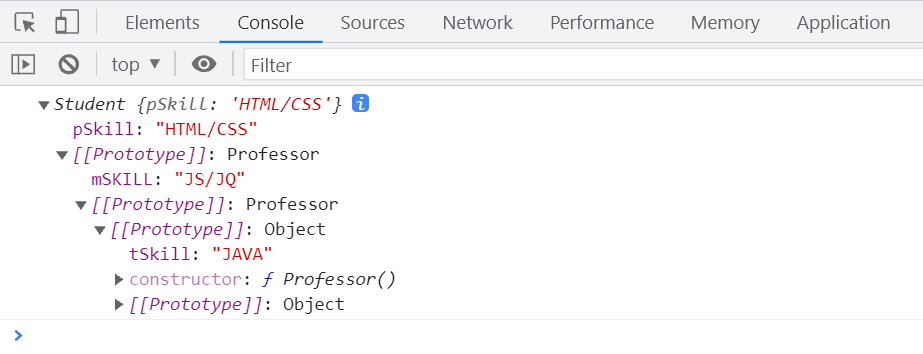
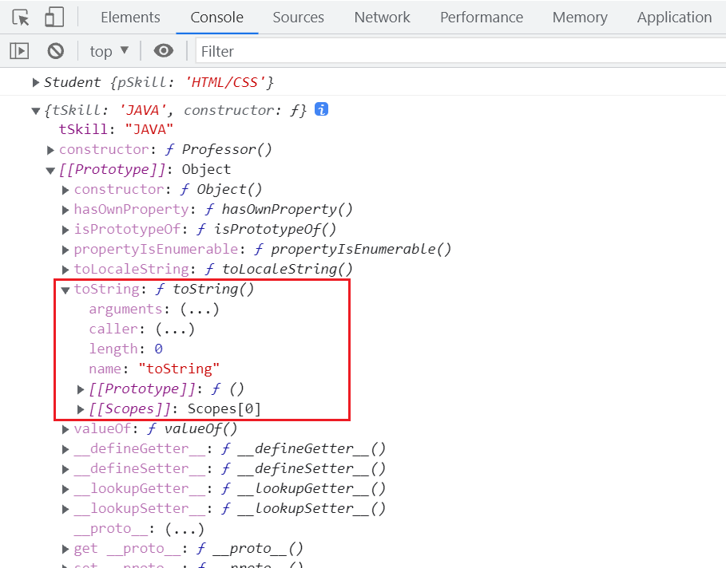
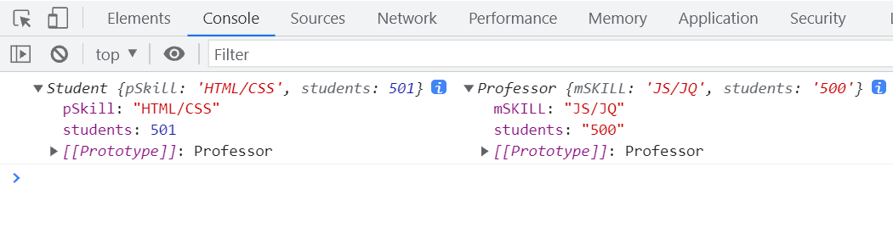
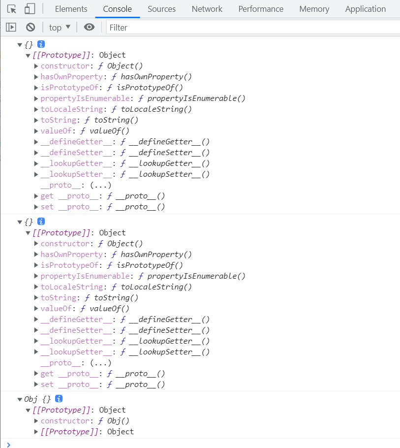
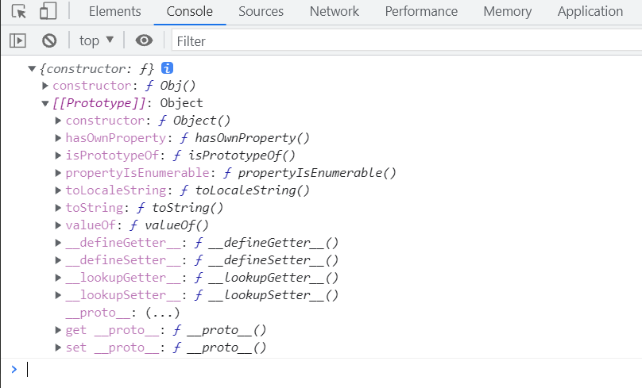
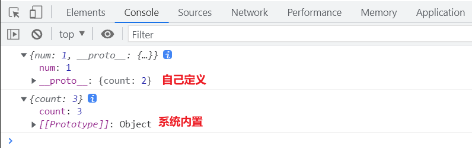
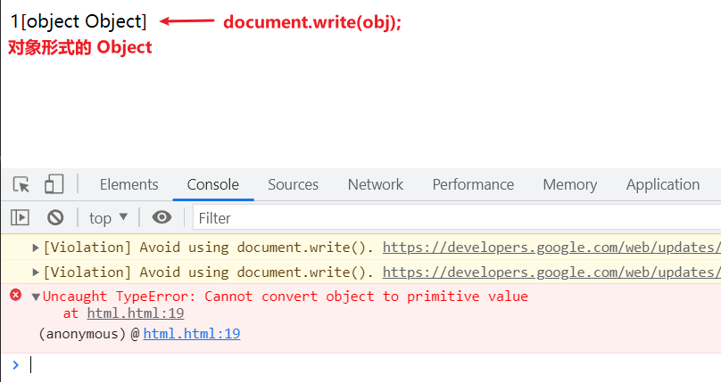
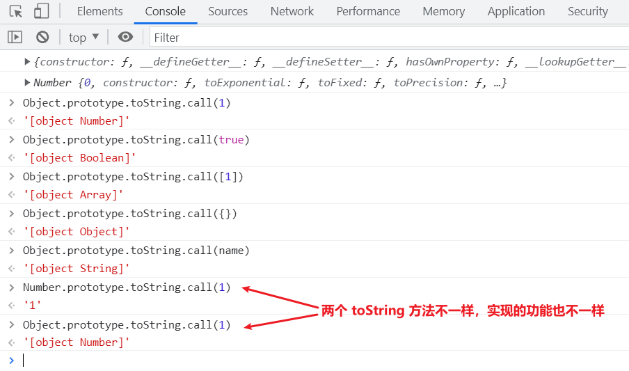

# 原型与继承

`__proto__`指向对象本身，是系统内置的。  
原型的原型，每一个对象的原型它本身还有原型。  
所有的对象都有原型，包括原型本身，原型本身就是对象。

```javascript
function Car() {}
var carInstance = new Car();
console.log(Car.prototype);
console.log(carInstance);
```



## 原型链

沿着`__proto__`查找对象的属性，一层一层继承原型的属性，这条链条称为原型链。

```javascript
Professor.prototype.teachingSkill = 'JAVA';

function Professor() {}
var professorInstance = new Professor();

Teacher.prototype = professorInstance;

function Teacher() {
  this.mainSkill = 'JavaScript/jQuery';
}
var teacherInstance = new Teacher();

Student.prototype = teacherInstance;

function Student() {
  this.primarySkill = 'HTML/CSS';
}
var studentInstance = new Student();
console.log(studentInstance);
```



## 原型链的顶端

原型链的终点是`Object.prototype`，`Object`是最大的构造函数。  
原型链上的增删改只能修改自身。

```javascript
Professor.prototype.teachingSkill = 'JAVA';

function Professor() {}
var professorInstance = new Professor();

Teacher.prototype = professorInstance;

function Teacher() {
  this.mainSkill = 'JavaScript/jQuery';
}
var teacherInstance = new Teacher();

Student.prototype = teacherInstance;

function Student() {
  this.primarySkill = 'HTML/CSS';
}
var studentInstance = new Student();
console.log(studentInstance);

console.log(Professor.prototype);
```



## 引用值与原始值，学生可以修改老师的属性

```javascript
Professor.prototype.teachingSkill = 'JAVA';

function Professor() {}
var professorInstance = new Professor();

Teacher.prototype = professorInstance;

function Teacher() {
  this.mainSkill = 'JavaScript/jQuery';
  this.successStories = {
    alibaba: '28',
    tencent: '30',
  };
}
var teacherInstance = new Teacher();

Student.prototype = teacherInstance;

function Student() {
  this.primarySkill = 'HTML/CSS';
}
var studentInstance = new Student();
studentInstance.successStories.baidu = '100';

console.log(teacherInstance.successStories);
```

# 给没有某个属性的对象赋值

```javascript
Professor.prototype.teachingSkill = 'JAVA';

function Professor() {}
var professorInstance = new Professor();

Teacher.prototype = professorInstance;

function Teacher() {
  this.mainSkill = 'JavaScript/jQuery';
  this.studentCount = '500';
}
var teacherInstance = new Teacher();

Student.prototype = teacherInstance;

function Student() {
  this.primarySkill = 'HTML/CSS';
}

var studentInstance = new Student();
studentInstance.studentCount++;

console.log(studentInstance, teacherInstance);
```



## 上述情况的原理

```javascript
var obj = {
  name: 'obj',
};
obj.age = 13;
console.log(obj);
// 自动增加age属性
```

# this 指向

**谁在使用**`this`**，**`this`**就指向谁。**

```javascript
function Car() {
  this.brand = 'Benz';
}

Car.prototype = {
  brand: 'Mazda',
  introduce: function () {
    console.log('我是' + this.brand + '车');
  },
};
var carInstance = new Car();

// carInstance.introduce，对象carInstance在使用this。this指向new出来的carInstance。
carInstance.introduce(); // Benz
// Car.prototype本身也是一个对象，this指向对象本身。
Car.prototype.introduce(); // Mazda
```

# 构造函数和普通函数的返回值

普通函数如果没有返回值，默认返回`undefined`。  
构造函数实例化后，返回`this`，以便访问其中的属性和方法。

```javascript
function Person() {
  this.smoke = function () {
    this.weight--;
    // 普通函数如果不写返回值，默认返回undefined
    // return undefined;
  };
}
Person.prototype = {
  weight: 130,
};
var personInstance = new Person();

console.log(personInstance.smoke());
```

# 创建对象的方法

以下两种方式没有区别，前两者的`constructor`指向`Object`。

```javascript
var obj1 = {};
console.log(obj1);

var obj2 = new Object();
console.log(obj2);
```

自定义的构造函数`new`的实例，其`constructor`指向自定义的构造函数。

```javascript
function CustomObj() {}
var obj3 = new CustomObj();
console.log(obj3);
```



# 原型的原型

原型的构造器一定指向系统自带的`Object`。  
原型的原型是由系统自带的`Object`构造出来的。

```javascript
function CustomObj() {}
var objInstance = new CustomObj();
console.log(objInstance.__proto__);
```



# Object.create()

创建对象使用该方法。

```javascript
// 格式 Object.create(原型对象, 属性描述符);
CustomObj.prototype.number = 1;

// obj1 和 obj2 两者是一样的
var obj1 = Object.create(Object.prototype);
// 使用自定义原型创建对象
var obj2 = new CustomObj();

console.log(obj1);
console.log(obj2);
```

将另一个对象作为原型使用`Object.create`。

```javascript
// 创建obj1空对象
var obj1 = Object.create(null);
// 原型上什么都没有
console.log(obj1);

// 添加属性
obj1.number = 1;
// obj1 作为 obj2的原型
var obj2 = Object.create(obj1);
console.log(obj2);
console.log(obj2.number);
```

# Object.create 的继承

并非所有对象都继承自`Object.prototype`。  
`Object.create(null)`不继承系统内置的`Object.prototype`。

```javascript
var obj = Object.create(null);
console.log(obj);
obj.toString();
```

## 系统的`__proto__`和自定义的`__proto__`

```javascript
var obj = Object.create(null);

obj.number = 1;
var parentObj = {
  count: 2,
};
// 自定义__proto__
obj.__proto__ = parentObj;
console.log(obj);
// 无法访问到 count 因为__proto__必须是系统内置的。
// 可以更改系统内置的__proto__，但是不建议自定义。
console.log(obj.count);

var obj2 = {
  count: 3,
};
console.log(obj2);
```



# 包装类和原型

`undefined`和`null`不能通过**包装类**转换为对象。  
`undefined`和`null`没有原型，无法继承`Object`，因此无法使用`Object`的`toString()`方法。  
包装类的函数相当于`Object.create(Object.prototype)`。

```javascript
// undefined 和 null 不能使用系统内置的 toString 方法
// console.log(undefined.toString());
// console.log(null.toString());

var number = 1;
// new Number(1) 创建一个Number对象，可以调用toString()
console.log(number.toString());

// 创建一个Number对象实例
var numberObj = new Number(number);
console.log(numberObj);
```

# Object.toString()

`obj2`想要打印需要先转换成字符串，这需要使用`toString()`方法。然而，`obj2`没有原型，无法继承`Object.prototype`，因此无法使用`toString()`方法，会报错。

```javascript
var number = 1;
var obj = {};
var obj2 = Object.create(null);

// document.write 在打印时会隐式转换为字符串
document.write(number);
document.write(obj);
// Uncaught TypeError: Cannot convert object to primitive value at
// 不能将对象转换为原始值
// document.write(obj2);

// 自定义 toString 方法
obj2.toString = function () {
  return 'hello';
};
document.write(obj2);
```



## 原型方法的重写

`Number.prototype`和`Object.prototype`都有`toString`方法。如果`Number.prototype`没有自己的`toString`方法，会继承自`Object.prototype.toString`，这可能无法实现预期的功能。因此，数据对象的原型`Number.prototype`重写了`toString`方法。



# call 和 apply

`call`和`apply`都用于更改`this`的指向，借用构造函数中的属性和方法来构建自己的属性和方法。

```javascript
function Car(brand, color) {
  this.brand = brand;
  this.color = color;
}

var car1 = {};
var car2 = {};

Car.call(car1, 'Benz1', 'red1');
console.log(car1);

Car.apply(car2, ['Benz2', 'red2']);
console.log(car2);
```

## 隐式的 call

系统在执行时会隐式地使用`call`来执行函数。

```javascript
function showNumber() {
  console.log(1);
}
showNumber.call();
```

## 改变 this 的用处

1. 补充方法，借用其他构造函数的方法和属性。
2. 团队协作开发时，分组开发功能后进行协同调用。
3. 将不同类型的功能分开编写后进行汇总。

```javascript
function Compute() {
  this.add = function (a, b) {
    console.log(a + b);
  };
  this.subtract = function (a, b) {
    console.log(a - b);
  };
}

function FullCompute() {
  Compute.apply(this);
  this.multiply = function (a, b) {
    console.log(a * b);
  };
  this.divide = function (a, b) {
    console.log(a / b);
  };
}

var computeInstance = new FullCompute();
computeInstance.add(1, 2);
computeInstance.subtract(1, 2);
computeInstance.multiply(1, 2);
computeInstance.divide(1, 2);
```

## 图解 bind、call、apply

| 方法  | 是否直接执行函数 | 传入的参数                     | 调用方式                                                                    |
| ----- | ---------------- | ------------------------------ | --------------------------------------------------------------------------- |
| call  | 是               | `(context, arg1, arg2, ...)`   | `function.call(context, arg1, arg2, ...)`                                   |
| apply | 是               | `(context, [arg1, arg2, ...])` | `function.apply(context, [arg1, arg2, ...])`                                |
| bind  | 否               | `(context, arg1, arg2, ...)`   | `var newFunction = function.bind(context);` `newFunction(arg1, arg2, ...);` |

# 练习

## 计算任意字符串的字节长度

```javascript
function getByteLength(str) {
  var byteLength = 0;

  for (var i = 0; i < str.length; i++) {
    var charCode = str.charCodeAt(i);
    if (charCode <= 255) {
      byteLength++;
    } else {
      byteLength += 2;
    }
  }
  return byteLength;
}
console.log(getByteLength('你好，世界! HelloWorld!'));
```

#
