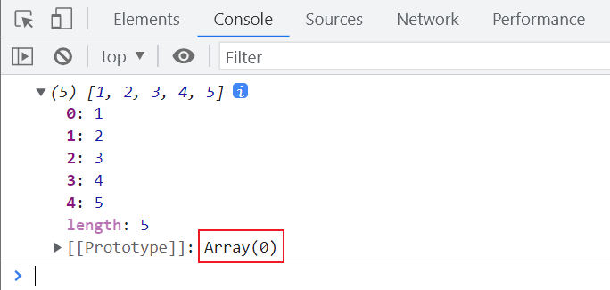
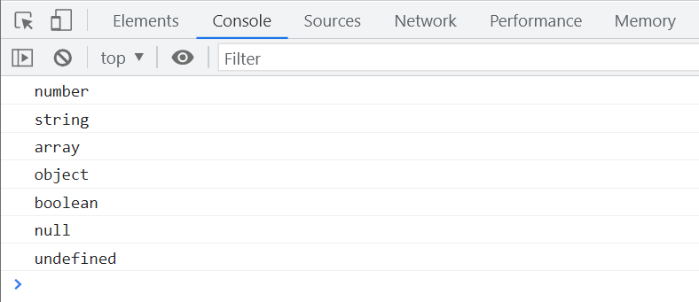

# JavaScript 实用技巧

# 类数组转换为数组

在 JavaScript 中，类数组对象如 `arguments` 并不具备数组的方法。以下函数展示了如何将类数组对象转换为真正的数组。

```javascript
function convertArgumentsToArray() {
  const argsArray = Array.prototype.slice.call(arguments);
  console.log(argsArray);
}
convertArgumentsToArray(1, 2, 3, 4, 5);
```



## 按元素字节数排序数组

有时需要根据字符串中字符的字节数对数组进行排序。Unicode 字符集中的字符有不同的字节长度，0-255 的字符为单字节，256 及以上为双字节。

```javascript
const array = ['EDG牛逼', 'OK', 'NB', '必胜', '777777'];

array.sort((a, b) => getByteLength(a) - getByteLength(b));

function getByteLength(str) {
  let bytes = str.length;
  for (let i = 0; i < str.length; i++) {
    if (str.charCodeAt(i) > 255) {
      // 中文字符或特殊字符占用两个字节
      bytes++;
    }
  }
  return bytes;
}

console.log(array);
```

## 封装 `typeof` 方法

JavaScript 的 `typeof` 操作符在判断复杂数据类型时有其局限性。以下函数通过 `Object.prototype.toString` 方法更准确地判断数据类型。

```javascript
function getType(value) {
  const typeMap = {
    '[object Array]': 'array',
    '[object Object]': 'object',
    '[object Number]': 'number',
    '[object String]': 'string',
    '[object Boolean]': 'boolean',
    '[object Function]': 'function',
    '[object Date]': 'date',
    '[object RegExp]': 'regexp',
    '[object Error]': 'error',
    '[object Null]': 'null',
    '[object Undefined]': 'undefined',
  };

  if (value === null) {
    return 'null';
  }

  const type = typeof value;
  if (type !== 'object') {
    return type;
  }

  const toString = Object.prototype.toString.call(value);
  return typeMap[toString] || 'object';
}

console.log(getType(1)); // number
console.log(getType('1')); // string
console.log(getType([])); // array
console.log(getType({})); // object
console.log(getType(new Boolean(true))); // boolean
console.log(getType(null)); // null
console.log(getType(undefined)); // undefined
```

`Object.prototype.toString.call(value);` 可以用于判断引用类型的具体类型。



## 数组去重

利用对象属性的不重复性（相同的属性名只保留一个）来实现数组去重。

```javascript
const array = [0, 1, 1, 1, 1, 2, 2, 2, 2, 3, 3, 3, 4, 4, 'a', 'a', 'a', 'a'];

Array.prototype.unique = function () {
  const seen = {};
  const result = [];

  for (let i = 0; i < this.length; i++) {
    if (!seen.hasOwnProperty(this[i])) {
      seen[this[i]] = true;
      result.push(this[i]);
    }
  }
  return result;
};

console.log(array.unique());
```

## 字符串去重

通过对象属性的不重复性实现字符串中的字符去重。

```javascript
const str = '1231654561adasd';

String.prototype.unique = function () {
  const seen = {};
  let uniqueStr = '';

  for (let i = 0; i < this.length; i++) {
    const char = this[i];
    if (!seen.hasOwnProperty(char)) {
      seen[char] = true;
      uniqueStr += char;
    }
  }
  return uniqueStr;
};

console.log(str.unique());
```

## 找出第一个不重复的字母

以下函数用于找出字符串中第一个出现一次的字母。

```javascript
const str = 'sjahdspodiqnqwubgiuosdupoiqiwoepwqn';

function findFirstUniqueChar(str) {
  const charCount = {};

  for (let i = 0; i < str.length; i++) {
    const char = str[i];
    charCount[char] = (charCount[char] || 0) + 1;
  }

  for (let i = 0; i < str.length; i++) {
    if (charCount[str[i]] === 1) {
      return str[i];
    }
  }

  return null;
}

console.log(findFirstUniqueChar(str));
```

## 练习题

### 重写 `unshift`

通过 `splice` 方法重写数组的 `unshift` 方法，用于在数组开头添加元素。

```javascript
const array = ['d', 'e', 'f'];

Array.prototype.myUnshift = function () {
  let position = 0;
  for (let i = 0; i < arguments.length; i++) {
    this.splice(position, 0, arguments[i]);
    position++;
  }
  return this.length;
};

array.myUnshift('a', 'b', 'c');
console.log(array);
```

### 重写 `unshift`（方法二）

利用数组的 `concat` 方法实现 `unshift` 的功能。

```javascript
const array = ['d', 'e', 'f'];

Array.prototype.myUnshift = function () {
  const argsArray = Array.prototype.slice.call(arguments);
  const newArray = argsArray.concat(this);
  // 可选：修改原数组
  this.length = 0;
  for (let i = 0; i < newArray.length; i++) {
    this.push(newArray[i]);
  }
  return this.length;
};

array.myUnshift('a', 'b', 'c');
console.log(array);
```

### 闭包

展示闭包的使用，保持私有变量的状态。

```javascript
function Counter() {
  let count = 0;

  this.increment = function () {
    count++;
    console.log(count);
  };
}

const counter1 = new Counter();
counter1.increment(); // 1
counter1.increment(); // 2

const counter2 = new Counter();
counter2.increment(); // 1
```

等同于

```javascript
function Counter() {
  let count = 0;

  const counter = {
    increment: function () {
      count++;
      console.log(count);
    },
  };
  return counter;
}

const counter1 = Counter();
counter1.increment(); // 1
counter1.increment(); // 2

const counter2 = Counter();
counter2.increment(); // 1
```

### `typeof` 和 `arguments`

```javascript
function test() {
  console.log(typeof arguments);
  // arguments 是类数组对象，typeof 返回 'object'
}
test();
```

### 函数字面量

展示函数表达式和函数名的作用域。

```javascript
const test = function a() {
  return 'a';
};

// 函数表达式中的函数名在外部不可访问
console.log(typeof a); // undefined
console.log(a); // 报错 ReferenceError: a is not defined
```

### 优化 `switch` 语句

通过数组替代 `switch` 语句来简化代码。

```javascript
function printWeekday(day) {
  const weekdays = ['Mon', 'Tue', 'Wed', 'Thu', 'Fri', 'Sat', 'Sun'];
  const weekday = weekdays[day - 1];
  if (weekday) {
    console.log(weekday);
  } else {
    console.log("I don't know");
  }
}

printWeekday(3); // Wed
```

---
