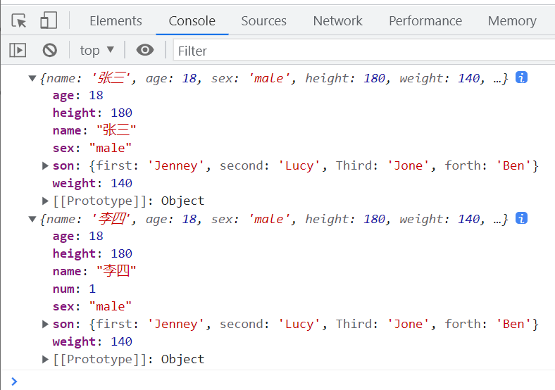
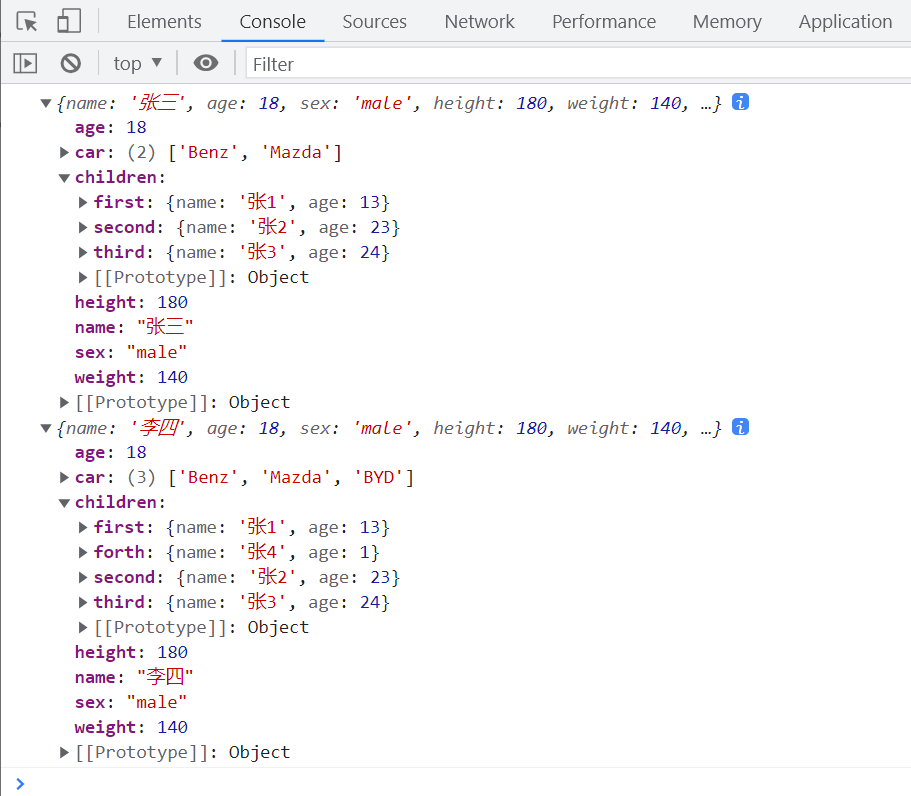
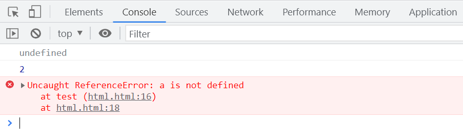
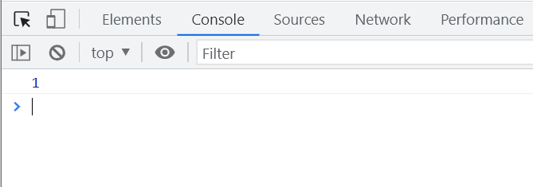
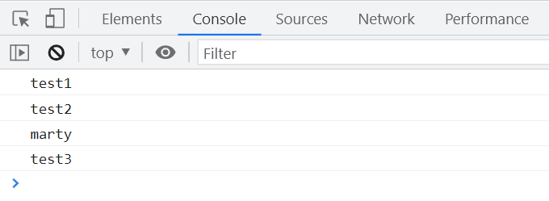
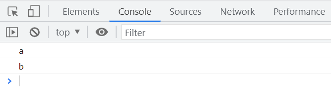

# 常见概念与实践

## 模块化开发方式

```html
<script>
  window.onload = function () {
    initialize();
  };

  function initialize() {
    console.log(computeFibonacci(10));
    console.log(getDivisibleNumbers(100));
  }

  const computeFibonacci = (function () {
    function fibonacci(n) {
      if (n <= 0) {
        return 0;
      }
      if (n <= 2) {
        return 1;
      }
      return fibonacci(n - 1) + fibonacci(n - 2);
    }
    return fibonacci;
  })();

  const getDivisibleNumbers = (function () {
    function filterDivisible(n) {
      const divisibleNumbers = [];
      for (let i = 0; i <= n; i++) {
        if (i % 3 === 0 || i % 5 === 0 || i % 7 === 0) {
          divisibleNumbers.push(i);
        }
      }
      return divisibleNumbers;
    }
    return filterDivisible;
  })();
</script>
```

## 插件开发方式

```javascript
(function () {
  function Plugin() {}

  Plugin.prototype = {
    // 添加插件方法和属性
    greet: function () {
      console.log('Hello from the plugin!');
    },
  };

  window.Plugin = Plugin;
})();
```

## 三元运算符`？:`

三元运算符在 JavaScript 中用于简化条件判断，以下是其优缺点及使用示例。

### 优点

- 语法简洁，易于书写
- 能根据条件返回不同的值

### 缺点

- 添加注释较为困难
- 可读性不如 `if` 语句

```javascript
let a = 0;
console.log(a > 0 ? '大于0' : '小于等于0');

// 推荐写法
a > 0 ? console.log('大于0') : console.log('小于等于0');
```

接收值的示例：

```javascript
let a = 0;
const result = a > 0 ? '大于0' : '小于等于0';
console.log(result);
```

## if...else 写法

```javascript
let age = prompt('请输入年龄:', 18);

let message = age < 3 ? 'Hi, baby!' : age < 18 ? 'Hello!' : age < 100 ? 'Greetings!' : 'What an unusual age!';

alert(message);
```

## 字符和数字的比较

```javascript
// 基于 ASCII 码的比较，'89' > '9' 为 false
console.log('89' > '9');

// 两个都是字符串，'99' > '9' 为 true
console.log('99' > '9');

// 字符串和数字比较，'77' 被转换为数字，77 < 99 为 false
console.log('77' > 99);

// 数字和字符串比较，'9' 被转换为数字，77 > 9 为 true
console.log(77 > '9');
```

## 深拷贝与浅拷贝

### 浅拷贝

浅拷贝只复制对象的第一层属性，引用类型的属性仍然指向原始对象。

```javascript
const personA = {
  name: '张三',
  age: 18,
  sex: 'male',
  height: 180,
  weight: 140,
};

const personB = {};

// 复制属性
for (const key in personA) {
  personB[key] = personA[key];
}

// 修改 personB 的属性不会影响 personA
personB.name = '李四';
console.log(personA, personB);
```

浅拷贝的问题在于，只处理了第一层属性，嵌套的引用类型仍然共享。

```javascript
Object.prototype.num = 1;

const personA = {
  name: '张三',
  age: 18,
  sex: 'male',
  height: 180,
  weight: 140,
  son: {
    first: 'Jenney',
    second: 'Lucy',
    third: 'Jone',
  },
};

const personB = {};

// 使用 clone 函数进行浅拷贝，排除原型链上的属性
function clone(origin, target) {
  const tar = target || {};
  for (const key in origin) {
    if (origin.hasOwnProperty(key)) {
      tar[key] = origin[key];
    }
  }
  return tar;
}

clone(personA, personB);
personB.name = '李四';
personB.son.forth = 'Ben';
console.log(personA, personB);
```



### 深拷贝

深拷贝会递归复制对象的所有层级，确保新对象与原对象完全独立。

```javascript
Object.prototype.num = 1;

const personA = {
  name: '张三',
  age: 18,
  sex: 'male',
  height: 180,
  weight: 140,
  children: {
    first: {
      name: '张1',
      age: 13,
    },
    second: {
      name: '张2',
      age: 23,
    },
    third: {
      name: '张3',
      age: 24,
    },
  },
  car: ['Benz', 'Mazda'],
};

const personB = deepClone(personA);
personB.name = '李四';
personB.children.forth = {
  name: '张4',
  age: 1,
};
personB.car.push('BYD');
console.log(personA, personB);

function deepClone(origin, target = {}) {
  const toStr = Object.prototype.toString;
  const arrType = '[object Array]';

  for (const key in origin) {
    if (origin.hasOwnProperty(key)) {
      if (typeof origin[key] === 'object' && origin[key] !== null) {
        target[key] = toStr.call(origin[key]) === arrType ? [] : {};
        deepClone(origin[key], target[key]);
      } else {
        target[key] = origin[key];
      }
    }
  }
  return target;
}
```



### 使用 JSON 方法进行深拷贝

```javascript
Object.prototype.num = 1;

const personA = {
  name: '张三',
  age: 18,
  sex: 'male',
  height: 180,
  weight: 140,
  children: {
    first: {
      name: '张1',
      age: 13,
    },
    second: {
      name: '张2',
      age: 23,
    },
    third: {
      name: '张3',
      age: 24,
    },
  },
  car: ['Benz', 'Mazda'],
};

// 将对象转换为字符串
const str = JSON.stringify(personA);
// 将字符串解析为新对象，实现深拷贝
const personB = JSON.parse(str);

personB.name = '李四';
personB.children.forth = {
  name: '张4',
  age: 1,
};
personB.car.push('BYD');
console.log(personA, personB);
```

## 练习题

### 未定义

```javascript
function test() {
  console.log(foo);
  var foo = 2;
  console.log(foo);
  console.log(a);
}
test();
```



### 作用域链（AO）

```javascript
function a() {
  var test;
  test();

  function test() {
    console.log(1);
  }
}
a();

// 作用域链示意
// AO = {
//   test: function test() {
//     console.log(1);
//   }
// }
```



### this 关键字

```javascript
var globalName = '222';

const objA = {
  name: '111',
  say: function () {
    console.log(this.name);
  },
};

const sayFunction = objA.say;
sayFunction(); // 输出: 222
objA.say(); // 输出: 111

const objB = {
  name: '333',
  say: function (func) {
    func();
  },
};

objB.say(objA.say); // 输出: 222

objB.say = objA.say;
objB.say(); // 输出: 333
```

### call 和 apply 方法

```javascript
function test() {
  const marty = {
    name: 'marty',
    printName: function () {
      console.log(this.name);
    },
  };

  const test1 = {
    name: 'test1',
  };

  const test2 = {
    name: 'test2',
  };

  const test3 = {
    name: 'test3',
  };

  test3.printName = marty.printName;

  marty.printName.call(test1); // 输出: test1
  marty.printName.apply(test2); // 输出: test2
  marty.printName(); // 输出: marty
  test3.printName(); // 输出: test3
}

test();
```



### 闭包

```javascript
const bar = {
  a: '1',
};

function test() {
  bar.a = 'a';
  Object.prototype.b = 'b';
  return function inner() {
    console.log(bar.a);
    console.log(bar.b);
  };
}
test()();

// 作用域链示意图
// test 函数内部修改了全局对象 bar 的属性
```



```javascript
function Foo() {
  getName = function () {
    console.log(1);
  };
  return this;
}

Foo.getName = function () {
  console.log(2);
};

Foo.prototype.getName = function () {
  console.log(3);
};

let getName = function () {
  console.log(4);
};

function getName() {
  console.log(5);
}

Foo.getName(); // 输出: 2
getName(); // 输出: 4
Foo().getName(); // 输出: 1
new Foo.getName(); // 输出: 2
new Foo().getName(); // 输出: 3
new new Foo().getName(); // 输出: 3
```
