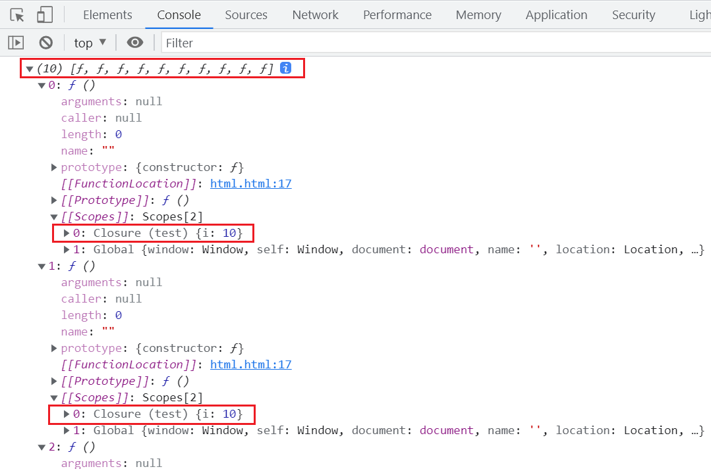

# 立即执行函数

立即执行函数在执行完成后会立即释放，常用于初始化变量，通常使用`IIFE`。

[IIFE（立即调用函数表达式） - 术语表 | MDN](https://developer.mozilla.org/zh-CN/docs/Glossary/IIFE)

## 基本写法

```javascript
(function () {})();

(function () {
  // W3C建议
})();
```

## 接收返回值

```javascript
const sum = (function (a, b) {
  return a + b;
})(2, 4);

console.log(sum);
```

括号内的任何内容都是表达式。无论是函数、变量还是方法，包裹后都成为表达式。

## 表达式才能被执行符号`()`

```javascript
// 无法执行
function test(){
  console.log(1);
}();

// 可以执行
const test = function () {
  console.log(1);
}();

// 使用+号将函数转换为表达式
+function test() {
  console.log(1);
}();

// 使用运算符执行
1 && function test() {
  console.log(1);
}();
```

## 立即执行函数被销毁

```javascript
const test1 = function () {
  console.log(1);
};
console.log(test1);

const test2 = (function () {
  console.log(1);
})();
console.log(test2);
```

## 函数名和表达式

函数被包裹在括号内时，函数成为表达式，表达式会自动忽略函数名。执行函数后，函数名没有实际意义。

```javascript
(function test() {
  console.log(123);
})();

(function () {
  console.log(123);
})();
```

## 不写函数名，只传参

不传参时不会输出任何结果。如果不传入参数，系统会将括号视为立即执行符号，导致语法错误。但如果有值，函数被视为表达式。

```javascript
function test(a) {
  console.log(1);
}
10;

function test(a) {
  console.log(1);
}
// JS引擎将函数解析为表达式
10;
```

# 逗号运算

逗号运算符返回最后一个运算的值。

```javascript
const num = (2 - 1, 6 + 5, 22 + 1);
console.log(num); // 23
```

# 练习题

```javascript
function createFunctions() {
  const functionsArray = [];
  for (let i = 0; i < 10; i++) {
    functionsArray[i] = function () {
      document.write(i + ' ');
    };
  }
  return functionsArray;
}
const myFunctions = createFunctions();

for (let j = 0; j < 10; j++) {
  myFunctions[j]();
}
```

## 结果为什么是 10 个 10？

```javascript
function createFunctions() {
  const functionsArray = [];
  let i = 0;
  for (; i < 10; ) {
    functionsArray[i] = function () {
      document.write(i + ' ');
    };
    i++;
  }
  return functionsArray;
}
const myFunctions = createFunctions();

for (let j = 0; j < 10; j++) {
  myFunctions[j]();
  // 执行10个匿名函数
}
console.log(myFunctions);
```

当`createFunctions`返回时，`i`的值已经是`10`。执行任意一个匿名函数时，都会使用`createFunctions`的作用域中的`i`值。

```javascript
// 匿名函数内查找i的值，会在createFunctions的作用域中找到i=10
function () {
  document.write(i + ' ');
}
```



## 打印 0~9

在循环中立即执行函数，使函数在循环时立即执行。

```javascript
function printNumbers() {
  for (let i = 0; i < 10; i++) {
    (function () {
      document.write(i + ' ');
    })();
  }
}
printNumbers();
```

### 外界传参

```javascript
function createFunctions() {
  const functionsArray = [];
  for (let i = 0; i < 10; i++) {
    functionsArray[i] = function (num) {
      document.write(num + ' ');
    };
  }
  return functionsArray;
}
const myFunctions = createFunctions();

for (let j = 0; j < 10; j++) {
  myFunctions[j](j);
}
```

### 给立即执行函数传参数（常用）

```javascript
function createFunctions() {
  const functionsArray = [];
  for (let i = 0; i < 10; i++) {
    (function (j) {
      functionsArray[j] = function () {
        document.write(j + ' ');
      };
    })(i);
  }
  return functionsArray;
}
const myFunctions = createFunctions();

for (let j = 0; j < 10; j++) {
  myFunctions[j]();
}
```

## 输出下标

```html
<body>
  <!-- 点击输出下标 -->
  <ul>
    <li>1</li>
    <li>2</li>
    <li>3</li>
    <li>4</li>
    <li>5</li>
  </ul>
  <script>
    const listItems = document.querySelectorAll('li');

    for (let i = 0; i < listItems.length; i++) {
      (function (index) {
        listItems[index].onclick = function () {
          console.log(index);
        };
      })(i);
    }
  </script>
</body>
```

## 立即执行函数与逗号表达式

逗号运算符返回最后一个表达式的值。

```javascript
const fn = (function test1() {
  return 1;
},
function test2() {
  return '2';
})();

console.log(typeof fn); // "function"
console.log(fn); // ƒ test2()
console.log(fn()); // "2"
```

## 被忽略的函数名

```javascript
let a = 10;
// function b() {} 返回 undefined，而 undefined 是字符串
if (function b() {}) {
  // (function b() {}) 是表达式，忽略名字，所以 typeof b = undefined
  a += typeof b;
}
console.log(a); // "10undefined"
```
