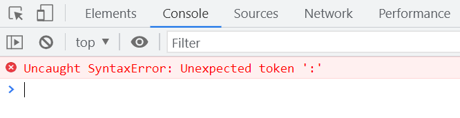

# JS 错误信息类型

## 语法错误 SyntaxError

### 变量名相关的

在 JavaScript 中，变量名不能以数字开头。尝试以下代码：

```javascript
var 1 = 1;
```

将抛出错误：

`Uncaught SyntaxError: Unexpected number`

这种错误是由于意外的数字作为变量名引起的。


另一个例子：

```javascript
var 1aaaab = 1;
function 1test(){}
```

会导致：

`Uncaught SyntaxError: Invalid or unexpected token`

这里的错误是因为变量名和函数名以数字开头，这是无效的标记。


### 关键字赋值

尝试给关键字赋值会产生语法错误。例如：

```javascript
var default = 5;
```

将抛出：

`Uncaught SyntaxError: Unexpected token '='`

这是因为关键字不能被赋值。


### 基本的语法错误

在代码中使用错误的标点符号也会引发语法错误。例如：

```javascript
var a = 5:
```

会导致：

`Uncaught SyntaxError: Unexpected token ':'`

这种错误是由于意外的冒号引起的。



## 引用错误 ReferenceError

当代码中引用了未定义的变量或函数时，会抛出引用错误。例如：

```javascript
test();
```

将抛出：

`Uncaught ReferenceError: test is not defined`

这是因为 `test` 函数没有被定义，导致引用错误。


### 给无法被赋值的对象赋值

尝试给无法被赋值的对象赋值会引发语法错误。例如：

```javascript
var a = 1 = 2;
console.log(a) = 1;
```

将抛出：

`Uncaught SyntaxError: Invalid left-hand side in assignment`

这是因为赋值操作的左侧无效，导致异常赋值。


## 范围错误 RangeError

### 数组长度赋值

给数组设置无效的长度会导致范围错误。例如：

```javascript
var arr = [1, 2, 3];
arr.length = 5;
console.log(arr); // [1, 2, 3, empty × 2]

var arr = [1, 2, 3];
arr.length = -5;
console.log(arr); // Uncaught RangeError: Invalid array length
```

第二个赋值操作中，数组长度被设置为负值，这是无效的。


### 超出区间

在数值操作中，传递超出范围的参数会引发范围错误。例如：

```javascript
var num = new Number(1.23);
console.log(num.toFixed(1)); // 1.2

var num = new Number(1.23);
console.log(num.toFixed(-1));
```

第二次调用 `toFixed` 时，参数 `-1` 超出了允许的范围，导致错误：

`Uncaught RangeError: toFixed() digits argument must be between 0 and 100 at Number.toFixed (<anonymous>)`


## 类型错误 TypeError

### 调用非函数

尝试调用一个非函数类型的值会抛出类型错误。例如：

```javascript
312();
```

将导致：

`Uncaught TypeError: 312 is not a function`

这是因为 `312` 不是一个函数类型，无法被调用。


### 对象里的属性

当对象的属性不是函数时，尝试调用它会引发类型错误。例如：

```javascript
var obj = {};
obj.say();
```

将抛出：

`Uncaught TypeError: obj.say is not a function`

这是因为 `obj` 对象没有 `say` 方法，导致属性无法被执行为函数。


## 实例化原始值 TypeError

### 构造函数

使用非构造函数进行实例化会引发类型错误。例如：

```javascript
var a = new 'str'();
```

将抛出：

`Uncaught TypeError: 'str' is not a constructor`

因为字符串不是一个构造函数，无法被实例化。


另一个例子：

```javascript
var a = new 123();
```

将导致：

`Uncaught TypeError: 123 is not a constructor`

这是因为数字类型不能被用作构造函数。


## URI 错误 URIError

### 编码和解码 URI

在处理 URI 时，编码和解码不符合规范会引发 URI 错误。例如：

```javascript
var myUrl = 'https://www.baidu.com?name=素明诚';
var newUrl = encodeURI(myUrl);
console.log(newUrl);
```

这段代码将中文字符转换为编码后的字符。


### URI 只要是资源标识就行

```javascript
var myUrl = '素明诚';
var newUrl = encodeURI(myUrl);
console.log(newUrl);
```


字符编码和 `URI` 可以相互转化：

```javascript
var myUrl = '素明诚';
var newUrl = encodeURI(myUrl);
console.log(newUrl);
var deUrl = decodeURI(newUrl);
console.log(deUrl);
```


### 错误格式的 URI

```javascript
var str = decodeURI('%daskdopnwinsad%');
// 自己乱写的
```

将抛出：

`Uncaught URIError: URI malformed`

这是由于 URI 格式不符合规范，导致解码失败。


## 函数执行错误

### eval 函数的使用

`eval` 函数可以执行字符串中的 JavaScript 代码，例如：

```javascript
eval('var a = 1; console.log(a);');
```

不建议使用 `eval` 的原因包括：

性能问题、规范不严格、难以调试、存在 XSS 隐患以及可读性差。

例如：

```javascript
var obj = {
  a: 1,
  b: 2,
};
// 规范不严格
console.log(eval('obj'));
console.log(eval(obj));
```

这段代码展示了 `eval` 可以执行对象和字符串。


### eval 把 JSON 字符串转化成对象

```javascript
var jsonData = [
  {
    name: '100',
    age: 50,
    work: 'SSS',
  },
];

var data = eval(jsonData);
console.log(jsonData);
```


## 自定义抛出错误

以上的错误都可以通过自定义抛出。例如：

```javascript
var error = new Error('代码错误了');
console.log(error);
```


# 手动抛出错误

## 正常的错误程序

在未处理错误的情况下，错误会导致后续代码不执行。例如：

```javascript
console.log('正常执行1');
console.log(a);
console.log('正常执行2');
```

在执行到第二行时，由于 `a` 未定义，第三行将不会被执行。


## try-catch

使用 `try-catch` 结构可以捕获和处理错误。

```javascript
try {
  console.log('正常执行1');
  console.log(a);
  console.log('正常执行2');
} catch (error) {
  console.log(error);
}
```

当 `try` 块中的代码抛出错误时，`catch` 块会捕获该错误并处理。


### 捕获错误信息

可以通过 `error` 对象获取详细的错误信息。

```javascript
try {
  console.log('正常执行1');
  console.log(a);
  console.log('正常执行2');
} catch (error) {
  console.log(error + ':' + error.message);
}
```


### 多个错误的情况

在 `try` 块中如果存在多个错误，只有第一个错误会被捕获，后续代码不会执行。

```javascript
try {
  console.log('正常执行1');
  console.log(a); // 报错，catch 捕获异常
  console.log(ab); // 不执行
  console.log('正常执行2');
} catch (error) {
  console.log(error + ':' + error.message);
}
```

## 不影响外界和 finally

无论 `try` 块中是否有错误，`finally` 块中的代码都会被执行。

```javascript
try {
  console.log('正常执行1');
  console.log(a); // 报错，catch 捕获异常
  console.log(ab); // 不执行
  console.log('正常执行2');
} catch (error) {
  console.log(error + ':' + error.message);
} finally {
  console.log('正常执行');
}
console.log(3);
```


### 自定义错误信息

可以使用 `throw` 语句自定义抛出错误信息。

```javascript
try {
  if ((a = 1)) {
    throw 'a未定义'; // 抛出一个数值异常
  }
} catch (e) {
  console.log(e);
}
```


# 以上错误类型总结

通过了解和处理不同类型的错误，可以编写更健壮和可靠的 JavaScript 代码。合理使用 `try-catch` 结构、自定义错误抛出以及避免使用不推荐的函数如 `eval`，都是提升代码质量的重要措施。

# 最佳实践

在编写 JavaScript 代码时，遵循以下最佳实践有助于减少错误的发生：

- **使用严格模式**：在文件或函数顶部添加 `"use strict";` 可以捕获更多的错误。

  ```javascript
  'use strict';
  var a = 1;
  ```

- **变量声明**：始终使用 `let` 或 `const` 声明变量，避免使用 `var`，以减少作用域相关的错误。

  ```javascript
  const PI = 3.14;
  let count = 0;
  ```

- **函数参数验证**：在函数内部验证参数类型和范围，确保函数在预期的条件下运行。

  ```javascript
  function divide(a, b) {
    if (typeof a !== 'number' || typeof b !== 'number') {
      throw new TypeError('参数必须是数字');
    }
    if (b === 0) {
      throw new RangeError('除数不能为零');
    }
    return a / b;
  }
  ```

- **避免使用 `eval`**：尽量避免使用 `eval`，因为它会带来安全和性能问题。可以使用其他方法来解析字符串，例如 `JSON.parse`。

  ```javascript
  const jsonData = '{"name":"John","age":30}';
  const obj = JSON.parse(jsonData);
  ```

- **捕获特定错误**：在 `catch` 块中，根据错误类型采取不同的处理措施，提高错误处理的精确性。

  ```javascript
  try {
    // 代码块
  } catch (error) {
    if (error instanceof TypeError) {
      console.error('类型错误:', error.message);
    } else if (error instanceof ReferenceError) {
      console.error('引用错误:', error.message);
    } else {
      console.error('未知错误:', error.message);
    }
  }
  ```
