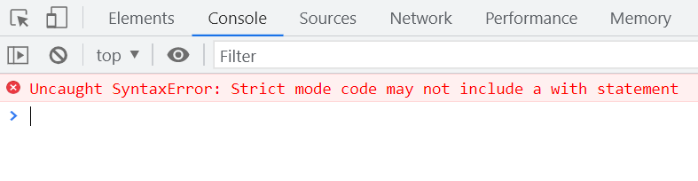
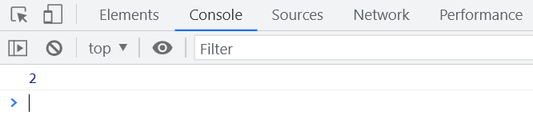
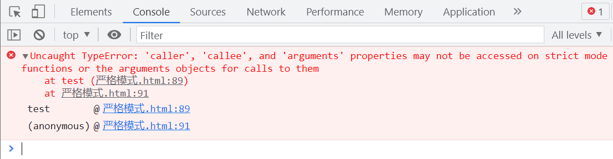
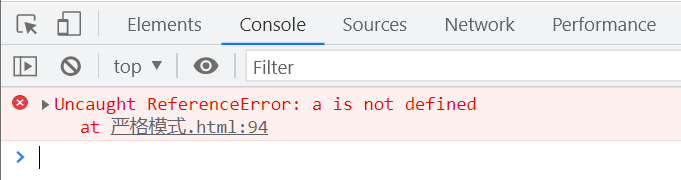
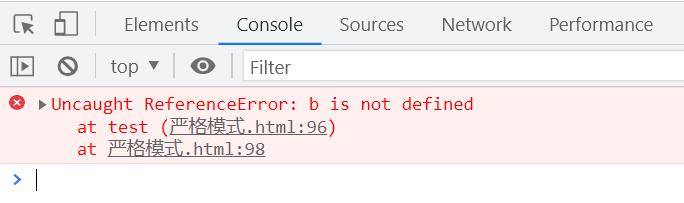
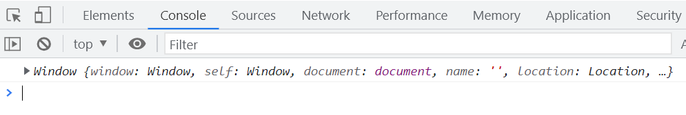
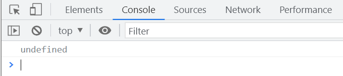
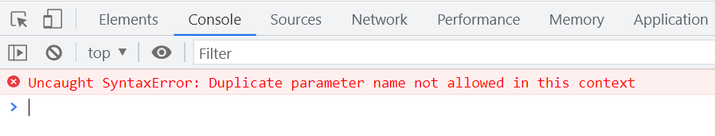
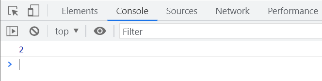
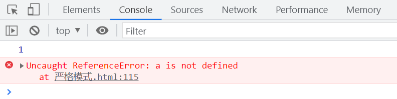

# ES5 严格模式

| **年份** |                           **ECMA 版本**                            |
| :------: | :----------------------------------------------------------------: |
|   1997   |                             `1.0` 发布                             |
|   1998   |                             `2.0` 发布                             |
|   1999   |                        `3.0` `JS` 通行标准                         |
|   2007   |     `4.0` 草案 雅虎、微软、谷歌反对，只有 `Mozilla` 支持该草案     |
|   2008   |  终止 `4.0` 草案，求同存异后，将可改善部分纳入 `3.1`，发布 `3.1`   |
|   2009   |   `5.0` 发布，争议的 `Harmony` 分为 `JS.NEXT` 和 `JS.NEXT.NEXT`    |
|   2011   | `5.1` 发布，成为 `ISO` 国际标准，与 `3.0` 地位相同，几乎基于 `3.0` |
|   2013   |           `ES6` 版本不再新增内容，`ES6` 等同于 `JS.NEXT`           |
|   2013   |                           `ES6` 草案发布                           |
|   2015   |              `ES6` 正式发布，命名为 `ECMAScript2015`               |
|          |                    `JS.NEXT.NEXT` 更名为 `ES7`                     |

从 `ES5` 开始，JavaScript 提供了两种运行模式，即正常模式和严格模式。需要注意的是，`IE9` 及以下版本的 `IE` 浏览器不支持严格模式。

# 严格模式的使用

## 使用字符串在全局进行声明

```javascript
'use strict';
```

使用 `'use strict'` 作为表达式，不会导致报错。即使浏览器不支持严格模式，也不会出现错误。

## 在函数内部使用

在企业开发中，通常在函数内部使用严格模式，全局使用较为少见。

```javascript
(function () {
  'use strict';
  // 函数内部代码
})();
```

# 严格模式的作用

## with 语句

`with` 语句能够改变作用域，填入作用域名称后，会在该作用域中查找变量。此外，使用 `with` 会增加作用域解析的开销，影响性能。

```javascript
var globalA = '全局';
var obj = {
  a: 'obj中的a',
};

function test() {
  var functionA = 'test函数中的a';
  with (obj) {
    console.log(a);
  }
}
test();
```

## 在严格模式下的 with

严格模式禁止使用 `with` 语句，尝试使用会导致语法错误。

```javascript
'use strict';
var globalA = '全局';
var obj = {
  a: 'obj中的a',
};

function test() {
  var functionA = 'test函数中的a';
  with (obj) {
    console.log(a);
  }
}
test();
```

运行上述代码会抛出以下错误：

```
Uncaught SyntaxError: Strict mode code may not include a with statement
```



# 命名空间

在开发中，可能会出现同名变量或函数的情况。

```javascript
function test() {
  console.log(1);
}

function test() {
  console.log(2);
}

test();
```

上述代码会打印出第二个 `test` 函数的结果。



## 解决命名冲突的方法

通过命名空间或模块化开发，可以避免命名冲突。

```javascript
window.onload = function () {
  init();
};

function init() {
  initSlider();
  initSidebar();
}

var initSlider = (function () {
  var sliderValue = 1;
  console.log(sliderValue);
})();

var initSidebar = (function () {
  var sidebarValue = 1;
  console.log(sidebarValue);
})();
```

## 未使用模块化时的命名空间管理

在早期多人协作开发中，可以通过对象嵌套的方式管理命名空间，防止命名冲突。

```javascript
var namespace = {
  header: {
    Jenny: {
      a: 1,
      b: 2,
    },
    Ben: {
      a: 3,
      b: 4,
    },
  },
  sidebar: {
    Crystal: {
      a: 5,
      b: 6,
    },
  },
};

// 使用命名空间访问变量
console.log(namespace.header.Ben.a);
```

# caller 和 callee

在严格模式下，`caller` 和 `callee` 属性无法访问。

```javascript
'use strict';

function test() {
  console.log(arguments.callee);
}
test(1);
```

执行上述代码会抛出以下错误：

```
Uncaught TypeError: 'caller', 'callee', and 'arguments' properties may not be accessed on strict mode functions or the arguments objects for calls to them
```



# 严格模式下的变量声明

在严格模式下，必须显式声明变量，否则会导致错误。

```javascript
'use strict';
var a = (b = 1);
```

执行上述代码会抛出错误：



```javascript
'use strict';

function test() {
  var a = (b = 1);
}
test();
```

执行上述代码同样会抛出错误：



# 严格模式下的 this

```javascript
'use strict';
console.log(this);
```

在全局环境中，`this` 指向 `window` 对象。



## 函数内部的 this

在严格模式下，未绑定的 `this` 为 `undefined`。

```javascript
'use strict';

function test() {
  console.log(this);
}
test();
```

上述代码输出 `undefined`。



# 严格模式下的函数形参

严格模式下，函数参数不能有重复的名称。

```javascript
'use strict';

function test(a, a) {
  console.log(a, a);
}
test(1, 2);
```

执行上述代码会抛出语法错误：



## 严格模式下的对象属性

在严格模式下，对象中不允许存在重复的属性名。

```javascript
'use strict';
var obj = {
  a: 1,
  a: 2,
};
console.log(obj.a);
```

上述代码不会报错，但只能访问到最后一个属性值。



# eval 函数

在严格模式下，`eval` 拥有独立的作用域，无法向外部作用域添加变量。

```javascript
'use strict';
eval('var a = 1; console.log(a);');
console.log(a);
```

上述代码在严格模式下，`a` 不会被定义在全局作用域，第二个 `console.log(a)` 会导致错误。


