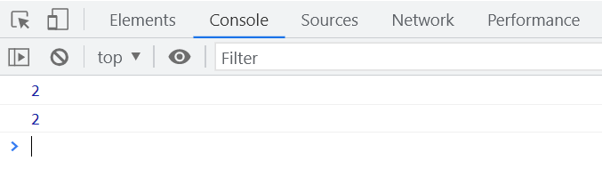
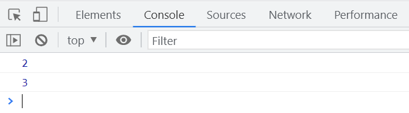
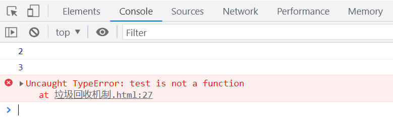

# 什么是垃圾回收机制

在编写代码时，变量和函数会暂时占用内存。然而，有些变量和函数不再需要，因此需要释放它们所占用的内存。JavaScript 拥有自动垃圾回收机制，JavaScript 引擎会回收与值相关的内存。

# 回收原理

## 可达性

[垃圾回收](https://zh.javascript.info/garbage-collection#ke-da-xing-reachability)

## 执行步骤

首先，垃圾回收器会识别出不再使用的变量。接着，释放这些变量占用的内存。最后，垃圾回收器会定期运行，以确保内存得到有效管理。

# 生命周期

存在声明的变量包括局部变量和全局变量。局部变量在函数执行结束后会被销毁，而全局变量则会在关闭浏览器前一直存在。

```javascript
// 执行后 test 的作用域链不存在了，变量被销毁。
function test() {
  var a = 0;
  console.log(a);
}
```

```javascript
function test1() {
  var count = 1;

  function increment() {
    count++;
    console.log(count);
  }
  increment();
}
test1();
test1();
```

函数执行结束后，`count` 就不存在了，所以两次执行的结果都是 `2`。



## 闭包

闭包允许函数访问其外部作用域的变量，即使外部函数已经执行完毕。这会导致相关变量无法被销毁，继续占用内存。

```javascript
function createCounter() {
  var count = 1;

  function increment() {
    count++;
    console.log(count);
  }
  return increment;
}

var counter = createCounter();
counter();
counter();
```

`createCounter` 中的 `count` 被保留在闭包中，无法被销毁，每次调用 `counter` 时，`count` 都会增加 `1`。



## 解除闭包的引用

通过将闭包的引用设为 `null`，可以解除对外部变量的引用，从而允许垃圾回收器回收内存。

```javascript
function createCounter() {
  var count = 1;

  function increment() {
    count++;
    console.log(count);
  }
  return increment;
}

var counter = createCounter();
counter();
counter();
counter = null;
// 下面的调用会报错，因为 counter 已被设为 null
// counter();
```

赋值 `null` 后，闭包中的 `count` 不再被引用，内存可以被释放。



# 标记清除

标记清除（mark and sweep）是常见的垃圾回收算法。它的工作原理如下：

首先，排除全局变量的引用。接着，排除闭包中存在的变量。然后，删除剩余未被引用的变量。不同浏览器的垃圾回收时间间隔和标记方式可能会有所不同。

```javascript
function initialize() {
  var localVar = 0; // 进入作用域
}
initialize(); // 离开作用域

var globalVar1 = 0;
var globalVar2 = 1;

console.log(globalVar1);
```

# 引用计数

引用计数（references counting）通过记录每个值被引用的次数来管理内存。引用次数为 `0` 的值会被删除。

```javascript
function referenceCounting() {
  var objA = new Object(); // objA 的引用次数等于 1
  var objB = new Object(); // objB 的引用次数等于 1
  var objC = objA; // objA 的引用次数增加到 2
  objC = objB; // objA 的引用次数减少到 1，objB 的引用次数增加到 2
}
```

# 特殊的引用

当两个对象相互引用时，如果没有其他引用指向它们，它们依然无法被销毁，可能导致内存泄漏。

```javascript
var objA = {};
var objB = {};

objA.prop = objB; // objA 的引用次数等于 2
objB.prop = objA; // objB 的引用次数等于 2

// 清空引用计数
objA = null;
objB = null;
```

在上述代码中，`objA` 和 `objB` 互相引用，尽管它们的引用次数被清空，但由于相互引用，垃圾回收器无法回收它们的内存。

# 闭包最佳实践

为了避免闭包导致的内存泄漏，应谨慎管理闭包的引用。以下是一些最佳实践：

确保不必要时解除闭包的引用，尤其是在大型应用中。

避免在闭包中引用大型对象，尽量只引用必要的变量。

使用模块化设计，限制闭包的作用范围，减少对全局变量的依赖。

通过这些方法，可以有效减少闭包带来的内存管理问题。

# 实战示例

在实际开发中，理解垃圾回收机制可以帮助我们编写更高效的代码。以下是一个实战示例，展示如何通过闭包管理计数器，同时避免内存泄漏。

```javascript
function createSafeCounter() {
  var count = 0;

  function increment() {
    count++;
    console.log(count);
  }

  function reset() {
    count = 0;
    console.log('Counter reset');
  }

  return {
    increment: increment,
    reset: reset,
  };
}

var counter = createSafeCounter();
counter.increment(); // 输出 1
counter.increment(); // 输出 2
counter.reset(); // 输出 "Counter reset"
counter = null; // 解除引用，允许垃圾回收
```

在这个示例中，通过返回一个包含 `increment` 和 `reset` 方法的对象，可以有效管理 `count` 变量。同时，通过将 `counter` 设为 `null`，可以解除闭包对 `count` 的引用，确保内存被释放。

[JavaScript 垃圾回收详解](https://zh.javascript.info/garbage-collection#ke-da-xing-reachability)
