# 语句与运算符指南

JavaScript 的语句以分号结束。使用分号分隔每条语句。

## 表达式写法

在运算赋值和判断的符号两侧留有空格。

```javascript
var a = (c = b);
```

# 常见错误

## 语法错误

语法错误会导致所有语句无法执行。

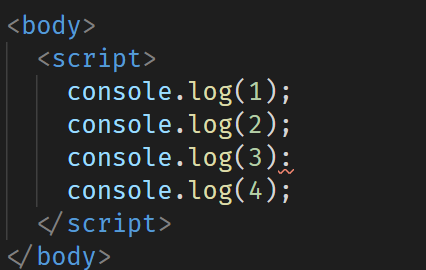
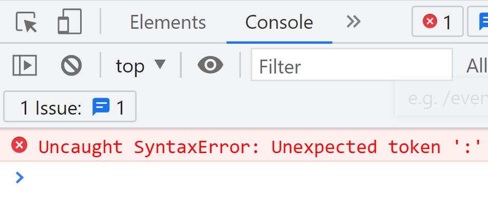

## 通用错误

通用错误会中断代码的执行，前面的代码会执行，后面的不会执行。以下示例中，变量`a`未定义。

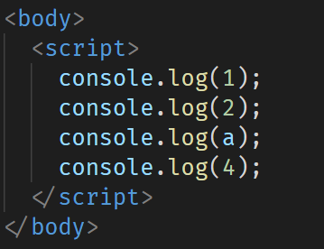
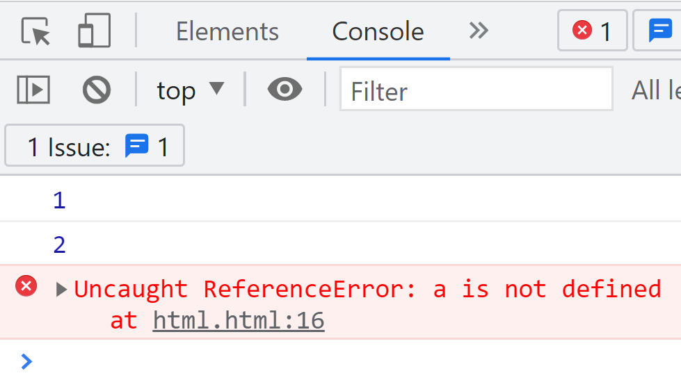

## 代码块内的错误

错误的代码块会导致执行报错。正确的代码块内的语法错误不会影响其他部分。

错误代码块示例：

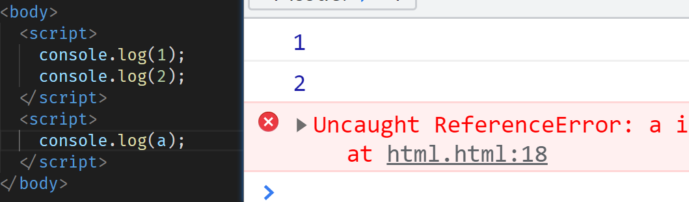

正确代码块示例：

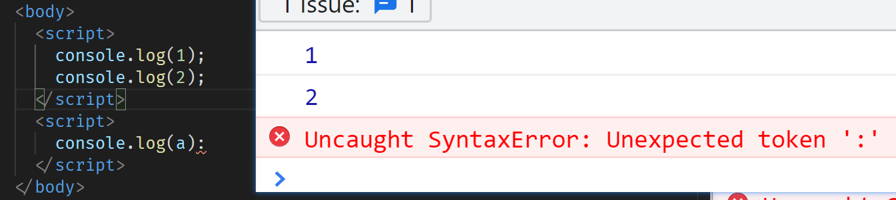

# 运算符

```javascript
var a = 1,
  b = 2,
  d = 3;
var c = (a + b) * d;
```

`var c = (a + b) * d;`

**执行顺序**

1. 声明变量`a`、`b`、`d`
2. 声明变量`c`
3. 变量`a`加变量`b`，结果与变量`d`相乘，得到结果
4. 将该结果赋值给变量`c`

## 加号运算符 `+`

1. 用作数学运算的加号。
2. 可以进行字符串拼接。字符串与字符串相加得到拼接结果。
3. 字符串与`undefined`相加得到`字符串undefined`。任何数据类型与字符串相加，结果都是字符串。

```javascript
console.log(1 + 1 + 'url' + 'url' + 123);
console.log('123' + undefined);
```

**结果**

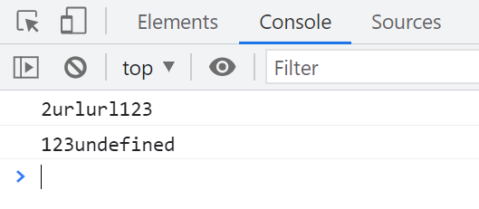

## 除号运算符 `/`

```javascript
console.log(5 / 2);
console.log(1 / 0);
console.log(undefined / undefined);
console.log(NaN / NaN);
console.log(-1 / 0);
console.log(0 / 0);
```

**结果**

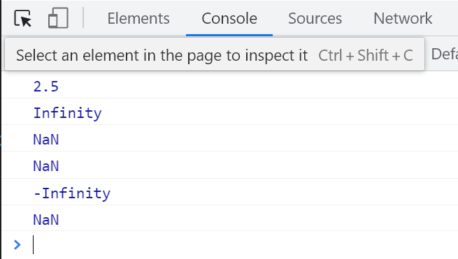

### NaN 是什么？

1. `NaN` 代表“不是一个数字”（Not a Number）。
2. 它是数字类型，当计算结果出错时出现。

### 为什么 NaN 是 number 类型？

`NaN` 的属性与 `Number.NaN` 相同。根据 1985 年的`IEEE 754`浮点数标准，`NaN` 是一种数值数据类型，表示未定义或不可表示的值。因此，`NaN` 属于 `number` 类型。

[JavaScript 数据类型和数据结构 - JavaScript | MDN](https://developer.mozilla.org/zh-CN/docs/Web/JavaScript/Data_structures)

### Infinity

1. `Infinity` 是数字类型，用来表示无穷大或无穷小。

## 取余运算符 `%`

```javascript
console.log(5 % 2);
console.log(4 % 6);
console.log(0 % 6);
console.log(NaN % NaN);
```

**结果**

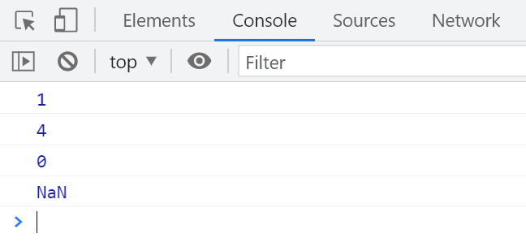

`4 % 6` 的结果是 `4`，因为 4 小于 6，余数就是 4。

## 值交换问题

不使用第三个变量进行值交换。

```javascript
var a = 1;
var b = 2;
a = a + b; // a = 3
b = a - b; // b = 1
a = a - b; // a = 2
```

## 自增和自减运算符 `++`、`--`

```javascript
var a = 1;
var b = 1;
var c = 1;
a = a + 1;
b += 1;
c++;
console.log(a);
console.log(b);
console.log(c);
```

**结果**

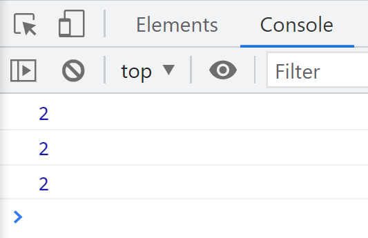

```javascript
var a = 1;
console.log(a++);
```

**结果**

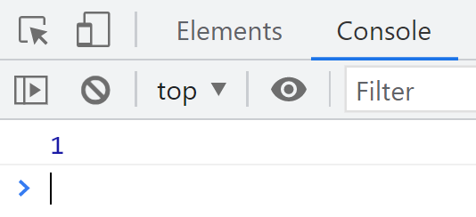

`a++` 是先计算后赋值，`++a` 是先赋值后计算。`--` 减运算符同理。

## 练习

### 练习 1

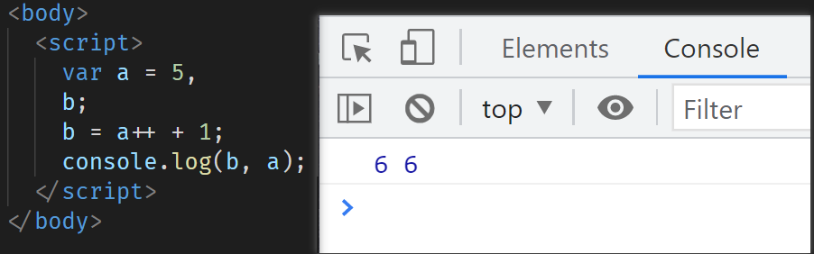

### 练习 2

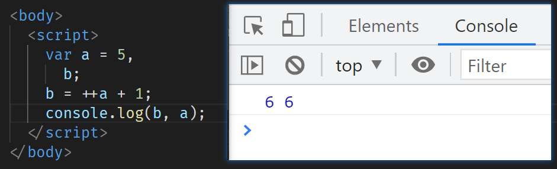

### 练习 3

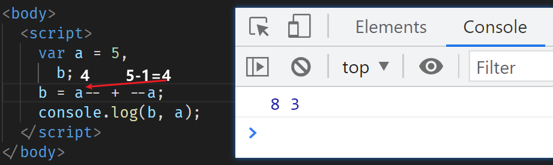

执行 `a--` 后，`a` 的值变为 4，此时两个 4 相加等于 8，结束后`a`再减 1，所以`a`的最终值是 3。

### 练习 4

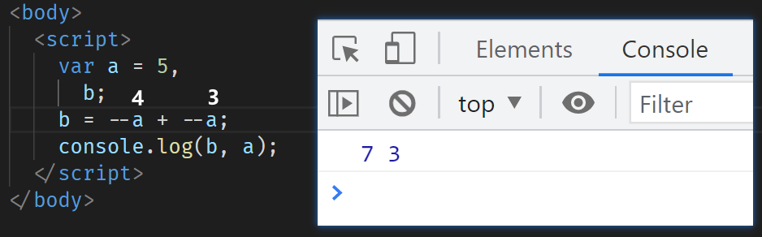

### 练习 5

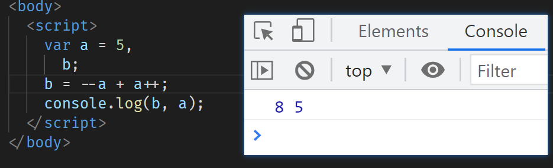

# 比较运算符

## 字符与数字的对比

```javascript
// 数字与字符串比较，字符串会先转化为数字
var bool = 1 > '2';
console.log(bool);

// 比较字符的 ASCII 码
var bool = 'a' > 'b';
console.log(bool);

// 为什么 4.5 > 11 呢？
var bool = '4.5' > '11';
console.log(bool);
```

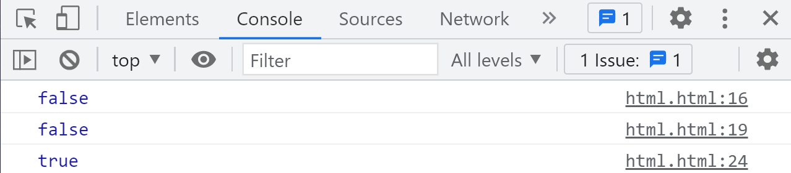

## `==` 和 `===`

```javascript
// NaN 与任何值（包括自己）都不相等
var bool1 = NaN == NaN;
console.log(bool1);

// 全等运算，比较值和类型
var bool2 = 1 !== '1';
console.log(bool2);

// 不等于运算，比较值
var bool3 = 1 != '1';
console.log(bool3);
```

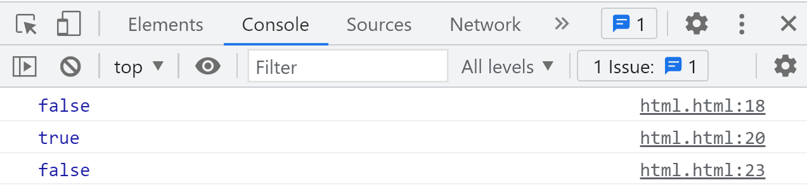
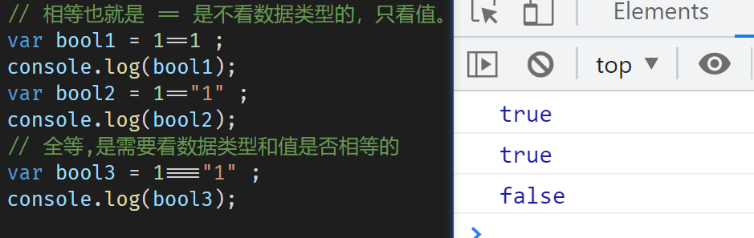

# 条件判断

## 使用 `if` 判断成绩等级

连续使用多个 `if` 语句时，所有条件都会被判断和执行。

```javascript
var score = 63;
if (score >= 90) {
  console.log('您的成绩等级为A');
}
if (score >= 80 && score < 90) {
  console.log('您的成绩等级为B');
}
if (score >= 70 && score < 80) {
  console.log('您的成绩等级为C');
}
if (score >= 60 && score < 70) {
  console.log('您的成绩等级为D');
}
if (score < 60) {
  console.log('您的成绩不及格');
}
```

## 使用 `if else` 优化判断

当条件之间具有互斥性时，使用 `else if` 可以提高效率，只执行满足条件的代码块。

```javascript
var score = 63;

if (score >= 90 && score <= 100) {
  console.log('您的成绩等级为A');
} else if (score >= 80 && score < 90) {
  console.log('您的成绩等级为B');
} else if (score >= 70 && score < 80) {
  console.log('您的成绩等级为C');
} else if (score >= 60 && score < 70) {
  console.log('您的成绩等级为D');
} else if (score >= 0 && score < 60) {
  console.log('您的成绩不及格');
} else {
  console.log('您的成绩异常');
}
```

# `switch` 语句

```javascript
var city = window.prompt('请输入所在地区');

switch (city) {
  case '北京':
    console.log('15k');
    break;
  case '上海':
    console.log('13k');
    break;
  case '深圳':
    console.log('12k');
    break;
  case '广州':
    console.log('11k');
    break;
  default:
    console.log('9k');
}
```

## `switch` 的使用方法

```javascript
var score = 65;

switch (true) {
  case score >= 90 && score <= 100:
    console.log('您的成绩等级为A');
    break;
  case score >= 80 && score < 90:
    console.log('您的成绩等级为B');
    break;
  case score >= 70 && score < 80:
    console.log('您的成绩等级为C');
    break;
  case score >= 60 && score < 70:
    console.log('您的成绩等级为D');
    break;
  case score >= 0 && score < 60:
    console.log('您的成绩不及格');
    break;
  default:
    console.log('您的成绩异常');
}
```

**总结**

1. 当需要判断值的范围或多个条件时，使用 `if` 更合适。
2. 当值为定值时，使用 `switch` 更简洁。

# 逻辑运算

## 与、或、非运算符

| 与（&&）       | 或（         |          | ）  | 非（!） |
| -------------- | ------------ | -------- | --- | ------- |
| 两个条件都为真 | 任一条件为真 | 取反操作 |

## 在 JavaScript 中的假值

| **undefined** | **null** | **NaN** | **""** | **0** | **false** |
| ------------- | -------- | ------- | ------ | ----- | --------- |
| 其余值均为真  |          |         |        |       |           |

```javascript
var a = 1 && 2;
// 遇到真就继续，遇到假就返回，如果没有假则返回最后一个值
console.log(a); // 2

var b = 0 || null || 1 || 0;
// 遇到假就继续，遇到真就返回，如果没有真则返回最后一个值
console.log(b); // 1
```

使用 `||` 运算符进行简单判断：

```javascript
var name = '数据';
console.log(name || '没有数据');
```

# 逻辑非运算符 `!`

常用于取反操作。

```javascript
var a = true;
a = !a; // a 现在为 false
```

# 注释

```javascript
// 行注释

/*
 * 推荐写法
 * 块注释
 */

/**
 * 自动生成的注释
 */

/*
    不推荐的写法
*/
```
