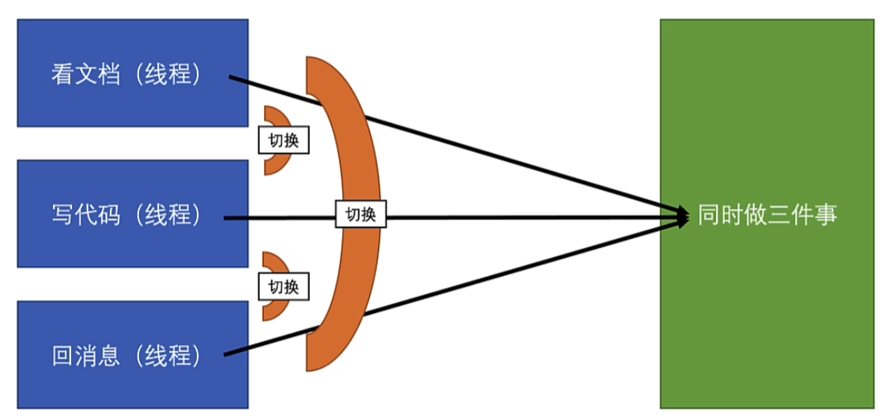
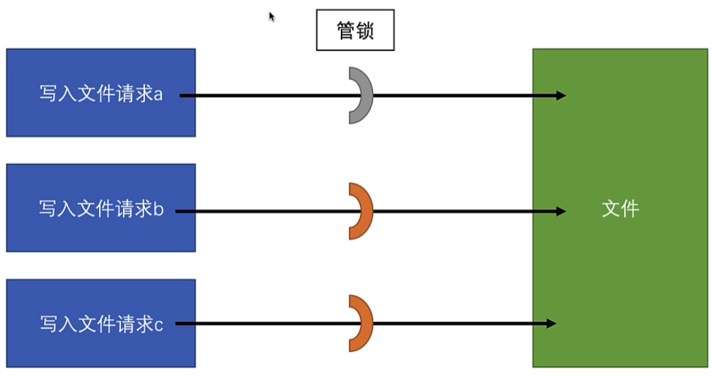
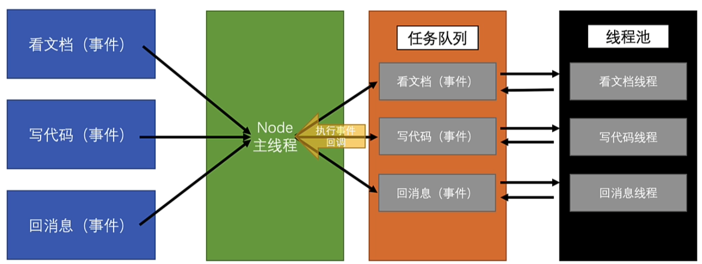

# JS 为什么是单线程？

防止多个线程同时操作`DOM`导致渲染结果混乱  
浏览器中的 JavaScript 采用单线程模型来确保`DOM`操作与渲染任务不会发生冲突  
Node.js 继承了这种单线程主线程处理模式，专注于作为前后端之间的辅助工具层面

## Node.js 与浏览器中的单线程执行

### 浏览器中的单线程执行

浏览器中的 JavaScript 运行在单线程环境下，这意味着所有的代码执行、事件处理和`DOM`操作都在同一个线程中进行。这种设计简化了编程模型，避免了多线程带来的复杂性和潜在的竞争条件。然而，为了保持界面的响应性，浏览器利用异步操作和事件循环机制来处理耗时任务。

### Node.js 中的单线程执行

Node.js 同样采用单线程模型，但其应用场景不同于浏览器。Node.js 主要用于构建服务器端应用，处理 I/O 密集型任务。通过事件驱动和非阻塞 I/O 操作，Node.js 能够高效地处理大量并发连接，而无需依赖多线程。这使得 Node.js 在处理网络请求和文件系统操作时表现出色。

## 单线程和多线程对比

多线程环境下需要频繁切换任务上下文来处理多个问题  
单线程无需频繁切换上下文  
多线程同时处理多个任务时需要引入锁机制管理共享资源  
单线程无需管理锁等复杂同步问题

## 多线程任务规则



### 锁的机制



## 单线程任务运行规则

在 Node.js 事件环中微任务执行环节与浏览器略有不同  
Node.js 在事件循环中将 I/O 回调、定时器回调与微任务（如 Promise）处理放在特定阶段  
微任务会在当前事件循环的末尾处理  
需谨慎避免在单线程内进行长时间阻塞操作  
应优先使用异步 I/O 或借助 Worker Threads 和 Cluster 模块处理 CPU 密集型任务



### 示例

以下代码在单线程环境中模拟阻塞操作，访问`/block`时整个事件循环会被阻塞

```javascript
const http = require('http');

function blockEventLoop(ms) {
  const startTime = Date.now();
  while (Date.now() - startTime < ms) {}
}

http
  .createServer((req, res) => {
    if (req.url === '/block') {
      blockEventLoop(5000);
      res.end('已阻塞5秒');
    } else {
      res.end('无阻塞响应');
    }
  })
  .listen(3000);
```

## JS 如何开辟新的线程

尽管 JavaScript 本身是单线程的，但在浏览器和 Node.js 环境中，可以通过不同的机制创建额外的线程来处理并行任务。

### 浏览器中的 Web Workers

Web Workers 允许在浏览器中创建独立的线程，执行耗时的任务而不阻塞主线程。这些线程与主线程通过消息传递进行通信，适用于计算密集型任务或需要并行处理的操作。

```javascript
// main.js
const worker = new Worker('worker.js');

worker.postMessage('开始计算');

worker.onmessage = function (event) {
  console.log('计算结果:', event.data);
};

// worker.js
self.onmessage = function (event) {
  if (event.data === '开始计算') {
    let result = 0;
    for (let i = 0; i < 1e9; i++) {
      result += i;
    }
    self.postMessage(result);
  }
};
```

### Node.js 中的 Worker Threads

Node.js 提供了`worker_threads`模块，允许在服务器端创建多个线程，适用于处理 CPU 密集型任务。每个 Worker 线程拥有独立的 V8 实例和事件循环，确保任务之间的隔离和高效执行。

```javascript
// main.js
const { Worker } = require('worker_threads');

const worker = new Worker('./worker.js');

worker.postMessage('开始计算');

worker.on('message', (result) => {
  console.log('计算结果:', result);
});

// worker.js
const { parentPort } = require('worker_threads');

parentPort.on('message', (message) => {
  if (message === '开始计算') {
    let result = 0;
    for (let i = 0; i < 1e9; i++) {
      result += i;
    }
    parentPort.postMessage(result);
  }
});
```

### 最佳实践

在使用额外线程时，应遵循以下最佳实践：

确保任务适合并行处理，避免频繁的线程创建和销毁  
通过消息传递进行线程间通信，避免共享状态  
处理好线程生命周期，确保资源正确释放  
合理分配任务，避免线程间负载不均衡

通过合理利用 Web Workers 和 Worker Threads，可以显著提升 JavaScript 应用的性能和响应性，尤其在处理复杂计算或高并发任务时。
