# 循环

## 循环结构

循环结构用于重复执行代码块，直到满足特定条件。常见的循环结构包括 `for`、`while` 和 `do...while`。

### `for` 循环

```javascript
for (let i = 0; i < 10; i++) {
  console.log(i);
}
```

### 循环执行步骤

```javascript
// 1. 声明变量 i = 0;
// 2. 判断条件 i < 10，如果为真，则执行代码块
//    console.log(i);
// 3. 执行迭代表达式 i++
// 4. 重复步骤 2 和 3，直到条件不满足，停止循环
```

## `for` 循环与 `while` 循环的转换

`for` 循环和 `while` 循环在功能上是等价的，可以相互转换。

```javascript
// 使用 for 循环
for (let i = 0; i < 10; i++) {
  console.log(i);
}

// 转换为 while 循环
let i = 0;
while (i < 10) {
  console.log(i);
  i++;
}
```

## 死循环

死循环是指循环条件永远为真，导致循环无法终止。

```javascript
// 使用 for 循环创建死循环
for (let i = 1; ; ) {
  console.log(i);
  i++;
}

// 使用 while 循环创建死循环
let j = 1;
while (j) {
  console.log(j);
  j++;
}
```

## 使用条件判断跳出循环

在循环中使用条件判断，可以在满足特定条件时终止循环。

```javascript
let i = 1;
while (i) {
  console.log(i);
  i++;
  if (i === 11) {
    i = 0; // 设置 i 为 0，结束循环
  }
}
```

## `break` 终止循环

`break` 语句用于立即终止当前循环。

```javascript
let i = 1;
let sum = 0;

for (; i; ) {
  sum += i;
  i++;
  if (sum >= 100) {
    break; // 当 sum 大于或等于 100 时，跳出循环
  }
  console.log(`i: ${i}, sum: ${sum}`);
}
```

## `continue` 跳过当前循环

`continue` 语句用于跳过当前循环的剩余部分，继续下一个循环。

```javascript
for (let i = 0; i <= 100; i++) {
  if (i % 7 === 0 || i % 7 === 7) {
    continue; // 跳过能被7整除的数字
  }
  console.log(i);
}
```

## 打印 `0~100` 的数字

使用 `for` 循环打印 `0` 到 `100` 的数字，且不使用比较操作和 `i++`、`i--`。

```javascript
for (let i = 100; i--; ) {
  console.log(i);
}
```

## `while` 和 `do...while` 循环

`do...while` 循环至少会执行一次循环体，然后再判断条件是否满足。

```javascript
let i = 0;
while (i < 10) {
  console.log(i);
  i++;
}

do {
  console.log('开始循环');
} while (i < 10);
```

## 循环练习

### 计算 10 的 N 次方

```javascript
const exponent = 5;
let result = 1;
for (let i = 0; i < exponent; i++) {
  result *= 10;
}
console.log(result); // 输出: 100000
```

### 计算 N 的阶乘

```javascript
const n = 5;
let factorial = 1;
for (let i = 1; i <= n; i++) {
  factorial *= i;
  console.log(`i: ${i}, factorial: ${factorial}`);
}
// 输出:
// i: 1, factorial: 1
// i: 2, factorial: 2
// i: 3, factorial: 6
// i: 4, factorial: 24
// i: 5, factorial: 120
```

### 取数字的各位

```javascript
const number = 857;
const units = number % 10;
console.log(units); // 输出: 7

const tens = Math.floor((number % 100) / 10);
console.log(tens); // 输出: 5

const hundreds = Math.floor(number / 100);
console.log(hundreds); // 输出: 8
```

**结果**

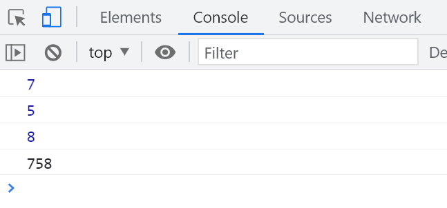

### 判断素数

素数是指大于 `1` 的自然数，除了 `1` 和它本身外，不能被其他自然数整除的数。

```javascript
for (let i = 2; i < 100; i++) {
  let isPrime = true;
  for (let j = 2; j <= Math.sqrt(i); j++) {
    if (i % j === 0) {
      isPrime = false;
      break; // 如果找到因子，退出内层循环
    }
  }
  if (isPrime) {
    console.log(i);
  }
}
```

# 引用类型

引用类型包括 `Array`、`Object`、`Function`、`RegExp` 等。

## 数组

数组用于存储有序的数据集合。

```javascript
const numbers = [1, 2, 3, 4, 5, 6];
numbers[3] = null;
console.log(numbers); // 输出: [1, 2, 3, null, 5, 6]
console.log(numbers.length); // 输出: 6

for (let i = 0; i < numbers.length; i++) {
  numbers[i] += 2;
}
console.log(numbers); // 输出: [3, 4, 5, 2, 7, 8]
```

## 对象

对象用于存储键值对的数据。

```javascript
const person = {
  name: '蟹老板',
  age: 18,
  height: 180,
  weight: 140,
  job: 'Web 开发',
};

// 修改属性
person.name = '海绵宝宝';

// 访问属性
console.log(person.name); // 输出: 海绵宝宝
```

# 数据类型转换

JavaScript 中的数据类型转换分为显式转换和隐式转换。

## 显式类型转换

显式类型转换通过函数或方法将一种数据类型转换为另一种数据类型。

### 使用 `Number` 转换

```javascript
console.log('1.' + typeof null); // 输出: object
// 这是因为 typeof null 的结果是 'object'，这是历史遗留的bug。

console.log('2.' + typeof undefined); // 输出: undefined
console.log('3.' + typeof function () {}); // 输出: function
console.log('4.' + typeof NaN); // 输出: number
console.log('5.' + typeof ''); // 输出: string
console.log('6.' + typeof Array); // 输出: function
console.log('7.' + typeof Object); // 输出: function
console.log('8.' + typeof (1 - 1)); // 输出: number
console.log('9.' + typeof (1 - '1')); // 输出: number
console.log('10.' + typeof ('1' - '1')); // 输出: number

let a;
console.log('11.' + typeof a); // 输出: undefined

console.log('12.' + typeof typeof a); // 输出: string
console.log('13.' + typeof typeof 123); // 输出: string
```

**结果**

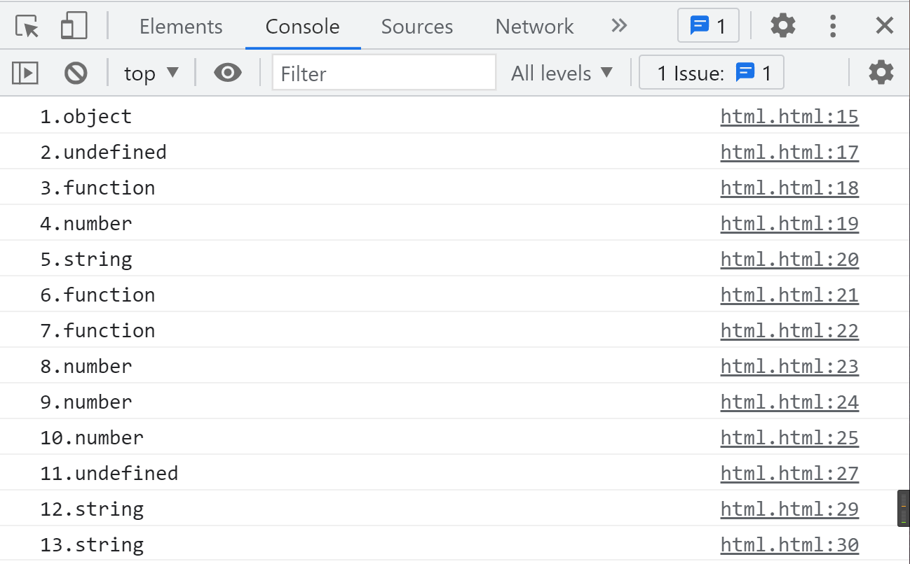

### 使用 `parseInt` 转换

```javascript
const a = '123';
console.log(`${parseInt(a)} - ${typeof parseInt(a)}`); // 输出: 123 - number

const b = 'true';
console.log(`${parseInt(b)} - ${typeof parseInt(b)}`); // 输出: NaN - number

const c = 'null';
console.log(`${parseInt(c)} - ${typeof parseInt(c)}`); // 输出: NaN - number

const d = 'undefined';
console.log(`${parseInt(d)} - ${typeof parseInt(d)}`); // 输出: NaN - number

const e = 'a';
console.log(`${parseInt(e)} - ${typeof parseInt(e)}`); // 输出: NaN - number

const f = 'a1';
console.log(`${parseInt(f)} - ${typeof parseInt(f)}`); // 输出: NaN - number

const g = '3.14';
console.log(`${parseInt(g)} - ${typeof parseInt(g)}`); // 输出: 3 - number
```

**结果**

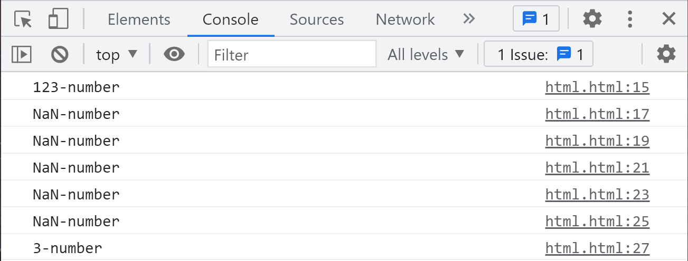

### 进制转换

```javascript
const a = '16';
console.log(parseInt(a, 16)); // 输出: 22

const b = '12';
console.log(parseInt(b, 8)); // 输出: 10

const c = '11';
console.log(parseInt(c, 2)); // 输出: 3

const d = 'abc123';
console.log(parseInt(d)); // 输出: NaN

const e = '123abc';
console.log(parseInt(e)); // 输出: 123

const f = '12abc3';
console.log(parseInt(f)); // 输出: 12
```

**结果**

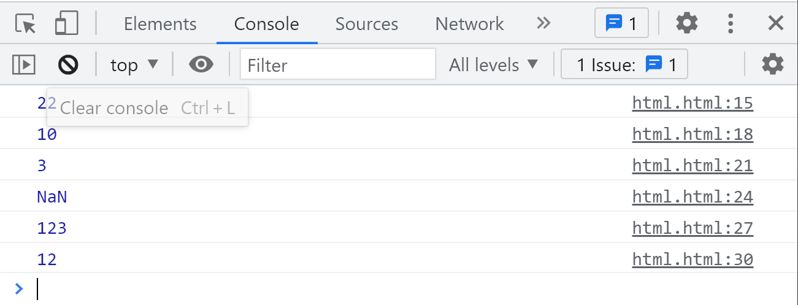

### 浮点数

使用 `parseFloat` 转换字符串为浮点数，并使用 `toFixed` 方法控制小数位数。

```javascript
const num = parseFloat('3.1465');
console.log(num.toFixed(2)); // 输出: 3.15
```

**结果**

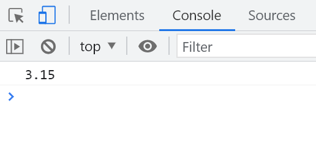

### 转换为字符串

```javascript
console.log(typeof String(123)); // 输出: string

let str = null;
try {
  console.log(str.toString());
} catch (error) {
  console.log(error.message); // 输出: Cannot read property 'toString' of null
}

let str1 = undefined;
try {
  console.log(str1.toString());
} catch (error) {
  console.log(error.message); // 输出: Cannot read property 'toString' of undefined
}
```

### 布尔类型

```javascript
console.log(Boolean(1)); // 输出: true
console.log(Boolean(null)); // 输出: false
console.log(Boolean(undefined)); // 输出: false
console.log(Boolean(0)); // 输出: false
console.log(Boolean('')); // 输出: false
console.log(Boolean(NaN)); // 输出: false
```

**结果**

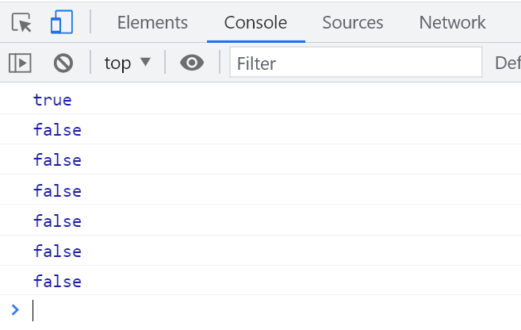

## 隐式类型转换

JavaScript 在某些情况下会自动进行类型转换。

### 隐式 `Number` 转换

```javascript
let a = '123';
a++;
console.log(a); // 输出: 124

let b = '3' * 2;
console.log(b); // 输出: 6
```

**结果**

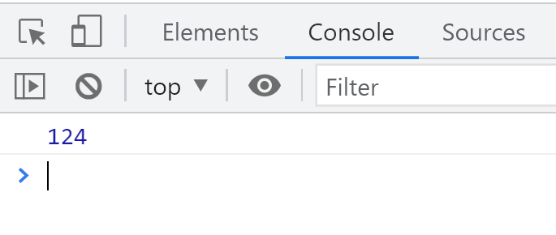
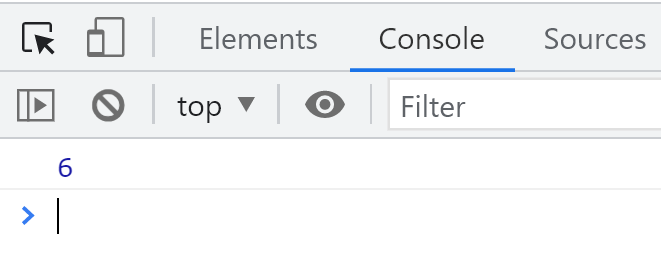

### 正负号转换

```javascript
const num1 = '123';
console.log(`${typeof +num1}: ${+num1}`); // 输出: number: 123
console.log(`${typeof -num1}: ${-num1}`); // 输出: number: -123

const num2 = 'abc';
console.log(`${typeof +num2}: ${+num2}`); // 输出: number: NaN
console.log(`${typeof -num2}: ${-num2}`); // 输出: number: NaN
```

**结果**

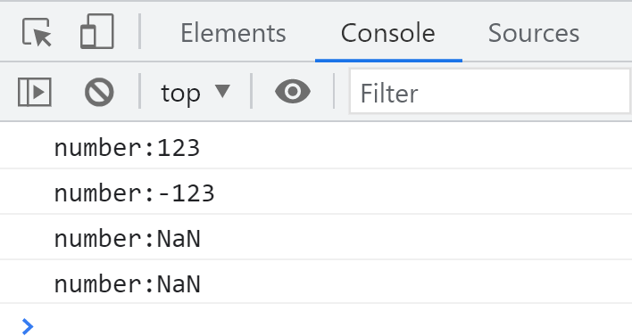

### 关系运算符的隐式转换

```javascript
let a = '1' > 2;
console.log(a); // 输出: false

let b = 1 > '2';
console.log(b); // 输出: false

let c = 1 == '1';
console.log(c); // 输出: true
```

**结果**

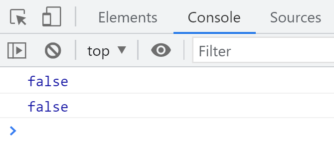

### 隐式字符串转换

```javascript
let a = 'a' + 1;
console.log(a); // 输出: a1
```

**结果**

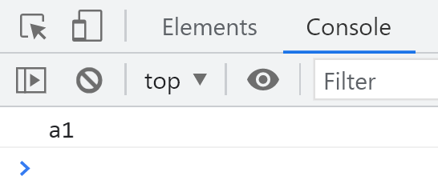

### 比较 ASCII 码

```javascript
let a = 'a' > 'b';
console.log(a); // 输出: false
```

**结果**

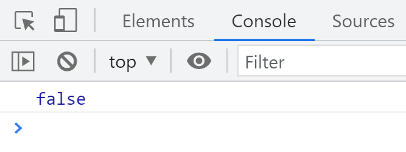

### 其他转换

```javascript
// 全等比较不进行隐式转换
let a1 = 1 === '1';
console.log(`1. ${a1}`); // 输出: 1. false

// NaN 不等于任何值，包括自身
let a2 = NaN == NaN;
console.log(`2. ${a2}`); // 输出: 2. false

// 复杂的比较运算
let a3 = 2 > 1 > 3;
console.log(`3. ${a3}`); // 输出: 3. false

let a4 = 2 > 1 == 1;
console.log(`4. ${a4}`); // 输出: 4. false

// undefined 和 null 的比较
let a6 = undefined == 0;
console.log(`6. ${a6}`); // 输出: 6. false

let a7 = null == 0;
console.log(`7. ${a7}`); // 输出: 7. false

let a8 = undefined == null;
console.log(`8. ${a8}`); // 输出: 8. true
```

**结果**

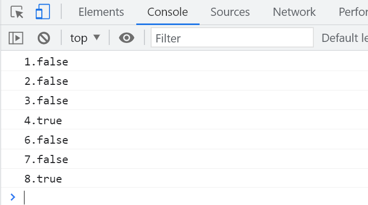

## `isNaN` 判断是否为非数

`isNaN` 函数用于判断一个值是否为 `NaN`。

```javascript
console.log(`1. ${isNaN(NaN)}`); // 输出: 1. true
console.log(`2. ${isNaN(123)}`); // 输出: 2. false
console.log(`3. ${isNaN('123')}`); // 输出: 3. false
console.log(`4. ${isNaN('a')}`); // 输出: 4. true
console.log(`5. ${isNaN(null)}`); // 输出: 5. false
console.log(`6. ${isNaN(undefined)}`); // 输出: 6. true
```

**结果**

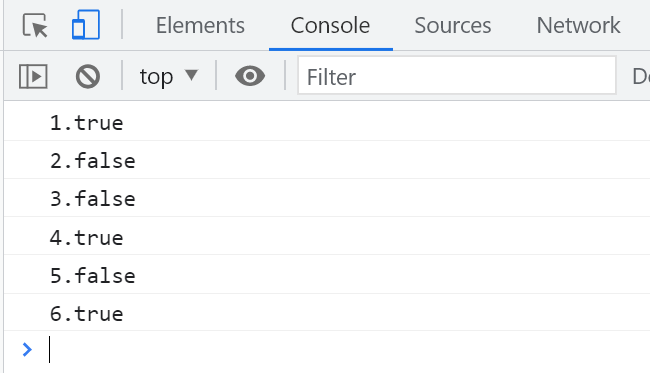

# 斐波那契数列

斐波那契数列是由 `1 1 2 3 5 8` 开始，每一位都是前两位的和。以下示例使用 `for` 循环打印斐波那契数列的第 N 位数字。

```javascript
const n = parseInt(window.prompt('请输入第几位'));
let n1 = 1;
let n2 = 1;
let n3;

if (n <= 0) {
  console.log('输入错误');
} else if (n === 1 || n === 2) {
  console.log(1);
} else {
  for (let i = 2; i < n; i++) {
    n3 = n1 + n2;
    n1 = n2;
    n2 = n3;
    // 向右移动
  }
  console.log(n3);
}
```

# JavaScript 函数

## 函数声明与调用

函数是执行特定任务的代码块，可以重复使用。

```javascript
function greet(name) {
  return `Hello, ${name}!`;
}

const message = greet('海绵宝宝');
console.log(message); // 输出: Hello, 海绵宝宝!
```

## 函数表达式

函数可以作为表达式赋值给变量。

```javascript
const add = function (a, b) {
  return a + b;
};

console.log(add(2, 3)); // 输出: 5
```

## 箭头函数

箭头函数是更简洁的函数写法，尤其适用于匿名函数。

```javascript
const multiply = (a, b) => a * b;

console.log(multiply(4, 5)); // 输出: 20
```

## 回调函数

回调函数是作为参数传递给另一个函数的函数，用于异步操作或事件处理。

```javascript
function fetchData(callback) {
  setTimeout(() => {
    const data = { id: 1, name: '海绵宝宝' };
    callback(data);
  }, 1000);
}

fetchData(function (data) {
  console.log('接收到数据:', data);
});
// 输出（延迟1秒后）: 接收到数据: { id: 1, name: '海绵宝宝' }
```

## 匿名函数

匿名函数是没有名称的函数，常用于回调或立即执行函数表达式（IIFE）。

```javascript
// 作为回调使用
setTimeout(function () {
  console.log('这是一个匿名函数');
}, 2000);

// 立即执行函数表达式
(function () {
  console.log('立即执行的匿名函数');
})();
```

## 递归函数

递归函数是调用自身的函数，用于解决分解为更小的同类问题的问题。

```javascript
function factorial(n) {
  if (n <= 1) return 1;
  return n * factorial(n - 1);
}

console.log(factorial(5)); // 输出: 120
```

# 正则表达式

正则表达式用于匹配字符串中的模式。

## 创建正则表达式

可以使用字面量或构造函数创建正则表达式。

```javascript
// 使用字面量
const regex1 = /hello/i;

// 使用构造函数
const regex2 = new RegExp('hello', 'i');
```

## 常用方法

### `test` 方法

`test` 方法用于测试字符串是否匹配正则表达式，返回布尔值。

```javascript
const regex = /world/i;
console.log(regex.test('Hello World')); // 输出: true
console.log(regex.test('Hello')); // 输出: false
```

### `exec` 方法

`exec` 方法用于执行匹配，返回匹配结果数组或 `null`。

```javascript
const regex = /(\w+) (\w+)/;
const result = regex.exec('Hello World');

console.log(result);
// 输出: ["Hello World", "Hello", "World", index: 0, input: "Hello World", groups: undefined]
```

### 字符集与量词

```javascript
const regex = /^[A-Za-z0-9]{5,10}$/;
console.log(regex.test('abc123')); // 输出: true
console.log(regex.test('ab')); // 输出: false
```

## 常用模式

- `^`：匹配字符串开头。
- `$`：匹配字符串结尾。
- `.`：匹配除换行符外的任何单个字符。
- `*`：匹配前一个字符零次或多次。
- `+`：匹配前一个字符一次或多次。
- `?`：匹配前一个字符零次或一次。
- `\d`：匹配数字。
- `\w`：匹配字母、数字或下划线。
- `\s`：匹配空白字符。
