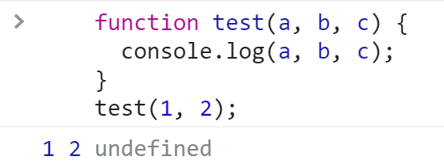
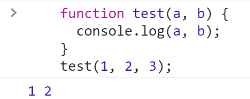
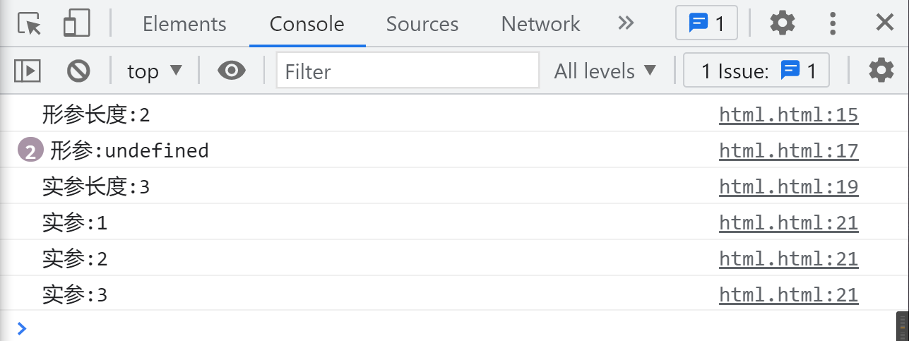
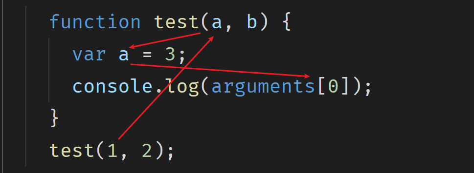
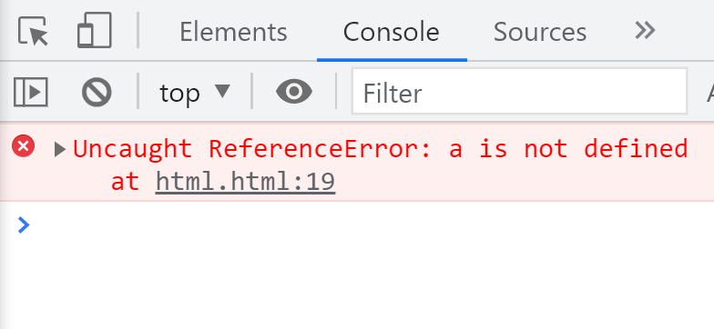

# 函数

```javascript
function test(parameter) {
  // Function execution statements
}
```

## 耦合

各个代码块中存在较高的代码重复度。优秀的代码应具备高内聚、低耦合的特点。通常希望一个代码块只完成一个功能，减少对其他模块的依赖。为了降低耦合度，可以多使用函数，通过调用函数来实现功能。

例如，一个项目中有二十个方法调用良好，但如果其中一个方法需要修改，其他十九个方法也必须进行相应的修改，这就是高耦合，独立性差的表现。

## 函数名命名规则

函数名不能以数字开头，必须以字母、下划线或美元符号开头，后续可以包含数字。ECMA 建议使用小驼峰命名法，例如`myTestHello`。

## 表达式函数

```javascript
// 表达式 字面量
var testFunction = function test1() {
  var a = 1,
    b = 1;
  console.log(a, b);
};
console.log(testFunction.name);
// 调用函数，函数名需为表达式中的名字
testFunction();
```

### 匿名函数表达式

使用`var testFunction = function ()`这种定义方式称为匿名函数表达式。

```javascript
var testFunction = function () {
  var a = 1,
    b = 1;
  console.log(a, b);
};
testFunction();
```

### 函数名`test1`的作用

在函数内部调用自身，这种方式称为递归。

```javascript
var testFunction = function test1() {
  var a = 1,
    b = 1;
  console.log(a, b);
  test1();
};
testFunction();
```

## 在调用函数时传递参数

```javascript
var numA = Number(window.prompt('请输入a的值'));
var numB = Number(window.prompt('请输入b的值'));
// 函数中的a和b是形式参数，通过调用时传递的实参赋值
function test(a, b) {
  console.log(a + b);
}
// 实际值，实参
test(numA, numB);
```

形参可以接收任何数据类型。

```javascript
function test(a, b) {
  console.log(a, b);
}
test('false', NaN);
```

## 传参的几种情况

传入的实参少于形参。

```javascript
function test(a, b, c) {
  console.log(a, b, c);
}
test(1, 2);
```

**结果**



传入的实参多于形参。

```javascript
function test(a, b) {
  console.log(a, b);
}
test(1, 2, 3);
```

**结果**



形参和实参的数量可以不相等。

## 函数内部是否知道实参和形参

```javascript
function test(a, b) {
  console.log('形参长度: ' + test.length);
  for (var i = 0; i < test.length; i++) {
    console.log('形参: ' + arguments[i]);
  }
  console.log('实参长度: ' + arguments.length);
  for (var q = 0; q < arguments.length; q++) {
    console.log('实参: ' + arguments[q]);
  }
}
test(1, 2, 3);
```

结论，函数内部可以通过`arguments`对象知道实参和形参。



## 实参求和

```javascript
function sum() {
  var total = 0;
  for (var i = 0; i < arguments.length; i++) {
    total += arguments[i];
  }
  console.log(total);
}
sum(1, 2, 3, 4, 5);
```

## 更改实参的值

```javascript
function modifyArgs1(a, b) {
  a = 3;
  console.log(arguments[0]);
}
modifyArgs1(1, 2);

function modifyArgs2(a, b) {
  b = 3;
  console.log(arguments[0]);
  console.log(arguments[1]);
}
modifyArgs2(1);
```



## 返回值

函数的返回值有以下两种作用：

终止函数运行。

```javascript
function test() {
  console.log('正在执行');
  console.log('函数执行完毕，结束运行');
  // JS引擎会默认添加一个return
}
test();
```

返回期望的值。

```javascript
function getName(name) {
  if (!name) {
    return 'IF';
  }
  return name;
}
console.log(getName());

// 或者使用逻辑运算符
function getName(name) {
  return name || '没有姓名';
}
console.log(getName());
```

# 打印函数内部的值

```javascript
function test() {
  var a = 1;
}
console.log(a);
```

**结果**



## 全局变量与局部变量

```javascript
// 全局变量
var a = 1;

function test1() {
  // 局部变量
  var b = 2;
  console.log(a, b);

  function test2() {
    // 局部变量
    var c = 3;
    // 内部函数可以访问外部变量
    console.log(a, b, c);
  }
  test2();
  // 外部函数无法访问内部函数的变量
}
console.log(a);
test1();
```

`test1`和`test2`之间相互无法访问对方的局部变量。

```javascript
function test1() {
  var a = 1;
  console.log(b);
}

function test2() {
  var b = 2;
  console.log(a);
}
// Uncaught ReferenceError: b is not defined
test1();
test2();
```

# 练习

## 不使用 for 循环实现 n 的阶乘

使用递归，调用自身。

```javascript
function factorial(n) {
  if (n === 1) {
    return 1;
  }
  // 等待递归结果再返回
  return n * factorial(n - 1);
}
console.log(factorial(5));
```

## 函数 - 斐波那契数列

前两项之和等于第三项。

```javascript
function fibonacci(n) {
  if (n <= 0) {
    return 0;
  }
  if (n <= 2) {
    return 1;
  }
  return fibonacci(n - 1) + fibonacci(n - 2);
}
console.log(fibonacci(6));
```

**使用递归时需注意**

找到函数的出口，即`return`的值。

确定计算的规律。

---
