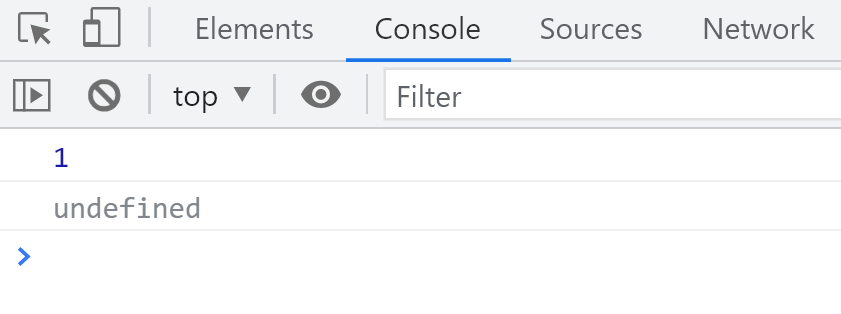
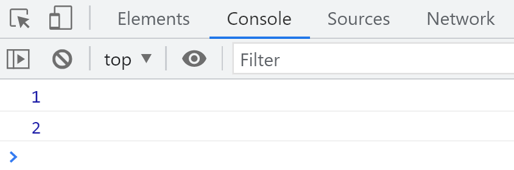
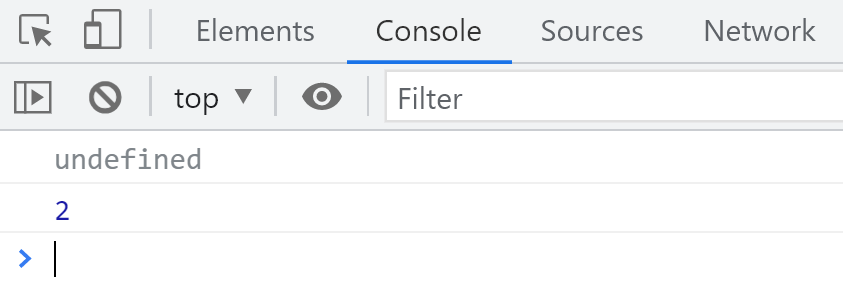

# 判断 AO

在 JavaScript 中，执行上下文包含两个重要的部分：活动对象（AO）和全局对象（GO）。判断 AO 的步骤如下：

寻找函数的形参和变量声明，将它们作为 AO 的属性名，初始值为 `undefined`。
将实参的值赋给对应的形参。
查找函数声明，并将函数体赋值给相应的属性。
执行函数。

# 判断 GO

全局执行上下文（GO）的判断步骤如下：

查找全局变量，将它们赋值为 `undefined`。
查找函数声明，并将函数体赋值给相应的属性。
按照代码的顺序依次执行。

# 作用域

## 对象

对象由属性和方法组成。

属性是键名后跟着字符串或其他数据类型的值。方法是键名后跟着一个匿名函数。可以使用点语法来访问对象的属性和方法。

```javascript
var obj = {
  name: '蓝轨迹',
  address: '北京',
  teach: function () {
    console.log('教学中...');
  },
};
// 使用点语法访问对象的属性
console.log(obj.name);
// 调用对象的方法
obj.teach();
```

## 函数也是一种对象类型，引用类型

在 JavaScript 中，函数也是对象，具有属性和方法。

```javascript
function testFunction() {}

console.log(testFunction.name); // 输出函数名
console.log(testFunction.length); // 输出函数参数的个数
```

然而，有些属性是 JavaScript 引擎内部的隐式属性，无法直接访问。

## [[scope]]

`[[scope]]` 是函数在创建时生成的一个隐式属性，用于存储函数的作用域链。这个属性只能由 JavaScript 引擎读取，不可直接访问。

`[[scope]]` 的作用是存储作用域链，包括活动对象（AO）和全局对象（GO）。当函数执行结束后，AO 会被销毁，但作用域链的引用确保了闭包的存在。

# 作用域链

作用域链是由多个执行上下文的变量对象（VO）按照创建顺序组成的链表，用于查找变量和函数。

```javascript
function a() {
  function b() {
    var b = 2;
    console.log(b);
  }

  var a = 1;
  b();
}

var c = 3;
a();
```

当函数 `a` 被定义时，系统生成 `[[scope]]` 属性，保存全局执行上下文 `GO` 的引用。执行 `a` 函数时，创建新的执行上下文，将 `a` 的 AO 放在作用域链的顶端，接着是 `GO`。在 `a` 内部定义并执行函数 `b`，`b` 的作用域链包含 `b` 的 AO、`a` 的 AO 以及 `GO`。


1. 每个函数在定义时包含全局执行上下文 `GO`。
2. 执行函数时，新的 AO 被添加到作用域链的顶端。
3. 查找变量时，从作用域链的顶端开始，逐层向下查找。

这种机制解释了为什么内部函数可以访问外部函数的变量，而外部函数无法访问内部函数的变量。


当函数执行结束后，其 AO 被销毁，作用域链恢复到之前的状态。

# 闭包

闭包是 JavaScript 中一个重要的概念，指的是一个函数能够记住并访问其定义时的词法作用域，即使在其外部执行。

[学习 JavaScript 闭包（Closure） - 阮一峰的网络日志](https://www.ruanyifeng.com/blog/2009/08/learning_javascript_closures.html)

```javascript
function test1() {
  function test2() {
    var b = 2;
    console.log(a);
  }

  var a = 1;
  return test2;
}

var test3 = test1();
test3(); // 输出 1
```

当 `test1` 被执行时，`test2` 被定义并返回。尽管 `test1` 已经执行完毕，其 AO 仍被 `test2` 的闭包引用，因此 `test2` 可以访问 `a` 变量。

## 闭包的产生

当内部函数被返回并在外部环境中使用时，闭包产生。闭包会保持对外部函数作用域的引用，防止这些变量被垃圾回收。过度使用闭包可能导致内存泄漏或性能问题。

[为什么 JavaScript 的闭包被称为闭包？ - 知乎](https://www.zhihu.com/question/35177512)

[闭包 - JavaScript | MDN](https://developer.mozilla.org/zh-CN/docs/Web/JavaScript/Closures)

在 JavaScript 中，每当创建一个函数，闭包就会在函数创建的同时被创建出来。

## 同时返回两个函数

```javascript
function createFunctions() {
  var count = 100;

  function increment() {
    count++;
    console.log(count);
  }

  function decrement() {
    count--;
    console.log(count);
  }

  return [increment, decrement];
}

var functions = createFunctions();
functions[0](); // 输出 101
functions[1](); // 输出 100
```

## 面包管理器（闭包案例）

```javascript
function breadManager(initialCount) {
  var breadCount = initialCount || 10;

  function supply() {
    breadCount += 10;
    console.log('面包供应量:', breadCount);
  }

  function sale() {
    breadCount--;
    console.log('面包剩余量:', breadCount);
  }

  return [supply, sale];
}

var manager = breadManager(50);
manager[0](); // 输出 面包供应量: 60
manager[1](); // 输出 面包剩余量: 59
```

## 星期天管理器（闭包案例）

```javascript
function sundayScheduler() {
  var schedule = '';

  var operations = {
    setSchedule: function (task) {
      schedule = task;
      console.log('安排已设置:', schedule);
    },
    showSchedule: function () {
      console.log('我的星期天安排是: ' + schedule);
    },
  };

  return operations;
}

var scheduler = sundayScheduler();

scheduler.setSchedule('学习 JavaScript');
scheduler.showSchedule(); // 输出 我的星期天安排是: 学习 JavaScript
```

## 闭包的三个特点

1. **函数嵌套函数**：内部函数嵌套在外部函数中。
2. **内部函数访问外部函数的参数和变量**：内部函数可以访问外部函数的参数和变量。
3. **外部函数执行结束后，内部函数仍然保持对外部函数作用域的引用**：即使外部函数已执行完毕，内部函数依然可以访问外部函数的变量。

# 练习

## test1

```javascript
function test() {
  return a;
  a = 1;

  function a() {}

  var a = 2;
}

console.log(test());
```

**解析：**

在函数 `test` 中，变量 `a` 和函数 `a` 同名。在预解析阶段，函数声明会覆盖变量声明。因此，`a` 最终指向函数 `a`。

```javascript
// 预解析后的 AO:
AO = {
  a: function a() {},
};
```

执行 `return a;` 时，返回的是函数 `a`。

**输出：**

```javascript
[Function: a]
```

## test2

```javascript
console.log(test());

function test() {
  a = 1;

  function a() {}

  var a = 2;
}
```

**解析：**

函数 `test` 中，`a` 被赋值为 `1`，但由于存在函数声明，`a` 最终指向变量 `a`。在预解析阶段，函数声明会覆盖变量声明，因此 `a` 被初始化为函数 `a`，然后被赋值为 `1`，最后赋值为 `2`。

```javascript
// 预解析后的 AO:
AO = {
  a: function a() {},
};

a = 1;
a = 2;
```

`return a;` 被隐式添加，但由于函数体中没有 `return` 语句，默认返回 `undefined`。因此，`console.log(test());` 输出 `undefined`。

**输出：**

```javascript
undefined;
```

## test3

```javascript
a = 1;

function test(e) {
  function e() {}

  arguments[0] = 2;
  console.log(e);
  if (a) {
    var b = 3;
  }
  var c;
  a = 4;
  var a;
  console.log(b);
  f = 5;
  console.log(c);
  console.log(a);
}

var a;
test(1);
console.log(a);
console.log(f);
```

**解析：**

在全局执行上下文 `GO` 中：

```javascript
GO = {
  a: undefined,
  test: function test(e) {},
  f: undefined,
};
```

执行 `a = 1;` 将 `a` 赋值为 `1`。

执行 `test(1);` 时，创建新的执行上下文 `AO`：

```javascript
AO = {
  e: undefined, // 函数声明优先
  a: undefined,
  b: undefined,
  c: undefined,
};
```

预解析阶段：

1. 函数声明 `e` 覆盖了参数 `e`。
2. 变量 `a`、`b`、`c` 被声明，初始值为 `undefined`。

执行过程：

1. `arguments[0] = 2;` 修改参数 `e` 的值为 `2`。
2. `console.log(e);` 输出 `2`。
3. `if (a)`，由于 `a` 是全局变量，值为 `1`（真），执行 `var b = 3;`。
4. `var c;`，`c` 已声明，保持 `undefined`。
5. `a = 4;` 修改全局变量 `a` 为 `4`。
6. `var a;`，已经处理过变量提升。
7. `console.log(b);` 输出 `3`。
8. `f = 5;` 隐式创建全局变量 `f`，赋值为 `5`。
9. `console.log(c);` 输出 `undefined`。
10. `console.log(a);` 输出全局变量 `a` 的值 `4`。

执行结束后，全局变量 `a` 为 `4`，`f` 为 `5`。

**输出：**

```javascript
2;
3;
undefined;
4;
4;
5;
```

## arguments

`arguments` 对象是函数内部的一个类数组对象，包含了传递给函数的所有实参。它提供了一种获取函数所有参数的方法。

```javascript
function func1(a, b, c) {
  console.log((arguments[0] = 2)); // 修改第一个参数
  // 输出: 2

  console.log(arguments[1]); // 输出第二个参数
  // 输出: 2

  console.log(arguments[2]); // 输出第三个参数
  // 输出: 3
}

func1(1, 2, 3);
```

**解析：**

1. `arguments[0] = 2;` 修改了第一个参数 `a` 的值。
2. `arguments[1]` 输出的是第二个参数 `b` 的值。
3. `arguments[2]` 输出的是第三个参数 `c` 的值。

**输出：**

```javascript
2;
2;
3;
```

# 练习

## 不使用 for 循环实现 n 的阶乘

使用递归函数来计算阶乘。

```javascript
function factorial(n) {
  if (n === 1) {
    return 1;
  }
  // 等待递归结果再返回
  return n * factorial(n - 1);
}

console.log(factorial(5)); // 输出 120
```

## 函数 - 斐波那契数列

计算斐波那契数列的第 n 项。

```javascript
function fibonacci(n) {
  if (n <= 0) {
    return 0;
  }
  if (n <= 2) {
    return 1;
  }
  return fibonacci(n - 1) + fibonacci(n - 2);
}

console.log(fibonacci(6)); // 输出 8
```

**使用递归时需注意**

1. **找到函数的出口**：确保递归有终止条件，如上例中的 `n === 1` 和 `n === 2`。
2. **确定计算的规律**：明确如何将问题分解为更小的子问题，例如斐波那契数列的递归关系。

---

# 练习

## test1

```javascript
function test() {
  return a;
  a = 1;

  function a() {}

  var a = 2;
}

console.log(test());
```

**解析：**

在函数 `test` 中，变量 `a` 先被声明为函数 `a`，然后被赋值为 `1`，最后被赋值为 `2`。由于函数声明优先于变量声明，`a` 最终指向变量 `a`。

**输出：**

```javascript
2;
```

## test2

```javascript
console.log(test());

function test() {
  a = 1;

  function a() {}

  var a = 2;
}
```

**解析：**

函数 `test` 中，变量 `a` 被赋值为 `1`，然后被赋值为 `2`。由于函数声明优先，`a` 最终指向变量 `a`。

**输出：**

```javascript
2;
```

## test3

```javascript
a = 1;

function test(e) {
  function e() {}

  arguments[0] = 2;
  console.log(e);
  if (a) {
    var b = 3;
  }
  var c;
  a = 4;
  var a;
  console.log(b);
  f = 5;
  console.log(c);
  console.log(a);
}

var a;
test(1);
console.log(a);
console.log(f);
```

**解析：**

在全局执行上下文 `GO` 中：

```javascript
GO = {
  a: undefined,
  test: function test(e) {},
  f: undefined,
};
```

执行 `a = 1;` 将 `a` 赋值为 `1`。

执行 `test(1);` 时，创建新的执行上下文 `AO`：

```javascript
AO = {
  e: undefined, // 函数声明优先
  a: undefined,
  b: undefined,
  c: undefined,
};
```

执行过程：

1. `arguments[0] = 2;` 修改参数 `e` 的值为 `2`。
2. `console.log(e);` 输出 `2`。
3. `if (a)`，全局变量 `a` 为 `1`（真），执行 `var b = 3;`。
4. `var c;`，保持 `undefined`。
5. `a = 4;` 修改全局变量 `a` 为 `4`。
6. `var a;`，已经处理过变量提升。
7. `console.log(b);` 输出 `3`。
8. `f = 5;` 隐式创建全局变量 `f`，赋值为 `5`。
9. `console.log(c);` 输出 `undefined`。
10. `console.log(a);` 输出全局变量 `a` 的值 `4`。

执行结束后，全局变量 `a` 为 `4`，`f` 为 `5`。

**输出：**

```javascript
2;
3;
undefined;
4;
4;
5;
```

## arguments

使用 `arguments` 对象获取函数的所有参数。

```javascript
function func1(a, b, c) {
  console.log((arguments[0] = 2)); // 输出: 2
  console.log(arguments[1]); // 输出: 2
  console.log(arguments[2]); // 输出: 3
}

func1(1, 2, 3);
```

**解析：**

1. `arguments[0] = 2;` 修改了第一个参数 `a` 的值。
2. `arguments[1]` 输出的是第二个参数 `b` 的值。
3. `arguments[2]` 输出的是第三个参数 `c` 的值。

**输出：**

```javascript
2;
2;
3;
```

# 作用域链全流程

```javascript
function a() {
  function b() {
    function c() {}
    c();
  }
  b();
}

a();
```

**解析：**

1. **函数定义阶段**：
   - 定义函数 `a`，`b`，`c`，并创建它们的 `[[scope]]` 属性。
2. **执行 `a()`**：
   - 创建 `a` 的执行上下文，AO 包含 `a` 函数自身。
   - 作用域链：`a` 的 AO → `GO`。
3. **执行 `b()`**：
   - 创建 `b` 的执行上下文，AO 包含 `b` 函数自身。
   - 作用域链：`b` 的 AO → `a` 的 AO → `GO`。
4. **执行 `c()`**：
   - 创建 `c` 的执行上下文，AO 包含 `c` 函数自身。
   - 作用域链：`c` 的 AO → `b` 的 AO → `a` 的 AO → `GO`。
5. **函数执行结束**：
   - `c` 执行结束，销毁 `c` 的 AO。
   - `b` 执行结束，销毁 `b` 的 AO。
   - `a` 执行结束，销毁 `a` 的 AO。
6. **全局执行上下文**：
   - 当关闭浏览器窗口时，全局执行上下文 `GO` 被销毁。


---

# 参考链接

- [Scope（作用域） - 术语表 | MDN](https://developer.mozilla.org/zh-CN/docs/Glossary/Scope)
- [学习 JavaScript 闭包（Closure） - 阮一峰的网络日志](https://www.ruanyifeng.com/blog/2009/08/learning_javascript_closures.html)
- [闭包 - JavaScript | MDN](https://developer.mozilla.org/zh-CN/docs/Web/JavaScript/Closures)
- [为什么 JavaScript 的闭包被称为闭包？ - 知乎](https://www.zhihu.com/question/35177512)

# 练习

## test1

```javascript
function test() {
  return a;
  a = 1;

  function a() {}

  var a = 2;
}

console.log(test()); // 输出: 2
```

## test2

```javascript
console.log(test()); // 输出: 2

function test() {
  a = 1;

  function a() {}

  var a = 2;
}
```

## test3

```javascript
a = 1;

function test(e) {
  function e() {}

  arguments[0] = 2;
  console.log(e); // 输出: 2
  if (a) {
    var b = 3;
  }
  var c;
  a = 4;
  var a;
  console.log(b); // 输出: 3
  f = 5;
  console.log(c); // 输出: undefined
  console.log(a); // 输出: 4
}

var a;
test(1);
console.log(a); // 输出: 4
console.log(f); // 输出: 5
```

## arguments

```javascript
function func1(a, b, c) {
  console.log((arguments[0] = 2)); // 输出: 2
  console.log(arguments[1]); // 输出: 2
  console.log(arguments[2]); // 输出: 3
}

func1(1, 2, 3);
```

# 闭包

```javascript
function test1() {
  function test2() {
    var b = 2;
    console.log(a);
  }

  var a = 1;
  return test2;
}

var test3 = test1();
test3(); // 输出: 1
```

# 作用域链全流程

```javascript
function a() {
  function b() {
    function c() {}
    c();
  }
  b();
}

a();
```

---

# 结语

通过本章内容的学习，我们深入理解了 JavaScript 中的函数、作用域、作用域链以及闭包的概念和实现机制。这些知识点对于编写高质量、可维护的代码至关重要。请结合实际项目多加练习，以巩固所学知识。

---

# 参考链接

- [Scope（作用域） - 术语表 | MDN](https://developer.mozilla.org/zh-CN/docs/Glossary/Scope)
- [学习 JavaScript 闭包（Closure） - 阮一峰的网络日志](https://www.ruanyifeng.com/blog/2009/08/learning_javascript_closures.html)
- [闭包 - JavaScript | MDN](https://developer.mozilla.org/zh-CN/docs/Web/JavaScript/Closures)
- [为什么 JavaScript 的闭包被称为闭包？ - 知乎](https://www.zhihu.com/question/35177512)

# 完整示例

以下是综合上述知识点的一个完整示例，展示了作用域链和闭包的应用：

```javascript
function outerFunction(outerVariable) {
  var outerVar = outerVariable;

  function innerFunction(innerVariable) {
    var innerVar = innerVariable;
    console.log('外部变量:', outerVar);
    console.log('内部变量:', innerVar);
  }

  return innerFunction;
}

var newFunction = outerFunction('外部值');
newFunction('内部值');
// 输出:
// 外部变量: 外部值
// 内部变量: 内部值
```

在这个示例中，`innerFunction` 形成了一个闭包，能够访问 `outerFunction` 的变量 `outerVar`，即使 `outerFunction` 已经执行完毕。

---

# 练习

## 递归函数示例

```javascript
function countdown(n) {
  if (n < 0) {
    return;
  }
  console.log(n);
  countdown(n - 1);
}

countdown(5);
// 输出:
// 5
// 4
// 3
// 2
// 1
// 0
```

## 闭包应用示例

```javascript
function createCounter() {
  var count = 0;

  return {
    increment: function () {
      count++;
      console.log('计数器:', count);
    },
    decrement: function () {
      count--;
      console.log('计数器:', count);
    },
  };
}

var counter = createCounter();
counter.increment(); // 输出: 计数器: 1
counter.increment(); // 输出: 计数器: 2
counter.decrement(); // 输出: 计数器: 1
```

在这个示例中，`createCounter` 返回的对象包含了两个函数，这两个函数形成了一个闭包，能够访问和修改 `count` 变量。

# 进一步学习

为了更深入地理解 JavaScript 的作用域和闭包，建议参考以下资源：

- [JavaScript 高级程序设计（第 3 版）](https://book.douban.com/subject/30461342/)：一本详尽介绍 JavaScript 高级概念的书籍。
- [You Don't Know JS 系列](https://github.com/getify/You-Dont-Know-JS)：开源书籍系列，深入解析 JavaScript 的核心机制。

通过持续学习和实践，您将能够更好地掌握 JavaScript 的作用域、闭包以及其他高级特性，从而编写出更高效、可维护的代码。

# 初始化参数

在函数执行期间，参数的默认赋值是`undefined`。

```javascript
function test(a, b) {
  console.log(a);
  console.log(b);
}
test(1);
```

结果



## 默认值

```javascript
function test(a = 1, b) {
  console.log(a);
  console.log(b);
}
test(undefined, 2);
```

结果


---

```javascript
function test(a = undefined, b) {
  console.log(a);
  console.log(b);
}
test(1, 2);
```

结果



---

```javascript
function test(a, b) {
  console.log(a);
  console.log(b);
}
test(undefined, 2);
```

结果




只要参数不是`undefined`就使用传入的值，如果都是`undefined`就打印`undefined`。

---

# 如何给参数赋默认值

> 如果实参没传就使用后面的值，相当于给参数一个默认值。

```javascript
function test(a, b) {
  var a = arguments[0] || 1;
  var b = arguments[1] || 2;
  console.log(a + b);
}
test(3, 4);
```

上述写法存在一个问题，如果传入的值不是`undefined`而是其他`falsy`值，会被隐式转换，导致`||`后面的值被使用。

```javascript
function test(a, b) {
  var a, b;
  if (typeof arguments[0] !== 'undefined') {
    a = arguments[0];
  } else {
    a = 1;
  }
  if (typeof arguments[1] !== 'undefined') {
    b = arguments[1];
  } else {
    b = 2;
  }
  console.log(a + b);
}
test(0, 0);
```

使用`if`配合`typeof`可以准确判断`undefined`，避免程序出现问题。

```javascript
function test(a, b) {
  var a = typeof arguments[0] !== 'undefined' ? arguments[0] : 1;
  var b = typeof arguments[1] !== 'undefined' ? arguments[1] : 2;
  console.log(a + b);
}
test('', 1);
```

通过三元表达式检测`typeof`来赋默认值。

---

# 预编译

> `JavaScript`引擎的工作流程

语法分析，由上至下，从左到右检查语法错误。

预编译阶段。

解释执行，一行一行地解释和执行代码。

## 两个现象

```javascript
test();
function test() {
  console.log(1);
}
```

正常打印`1`

```javascript
console.log(a);
var a = 10;

console.log(b);
var b;
```

打印`undefined`

## 总结

函数声明会被提升到整个代码的顶部。

变量只有声明会被提升，赋值不会被提升。

# 隐式全局变量

`隐式全局变量`

```javascript
// var a =1;
a = 1;
console.log(a);
```

上述代码，无论是否使用`var`，都会正常打印`1`。这是因为未声明变量会自动成为全局变量。

```javascript
var a = 1;
b = 2;
console.log(a);
// window.a 也可以正常打印
console.log(window.a);

// 因为不论是否使用var，变量都属于Window对象
window = {
  a: 1,
  b: 2,
};
```

即`a === window.a`，所有**全局变量**都属于`Window`对象。

```javascript
// 全局变量
var a = 1;
// 隐式全局变量
b = 2;
console.log(a);
console.log(window.a);
```

## 特性

```javascript
function test() {
  var a = (b = 1);
}
test();
console.log(b);
```

在函数内部没有声明变量`b`，因此`b`被提升到全局`Window`对象。

```javascript
function test() {
  var a = (b = 1);
}
test();
// console.log(a);
console.log(window.a);
```

**为什么 `console.log(a);` 报错而 `console.log(window.a);` 打印`undefined`**

因为`a`在全局作用域中未定义，而`window.a`尝试从`Window`对象中查找，未找到则返回`undefined`。

# 函数预编译做了什么

## AO

> **Activation Object** 函数上下文，针对函数

创建`AO`对象。

```git
    AO= {

    }
```

查找函数的形参和变量声明，作为`AO`的属性，初始值为`undefined`。

将实参值赋给形参。

查找函数声明，并赋值函数体。

执行函数。

### 例一

```javascript
function test(a) {
  console.log(a);
  var a = 1;
  console.log(a);

  function a() {}
  console.log(a);
  var b = function () {}
  console.log(b);

  function d() {}
}
test(2);

AO = {
  a: undefined
  -> 2
  -> function a() {}
  -> 1,
  b: undefined
  -> function () {}
  d: function d() {}
}
```

### 例二

```javascript
function test(a, b) {
  console.log(a);
  c = 0;
  var c;
  a = 5;
  b = 6;
  console.log(b);

  function b() {}

  function d() {}
  console.log(b);
}
test(1);

AO{
  a: undefined,
  ->1
  ->5
  b: undefined,
  ->function b() {}
  ->6
  c: undefined,
  ->0
  d: function d() {}
}
```

## GO

> **Global Object** 全局上下文
>
> **GO** 等同于 **Window**

创建`GO`对象。

```javascript
GO{

}
```

查找变量声明，赋值为`undefined`，**GO 没有参数**

查找函数声明。

按顺序执行代码。

```javascript
console.log(a,b);
function a(){}
var b = function(){}

GO{
  b: undefined
  a: function a(){}
}
```

```javascript
function test(){
  var a = b =1;
  console.log(a);
}
test();

GO{
  b:1
}

AO={
  a: undefined ->1
}
```

```javascript
var b = 3;
console.log(a);

function a(a) {
  console.log(a);
  var a = 2;
  console.log(a);

  function a() {
    var b = 5;
    console.log(b);
  }
}
a(1);

GO{
  b: undefined
  -> 3
  a: function a(){...}
}
AO{
  a: undefined
  ->1
  -> function a() {
  }
  2
  b: undefined
  ->5
}
```

`AO`中存在变量时，不会去`GO`中查找。

```javascript
a = 1;

function test() {
  // AO中有a，不去GO中查找
  console.log(a);
  a = 2;
  console.log(a);
  var a = 3;
  console.log(a);
}
test();

GO{
  a: undefined
  1
  test: undefined
}

AO{
  a: undefined
  undefined
  2
  3
}
```

使用`var`声明的变量作用域为当前作用域，直接声明为全局变量。

```javascript
function test() {
  console.log(b);
  if (a) {
    var b = 2;
  }
  c = 3;
  console.log(c);
}

var a =1;
test();
a = 1;
console.log(a);

GO{
  a: undefined
  1
  test: function test(){}
  c: 3
}
AO{
  b: undefined
}
```

# 练习

```javascript
var a = false + 1;
console.log(a);
// false 隐式类型转换为 0，结果为 1
```

```javascript
var b = false == 1;
console.log(b);
// 比较运算输出布尔值类型，结果为 false
```

```javascript
// 字符串的 undefined 是 true，-true = -1，+undefined = NaN
if (typeof a && -true + +undefined + '') {
  console.log('通过');
} else {
  console.log('未通过');
}
console.log(typeof a);
```

```javascript
// 字符串 '3' 隐式转换成 number
if (1 + 5 * '3' === 16) {
  console.log('通过了');
} else {
  console.log('未通过');
}
```

```javascript
// 1 + 0 - 0 = 1，不往后执行
console.log(!!' ' + !!'' - !!false || '未通过');
```
