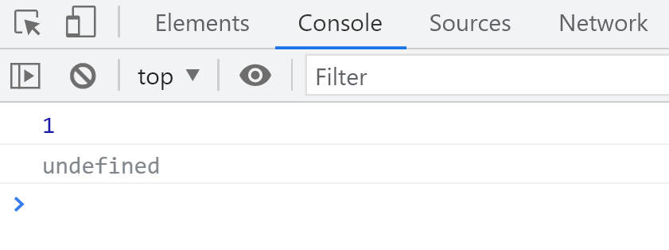
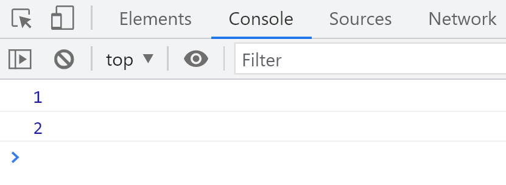
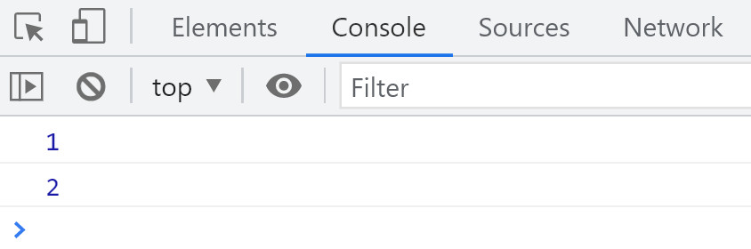
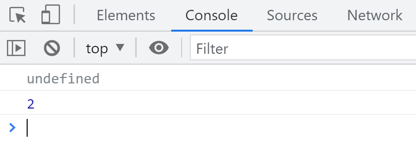

# 初始化参数

在函数执行期间，参数的默认赋值是`undefined`。

```javascript
function test(a, b) {
  console.log(a);
  console.log(b);
}
test(1);
```

结果



## 默认值

```javascript
function test(a = 1, b) {
  console.log(a);
  console.log(b);
}
test(undefined, 2);
```

结果



---

```javascript
function test(a = undefined, b) {
  console.log(a);
  console.log(b);
}
test(1, 2);
```

结果



---

```javascript
function test(a, b) {
  console.log(a);
  console.log(b);
}
test(undefined, 2);
```

结果



## 总结

只要参数不是`undefined`就使用传入的值，如果都是`undefined`就打印`undefined`。

---

# 如何给参数赋默认值

> 如果实参没传就使用后面的值，相当于给参数一个默认值。

```javascript
function test(a, b) {
  var a = arguments[0] || 1;
  var b = arguments[1] || 2;
  console.log(a + b);
}
test(3, 4);
```

上述写法存在一个问题，如果传入的值不是`undefined`而是其他`falsy`值，会被隐式转换，导致`||`后面的值被使用。

```javascript
function test(a, b) {
  var a, b;
  if (typeof arguments[0] !== 'undefined') {
    a = arguments[0];
  } else {
    a = 1;
  }
  if (typeof arguments[1] !== 'undefined') {
    b = arguments[1];
  } else {
    b = 2;
  }
  console.log(a + b);
}
test(0, 0);
```

使用`if`配合`typeof`可以准确判断`undefined`，避免程序出现问题。

```javascript
function test(a, b) {
  var a = typeof arguments[0] !== 'undefined' ? arguments[0] : 1;
  var b = typeof arguments[1] !== 'undefined' ? arguments[1] : 2;
  console.log(a + b);
}
test('', 1);
```

通过三元表达式检测`typeof`来赋默认值。

---

# 预编译

> `JavaScript`引擎的工作流程

语法分析，由上至下，从左到右检查语法错误。

预编译阶段。

解释执行，一行一行地解释和执行代码。

## 两个现象

```javascript
test();
function test() {
  console.log(1);
}
```

正常打印`1`

```javascript
console.log(a);
var a = 10;

console.log(b);
var b;
```

打印`undefined`

## 总结

函数声明会被提升到整个代码的顶部。

变量只有声明会被提升，赋值不会被提升。

# 隐式全局变量

`隐式全局变量`

```javascript
// var a =1;
a = 1;
console.log(a);
```

上述代码，无论是否使用`var`，都会正常打印`1`。这是因为未声明变量会自动成为全局变量。

```javascript
var a = 1;
b = 2;
console.log(a);
// window.a 也可以正常打印
console.log(window.a);

// 因为不论是否使用var，变量都属于Window对象
window = {
  a: 1,
  b: 2,
};
```

即`a === window.a`，所有**全局变量**都属于`Window`对象。

```javascript
// 全局变量
var a = 1;
// 隐式全局变量
b = 2;
console.log(a);
console.log(window.a);
```

## 特性

```javascript
function test() {
  var a = (b = 1);
}
test();
console.log(b);
```

在函数内部没有声明变量`b`，因此`b`被提升到全局`Window`对象。

```javascript
function test() {
  var a = (b = 1);
}
test();
// console.log(a);
console.log(window.a);
```

**为什么 `console.log(a);` 报错而 `console.log(window.a);` 打印`undefined`**

因为`a`在全局作用域中未定义，而`window.a`尝试从`Window`对象中查找，未找到则返回`undefined`。

# 函数预编译做了什么

## AO

> **Activation Object** 函数上下文，针对函数

创建`AO`对象。

```git
    AO= {

    }
```

查找函数的形参和变量声明，作为`AO`的属性，初始值为`undefined`。

将实参值赋给形参。

查找函数声明，并赋值函数体。

执行函数。

### 例一

```javascript
function test(a) {
  console.log(a);
  var a = 1;
  console.log(a);

  function a() {}
  console.log(a);
  var b = function () {}
  console.log(b);

  function d() {}
}
test(2);

AO = {
  a: undefined
  -> 2
  -> function a() {}
  -> 1,
  b: undefined
  -> function () {}
  d: function d() {}
}
```

### 例二

```javascript
function test(a, b) {
  console.log(a);
  c = 0;
  var c;
  a = 5;
  b = 6;
  console.log(b);

  function b() {}

  function d() {}
  console.log(b);
}
test(1);

AO{
  a: undefined,
  ->1
  ->5
  b: undefined,
  ->function b() {}
  ->6
  c: undefined,
  ->0
  d: function d() {}
}
```

## GO

> **Global Object** 全局上下文
>
> **GO** 等同于 **Window**

创建`GO`对象。

```javascript
GO{

}
```

查找变量声明，赋值为`undefined`，**GO 没有参数**

查找函数声明。

按顺序执行代码。

```javascript
console.log(a,b);
function a(){}
var b = function(){}

GO{
  b: undefined
  a: function a(){}
}
```

```javascript
function test(){
  var a = b =1;
  console.log(a);
}
test();

GO{
  b:1
}

AO={
  a: undefined ->1
}
```

```javascript
var b = 3;
console.log(a);

function a(a) {
  console.log(a);
  var a = 2;
  console.log(a);

  function a() {
    var b = 5;
    console.log(b);
  }
}
a(1);

GO{
  b: undefined
  -> 3
  a: function a(){...}
}
AO{
  a: undefined
  ->1
  -> function a() {
  }
  2
  b: undefined
  ->5
}
```

`AO`中存在变量时，不会去`GO`中查找。

```javascript
a = 1;

function test() {
  // AO中有a，不去GO中查找
  console.log(a);
  a = 2;
  console.log(a);
  var a = 3;
  console.log(a);
}
test();

GO{
  a: undefined
  1
  test: undefined
}

AO{
  a: undefined
  undefined
  2
  3
}
```

使用`var`声明的变量作用域为当前作用域，直接声明为全局变量。

```javascript
function test() {
  console.log(b);
  if (a) {
    var b = 2;
  }
  c = 3;
  console.log(c);
}

var a =1;
test();
a = 1;
console.log(a);

GO{
  a: undefined
  1
  test: function test(){}
  c: 3
}
AO{
  b: undefined
}
```

# 练习

```javascript
var a = false + 1;
console.log(a);
// false 隐式类型转换为 0，结果为 1
```

```javascript
var b = false == 1;
console.log(b);
// 比较运算输出布尔值类型，结果为 false
```

```javascript
// 字符串的 undefined 是 true，-true = -1，+undefined = NaN
if (typeof a && -true + +undefined + '') {
  console.log('通过');
} else {
  console.log('未通过');
}
console.log(typeof a);
```

```javascript
// 字符串 '3' 隐式转换成 number
if (1 + 5 * '3' === 16) {
  console.log('通过了');
} else {
  console.log('未通过');
}
```

```javascript
// 1 + 0 - 0 = 1，不往后执行
console.log(!!' ' + !!'' - !!false || '未通过');
```
