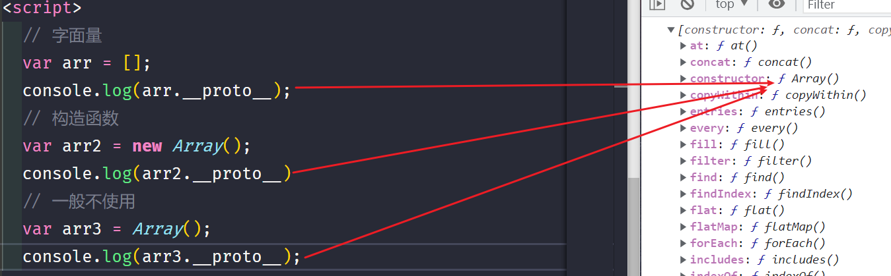
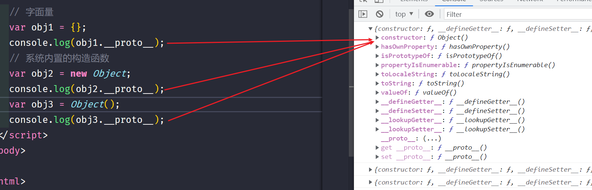
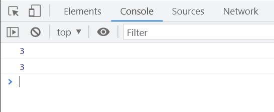
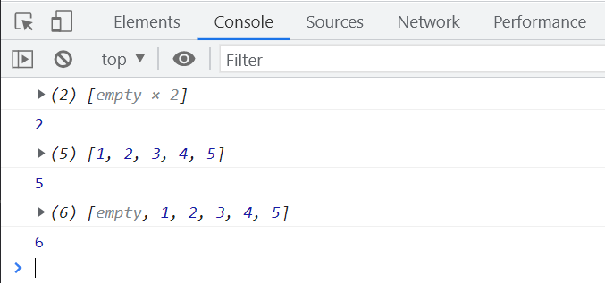

# 数组

## 声明方式

```javascript
// 字面量
let arr = [];
console.log(arr);
// 构造函数
let arr2 = new Array();
console.log(arr2);
// 不推荐使用
let arr3 = Array();
console.log(arr3);
```

所有声明的数组都继承自 `Array.prototype`。



# 对象和数组的关系

```javascript
let obj1 = {};
console.log(obj1.__proto__);
// 系统内置的构造函数
let obj2 = new Object();
console.log(obj2.__proto__);
let obj3 = Object();
console.log(obj3.__proto__);
```

所有对象都继承自 `Object.prototype`。



# 数组的本质

## 对象模拟数组

```javascript
// 索引值
let arr = [1, 2, 3, 4, 5];

let obj = {
  0: 1,
  1: 2,
  2: 3,
  3: 4,
  4: 5,
};
console.log(arr[2]);
console.log(obj[2]);
```



JavaScript 数组底层基于对象实现，通过索引值访问数组元素。

数组在 JavaScript 中也是对象的一种表现形式。

# 空数组

```javascript
let arr = [];
```

## 稀疏数组

稀疏数组的空位会被 `empty` 标识。

```javascript
let sparseArr = [, ,];
console.log(sparseArr);
console.log(sparseArr.length);
// 无法打印空位
let filledArr = [1, 2, 3, 4, 5];
console.log(filledArr);
console.log(filledArr.length);
// 前面空位可以打印
let mixedArr = [, 1, 2, 3, 4, 5];
console.log(mixedArr);
console.log(mixedArr.length);
```



`empty` 是系统用于标识空元素的标记。

## 使用构造函数创建数组

```javascript
// 语法错误示例
let arrWithEmpty = new Array(1, 2, 4, 5, , ,);
console.log(arrWithEmpty);
```

```javascript
// 正确写法，避免空值
let arr = new Array(1, 2, 4, 5);
console.log(arr);
```

```javascript
// 创建包含空位的数组
let emptyArr = new Array(5);
console.log(emptyArr);
```

# 数组的增删改

```javascript
let numbers = [1, 2, 3, 4, 5, 6, 7, 8, 9, 10];
// 增加元素
numbers[10] = 11;
// 修改元素
numbers[5] = 'aaa';
console.log(numbers);
```

# 数组的方法

> 修改原数组的方法

```javascript
console.log(Array.prototype);
// 数组的所有方法都继承自 Array.prototype
```

## push

在数组末尾添加元素，返回添加后的数组长度。

```javascript
let numbers = [2, 3, 4];
numbers.push(5);
console.log(numbers);
```

## 自定义 push 方法

```javascript
let numbers = [2, 3, 4];
Array.prototype.myPush = function () {
  for (let i = 0; i < arguments.length; i++) {
    this[this.length] = arguments[i];
  }
  return this.length;
};
let newLength = numbers.myPush(1, 2, 3);
console.log(newLength);
console.log(numbers);
```

## unshift

在数组前端添加元素，返回添加后的数组长度。

```javascript
let numbers = [2, 3, 4];
numbers.unshift(0, 1);
console.log(numbers);
```

## pop

移除数组最后一个元素并返回该元素。

```javascript
let letters = ['a', 'b', 'c'];
console.log(letters);
letters.pop();
console.log(letters);
```

## shift

移除数组第一个元素并返回该元素。

```javascript
let letters = ['a', 'b', 'c'];
console.log(letters);
letters.shift();
console.log(letters);
```

## reverse

反转数组元素的顺序。

```javascript
let digits = ['1', '2', '3'];
console.log(digits);
digits.reverse();
console.log(digits);
```

# splice

```javascript
// 使用方法
let arr = ['1', '2', '3'];
arr.splice(起始索引, 删除数量, 添加元素);
```

## 删除元素

```javascript
let letters = ['a', 'b', 'c'];
// 从索引1开始删除1个元素
letters.splice(1, 1);
console.log(letters);
```

## 替换元素

```javascript
let letters = ['a', 'b', 'c', 'e', 'f'];
// 从索引1开始删除2个元素，并添加3个4
letters.splice(1, 2, 4, 4, 4);
console.log(letters);
```

```javascript
let letters = ['a', 'b', 'c', 'e', 'f'];
// 从索引3开始不删除元素，添加3个4
letters.splice(3, 0, 4, 4, 4);
console.log(letters);
```

## 使用负索引

```javascript
let letters = ['a', 'b', 'c', 'e', 'f'];
// 在倒数第一位前添加3个4
letters.splice(-1, 0, 4, 4, 4);
console.log(letters);
```

## 负索引的处理

```javascript
let letters = ['a', 'b', 'c', 'e', 'f'];

function getPositiveIndex(array, index) {
  return index >= 0 ? index : array.length + index;
}
console.log(letters[getPositiveIndex(letters, -1)]);
```

# sort

## 数字排序

```javascript
let numbers = [-1, -5, 8, 0, 2];
numbers.sort((a, b) => a - b);
console.log(numbers);
```

## 字母排序

```javascript
let letters = ['a', 'z', 'e', 'y', 'p'];
letters.sort();
console.log(letters);
```

## 字符串数组排序

`sort` 方法默认按照 `ASCII` 码排序。

```javascript
let strings = ['27', '49', '5', '7'];
strings.sort();
console.log(strings);
```

## sort 方法详解

比较函数需要两个参数，并返回一个值：

- 返回负数：`a` 排在前面
- 返回正数：`b` 排在前面
- 返回 0：保持原顺序

```javascript
let strings = ['27', '49', '5', '7'];
strings.sort((a, b) => (a > b ? 1 : -1));
console.log(strings);
```

## 随机排序

```javascript
let numbers = [1, 2, 3, 4, 5, 7, 9, 10];
numbers.sort(() => (Math.random() - 0.5 > 0 ? 1 : -1));
console.log(numbers);
```

## 对象排序

```javascript
let people = [
  { name: 'JJ', age: 18 },
  { name: 'GG', age: 12 },
  { name: 'AA', age: 3 },
  { name: 'WW', age: 1 },
  { name: 'QQ', age: 20 },
];
people.sort((a, b) => a.age - b.age);
console.log(people);
```

## 按长度排序

```javascript
let strings = ['123', '123213', '213213', '1'];
strings.sort((a, b) => a.length - b.length);
console.log(strings);
```
