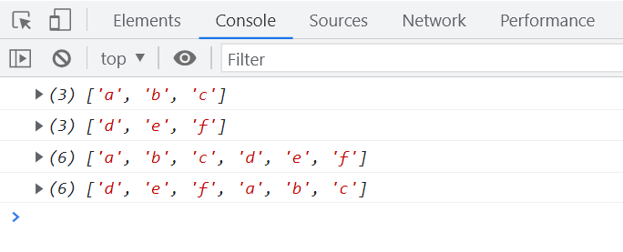
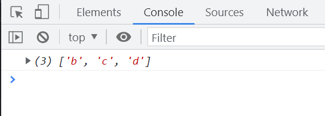
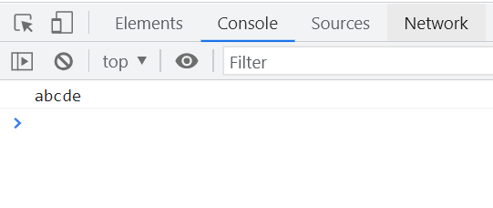
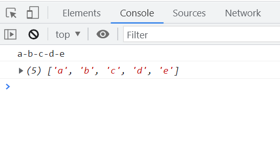
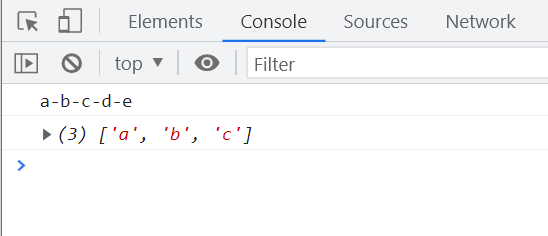
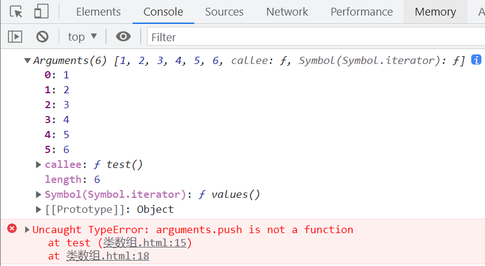
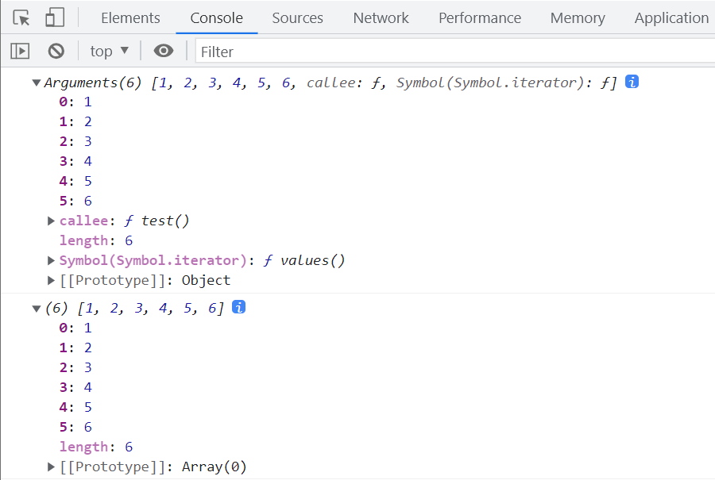
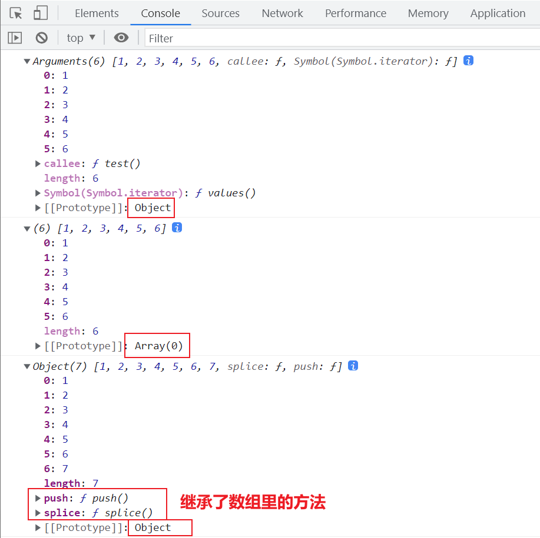
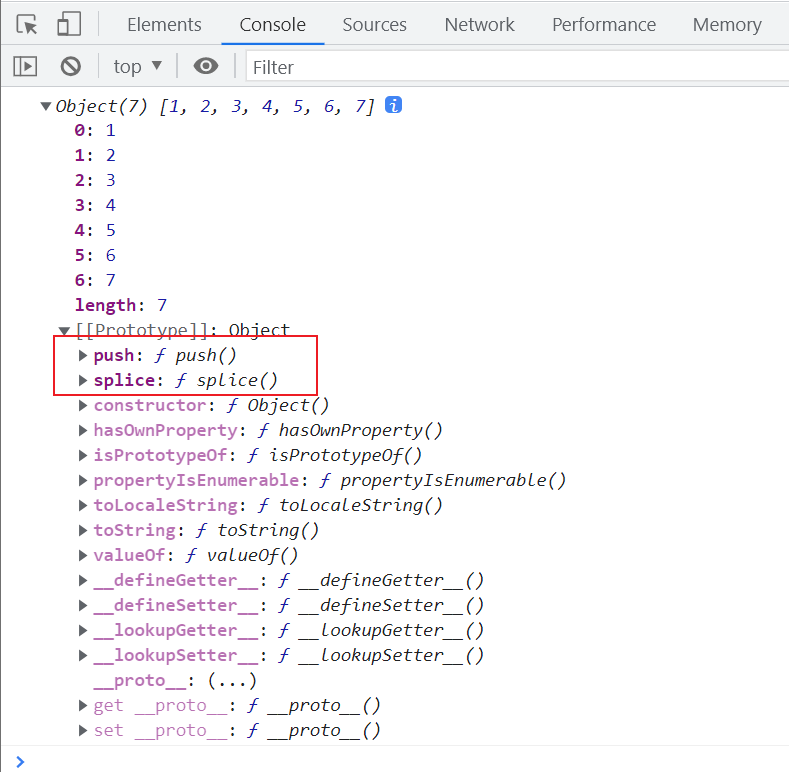
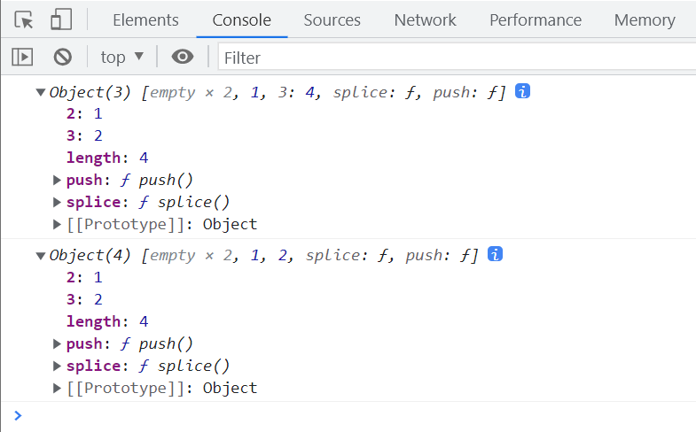

# 新建数组上的方法

## concat

`concat` 方法用于合并两个数组，语法为 `前数组.concat(后数组)`。

```javascript
let array1 = ['a', 'b', 'c'];
console.log(array1);

let array2 = ['d', 'e', 'f'];
console.log(array2);

let mergedArray1 = array1.concat(array2);
console.log(mergedArray1);

let mergedArray2 = array2.concat(array1);
console.log(mergedArray2);
```



## toString

`toString` 方法将数组转换为一个由逗号分隔的字符串。

```javascript
let letters = ['a', 'b', 'c', 'd'];
let numbers = [1, 2, 3, 4, 5, 6];

console.log(letters.toString());
console.log(numbers.toString());
```

## slice

`slice` 方法用于克隆数组或截取数组的一部分。

```javascript
// 克隆数组
let originalArray = ['a', 'b', 'c', 'd'];
let clonedArray = originalArray.slice();
console.log(clonedArray);

// 从索引1开始截取到最后
let slicedArray1 = originalArray.slice(1);
console.log(slicedArray1);
```



```javascript
// 从索引1开始截取到索引3（不包括3）
let originalArray = ['a', 'b', 'c', 'd', 'e'];
let slicedArray2 = originalArray.slice(1, 3);
console.log(slicedArray2);
```

```javascript
// 从倒数第3位开始截取到索引4（不包括4）
let originalArray = ['a', 'b', 'c', 'd', 'e'];
let slicedArray3 = originalArray.slice(-3, 4);
console.log(slicedArray3);
```

```javascript
// 从倒数第3位开始截取到倒数第2位（不包括-2）
let originalArray = ['a', 'b', 'c', 'd', 'e'];
let slicedArray4 = originalArray.slice(-3, -2);
console.log(slicedArray4);
```

## join

`join` 方法将数组元素连接成一个字符串，默认使用逗号分隔。

```javascript
let elements = ['a', 'b', 'c', 'd', 'e'];
let joinedString = elements.join();
console.log(joinedString);
```

使用自定义分隔符，例如空字符串：

```javascript
let elements = ['a', 'b', 'c', 'd', 'e'];
let joinedString = elements.join('');
console.log(joinedString);
```



## split

`split` 方法用于将字符串分割成数组，基于指定的分隔符。

```javascript
let elements = ['a', 'b', 'c', 'd', 'e'];
let joinedString = elements.join('-');
console.log(joinedString);

let splitArray = joinedString.split('-');
console.log(splitArray);
```



限制分割后的数组长度：

```javascript
let elements = ['a', 'b', 'c', 'd', 'e'];
let joinedString = elements.join('-');
console.log(joinedString);

let limitedSplitArray = joinedString.split('-', 3);
console.log(limitedSplitArray);
```



# 类数组

**类数组是指那些具有类似数组结构的对象。**

```javascript
function displayArguments() {
  console.log(arguments);
  arguments.push(7);
  console.log(arguments);
}
displayArguments(1, 2, 3, 4, 5, 6);
```

`arguments` 对象并不是一个真正的数组，它不继承自 `Array.prototype`，因此无法直接使用数组的方法。



## 原型的对比

通过比较 `arguments` 对象和数组的原型，可以看出它们的不同。

```javascript
function displayArguments() {
  console.log(arguments);
}
displayArguments(1, 2, 3, 4, 5, 6);

let arrayExample = [1, 2, 3, 4, 5, 6];
console.log(arrayExample);
```



## 如何让类数组使用 push 方法

为类数组对象添加 `push` 方法，使其能够使用数组的 `push` 功能。

```javascript
function displayArguments() {
  console.log(arguments);
}
displayArguments(1, 2, 3, 4, 5, 6);

let arrayExample = [1, 2, 3, 4, 5, 6];
console.log(arrayExample);

let arrayLikeObject = {
  0: 1,
  1: 2,
  2: 3,
  3: 4,
  4: 5,
  5: 6,
  length: 6,
  splice: Array.prototype.splice,
  push: Array.prototype.push,
};

arrayLikeObject.push(7);
console.log(arrayLikeObject);
```



## 在 Object 的原型上增加数组的方法

通过在 `Object.prototype` 上添加数组方法，使所有对象都能使用这些方法。

```javascript
let objectExample = {
  0: 1,
  1: 2,
  2: 3,
  3: 4,
  4: 5,
  5: 6,
  length: 6,
};

Object.prototype.push = Array.prototype.push;
Object.prototype.splice = Array.prototype.splice;

objectExample.push(7);
console.log(objectExample);
```



## 重写 push

自定义 `push` 方法，以增强其功能或调整其行为。

```javascript
// 重写 push 方法以接受多个值
Array.prototype.push = function (...values) {
  for (let value of values) {
    this[this.length] = value;
    this.length++;
  }
  return this.length;
};

let numbers = [1, 2, 3];
numbers.push(4, 5, 6);
console.log(numbers);
```

## 类数组的使用

通过类数组对象的示例，展示如何使用数组方法。

```javascript
let person = {
  0: '张1',
  1: '张2',
  2: '张3',
  name: '张三',
  age: 32,
  weight: 140,
  height: 180,
  length: 3,
};

Object.prototype.push = Array.prototype.push;
Object.prototype.splice = Array.prototype.splice;

console.log(person[1]); // 输出: 张2
console.log(person.weight); // 输出: 140

for (let key in person) {
  if (person.hasOwnProperty(key)) {
    console.log(person[key]);
  }
}
```

# 练习

## 判断闰年

编写一个函数判断输入的年份是否为闰年。

```javascript
let inputYear = prompt('请输入年份');
console.log(checkLeapYear(inputYear));

function checkLeapYear(year) {
  year = Number(year);
  if ((year % 4 === 0 && year % 100 !== 0) || year % 400 === 0) {
    return '闰年';
  } else {
    return '不是闰年';
  }
}
```

## 三目写法

使用三目运算符简化判断闰年的函数。

```javascript
let inputYear = prompt('请输入年份');
console.log(checkLeapYear(inputYear));

function checkLeapYear(year) {
  year = Number(year);
  return (year % 4 === 0 && year % 100 !== 0) || year % 400 === 0 ? '闰年' : '不是闰年';
}
```

## 函数执行

分析函数执行顺序及其输出结果。

```javascript
function Foo() {
  getName = function () {
    console.log(1);
  };
  return this;
}

Foo.getName = function () {
  console.log(2);
};

Foo.prototype.getName = function () {
  console.log(3);
};

let getName = function () {
  console.log(4);
};

function getName() {
  console.log(5);
}

Foo.getName(); // 输出: 2
getName(); // 输出: 4

Foo().getName(); // 输出: 1
getName(); // 输出: 1

new Foo.getName(); // 输出: 2

new Foo().getName(); // 输出: 3

new new Foo().getName(); // 输出: 3
```

## push

在类数组对象上使用 `push` 方法。

```javascript
let arrayLikeObject = {
  2: 3,
  3: 4,
  length: 2,
  splice: Array.prototype.splice,
  push: Array.prototype.push,
};

arrayLikeObject.push(1);
console.log(arrayLikeObject);

arrayLikeObject.push(2);
console.log(arrayLikeObject);
// 结果展示了下标的变化
```



# 补充内容

## 最佳实践

在处理类数组对象时，尽量将其转换为真正的数组，以便使用数组的所有方法。

```javascript
function convertToArray(arrayLike) {
  return Array.prototype.slice.call(arrayLike);
}

function exampleFunction() {
  let args = convertToArray(arguments);
  args.push(7);
  console.log(args);
}

exampleFunction(1, 2, 3, 4, 5, 6);
```

## 注意事项

- 避免在 `Object.prototype` 上添加方法，以防止影响所有对象。
- 使用 `let` 或 `const` 替代 `var`，以提高代码的可维护性和减少潜在的错误。
- 在重写原生方法时，应谨慎操作，以避免引入不可预见的问题。

# 完整代码示例

```javascript
// 合并数组示例
let array1 = ['a', 'b', 'c'];
let array2 = ['d', 'e', 'f'];
let mergedArray = array1.concat(array2);
console.log('合并后的数组:', mergedArray);

// 克隆和截取数组示例
let originalArray = ['a', 'b', 'c', 'd', 'e'];
let clonedArray = originalArray.slice();
let slicedArray = originalArray.slice(1, 3);
console.log('克隆的数组:', clonedArray);
console.log('截取的数组:', slicedArray);

// 类数组使用 push 方法示例
let arrayLikeObject = {
  0: '张1',
  1: '张2',
  2: '张3',
  length: 3,
  splice: Array.prototype.splice,
  push: Array.prototype.push,
};

arrayLikeObject.push('张4');
console.log('更新后的类数组对象:', arrayLikeObject);

// 判断闰年示例
let inputYear = prompt('请输入年份');
console.log(checkLeapYear(inputYear));

function checkLeapYear(year) {
  year = Number(year);
  return (year % 4 === 0 && year % 100 !== 0) || year % 400 === 0 ? '闰年' : '不是闰年';
}
```
