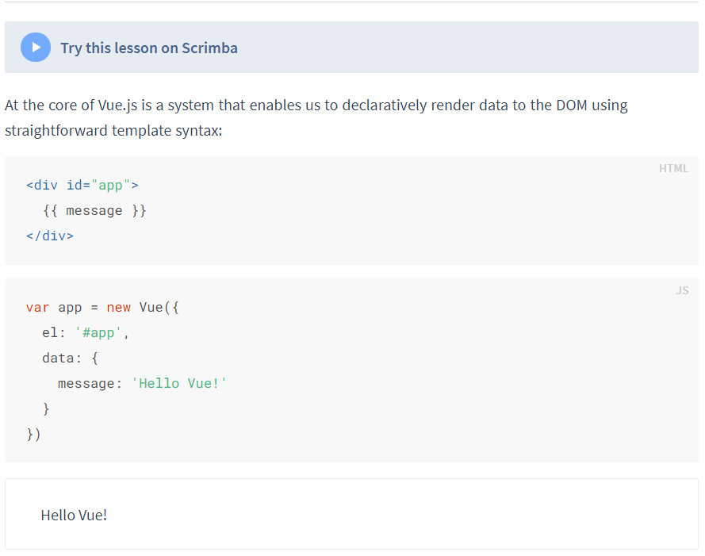

# 对象管理

```javascript
// 一个教师对象
var teacher = {
  name: '张三',
  age: 32,
  sex: 'male',
  height: 176,
  weight: 130,
  teach: function () {
    console.log('I am teaching JS');
  },
  smoke: function () {
    console.log('I am smoking');
  },
  eat: function () {
    console.log('I am having dinner');
  },
};
```

## 查找对象的属性

```javascript
console.log(teacher.name);
```

## 使用对象的方法

```javascript
// 调用对象的方法
teacher.smoke();
```

## 增加属性

```javascript
teacher.address = '北京';
console.log(teacher);
```

## 增加方法

```javascript
teacher.drink = function () {
  console.log('I am drinking beer');
};
console.log(teacher);
```

## 修改对象的属性

```javascript
teacher.height = 180;
console.log(teacher.height);
```

## 修改对象的方法

```javascript
teacher.teach = function () {
  console.log('I am teaching HTML');
};
teacher.teach();
```

## 删除对象中的属性

```javascript
delete teacher.name;
console.log(teacher);
```

## 删除对象中的方法

```javascript
delete teacher.teach;
teacher.teach(); // 这将导致错误，因为teach方法已被删除
```

## `this` 关键字的使用

```javascript
var teacher = {
  name: '张三',
  age: 32,
  sex: 'male',
  height: 176,
  weight: 130,
  teach: function () {
    console.log('I am teaching JS');
  },
  smoke: function () {
    console.log('I am smoking');
    this.weight--;
  },
  eat: function () {
    this.weight++;
    console.log('I am having dinner');
  },
};
```

# 上下课管理

## 删除数组元素

[Array.prototype.splice() - JavaScript | MDN](https://developer.mozilla.org/zh-CN/docs/Web/JavaScript/Reference/Global_Objects/Array/splice)

```javascript
var num = 3;
var arr = [1, 2, 3, 4];

for (var i = 0; i < arr.length; i++) {
  if (arr[i] === num) {
    arr.splice(i, 1);
  }
}
console.log(arr);
```

## 查找数组下标

[String.prototype.indexOf() - JavaScript | MDN](https://developer.mozilla.org/zh-CN/docs/Web/JavaScript/Reference/Global_Objects/String/indexOf)

```javascript
console.log(arr.indexOf(num));
```

## 课堂出勤管理代码

```javascript
var attendance = {
  students: [],
  total: 6,
  join: function (name) {
    this.students.push(name);
    if (this.students.length === this.total) {
      console.log(name + '到课, 学生已到齐');
    } else {
      console.log(name + '到课, 学生未到齐');
    }
  },
  leave: function (name) {
    var index = this.students.indexOf(name);
    if (index !== -1) {
      this.students.splice(index, 1);
    }
    console.log(name + '早退');
    console.log(this.students);
  },
  classOver: function () {
    this.students = [];
    console.log('已下课');
  },
};

attendance.join('张三');
attendance.join('李四');
attendance.join('王五');
attendance.join('赵六');
attendance.join('五七');
attendance.join('大一');
attendance.leave('张三');
attendance.classOver();
```

# 对象的使用

## 对象字面量

```javascript
var person = {
  name: '张三',
  sex: 'male',
};
person.name = '李四';
console.log(person.name);
```

## 使用 Object 构造函数

```javascript
var person = new Object();
person.name = '张三';
person.sex = 'female';

console.log(person);
```

## 自定义构造函数

```javascript
function Teacher() {
  this.name = '张三';
  this.sex = 'male';
  this.smoke = function () {
    console.log('I am smoking');
  };
}
// 实例化 Teacher 对象
var teacher = new Teacher();
console.log(teacher);
```

## 创建多个对象实例

```javascript
function Teacher() {
  this.name = '张三';
  this.sex = 'male';
  this.smoke = function () {
    console.log('I am smoking');
  };
}
var teacher1 = new Teacher();
var teacher2 = new Teacher();

teacher1.name = '李四';
console.log(teacher1);
console.log(teacher2);
```

## 构造函数传参

```javascript
function Teacher(name, sex, weight, course) {
  this.name = name;
  this.sex = sex;
  this.weight = weight;
  this.course = course;
  this.smoke = function () {
    this.weight++;
    console.log(this.weight);
  };
  this.eat = function () {
    this.weight--;
    console.log(this.weight);
  };
}
var teacher1 = new Teacher('张三', 'male', 145, 'JS');
var teacher2 = new Teacher('李四', 'female', 90, 'HTML');

console.log(teacher1);
console.log(teacher2);
```

## 使用对象作为参数

```javascript
function Teacher(options) {
  this.name = options.name;
  this.sex = options.sex;
  this.weight = options.weight;
  this.course = options.course;
  this.smoke = function () {
    this.weight++;
    console.log(this.weight);
  };
  this.eat = function () {
    this.weight--;
    console.log(this.weight);
  };
}
var teacher1 = new Teacher({
  name: '张三',
  sex: 'male',
  weight: 145,
  course: 'JS',
});

console.log(teacher1);
```

Vue 也是采用这种方式。Vue 实际上是一个复杂的构造函数，通过实例化 Vue 和使用插件，我们在使用 Vue 时实际上是在调用这个构造函数的方法。这也是为什么在使用 Vue 时需要先创建一个实例的原因。


