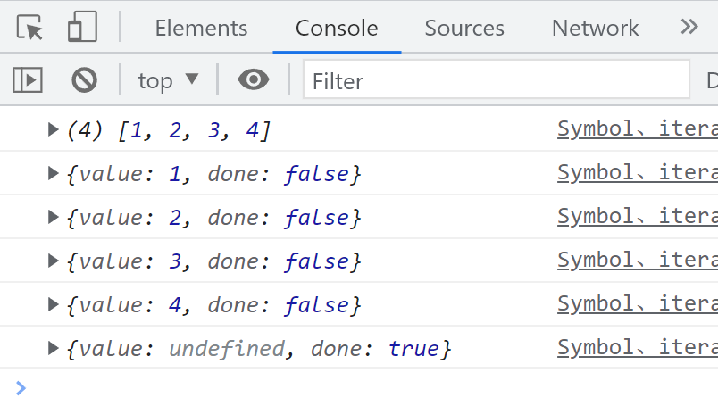
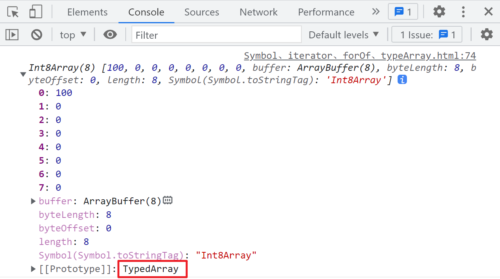

# 迭代器、Symbol 和类型数组

## 扩展运算符

```javascript
const objectA = { a: 1, b: 2, c: 3 };
const objectB = { a: 3, d: 5, e: 6 };

const combinedObject = { ...objectB, ...objectA };
// Object.assign(combinedObject, objectA, objectB);
console.log(combinedObject);
```

扩展运算符允许将一个对象的所有可枚举属性复制到另一个对象中。在上面的示例中，`combinedObject` 将包含 `objectB` 和 `objectA` 的所有属性。如果属性名重复，后面的对象属性会覆盖前面的。

## Symbol

```javascript
const uniqueSymbol = Symbol();
console.log(Object.getPrototypeOf(uniqueSymbol));
```

`Symbol` 是一种基本数据类型，用于创建唯一的标识符。每个 `Symbol` 都是唯一的，常用于对象属性的键，避免属性名冲突。

## 迭代器

迭代器是一种有序、连续、基于拉取的消耗数据的组织方式。

```javascript
const array = [1, 2, 3, 4];
console.log(array);

// 访问数组上的 Symbol.iterator 方法
const iterator = array[Symbol.iterator]();
console.log(iterator.next());
console.log(iterator.next());
console.log(iterator.next());
console.log(iterator.next());
console.log(iterator.next());
```



### 实现迭代器

```javascript
function createIterator(items) {
  let currentIndex = 0;
  return {
    next: function () {
      if (currentIndex < items.length) {
        return { value: items[currentIndex++], done: false };
      } else {
        return { value: undefined, done: true };
      }
    },
  };
}

const iteratorInstance = createIterator([1, 2, 3, 4]);
console.log(iteratorInstance.next());
console.log(iteratorInstance.next());
console.log(iteratorInstance.next());
console.log(iteratorInstance.next());
console.log(iteratorInstance.next());
```

上述代码展示了如何手动创建一个迭代器。`createIterator` 函数返回一个具有 `next` 方法的对象，每次调用 `next` 都会返回序列中的下一个值，直到所有值被迭代完毕。

## TypeArray

TypeArray 用于处理二进制数据的类型数组，但它不是类数组。

```javascript
// 八进制数据
const int8Array = new Int8Array(8);
int8Array[0] = 100;
console.log(int8Array);
```

### 原型

声明这种数据的原型是 `TypedArray`。



`TypedArray` 提供了一组视图，用于不同类型的二进制数据处理，如 `Int8Array`、`Uint8Array`、`Float32Array` 等。

## for...of

`for...of` 循环调用 `[Symbol.iterator]` 接口，进行迭代，一次迭代全部的内容。

```javascript
const array = [1, 2, 3, 4];

for (const element of array) {
  console.log(element); // 1 2 3 4
}
```

### 给对象添加迭代器

```javascript
const iterableObject = {
  a: [2],
  b: [3],
  c: [1],
  [Symbol.iterator]() {
    const combinedArray = [...this.a, ...this.b, ...this.c];
    let index = 0;
    const length = combinedArray.length;
    return {
      next() {
        if (index < length) {
          return { value: combinedArray[index++], done: false };
        } else {
          return { value: undefined, done: true };
        }
      },
    };
  },
};

for (const value of iterableObject) {
  console.log(value); // 2 3 1
}
```

通过在对象上实现 `[Symbol.iterator]` 方法，可以使该对象支持 `for...of` 循环，实现自定义的迭代行为。

## for...in

`for...in` 循环用于遍历对象的可枚举属性，或数组的索引。

```javascript
const array = [1, 2, 3, 4];

for (const index in array) {
  console.log(index); // 0 1 2 3
}
```

```javascript
const object = {
  a: 1,
  b: 2,
  c: 3,
};

for (const key in object) {
  console.log(key); // a b c
}
```

需要注意的是，`for...in` 循环会遍历对象及其原型链上的可枚举属性，因此在使用时应结合 `hasOwnProperty` 方法进行过滤，以避免遍历到不必要的属性。
