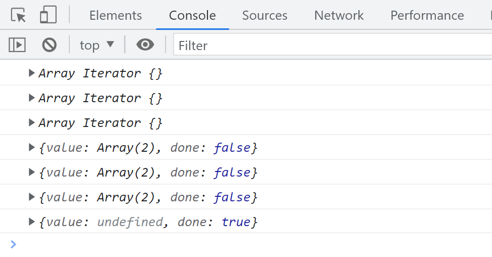
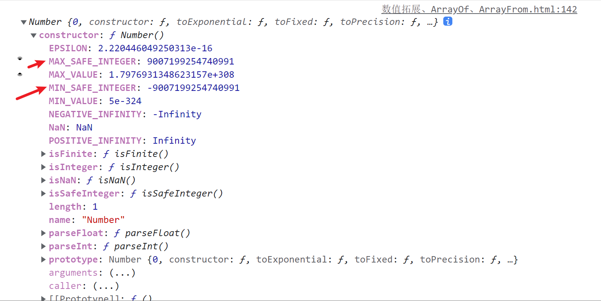

# 数组的创建方法 Array.of() 和 Array.from()

## Array.of()

通过 `Array.of()` 方法可以创建一个新的数组实例，与直接使用 `Array` 构造函数不同，`Array.of()` 不会产生歧义。

```javascript
// 使用 Array 构造函数创建数组，传入单个数字参数会创建具有该长度的空数组
console.log(Array(3)); // [ <3 empty items> ]

// 使用 Array.of() 创建数组，传入的参数会成为数组的元素
console.log(Array.of(3)); // [3]
```

`Array.of()` 方法解决了使用 `Array` 构造函数时可能出现的歧义问题，确保传入的参数始终作为数组的元素。

## Array.from()

`Array.from()` 方法可以将一个类似数组或可迭代对象转换为一个新的、浅拷贝的数组实例。

```javascript
const nodeList = document.querySelectorAll('p');
console.log(Array.from(nodeList));
```

对于实现了迭代器接口的对象，也可以使用 `Array.from()` 进行转换：

```javascript
const iterableObject = {
  start: [12, 3, 4, 5],
  end: [7, 8, 9],
  [Symbol.iterator]() {
    const combinedArray = [...this.start, ...this.end];
    let index = 0;
    return {
      next() {
        if (index < combinedArray.length) {
          return { value: combinedArray[index++], done: false };
        } else {
          return { value: undefined, done: true };
        }
      },
    };
  },
};

// 可以传入映射函数，将每个元素乘以 2
console.log(Array.from(iterableObject, (val) => val * 2));
// 输出: [24, 6, 8, 10, 14, 16, 18]
```

`Array.from()` 方法不仅可以转换对象，还支持传入一个映射函数，对每个元素进行处理。

## Array.prototype.fill()

`fill()` 方法用于将数组中的所有元素填充为指定的值，从起始索引到结束索引（不包括结束索引）。

```javascript
let numbers = [1, 2, 3, 4, 5];
// 将所有元素填充为 6，修改原数组
numbers.fill(6);
console.log(numbers); // [6, 6, 6, 6, 6]
```

### 多个参数

`fill()` 方法可以接受多个参数，指定填充的起始和结束位置。

```javascript
let numbers = [1, 2, 3, 4, 5];
// 从索引 1 开始填充 6
numbers.fill(6, 1);
console.log(numbers); // [1, 6, 6, 6, 6]
```

```javascript
let numbers = [1, 2, 3, 4, 5];
// 从索引 1 开始填充 6，到索引 2 结束（不包括索引 2）
numbers.fill(6, 1, 2);
console.log(numbers); // [1, 6, 3, 4, 5]
```

### 不符合要求的参数

传入不合法的参数时，`fill()` 方法不会进行填充操作。

```javascript
let numbers = [1, 2, 3, 4, 5];
// 传入 NaN 作为起始和结束索引，不进行填充
numbers.fill(6, NaN, NaN);
console.log(numbers); // [1, 2, 3, 4, 5]
```

### 对象调用 `fill`

可以将 `fill()` 方法应用于类数组对象，并指定填充值和数组长度。

```javascript
let filled = [].fill.call({ length: 3 }, 4);
console.log(filled); // {0: 4, 1: 4, 2: 4, length: 3}
```

## Object.keys/values/entries

`Object.keys()`、`Object.values()` 和 `Object.entries()` 方法用于获取对象的键、值和键值对。

```javascript
const obj = {
  a: 1,
  b: 2,
  c: 3,
};

// 获取所有键名
console.log(Object.keys(obj)); // ['a', 'b', 'c']

// 获取所有值
console.log(Object.values(obj)); // [1, 2, 3]

// 获取所有键值对
console.log(Object.entries(obj)); // [['a', 1], ['b', 2], ['c', 3]]
```

这些方法提供了一种简便的方式来遍历对象的属性，适用于需要操作对象数据的场景。

## Array.keys/values/entries

数组的 `keys()`、`values()` 和 `entries()` 方法返回迭代器对象，分别用于遍历数组的索引、值和键值对。

```javascript
const array = ['a', 'b', 'c'];

// 获取索引迭代器
console.log(array.keys()); // Array Iterator {}

// 获取值迭代器
console.log(array.values()); // Array Iterator {}

// 获取键值对迭代器
console.log(array.entries()); // Array Iterator {}

// 使用迭代器
const iter = array.entries();
console.log(iter.next()); // { value: [0, 'a'], done: false }
console.log(iter.next()); // { value: [1, 'b'], done: false }
console.log(iter.next()); // { value: [2, 'c'], done: false }
console.log(iter.next()); // { value: undefined, done: true }

for (const entry of array.entries()) {
  console.log(entry);
}
// 输出:
// [0, 'a']
// [1, 'b']
// [2, 'c']
```



这些迭代器方法使得数组的遍历更加灵活，适用于需要同时访问索引和值的场景。

## Array.prototype.copyWithin()

`copyWithin()` 方法在数组内部将指定位置的元素复制到目标位置，并返回修改后的数组。此方法会修改原数组。

```javascript
const arr = [1, 2, 3, 4, 5];
// 从索引 0 开始复制元素，复制到索引 2
console.log(arr.copyWithin(2));
// 输出: [1, 2, 1, 2, 3]
```

```javascript
// 类数组对象调用 copyWithin
console.log([].copyWithin.call({ length: 5, 1: 2, 2: 3, 3: 4 }, 0, 3));
// 输出: {0: 4, 1: 2, 2: 3, 3: 4, length: 5}
```

`copyWithin()` 方法常用于对数组进行部分重排，避免创建新的数组实例，提高性能。

## Array.prototype.find()

`find()` 方法用于查找数组中第一个满足条件的元素，并返回其值。如果没有找到符合条件的元素，则返回 `undefined`。

```javascript
const numbers = [1, 2, 3, 4, 5];
// 查找第一个大于或等于 3 的元素
const found = numbers.find((value) => value >= 3);
console.log(found); // 3
```

当需要根据条件获取数组中的特定元素时，`find()` 方法提供了一种简洁的解决方案。

## Array.prototype.findIndex()

`findIndex()` 方法用于查找数组中第一个满足条件的元素的索引。如果没有找到符合条件的元素，则返回 `-1`。

```javascript
const numbers = [1, 2, 3, 4, 5];
// 查找第一个大于或等于 3 的元素的索引
const index = numbers.findIndex((value) => value >= 3);
console.log(index); // 2
```

`findIndex()` 方法相比 `indexOf()` 更加灵活，因为它可以基于自定义的条件进行查找。

```javascript
console.log([NaN].findIndex((y) => Object.is(NaN, y))); // 0
```

在处理特殊情况（如查找 `NaN`）时，`findIndex()` 提供了更可靠的结果。

## Array.prototype.includes()

`includes()` 方法用于判断数组是否包含某个指定的值，根据情况返回 `true` 或 `false`。

```javascript
const numbers = [1, 2, 3, 4, 5];
console.log(numbers.includes(1)); // true
```

### 判断 NaN

`includes()` 方法能够正确判断数组中是否包含 `NaN`，这在使用 `indexOf()` 时无法实现。

```javascript
const numbers = [1, 2, 3, 4, 5, NaN];
console.log(numbers.includes(NaN)); // true
```

`includes()` 方法提供了一种简便的方式来检查数组中是否存在某个元素，适用于需要快速验证元素存在性的场景。

## 数值的扩展

JavaScript 提供了多种方式来表示和操作数值，包括十六进制、八进制和二进制。

```javascript
console.log(0xff); // 255
console.log(0o775); // 509
console.log(0b111); // 7

// 将十进制转换为二进制字符串
console.log((509).toString(2)); // '111111101'

// 将二进制字符串转换为十进制数
console.log(parseInt('111111101', 2)); // 509
```

这些数值表示方法在处理底层数据或进行特定算法实现时非常有用。

### isNaN()

`isNaN()` 函数用于判断一个值是否为 `NaN`。需要注意的是，`isNaN()` 会进行隐式类型转换。

```javascript
// 隐式转换
console.log(isNaN('NaN')); // true
console.log(Number.isNaN('NaN')); // false
```

为避免类型转换带来的误判，推荐使用 `Number.isNaN()` 方法，它不会进行隐式转换。

### isFinite()

`isFinite()` 函数用于判断一个值是否是有限的数值。同样，`isFinite()` 会进行隐式类型转换。

```javascript
// 隐式转换
console.log(isFinite('1')); // true
// 不进行隐式转换
console.log(Number.isFinite('1')); // false
```

`Number.isFinite()` 方法提供了更严格的检查，确保只有真正的有限数值才会返回 `true`。

### isInteger()

`isInteger()` 方法用于判断一个值是否为整数。

```javascript
console.log(Number.isInteger(20)); // true
console.log(Number.isInteger(20.0)); // true
console.log(Number.isInteger(20.1)); // false
```

此方法在需要验证数值是否为整数时非常有用，如在索引操作或整数计算中。

### 安全整数

JavaScript 中的安全整数范围在 `-(2^53 - 1)` 到 `2^53 - 1` 之间。超过这个范围的整数可能无法精确表示。

```javascript
console.log(Number.MAX_SAFE_INTEGER === Math.pow(2, 53) - 1); // true
console.log(Number.MIN_SAFE_INTEGER === -(Math.pow(2, 53) - 1)); // true
```



确保在处理大整数时不超过安全整数范围，以避免精度丢失的问题。
