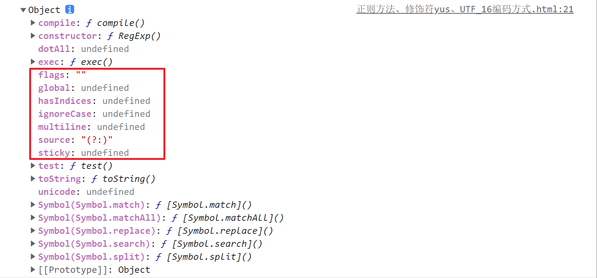
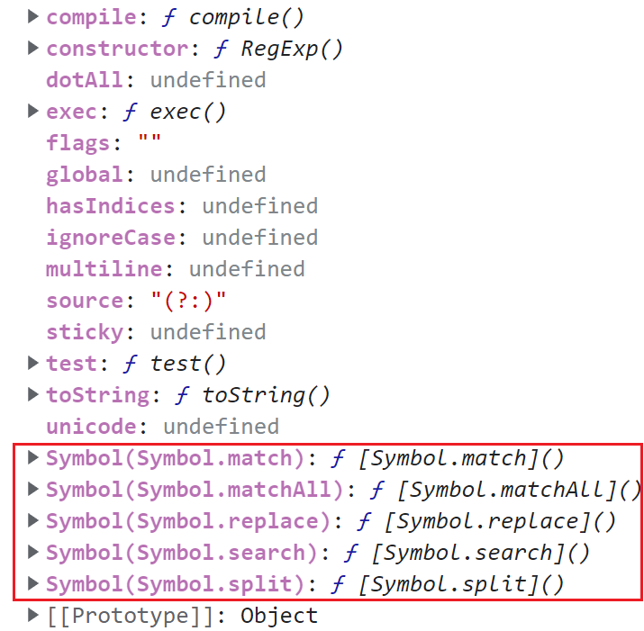

# 正则表达式

## 修饰符

全局 `global` -g  
忽略大小写 `ignoreCase` -i  
多行模式 `multi-line` -m



## ES6 正则增强

### 声明正则的方式变化

在 ES6 中，声明正则表达式的方式有所变化，支持表达式和修饰符分开传入。这使得正则表达式的创建更加灵活。

```javascript
// ES5 字面量定义正则
var regexLiteral = /xyz/i;

// ES5 使用构造函数声明正则
var regexConstructor = new RegExp('xyz', 'i');

// ES5 传入正则对象
var regexFromRegex = new RegExp(/xyz/i);

// ES6 支持分开传入表达式和修饰符
var regexES6 = new RegExp(/xyz/, 'i');
```

### 字符串上的正则方法调整

ES6 将字符串上的正则方法调整到了正则表达式的原型上，使得方法调用更加直观和统一。

```javascript
console.log(RegExp.prototype);
```



### 新增修饰符 `u`、`y` 和 `s`

#### `y` 修饰符

`y` 修饰符用于执行“粘性”匹配，要求匹配必须从当前 `lastIndex` 位置开始。这在处理连续的匹配时尤为有用。

```javascript
var str = 'aaa_aa_a';
var globalRegex = /a+/g;
var stickyRegex = /a+/y;

console.log(globalRegex.exec(str)); // ["aaa"]
console.log(stickyRegex.exec(str)); // ["aaa"]
console.log(globalRegex.exec(str)); // ["aa"]
console.log(stickyRegex.exec(str)); // null
```

#### `source` 和 `flags`

`source` 属性返回正则表达式的文本部分，`flags` 属性返回修饰符。

```javascript
var regex = /\wabed/giy;
console.log(regex.source); // \wabed
console.log(regex.flags); // giy
```

#### 码点

[Unicode - 术语表 | MDN](https://developer.mozilla.org/zh-CN/docs/Glossary/Unicode)

### Unicode 分区定义

1. `Unicode` 分区定义包括 `BMP` 和另外 16 个平面，共 17 个平面。
2. `JavaScript` 引擎使用 `UTF-16` 编码。
3. 代码点 `U+0000~U+FFFF` 用于标识基本多文种平面中的字符。
4. 对于不在 `Unicode` 中的编码，采用四个字节的表示方法。
5. `U+D8000~U+FFFF` 范围用于代理对，允许通过四个字节标识一个字符。

```javascript
// UTF-16 编码
console.log('\u20bb7'); // 输出: \u20bb7

// 使用代理对表示四字节字符，ES5 不支持
console.log('\uD842\uDFB7'); // 输出: 𠮷

// ES6 支持使用大括号表示四字节字符
console.log('\u{20bb7}'); // 输出: 𠮷
```

### `u` 修饰符

`u` 修饰符增强了正则表达式对 Unicode 字符的支持，使其能够正确处理四字节字符。

#### ES6 编码识别优化

```javascript
// 仅匹配高位代理
console.log(/^\uD83D/.test('\uD83D\uDC2A')); // true

// 使用 u 修饰符后，不匹配四字节字符
console.log(/^\uD83D/u.test('\uD83D\uDC2A')); // false
```

#### 使用点匹配

```javascript
var surrogatePair = '\uD842\uDFB7';
console.log(surrogatePair); // 输出: 𠮷

// ES5 中点匹配不到四字节字符
console.log(/^.$/.test(surrogatePair)); // false

// ES6 中使用 u 修饰符可以匹配
console.log(/^.$/u.test(surrogatePair)); // true
```

### 区分量词和编码

```javascript
// 使用量词匹配
console.log(/a{2}/.test('aa')); // true

// 使用 u 修饰符匹配编码
console.log(/\u{20bb7}/u.test('𠮷')); // true
```

### `s` 修饰符

`s` 修饰符（`dotAll`）使得点号 `.` 能匹配包括换行符在内的所有字符。

1. 增加了 `s` 修饰符，使得 `.` 可以匹配任意字符，包括换行符。
2. 使用 `s` 修饰符时，`dotAll` 属性返回 `true`，否则返回 `false`。

```javascript
console.log(/foo.bar/.test('foo\nbar')); // false

// 使用 s 修饰符后，点号匹配换行符
console.log(/foo.bar/s.test('foo\nbar')); // true

console.log(/foo.bar/s.dotAll); // true
```

[RegExp.prototype.dotAll - JavaScript | MDN](https://developer.mozilla.org/zh-CN/docs/Web/JavaScript/Reference/Global_Objects/RegExp/dotAll)

## 实战示例

### 使用 `y` 修饰符进行连续匹配

```javascript
var text = 'apple banana apple';
var regex = /apple/y;
var match;

while ((match = regex.exec(text)) !== null) {
  console.log(`Found ${match[0]} at position ${match.index}`);
  regex.lastIndex += 1; // 移动索引以避免死循环
}
```

### 使用 `u` 修饰符处理 Emoji 字符

```javascript
var emoji = '😊';
var regex = /\u{1F60A}/u;

console.log(regex.test(emoji)); // true
```

### 使用 `s` 修饰符匹配多行字符串

```javascript
var multiLine = `Hello
World`;
var regex = /Hello.World/s;

console.log(regex.test(multiLine)); // true
```
