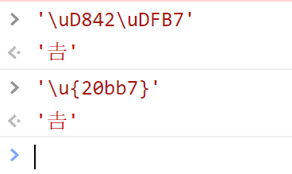
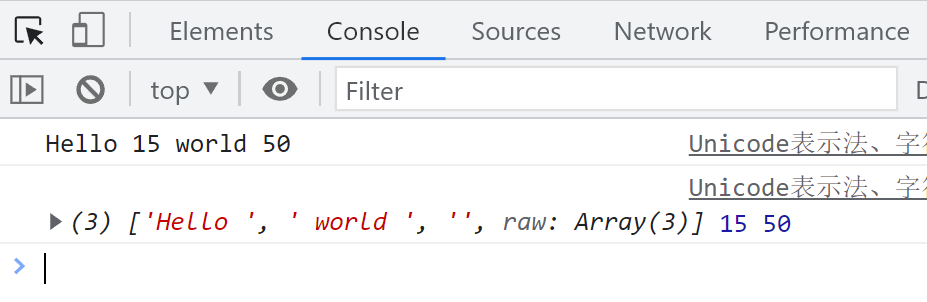

# Unicode 表示法

JavaScript 采用 UTF-16 编码方式。UTF-16 使用两个字节作为物理极限。

`U+0000`至`U+FFFF`是正常的表示范围，但有些汉字无法完全表示，因此约定使用四个字节的`32bit`解析一个字符，或者使用五位十六进制解析一个特殊字符。

`U+D800`至`U+DFFF`这个区间被预留用于四个字节表示一个字符，例如：

```javascript
"\uD842\uDFB7" 表示一个字符
"\u{20bb7}" ES6 新增的五位可以识别一个字符
```



## 有关字符的方法

变量`specialChar`由四个字节组成，即两个字符组成一个字。所以长度为`2`，表示一个字符。打印对应的字符无法识别，说明字符位于`U+D800`至`U+DFFF`区间。

```javascript
// 正常字符
const normalChar = '\u0004';
// 特殊字符
const specialChar = '\u{20bb7}';
// 正常字符长度
console.log(normalChar.length); // 1 代表一个字符
// 特殊字符长度
console.log(specialChar.length); // 2 代表一个字符
// charAt 返回索引位的字符
console.log(specialChar.charAt(0)); // � 无法正确表示一个字符
console.log(specialChar.charAt(1)); // � 无法正确表示一个字符
// ES5 返回对应的字符编码
console.log(specialChar.charCodeAt(0)); // 55362
console.log(specialChar.charCodeAt(1)); // 57271
// 转换成16进制
console.log((55362).toString(16)); // d842
console.log((57271).toString(16)); // dfb7
```

## codePointAt()

`codePointAt`能够正确处理超出物理极限的字符。

```javascript
const mixedString = '𠮷a';
console.log(mixedString.length); // 3

console.log(mixedString.codePointAt(0)); // 134071
console.log((134071).toString(16)); // 20bb7

console.log(mixedString.codePointAt(1)); // 57271
console.log((57271).toString(16)); // dfb7

console.log(mixedString.codePointAt(2)); // 97
console.log((97).toString(16)); // 61
console.log('\u{61}'); // a
```

# 迭代器抽取字符

迭代时可以处理超出字符极限的字符，说明迭代器与`length`方法不同。

```javascript
const unicodeString = '𠮷a';

for (const char of unicodeString) {
  console.log(char); // 𠮷 a
}
```

# 判断四字节的字符

判断字符是否超出`U+0000`至`U+FFFF`的范围。

```javascript
function is32bitCharacter(char) {
  return char.codePointAt(0) > 0xffff;
}
console.log(is32bitCharacter('𠮷')); // true
```

# String 上的方法

## fromCharCode

`fromCharCode`是 ES5 的方法，超出物理极限时，舍弃高位，处理后四位。

```javascript
// ES5
console.log(String.fromCharCode(0x20bb7)); // 0x20bb7超出范围，无法正确显示
```

## fromCodePoint

`fromCodePoint`是 ES6 的方法，解决超出范围的问题。

```javascript
// ES6
console.log(String.fromCodePoint(0x20bb7)); // 𠮷
```

## for...of 迭代字符

`for...of`可以正常迭代超出极限的字符。

```javascript
for (const char of '𠮷𠮷𠮷') {
  console.log(char); // 𠮷 𠮷 𠮷
}
```

## for 循环输出字符

传统`for`循环无法正确处理超出极限的字符。

```javascript
const unicodeStr = '𠮷𠮷𠮷';
for (let i = 0; i < unicodeStr.length; i++) {
  console.log(unicodeStr[i]); // 乱码 乱码 乱码
}
```

## 判断字符串

判断字符串的开头、结尾以及是否包含特定内容。

```javascript
const filename = 'main.js!';
// 是否以'main'开始
console.log(filename.startsWith('main')); // true
// 是否以'!'结尾
console.log(filename.endsWith('!')); // true
// 是否包含'.'
console.log(filename.includes('.')); // true
```

## repeat

`repeat`方法用于重复字符串，舍弃小数部分。

```javascript
console.log('x'.repeat(3)); // xxx
console.log('x'.repeat(2.9)); // xx
console.log('x'.repeat(NaN)); //
console.log('x'.repeat(0)); //
console.log('x'.repeat('3')); // xxx
```

## padStart 和 padEnd

`padStart`和`padEnd`用于填充字符串。

```javascript
// 从前开始填充，总长度为5
console.log('x'.padStart(5, '*')); // ****x
// 从末尾开始填充，总长度为5
console.log('x'.padEnd(5, '*')); // x****
```

# 模板字符串

模板字符串无需频繁使用加号进行拼接，是 ES6 的写法。

```javascript
const userName = 'web';
const message = `I love ${userName}`;
console.log(message); // I love web
```

## `${}`中的表达式

`${}`中可以包含任意表达式。

```javascript
const x = 1;
const y = 2;
console.log(`${x} + ${y} = ${x + y}`); // 1 + 2 = 3
```

## 执行方法

模板字符串中可以执行函数。

```javascript
function greet() {
  return 'hello';
}
console.log(`${greet()}`); // hello
```

## 模板渲染

使用`join`去掉逗号，实现模板渲染。

```javascript
const renderTemplate = (addresses) => `
  <table>
    ${addresses
      .map(
        (address) => `
      <tr><td>${address.first}</td></tr>
      <tr><td>${address.last}</td></tr>
    `
      )
      .join('')}
  </table>
`;

const data = [
  { first: 'zhang', last: 'san' },
  { first: 'li', last: 'si' },
];

console.log(renderTemplate(data));
```

## 标签模版

标签模板用于防止代码恶意注入，是函数调用的一种特殊形式。

```javascript
const a = 5;
const b = 10;
console.log(`Hello ${a + b} world ${a * b}`);
// 标签模板的执行
tag`Hello ${a + b} world ${a * b}`;
// 函数定义
function tag(strings, ...values) {
  // strings是字符串数组，values是变量的结果
  console.log(strings, values);
}
```



## 过滤注入的标签

通过过滤`<`和`>`来防止注入攻击。

```javascript
function saferHTML(templateStrings, ...values) {
  let result = templateStrings[0];
  values.forEach((value, index) => {
    const sanitizedValue = String(value).replace(/</g, '&lt').replace(/>/g, '&gt');
    result += sanitizedValue + templateStrings[index + 1];
  });
  return result;
}

const sender = `<script>alert("abc")</script>`;

const safeMessage = saferHTML`<p> ${sender} has sent you a message</p>`;
console.log(safeMessage); // <p> &lt;script&gt;alert("abc")&lt;/script&gt; has sent you a message</p>
```
