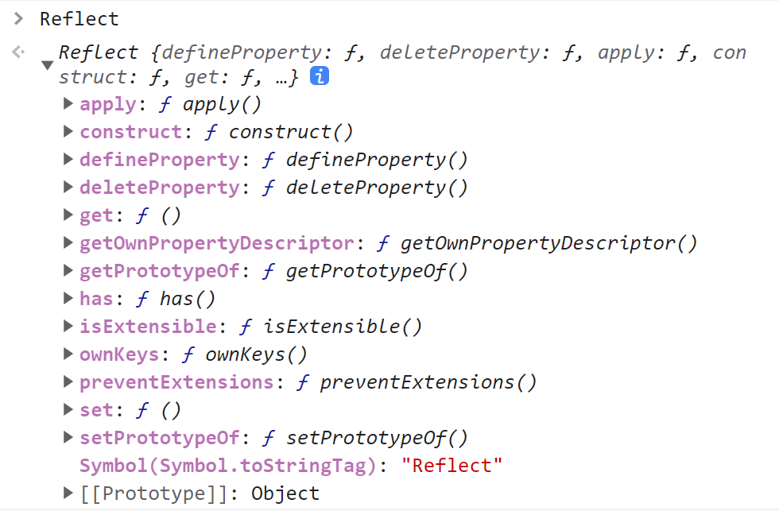

# 14 种操作对象方法

## 1. [[GetPrototypeOf]]

笔者介绍如何获取对象的原型。通过 `Object.getPrototypeOf` 方法可以获取一个对象的原型。

```javascript
const obj = { a: 1, b: 2 };

// 获取对象的原型
const proto = Object.getPrototypeOf(obj);
console.log(proto); // 输出对象的原型
console.log(obj.__proto__); // 另一种获取原型的方式
console.log(Object.prototype); // Object.prototype 是所有普通对象的原型
```

## 2. [[SetPrototypeOf]]

设置一个指定对象的原型。使用 `Object.setPrototypeOf` 方法可以动态修改对象的原型。

```javascript
const obj = { a: 1, b: 2 };

// 设置对象的原型
Object.setPrototypeOf(obj, { c: 3, d: 4 });
obj.__proto__ = { c: 3, d: 4 };
console.log(obj); // 输出：{ a: 1, b: 2, c: 3, d: 4 }
```

## 3. 获取对象的可扩展性

笔者解释如何检查和控制对象的可扩展性。使用 `Object.isExtensible`、`Object.seal` 和 `Object.freeze` 方法。

```javascript
const obj = { a: 1, b: 2 };

// 检查对象是否可扩展
let isExtensible = Object.isExtensible(obj);
console.log(isExtensible); // true

// 冻结对象，使其不可扩展且不可修改
Object.freeze(obj);
let isExtensibleAfterFreeze = Object.isExtensible(obj);
console.log(isExtensibleAfterFreeze); // false

// 封闭对象，使其不可扩展但可修改已有属性
Object.seal(obj);
obj.c = 3; // 无效，属性不会被添加
console.log(obj); // { a: 1, b: 2 }
```

## 4. [[GetOwnProperty]]

获取对象自身属性的属性名。使用 `Object.getOwnPropertyNames` 方法可以列出对象的所有自身属性。

```javascript
const obj = { a: 1, b: 2 };

// 获取对象的自身属性名
Object.setPrototypeOf(obj, { c: 3, d: 4 });
console.log(Object.getOwnPropertyNames(obj)); // ["a", "b"]
```

## 5. [[PreventExtensions]]

禁止扩展对象。使用 `Object.preventExtensions` 方法可以阻止向对象添加新属性。

```javascript
const obj = { a: 1, b: 2 };

// 禁止扩展对象
Object.preventExtensions(obj);
obj.c = 3; // 无效，属性不会被添加
console.log(obj); // { a: 1, b: 2 }

// 删除属性
delete obj.a;
console.log(obj); // { b: 2 }
```

## 6. [[DefineOwnProperty]]

定义或修改对象的属性。使用 `Object.defineProperty` 方法可以精确控制属性的行为。

```javascript
const obj = { a: 1, b: 2 };

// 定义新的属性或修改现有属性
Object.defineProperty(obj, 'c', {
  value: 3,
  writable: true,
  enumerable: true,
  configurable: true,
});
console.log(obj); // { a: 1, b: 2, c: 3 }
```

## 7. [[HasProperty]]

判断对象是否具有某个属性。使用 `hasOwnProperty` 方法可以检查属性是否为对象自身的属性。

```javascript
const obj = { a: 1, b: 2 };

// 检查对象是否具有属性 'a'
console.log(obj.hasOwnProperty('a')); // true
console.log(obj.hasOwnProperty('c')); // false
```

## 8. [[GET]]

访问对象的属性。可以使用 `in` 操作符或直接访问属性值。

```javascript
const obj = { a: 1, b: 2 };

// 使用 'in' 检查属性是否存在
console.log('a' in obj); // true
console.log('c' in obj); // false

// 直接访问属性值
console.log(obj.a); // 1
console.log(obj.c); // undefined
```

## 9. [[SET]]

设置对象的属性。直接赋值可以修改现有属性或添加新属性。

```javascript
const obj = { a: 1, b: 2 };

// 修改现有属性
obj.a = 3;

// 添加新属性
obj.c = 4;

console.log(obj); // { a: 3, b: 2, c: 4 }
```

## 10. 删除属性

删除对象的属性。使用 `delete` 操作符可以移除对象的属性。

```javascript
const obj = { a: 1, b: 2 };

// 删除属性 'a'
delete obj.a;

console.log(obj); // { b: 2 }
```

## 11. 枚举属性

迭代对象的可枚举属性，包括继承的属性，但不包括 `Symbol` 类型的属性。

```javascript
const obj = { a: 1, b: 2 };

// 使用 for...in 迭代可枚举属性
for (const key in obj) {
  console.log(`${key}: ${obj[key]}`);
}
// 输出:
// a: 1
// b: 2
```

## 12. OwnPropertyKeys

获取对象的所有键，包括非可枚举的属性。使用 `Object.keys` 方法可以获取对象的可枚举自身属性。

```javascript
const obj = { a: 1, b: 2 };

// 获取对象的可枚举自身属性键
console.log(Object.keys(obj)); // ["a", "b"]
```

## 13. call / apply / bind

调用函数的不同方式。`call` 和 `apply` 用于改变函数的执行上下文，`bind` 用于创建一个新的绑定函数。

```javascript
const obj = { a: 1, b: 2 };

function greet(greeting) {
  console.log(`${greeting}, a is ${this.a}`);
}

// 使用 call
greet.call(obj, 'Hello'); // 输出: Hello, a is 1

// 使用 apply
greet.apply(obj, ['Hi']); // 输出: Hi, a is 1

// 使用 bind
const boundGreet = greet.bind(obj);
boundGreet('Hey'); // 输出: Hey, a is 1
```

## 14. new

创建用户定义的对象类型的实例或具有构造函数的内置对象的实例。使用 `new` 操作符可以实例化对象。

```javascript
const obj = { a: 1, b: 2 };

function Test() {
  this.c = 3;
}

const testInstance = new Test();
console.log(testInstance); // Test { c: 3 }
```

# Proxy 和 defineProperty 区别

## defineProperty

`defineProperty` 方法用于劫持数据，通过设置或定义对象的属性，可以控制属性的行为，例如设置只读属性或添加新的属性。

1. `defineProperty` 劫持数据，给对象进行扩展，对属性进行设置。
2. 例如修改数组下标的一些方法时，`defineProperty` 的 `set` 是无法触发的。
3. 在 `Vue2.0` 中，代理是通过重写 `Data` 来实现的，因此需要使用 `defineProperty`。

## Proxy

`Proxy` 是 `ES6` 新增的构造函数，用于创建一个对象的代理，可以拦截和定义基本操作。

1. `Proxy` 返回一个代理对象，对目标对象进行代理。
2. `Proxy` 不仅仅是拦截，还可以代理处理各种操作。
3. `Vue3.0` 使用的是 `Proxy` 来实现响应式数据。

## 参数

1. `target`，目标对象，即要进行代理的对象。
2. `handler`，处理器，包含可以拦截的各种方法的对象，自定义函数的各种功能。

# Proxy 代理

## 代理 Object

笔者通过以下示例展示如何使用 `Proxy` 代理一个普通对象，并拦截 `get` 和 `set` 操作。

```javascript
const target = {
  a: 1,
  b: 2,
};

const proxy = new Proxy(target, {
  // 拦截属性读取
  get(target, prop) {
    console.log(`获取属性 ${prop}: ${target[prop]}`);
    return target[prop];
  },
  // 拦截属性设置
  set(target, prop, value) {
    target[prop] = value;
    console.log(`设置属性 ${prop} 为 ${value}`);
    return true;
  },
});

console.log(proxy.a); // 获取属性 a: 1
proxy.a = 3; // 设置属性 a 为 3
console.log(proxy.a); // 获取属性 a: 3
```

## 代理 Array

通过以下示例，笔者展示了如何使用 `Proxy` 代理一个数组，并拦截数组的 `get` 和 `set` 操作。

```javascript
const originalArray = [
  { name: '张三', age: 25 },
  { name: '李四', age: 30 },
  { name: '王五', age: 35 },
];

const proxyArray = new Proxy(originalArray, {
  // 拦截属性读取
  get(target, prop) {
    if (prop in target) {
      console.log(`读取索引 ${prop}:`, target[prop]);
      return target[prop];
    }
    return undefined;
  },
  // 拦截属性设置
  set(target, prop, value) {
    target[prop] = value;
    console.log(`设置索引 ${prop} 为`, value);
    return true;
  },
});

proxyArray[1] = { name: '小张', age: 28 }; // 设置索引 1 为 { name: '小张', age: 28 }
console.log(proxyArray[1]); // 读取索引 1: { name: '小张', age: 28 }
```

## 代理 Function

以下示例展示了如何使用 `Proxy` 代理一个函数，并拦截其属性访问。

```javascript
const fn = function () {
  console.log('执行函数 fn');
};

fn.a = 123;

const proxyFn = new Proxy(fn, {
  // 拦截属性读取
  get(target, prop) {
    if (prop in target) {
      return `${target[prop]} 返回的 fn`;
    }
    return undefined;
  },
});

console.log(proxyFn.a); // 输出: 123 返回的 fn
proxyFn(); // 输出: 执行函数 fn
```

# 实现 MyProxy

笔者通过实现一个简单的 `MyProxy` 函数，演示了如何模仿 `Proxy` 的基本功能。

```javascript
function MyProxy(target, handler) {
  const proxyTarget = deepClone(target);

  Object.keys(proxyTarget).forEach((key) => {
    Object.defineProperty(proxyTarget, key, {
      get() {
        return handler.get ? handler.get(target, key) : target[key];
      },
      set(newVal) {
        if (handler.set) {
          handler.set(target, key, newVal);
        } else {
          target[key] = newVal;
        }
      },
      enumerable: true,
      configurable: true,
    });
  });

  return proxyTarget;

  // 深拷贝函数
  function deepClone(original, clone = {}) {
    const toStr = Object.prototype.toString;
    const arrType = '[object Array]';

    for (const key in original) {
      if (original.hasOwnProperty(key)) {
        if (typeof original[key] === 'object' && original[key] !== null) {
          clone[key] = toStr.call(original[key]) === arrType ? [] : {};
          deepClone(original[key], clone[key]);
        } else {
          clone[key] = original[key];
        }
      }
    }
    return clone;
  }
}

const target = {
  a: 1,
  b: 2,
};

const proxy = new MyProxy(target, {
  get(target, prop) {
    return target[prop];
  },
  set(target, prop, value) {
    target[prop] = value;
  },
});

console.log(proxy.a); // 输出: 1
proxy.b = 4;
console.log(proxy.b); // 输出: 4
```

# 更多的 Proxy 捕获器

笔者推荐参考 [Proxy - JavaScript | MDN](https://developer.mozilla.org/zh-CN/docs/Web/JavaScript/Reference/Global_Objects/Proxy#handler_%E5%AF%B9%E8%B1%A1%E7%9A%84%E6%96%B9%E6%B3%95) 以了解更多 `Proxy` 的捕获器和用法。

# Reflect

`Reflect` 是 `ES6` 的内置对象，作为方法的集合容器。最初的 `14` 种方法都是放在 `Object` 上，但随着 `Reflect` 的引入，许多操作被移动到了 `Reflect`，使得 API 更加一致和函数化。

```javascript
const target = {
  a: 1,
  b: 2,
};

const proxy = new Proxy(target, {
  get(target, prop) {
    // 使用 Reflect.get 获取属性值
    return Reflect.get(target, prop);
  },
  set(target, prop, value) {
    // 使用 Reflect.set 设置属性值
    const isSuccess = Reflect.set(target, prop, value);

    if (isSuccess) {
      console.log('属性设置成功');
    }
    return isSuccess;
  },
});

// 使用代理获取和设置属性
console.log(proxy.a); // 输出: 1
proxy.b = 4; // 输出: 属性设置成功
console.log(proxy.b); // 输出: 4
```

## 方法在 Reflect 的好处

1. **统一的方法集合**：未来会有更多方法被添加到 `Reflect` 上，使得 `Object` 上的方法更加简洁。
2. **函数式编程**：`Reflect` 提供了一种更符合函数式编程的方式来操作对象。

   ```javascript
   const obj = { a: 1 };
   console.log(Reflect.has(obj, 'a')); // true，相当于 'a' in obj
   ```

3. **全局对象**：`Reflect` 是一个全局的内置对象，提供静态方法，无需实例化即可使用。



# 完整示例

结合 `Proxy` 和 `Reflect`，笔者展示了如何创建一个更加健壮和灵活的代理对象。

```javascript
const target = {
  a: 1,
  b: 2,
};

const handler = {
  get(target, prop, receiver) {
    console.log(`获取属性 ${prop}`);
    return Reflect.get(target, prop, receiver);
  },
  set(target, prop, value, receiver) {
    console.log(`设置属性 ${prop} 为 ${value}`);
    return Reflect.set(target, prop, value, receiver);
  },
  deleteProperty(target, prop) {
    console.log(`删除属性 ${prop}`);
    return Reflect.deleteProperty(target, prop);
  },
};

const proxy = new Proxy(target, handler);

console.log(proxy.a); // 获取属性 a \n 1
proxy.b = 3; // 设置属性 b 为 3
delete proxy.a; // 删除属性 a
console.log(target); // { b: 3 }
```

通过上述示例，笔者展示了如何利用 `Proxy` 和 `Reflect` 来拦截和控制对象的基本操作，从而实现更复杂的功能，如日志记录、数据验证等。
