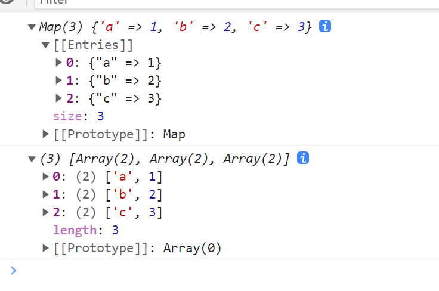

# Array.from()

`Array.from()` 方法用于从一个类似数组或可迭代对象创建一个新的浅拷贝的数组实例。

## 返回新数组引用

使用 `Array.from()` 创建的新数组与原数组不同，它们拥有各自的引用。

```javascript
const arr = [1, 2, 3];
const newArr = Array.from(arr);

console.log(newArr === arr); // false
console.log(newArr); // [1, 2, 3]
```

## 内部引用不做深拷贝

`Array.from()` 进行的是浅拷贝，内部对象的引用依然指向原始对象。

```javascript
const arr = [
  {
    id: 1,
    name: '张三',
  },
  {
    id: 2,
    name: '李四',
  },
];

const newArr = Array.from(arr);

console.log(arr[1] === newArr[1]); // true
```

## 处理字符串

由于字符串实现了可迭代接口 `Symbol.iterator`，`Array.from()` 可以将字符串转换为字符数组。

```javascript
const str = '123';
const newArr = Array.from(str);

console.log(newArr); // ['1', '2', '3']
```

### 处理不可迭代对象

对于不可迭代的对象，`Array.from()` 将返回一个空数组。

```javascript
const num = 123;
const newArr = Array.from(num);

console.log(newArr); // []
```

## 类数组

`Array.from()` 也可以将类数组对象转换为数组。

```javascript
const arrLike = {
  0: 'a',
  1: 'b',
  2: 'c',
  length: 3,
};

const newArr = Array.from(arrLike);
console.log(newArr); // ['a', 'b', 'c']
```

## 错误下标类数组

对于类数组对象中缺失的索引，`Array.from()` 会填充 `undefined`。

```javascript
const arrLike = {
  1: 'a',
  3: 'b',
  4: 'c',
  length: 5,
};

const newArr = Array.from(arrLike);
console.log(newArr); // [undefined, 'a', undefined, 'b', 'c']
```

## Map 对象

`Array.from()` 可以将 `Map` 对象转换为数组。

```javascript
const m = new Map([
  ['a', 1],
  ['b', 2],
  ['c', 3],
]);

console.log(m);

const newArr = Array.from(m);
console.log(newArr);
```



## Set 对象

`Array.from()` 可以将 `Set` 对象转换为数组。

```javascript
const s = new Set([1, 2, 3]);

console.log(s);

const newArr = Array.from(s);
console.log(newArr); // [1, 2, 3]
```

## 返回正常数组的必要条件

`Array.from()` 返回正常数组需要满足以下条件：

- 参数必须是可迭代对象，或者是标准的类数组。

# 参数

## 未提供参数

如果不传递参数，`Array.from()` 会尝试使用 `undefined`，这会导致 TypeError。

```javascript
const newArr = Array.from();
// Uncaught TypeError: undefined is not iterable
```

## 三个参数

`Array.from()` 接受三个参数：目标数组、映射函数（接收每一项及其索引）、以及映射函数的 `this` 指向。

```javascript
const arrLike = {
  0: 1,
  1: 2,
  2: 3,
  length: 3,
};

const newArr = Array.from(
  arrLike,
  function (item, index) {
    // 在非严格模式下，回调函数内部的 this 指向 window
    console.log(item, index);
    console.log(this);
    return item;
  },
  { a: 1 }
);

console.log(newArr);
```

### 执行原理对比

`from` 的第二个参数的执行原理与 `map` 基本相同，但 `from` 是一个整体操作，而 `map` 是先转换再映射，因此 `map` 的回调函数中可以访问数组参数，而 `from` 还未执行完毕，没有数组参数。

```javascript
const arrLike = {
  0: 1,
  1: 2,
  2: 3,
  length: 3,
};

const newArr = Array.from(arrLike).map(function (item, index, array) {
  console.log(item, index);
  return item + 1;
});

console.log(newArr);
```

# 常见使用

## 填充数组

使用 `Array.from()` 可以方便地填充数组。

```javascript
const r = range(1, 10, 2);
console.log(r); // [1, 3, 5, 7, 9]

function range(start, stop, step) {
  return Array.from({ length: Math.floor((stop - start) / step) + 1 }, function (item, index) {
    return start + index * step;
  });
}
```

## 合并和去重

结合 `Array.from()` 和 `Set` 可以实现数组的合并与去重。

```javascript
const arr = [1, 2, 3, 4, 5, 1, 2];

function combine() {
  const combined = Array.prototype.concat.apply([], arguments);
  return Array.from(new Set(combined));
}

console.log(combine(arr));
```

# 实现 Array.from()

```javascript
function myArrayFrom(arrayLike, mapFn, thisArg) {
  // 检查 arrayLike 是否为 null 或 undefined
  if (arrayLike == null) {
    throw new TypeError('Array.from requires an array-like object');
  }

  // 获取迭代器方法
  let iteratorMethod = arrayLike[Symbol.iterator];
  let items = [];

  if (typeof iteratorMethod === 'function') {
    // 如果是可迭代对象,使用迭代器获取值
    let iterator = iteratorMethod.call(arrayLike);
    let next = iterator.next();
    while (!next.done) {
      items.push(next.value);
      next = iterator.next();
    }
  } else {
    // 处理类数组对象
    let len = arrayLike.length >>> 0;
    for (let i = 0; i < len; i++) {
      if (i in arrayLike) {
        items[i] = arrayLike[i];
      }
    }
  }

  // 如果提供了 mapFn,对每个元素进行映射
  if (typeof mapFn === 'function') {
    items = items.map((item, index) => {
      return mapFn.call(thisArg, item, index);
    });
  }

  return items;
}

// 测试
const obj = {
  0: 1,
  1: 2,
  2: 3,
  length: 3,
};

console.log(myArrayFrom(obj)); // [1, 2, 3]
console.log(myArrayFrom(obj, (x) => x * 2)); // [2, 4, 6]
```
